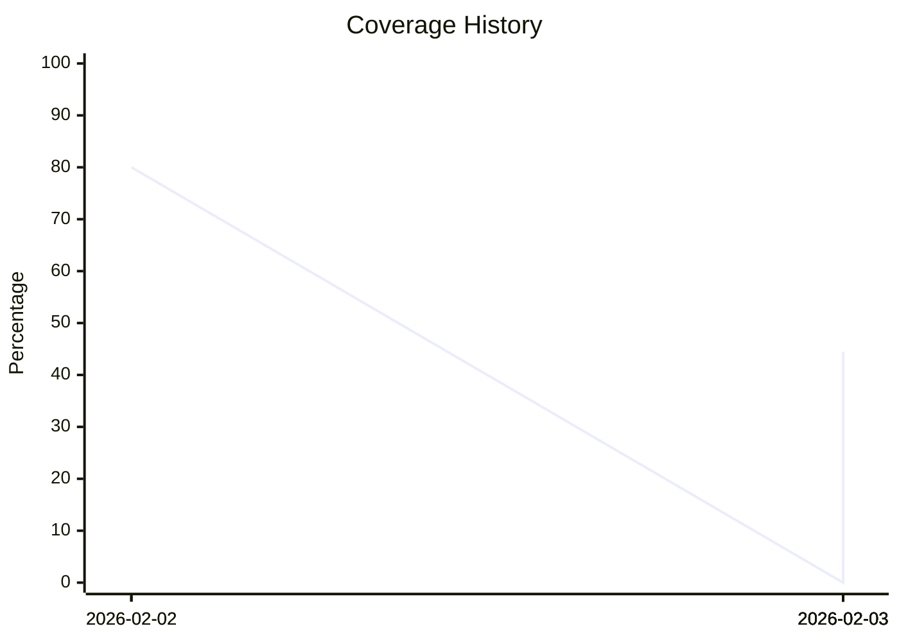

# Cocov Intelligence Report

## 📊 Coverage Summary
| Metric | % | Status |
| :--- | :--- | :--- |
| **Lines** | 44.48% | 🚨 |
| **Statements** | 44.48% | 🚨 |
| **Functions** | 57.14% | 🚨 |
| **Branches** | 74.28% | 🚨 |

## 📈 Trend Analysis

    

> **Note**: This report is auto-generated by Cocov.