<p align="center">
  
</p>


Cocov is a **Compliance Engine**. It enforces strict coverage baselines, prevents merge regressions via `husky` hooks, and generates audit-ready artifacts in Markdown and HTML.

## 📐 Architecture

Cocov operates as a strict middleware between your test runner (Vitest/Jest) and your git history.

```mermaid
graph TD
    A["Test Runner (Vitest)"] -->|Coverage JSON| B("Cocov Engine")
    B -->|Compare| C{"Baseline Check"}
    D["Baseline (.cocov/config.json)"] --> C
    C -->|Regression| E["FAIL 🛑"]
    C -->|Improvement| F["UPDATE ✅"]
    C -->|Stable| G["PASS ✅"]

    subgraph Outputs
        B --> H["HTML Dashboard"]
        B --> I["Markdown Summary"]
        B --> J["Console Report"]
        B --> K["SVG Badges"]
    end
```



## ✨ Features

- **📉 Regression Guard**: Automatically detects if coverage drops below the master baseline.
- **Strict Diff Mode**: Enforces 100% coverage on _changed lines only_ (PR mode).
- **📊 Professional Reporting**: High-fidelity HTML dashboards and GitHub-ready Markdown summaries.
- **🤖 LLM Friendly**: Outputs are structured for AI context ingestion.
- **🛡️ Stack Guard**: Enforces standard dependency validation (e.g. no rogue libs).

## 🚀 Quick Start

Initialize Cocov in your project:

```bash
npx cocov init
```

_Sets up `.cocov`, `husky` hooks, and CI workflows automatically._

Run the guard:

```bash
npm run cocov
```

## 🛠️ Configuration

Stored in `.cocov/config.json` or `cocov.json`.

```json
{
  "thresholds": {
    "lines": 90,
    "functions": 90,
    "branches": 90
  },
  "git": {
    "enforceClean": true
  }
}
```

## 🏆 Badges

Cocov generates high-fidelity SVG badges with the project logo and distinct visualizations:

- **Unified Badge**: All metrics (Lines, Branches, Functions) in one readable pill.
- **Diff Badge**: Visualizes coverage delta (`+5%`, `-1%`) vs baseline.
- **Strict Accessibility**: High contrast colors and readable typography.

## 🤝 Contributing

We welcome contributions! Please read [CONTRIBUTING.md](./CONTRIBUTING.md) for details.

## 📄 License

MIT © 2026
