<p align="center">
  
</p>


<!-- COCOV_BADGES_START -->
[](https://github.com/lguibr/cocov) [](https://github.com/lguibr/cocov)
<!-- COCOV_BADGES_END -->

Cocov is a **Compliance Engine**. It enforces strict coverage baselines, prevents merge regressions via `husky` hooks, and generates audit-ready artifacts in Markdown and HTML.

---

## 🚀 Quick Start (Zero Config)

Run the interactive initializer. This handles **Husky**, **CI**, and **Config** for you.

```bash
npx cocov init
```

> **What this does:**
> 1. Creates `.cocov/config.json`.
> 2. installs `husky` and adds a `pre-commit` hook.
> 3. Creates a `.github/workflows/ci.yml` for automated checking.

---

## 📚 The Complete Setup Guide

### 1. Installation

Install as a dev dependency:

```bash
npm install -D cocov
```

### 2. The "Golden Rule" (Baseline)

Cocov works by comparing your **current coverage** against a **baseline** (master branch).
Run it once to establish your first baseline:

```bash
# Runs tests, checks coverage, and saves the baseline if compliant
npm run cocov
```

### 3. Pre-Commit Guard (Husky)

Stop bad code *before* it gets committed. Add this to your `.husky/pre-commit`:

```bash
# .husky/pre-commit
npm run cocov
git add .cocov/history.jsonl # Auto-save the history log!
```

### 4. CI/CD Integration (GitHub Actions)

We recommend using **OIDC (Trusted Publishers)** for secure, keyless publishing.

**`.github/workflows/ci.yml`**:
```yaml
permissions:
  contents: read
  id-token: write # Required for Trusted Publishers

steps:
  - uses: actions/checkout@v4
  - run: npm ci
  - run: npm run cocov # fails if coverage drops
```

### 5. Displaying Badges

Want those cool badges in your README?

```bash
npx cocov inject-readme
```

This command:
1. Generates SVG badges in `assets/badges/`.
2. Injects them into your `README.md` with absolute GitHub URLs.
3. Updates automatically when you run `npm run cocov`.

---

## 🛠️ Configuration

Stored in `.cocov/config.json`.

```json
{
  "thresholds": {
    "lines": 90,
    "functions": 90,
    "branches": 90
  },
  "git": {
    "enforceClean": true
  }
}
```

## 📐 Architecture

Cocov operates as a strict middleware between your test runner (Vitest/Jest) and your git history.

```mermaid
graph TD
    A["Test Runner (Vitest)"] -->|Coverage JSON| B("Cocov Engine")
    B -->|Compare| C{"Baseline Check"}
    D["Baseline (.cocov/config.json)"] --> C
    C -->|Regression| E["FAIL 🛑"]
    C -->|Improvement| F["UPDATE ✅"]
    C -->|Stable| G["PASS ✅"]

    subgraph Outputs
        B --> H["HTML Dashboard"]
        B --> I["Markdown Summary"]
        B --> J["Console Report"]
        B --> K["SVG Badges"]
    end
```



## 🤝 Contributing

We welcome contributions! Please read [CONTRIBUTING.md](./CONTRIBUTING.md) for details.

## 📄 License

MIT © 2026
