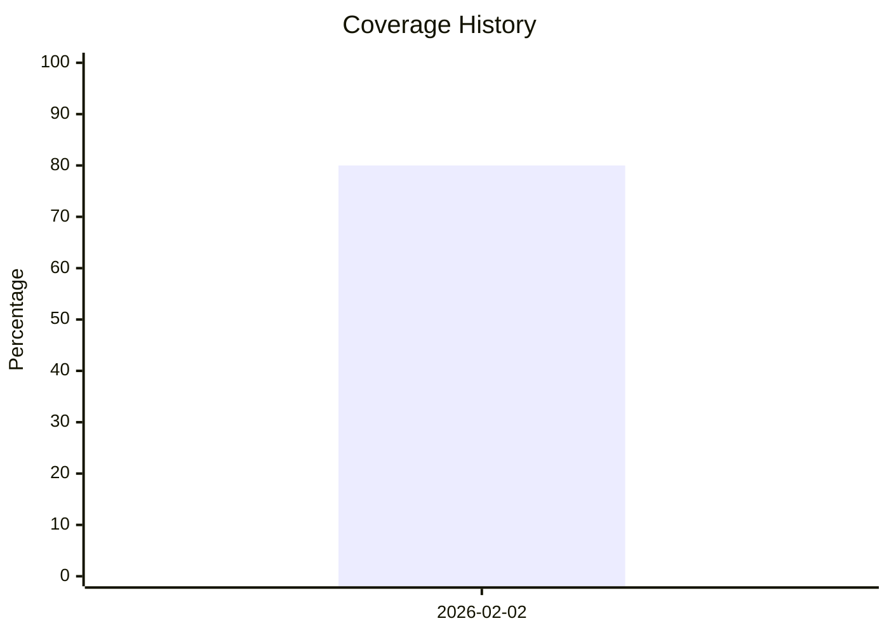

# Test Project

## Coverage Status
<!-- cocov-start -->
# Cocov Intelligence Report

## 📊 Coverage Summary
| Metric | % | Status |
| :--- | :--- | :--- |
| **Lines** | 80% | ⚠️ |
| **Statements** | 80% | ⚠️ |
| **Functions** | 80% | ⚠️ |
| **Branches** | 50% | 🚨 |

## 📈 Trend Analysis

    

> **Note**: This report is auto-generated by Cocov.
<!-- cocov-end -->

## Other data
Some other info
