# Project Codebase: cocov

## File Tree

```text
cocov/
├── .agent
│   └── rules
│       ├── 00-THE_RULE.md
│       ├── 01-cli-first.md
│       ├── 02-typescript-imperative.md
│       ├── 03-coding-standards.md
│       ├── 04-quality-protocol.md
│       ├── 05-documentation.md
│       └── 06-testing-mandate.md
├── .cocov
│   ├── config.json
│   └── reports
│       └── summary.md
├── .github
│   └── workflows
│       ├── ci.yml
│       └── publish.yml
├── .gitignore
├── .husky
│   ├── _
│   │   ├── .gitignore
│   │   ├── applypatch-msg
│   │   ├── commit-msg
│   │   ├── h
│   │   ├── post-applypatch
│   │   ├── post-checkout
│   │   ├── post-commit
│   │   ├── post-merge
│   │   ├── post-rewrite
│   │   ├── pre-applypatch
│   │   ├── pre-auto-gc
│   │   ├── pre-commit
│   │   ├── pre-merge-commit
│   │   ├── pre-push
│   │   ├── pre-rebase
│   │   └── prepare-commit-msg
│   ├── pre-commit
│   └── pre-push
├── .npmignore
├── CONTRIBUTING.md
├── README.md
├── TODO_TESTS.md
├── assets
│   └── ascii-art.txt
├── eslint.config.js
├── package-lock.json
├── package.json
├── src
│   ├── cli.test.ts
│   ├── cli.ts
│   ├── commands
│   │   ├── badge.test.ts
│   │   ├── badge.ts
│   │   ├── debug-html.test.ts
│   │   ├── html.ts
│   │   ├── init.test.ts
│   │   ├── init.ts
│   │   ├── markdown.test.ts
│   │   ├── markdown.ts
│   │   ├── run.test.ts
│   │   └── run.ts
│   ├── comparator.ts
│   ├── core
│   │   ├── badges
│   │   │   ├── generator.test.ts
│   │   │   └── generator.ts
│   │   ├── html
│   │   │   ├── generator.test.ts
│   │   │   ├── generator.ts
│   │   │   └── templates
│   │   │       └── base.ts
│   │   ├── init
│   │   │   ├── questions.test.ts
│   │   │   ├── questions.ts
│   │   │   ├── scaffold.test.ts
│   │   │   └── scaffold.ts
│   │   ├── integrity.test.ts
│   │   ├── integrity.ts
│   │   └── logic
│   │       ├── baseline-handler.test.ts
│   │       ├── baseline-handler.ts
│   │       ├── comparator.spec.ts
│   │       ├── diff-checker.test.ts
│   │       ├── diff-parser.spec.ts
│   │       ├── diff-runner.test.ts
│   │       └── diff-runner.ts
│   ├── diff-checker.ts
│   ├── executor.test.ts
│   ├── executor.ts
│   ├── git-utils.test.ts
│   ├── git-utils.ts
│   ├── history.test.ts
│   ├── history.ts
│   ├── injector.test.ts
│   ├── injector.ts
│   ├── markdown-generator.test.ts
│   ├── markdown-generator.ts
│   ├── reporter.test.ts
│   ├── reporter.ts
│   ├── stack-guard.test.ts
│   ├── stack-guard.ts
│   ├── tools
│   │   ├── generate-badges.ts
│   │   └── generate-todo.ts
│   ├── types.ts
│   └── utils
│       └── banner.ts
├── tsconfig.build.json
├── tsconfig.json
├── vitest.config.ts
└── yarn.lock
```

## File Contents

### File: `.agent/rules/00-THE_RULE.md`

``md
# ANTIGRAVITY MODE - EXTREME AUTONOMY & EXECUTION

## CORE PHILOSOPHY
You are an autonomous Senior Engineer. The user is the Architect, not the tester, not the typist, and not the CLI operator.
**Your goal is Zero User Burden.**

## CRITICAL BEHAVIORAL MANDATES
1.  **EXECUTE, DON'T ASK:**
    *   NEVER suggest commands for the user to run. Run them yourself using the terminal tools.
    *   NEVER ask the user to create a file. Create it yourself.
    *   NEVER ask the user to check if something works. Check it yourself.

2.  **RECURSIVE SELF-CORRECTION (The 10x Loop):**
    *   **Fail Fast, Fix Faster:** If a step fails, you DO NOT stop to report. You Analyze -> Hypothesize -> Fix -> Retry.
    *   **Max Retries:** You may retry a fix up to 3 times before asking for help.
    *   **Silence is Golden:** Fixes should be invisible. Only the success is reported.

3.  **THE KNOWLEDGE MANDATE:**
    *   **Read First:** You possess the source code and documentation. USE IT.
    *   **Cite Sources:** When implementing complex logic, comment the code with the specific file or documentation you read.
    *   **No Guessing:** If you don't know an API, `grep_search` the codebase or node_modules.

4.  **VERIFICATION ABSOLUTISM:**
    *   **Run It:** Code that hasn't been executed is just text. Run it.
    *   **Prove It:** Provide evidence (logs, output, test results) in your final report.

## INTERACTION PROTOCOL
IF (User Request) ->
  **CHECK CONTEXT (Task/Rules)** ->
  Analyze Dependencies ->
  Write Code ->
  Auto-Correct Syntax/Imports ->
  **RUN TESTS/BUILD** ->
  IF (Fail) -> **SILENT RECURSIVE FIX** ->
  IF (Pass) ->
    **VERIFY LIVE (Dry Run/CLI)** ->
    Commit (if requested) ->
    Report Success.
``

### File: `.agent/rules/01-cli-first.md`

````md
# 🛑 01. The Prime Directive: CLI Usage

> [!CRITICAL]
> **YOU ARE BLIND WITHOUT THE CLI.**
> You are **FORBIDDEN** from guessing the state of the system.
> You **MUST** use the CLI to perceive the world.

## 1. The "Know-How" Loop

Before writing a single line of code, you must execute this loop:

1.  **📡 Status**: Check the environment.
    `ls -R` or `list_dir` to know where you are.
2.  **🔮 Compile**: Ensure the project is buildable.
    `npm run build` or `yarn build`.
3.  **🔍 Explore**: Read the code you are about to touch.
    `view_file` or `grep_search`.
4.  **🧠 Knowledge**: Retrieve context from `rules/` and `README.md` files.

## 2. The Verification Command

You must verifying your work using the tool itself.

**Usage:**

```bash
# Verify the build
npm run build

# Verify the CLI output (Dry Run)
node dist/cli.js --help
node dist/cli.js npm test --dry-run
```
````

### File: `.agent/rules/02-typescript-imperative.md`

``md
# 🛑 02. The TypeScript Imperative (The Blood Oath)

> [!CRITICAL]
> **YOU ARE BLIND WITHOUT TYPES.**
> TypeScript is not a suggestion. It is the **LAW**.
> You **MUST** adhere to strict typing.

## 1. The Strictness Mandate

1.  **No `any`**: `any` is **FORBIDDEN**. Use `unknown` with narrowing if necessary.
2.  **No Implicit Any**: All parameters must be typed.
3.  **Return Types**: Exported functions **MUST** have explicit return types.

## 2. The "No Hallucination" Pact

-   **FORBIDDEN**: "I think this library does X..."
-   **REQUIRED**: Check the `@types` or source code.
-   **ENFORCEMENT**: If `tsc` fails, you have **FAILED**.

## 3. The Path to Truth

-   **Configuration**: `tsconfig.json` defines the rules.
-   **Verification**: Run `npm run build` (which runs `tsc`) to prove correctness.

> **When in doubt, CHECK THE TYPE DEFINITIONS.**

## 4. Dependencies

-   **Rule**: `package.json` is the source of truth.
-   **Imports**: Do not import packages that are not in `dependencies` or `devDependencies`.
-   **Types**: Ensure `@types/` packages are installed for all dependencies.
``

### File: `.agent/rules/03-coding-standards.md`

``md
# 🛑 03. Coding Standards (The Law)

> [!IMPORTANT]
> **Technical Debt is Forbidden.**

## 1. The Absolute Zero `any`

-   **Rule**: `any` is **FORBIDDEN**.
-   **Exception**: `unknown` is permitted ONLY in `catch(e)` blocks or generic constraints, but MUST be narrowed immediately.
-   **Enforcement**: If you type `any`, you must delete the file and start over.

## 2. The 200-Line Limit

-   **Rule**: Max file length is **200 lines**.
-   **Action**: At line 201, you **STOP** and Refactor.
-   **Exception**: Generated types, JSON, and highly cohesive matching logic (if absolutely necessary).

## 3. Strict Naming & Hygiene

-   **No Abbreviations**: `ctx` (❌), `context` (✅). `char` (❌), `character` (✅).
-   **Explicit Returns**: Functions **MUST** have explicit return types.
-   **No Console Logs**: `console.log` is allowed ONLY in the CLI entry point (`cli.ts`) or `Reporter` class. All other logic should return data or throw errors.

## 4. Documentation Coupling

-   **Rule**: Every exported function MUST have JSDoc.
-   **Linking**: JSDoc SHOULD link to relevant design docs or rules if complex.

## 5. Type Definitions

-   **Single Source of Truth**: Define types in `types.ts` or close to usage.
-   **Prefer `interface`**: For public APIs/Shapes.
-   **Prefer `type`**: For Unions/Intersections.
``

### File: `.agent/rules/04-quality-protocol.md`

``md
# 🛑 04. Quality Protocol (The Iron Gates)

> [!IMPORTANT]
> **No Progress without Proof.**

## 1. The Iron Gates

You cannot mark a task as "Done" until you pass the Gates.

1.  **Format**: `npm run format` (or equivalent).
2.  **Lint**: `npm run lint` (0 Errors).
3.  **Build**: `npm run build` (Must pass `tsc`).
4.  **Test**: `npm test` (Must pass).

## 2. Proactive Verification

-   **Do not wait** for the user to run these. Run them yourself after **EVERY** significant change.
-   **Fix immediately**: If Lint fails, fix it *now*. Do not continue writing logic on broken foundations.

## 3. Dependency Management

-   **Lockfile**: `package-lock.json` or `yarn.lock` is sacred. Do not delete it to "fix" issues unless corrupted.

## 4. The "Works on My Machine" ban

-   **Verify**: Run `node dist/cli.js` to verify the build artifact actually works.
``

### File: `.agent/rules/05-documentation.md`

````md
# 🛑 05. Documentation Strategy

> [!IMPORTANT]
> **Colocation is King. Separation of Concerns is Law.**

## 1. The Structure: "One Module, One Manual"

Every complex directory **SHOULD** contain a `README.md` if the logic is non-trivial.

## 2. JSDoc (The Code Navigator)

-   **Purpose**: Explains Inputs, Outputs, and Code Flow.
-   **Requirement**: Exported members must be documented.

**Example JSDoc:**

```typescript
/**
 * Compares two coverage reports and determines if there is a regression.
 *
 * @param {CoverageSummary} current - The new coverage data.
 * @param {CoverageSummary} baseline - The baseline coverage data.
 * @returns {ComparisonResult} The result of the comparison.
 */
```
````

### File: `.agent/rules/06-testing-mandate.md`

``md
# 🛑 06. Testing Mandate

> [!IMPORTANT]
> **Speed, Isolation, and Mocking.**

## 1. Speed Limit

-   **Tests**: Must run fast.
-   **Action**: Refactor slow tests.

## 2. Strict Mocking

-   **External Interactions**: Filesystem and Child Process executions SHOULD be mocked in unit tests unless testing the integration explicitly.
-   **Tools**: Use `vitest` mocking capabilities.

## 3. Hostile Testing

-   **Happy Path is not enough**.
-   Test **Missing Files**.
-   Test **Invalid JSON**.
-   Test **Process Failures** (setup commands failing).

## 4. The "No Test, No Code" Rule

-   If you write a helper function, you MUST write a unit test for it.
-   If you fix a bug, you MUST write a regression test.
``

### File: `.cocov/config.json`

```json
{
  "total": {
    "lines": {
      "total": 1451,
      "covered": 1367,
      "skipped": 0,
      "pct": 94.21
    },
    "statements": {
      "total": 1451,
      "covered": 1367,
      "skipped": 0,
      "pct": 94.21
    },
    "functions": {
      "total": 53,
      "covered": 48,
      "skipped": 0,
      "pct": 90.56
    },
    "branches": {
      "total": 206,
      "covered": 189,
      "skipped": 0,
      "pct": 91.74
    },
    "branchesTrue": {
      "total": 0,
      "covered": 0,
      "skipped": 0,
      "pct": 100
    }
  },
  "/Users/lg/lab/cocov/src/cli.ts": {
    "lines": {
      "total": 83,
      "covered": 76,
      "skipped": 0,
      "pct": 91.56
    },
    "functions": {
      "total": 1,
      "covered": 1,
      "skipped": 0,
      "pct": 100
    },
    "statements": {
      "total": 83,
      "covered": 76,
      "skipped": 0,
      "pct": 91.56
    },
    "branches": {
      "total": 8,
      "covered": 6,
      "skipped": 0,
      "pct": 75
    }
  },
  "/Users/lg/lab/cocov/src/comparator.ts": {
    "lines": {
      "total": 42,
      "covered": 42,
      "skipped": 0,
      "pct": 100
    },
    "functions": {
      "total": 1,
      "covered": 1,
      "skipped": 0,
      "pct": 100
    },
    "statements": {
      "total": 42,
      "covered": 42,
      "skipped": 0,
      "pct": 100
    },
    "branches": {
      "total": 5,
      "covered": 5,
      "skipped": 0,
      "pct": 100
    }
  },
  "/Users/lg/lab/cocov/src/diff-checker.ts": {
    "lines": {
      "total": 61,
      "covered": 61,
      "skipped": 0,
      "pct": 100
    },
    "functions": {
      "total": 3,
      "covered": 3,
      "skipped": 0,
      "pct": 100
    },
    "statements": {
      "total": 61,
      "covered": 61,
      "skipped": 0,
      "pct": 100
    },
    "branches": {
      "total": 14,
      "covered": 14,
      "skipped": 0,
      "pct": 100
    }
  },
  "/Users/lg/lab/cocov/src/executor.ts": {
    "lines": {
      "total": 6,
      "covered": 6,
      "skipped": 0,
      "pct": 100
    },
    "functions": {
      "total": 1,
      "covered": 1,
      "skipped": 0,
      "pct": 100
    },
    "statements": {
      "total": 6,
      "covered": 6,
      "skipped": 0,
      "pct": 100
    },
    "branches": {
      "total": 1,
      "covered": 1,
      "skipped": 0,
      "pct": 100
    }
  },
  "/Users/lg/lab/cocov/src/git-utils.ts": {
    "lines": {
      "total": 76,
      "covered": 74,
      "skipped": 0,
      "pct": 97.36
    },
    "functions": {
      "total": 5,
      "covered": 5,
      "skipped": 0,
      "pct": 100
    },
    "statements": {
      "total": 76,
      "covered": 74,
      "skipped": 0,
      "pct": 97.36
    },
    "branches": {
      "total": 18,
      "covered": 15,
      "skipped": 0,
      "pct": 83.33
    }
  },
  "/Users/lg/lab/cocov/src/history.ts": {
    "lines": {
      "total": 43,
      "covered": 43,
      "skipped": 0,
      "pct": 100
    },
    "functions": {
      "total": 4,
      "covered": 4,
      "skipped": 0,
      "pct": 100
    },
    "statements": {
      "total": 43,
      "covered": 43,
      "skipped": 0,
      "pct": 100
    },
    "branches": {
      "total": 10,
      "covered": 10,
      "skipped": 0,
      "pct": 100
    }
  },
  "/Users/lg/lab/cocov/src/injector.ts": {
    "lines": {
      "total": 34,
      "covered": 34,
      "skipped": 0,
      "pct": 100
    },
    "functions": {
      "total": 1,
      "covered": 1,
      "skipped": 0,
      "pct": 100
    },
    "statements": {
      "total": 34,
      "covered": 34,
      "skipped": 0,
      "pct": 100
    },
    "branches": {
      "total": 5,
      "covered": 5,
      "skipped": 0,
      "pct": 100
    }
  },
  "/Users/lg/lab/cocov/src/markdown-generator.ts": {
    "lines": {
      "total": 59,
      "covered": 58,
      "skipped": 0,
      "pct": 98.3
    },
    "functions": {
      "total": 4,
      "covered": 4,
      "skipped": 0,
      "pct": 100
    },
    "statements": {
      "total": 59,
      "covered": 58,
      "skipped": 0,
      "pct": 98.3
    },
    "branches": {
      "total": 12,
      "covered": 11,
      "skipped": 0,
      "pct": 91.66
    }
  },
  "/Users/lg/lab/cocov/src/reporter.ts": {
    "lines": {
      "total": 50,
      "covered": 50,
      "skipped": 0,
      "pct": 100
    },
    "functions": {
      "total": 2,
      "covered": 2,
      "skipped": 0,
      "pct": 100
    },
    "statements": {
      "total": 50,
      "covered": 50,
      "skipped": 0,
      "pct": 100
    },
    "branches": {
      "total": 7,
      "covered": 7,
      "skipped": 0,
      "pct": 100
    }
  },
  "/Users/lg/lab/cocov/src/stack-guard.ts": {
    "lines": {
      "total": 73,
      "covered": 73,
      "skipped": 0,
      "pct": 100
    },
    "functions": {
      "total": 3,
      "covered": 3,
      "skipped": 0,
      "pct": 100
    },
    "statements": {
      "total": 73,
      "covered": 73,
      "skipped": 0,
      "pct": 100
    },
    "branches": {
      "total": 17,
      "covered": 17,
      "skipped": 0,
      "pct": 100
    }
  },
  "/Users/lg/lab/cocov/src/commands/badge.ts": {
    "lines": {
      "total": 63,
      "covered": 59,
      "skipped": 0,
      "pct": 93.65
    },
    "functions": {
      "total": 1,
      "covered": 1,
      "skipped": 0,
      "pct": 100
    },
    "statements": {
      "total": 63,
      "covered": 59,
      "skipped": 0,
      "pct": 93.65
    },
    "branches": {
      "total": 15,
      "covered": 12,
      "skipped": 0,
      "pct": 80
    }
  },
  "/Users/lg/lab/cocov/src/commands/html.ts": {
    "lines": {
      "total": 25,
      "covered": 22,
      "skipped": 0,
      "pct": 88
    },
    "functions": {
      "total": 1,
      "covered": 1,
      "skipped": 0,
      "pct": 100
    },
    "statements": {
      "total": 25,
      "covered": 22,
      "skipped": 0,
      "pct": 88
    },
    "branches": {
      "total": 2,
      "covered": 1,
      "skipped": 0,
      "pct": 50
    }
  },
  "/Users/lg/lab/cocov/src/commands/init.ts": {
    "lines": {
      "total": 50,
      "covered": 50,
      "skipped": 0,
      "pct": 100
    },
    "functions": {
      "total": 1,
      "covered": 1,
      "skipped": 0,
      "pct": 100
    },
    "statements": {
      "total": 50,
      "covered": 50,
      "skipped": 0,
      "pct": 100
    },
    "branches": {
      "total": 6,
      "covered": 6,
      "skipped": 0,
      "pct": 100
    }
  },
  "/Users/lg/lab/cocov/src/commands/markdown.ts": {
    "lines": {
      "total": 55,
      "covered": 55,
      "skipped": 0,
      "pct": 100
    },
    "functions": {
      "total": 1,
      "covered": 1,
      "skipped": 0,
      "pct": 100
    },
    "statements": {
      "total": 55,
      "covered": 55,
      "skipped": 0,
      "pct": 100
    },
    "branches": {
      "total": 6,
      "covered": 6,
      "skipped": 0,
      "pct": 100
    }
  },
  "/Users/lg/lab/cocov/src/commands/run.ts": {
    "lines": {
      "total": 54,
      "covered": 52,
      "skipped": 0,
      "pct": 96.29
    },
    "functions": {
      "total": 1,
      "covered": 1,
      "skipped": 0,
      "pct": 100
    },
    "statements": {
      "total": 54,
      "covered": 52,
      "skipped": 0,
      "pct": 96.29
    },
    "branches": {
      "total": 9,
      "covered": 8,
      "skipped": 0,
      "pct": 88.88
    }
  },
  "/Users/lg/lab/cocov/src/core/integrity.ts": {
    "lines": {
      "total": 28,
      "covered": 28,
      "skipped": 0,
      "pct": 100
    },
    "functions": {
      "total": 2,
      "covered": 2,
      "skipped": 0,
      "pct": 100
    },
    "statements": {
      "total": 28,
      "covered": 28,
      "skipped": 0,
      "pct": 100
    },
    "branches": {
      "total": 5,
      "covered": 5,
      "skipped": 0,
      "pct": 100
    }
  },
  "/Users/lg/lab/cocov/src/core/badges/generator.ts": {
    "lines": {
      "total": 159,
      "covered": 159,
      "skipped": 0,
      "pct": 100
    },
    "functions": {
      "total": 4,
      "covered": 4,
      "skipped": 0,
      "pct": 100
    },
    "statements": {
      "total": 159,
      "covered": 159,
      "skipped": 0,
      "pct": 100
    },
    "branches": {
      "total": 27,
      "covered": 27,
      "skipped": 0,
      "pct": 100
    }
  },
  "/Users/lg/lab/cocov/src/core/coverage/reader.ts": {
    "lines": {
      "total": 37,
      "covered": 21,
      "skipped": 0,
      "pct": 56.75
    },
    "functions": {
      "total": 3,
      "covered": 1,
      "skipped": 0,
      "pct": 33.33
    },
    "statements": {
      "total": 37,
      "covered": 21,
      "skipped": 0,
      "pct": 56.75
    },
    "branches": {
      "total": 4,
      "covered": 4,
      "skipped": 0,
      "pct": 100
    }
  },
  "/Users/lg/lab/cocov/src/core/coverage/writer.ts": {
    "lines": {
      "total": 41,
      "covered": 38,
      "skipped": 0,
      "pct": 92.68
    },
    "functions": {
      "total": 1,
      "covered": 1,
      "skipped": 0,
      "pct": 100
    },
    "statements": {
      "total": 41,
      "covered": 38,
      "skipped": 0,
      "pct": 92.68
    },
    "branches": {
      "total": 4,
      "covered": 2,
      "skipped": 0,
      "pct": 50
    }
  },
  "/Users/lg/lab/cocov/src/core/html/generator.ts": {
    "lines": {
      "total": 18,
      "covered": 18,
      "skipped": 0,
      "pct": 100
    },
    "functions": {
      "total": 3,
      "covered": 3,
      "skipped": 0,
      "pct": 100
    },
    "statements": {
      "total": 18,
      "covered": 18,
      "skipped": 0,
      "pct": 100
    },
    "branches": {
      "total": 3,
      "covered": 3,
      "skipped": 0,
      "pct": 100
    }
  },
  "/Users/lg/lab/cocov/src/core/html/templates/base.ts": {
    "lines": {
      "total": 85,
      "covered": 85,
      "skipped": 0,
      "pct": 100
    },
    "functions": {
      "total": 1,
      "covered": 1,
      "skipped": 0,
      "pct": 100
    },
    "statements": {
      "total": 85,
      "covered": 85,
      "skipped": 0,
      "pct": 100
    },
    "branches": {
      "total": 1,
      "covered": 1,
      "skipped": 0,
      "pct": 100
    }
  },
  "/Users/lg/lab/cocov/src/core/init/questions.ts": {
    "lines": {
      "total": 74,
      "covered": 74,
      "skipped": 0,
      "pct": 100
    },
    "functions": {
      "total": 3,
      "covered": 1,
      "skipped": 0,
      "pct": 33.33
    },
    "statements": {
      "total": 74,
      "covered": 74,
      "skipped": 0,
      "pct": 100
    },
    "branches": {
      "total": 2,
      "covered": 2,
      "skipped": 0,
      "pct": 100
    }
  },
  "/Users/lg/lab/cocov/src/core/init/scaffold.ts": {
    "lines": {
      "total": 143,
      "covered": 97,
      "skipped": 0,
      "pct": 67.83
    },
    "functions": {
      "total": 4,
      "covered": 3,
      "skipped": 0,
      "pct": 75
    },
    "statements": {
      "total": 143,
      "covered": 97,
      "skipped": 0,
      "pct": 67.83
    },
    "branches": {
      "total": 10,
      "covered": 6,
      "skipped": 0,
      "pct": 60
    }
  },
  "/Users/lg/lab/cocov/src/core/logic/baseline-handler.ts": {
    "lines": {
      "total": 61,
      "covered": 61,
      "skipped": 0,
      "pct": 100
    },
    "functions": {
      "total": 1,
      "covered": 1,
      "skipped": 0,
      "pct": 100
    },
    "statements": {
      "total": 61,
      "covered": 61,
      "skipped": 0,
      "pct": 100
    },
    "branches": {
      "total": 10,
      "covered": 10,
      "skipped": 0,
      "pct": 100
    }
  },
  "/Users/lg/lab/cocov/src/core/logic/diff-runner.ts": {
    "lines": {
      "total": 31,
      "covered": 31,
      "skipped": 0,
      "pct": 100
    },
    "functions": {
      "total": 1,
      "covered": 1,
      "skipped": 0,
      "pct": 100
    },
    "statements": {
      "total": 31,
      "covered": 31,
      "skipped": 0,
      "pct": 100
    },
    "branches": {
      "total": 5,
      "covered": 5,
      "skipped": 0,
      "pct": 100
    }
  },
  "/Users/lg/lab/cocov/src/tools/generate-todo.mjs": {
    "lines": {
      "total": 79,
      "covered": 0,
      "skipped": 0,
      "pct": 0
    },
    "functions": {
      "total": 1,
      "covered": 0,
      "skipped": 0,
      "pct": 0
    },
    "statements": {
      "total": 79,
      "covered": 0,
      "skipped": 0,
      "pct": 0
    },
    "branches": {
      "total": 1,
      "covered": 0,
      "skipped": 0,
      "pct": 0
    }
  },
  "/Users/lg/lab/cocov/src/tools/generate-todo.ts": {
    "lines": {
      "total": 62,
      "covered": 0,
      "skipped": 0,
      "pct": 0
    },
    "functions": {
      "total": 1,
      "covered": 0,
      "skipped": 0,
      "pct": 0
    },
    "statements": {
      "total": 62,
      "covered": 0,
      "skipped": 0,
      "pct": 0
    },
    "branches": {
      "total": 1,
      "covered": 0,
      "skipped": 0,
      "pct": 0
    }
  }
}
```

### File: `.cocov/reports/summary.md`

````md
# Cocov Intelligence Report

## 📊 Coverage Summary
| Metric | % | Status |
| :--- | :--- | :--- |
| **Lines** | 44.48% | 🚨 |
| **Statements** | 44.48% | 🚨 |
| **Functions** | 57.14% | 🚨 |
| **Branches** | 74.28% | 🚨 |

## 📈 Trend Analysis


    

> **Note**: This report is auto-generated by Cocov.
````

### File: `.github/workflows/ci.yml`

```yml
name: CI Security & Quality

on:
  push:
    branches: [ main, master ]
  pull_request:
    branches: [ main, master ]

permissions:
  contents: read

jobs:
  build:
    name: Build, Test & Security Scan
    runs-on: ubuntu-latest
    strategy:
      matrix:
        node-version: [18.x, 20.x, 22.x]

    steps:
    - uses: actions/checkout@v4
      with:
        fetch-depth: 0

    - name: Use Node.js ${{ matrix.node-version }}
      uses: actions/setup-node@v4
      with:
        node-version: ${{ matrix.node-version }}
        cache: 'npm'

    - name: Install Dependencies
      run: npm ci

    - name: Security Audit
      run: npm audit --audit-level=moderate
      continue-on-error: true

    - name: Lint
      run: npm run lint
      continue-on-error: true # For now, until we fix all lints

    - name: Build
      run: npm run build

    - name: Test (Unit & Coverage)
      run: npm test -- --coverage

    - name: Self-Test (Dogfooding)
      run: node dist/cli.js run "echo 'Self Test'" --diff --dry-run
```

### File: `.github/workflows/publish.yml`

```yml
name: Publish to NPM

on:
  release:
    types: [published]
  workflow_dispatch:

permissions:
  contents: read
  id-token: write # Required for provenance

jobs:
  publish:
    name: Build & Publish
    runs-on: ubuntu-latest
    steps:
      - uses: actions/checkout@v4
      
      - name: Setup Node.js
        uses: actions/setup-node@v4
        with:
          node-version: '20.x'
          registry-url: 'https://registry.npmjs.org'
          cache: 'npm'

      - name: Install Dependencies
        run: npm ci

      - name: Build
        run: npm run build

      - name: Test
        run: npm test

      - name: Publish to NPM
        run: npm publish --provenance --access public
        env:
          NODE_AUTH_TOKEN: ${{ secrets.NPM_TOKEN }}
```

### File: `.gitignore`

```text
node_modules
dist
coverage
cocov
.DS_Store
```

### File: `.husky/_/.gitignore`

```text
*
```

### File: `.husky/_/applypatch-msg`

```text
#!/usr/bin/env sh
. "$(dirname "$0")/h"
```

### File: `.husky/_/commit-msg`

```text
#!/usr/bin/env sh
. "$(dirname "$0")/h"
```

### File: `.husky/_/h`

```text
#!/usr/bin/env sh
[ "$HUSKY" = "2" ] && set -x
n=$(basename "$0")
s=$(dirname "$(dirname "$0")")/$n

[ ! -f "$s" ] && exit 0

if [ -f "$HOME/.huskyrc" ]; then
	echo "husky - '~/.huskyrc' is DEPRECATED, please move your code to ~/.config/husky/init.sh"
fi
i="${XDG_CONFIG_HOME:-$HOME/.config}/husky/init.sh"
[ -f "$i" ] && . "$i"

[ "${HUSKY-}" = "0" ] && exit 0

export PATH="node_modules/.bin:$PATH"
sh -e "$s" "$@"
c=$?

[ $c != 0 ] && echo "husky - $n script failed (code $c)"
[ $c = 127 ] && echo "husky - command not found in PATH=$PATH"
exit $c
```

### File: `.husky/_/post-applypatch`

```text
#!/usr/bin/env sh
. "$(dirname "$0")/h"
```

### File: `.husky/_/post-checkout`

```text
#!/usr/bin/env sh
. "$(dirname "$0")/h"
```

### File: `.husky/_/post-commit`

```text
#!/usr/bin/env sh
. "$(dirname "$0")/h"
```

### File: `.husky/_/post-merge`

```text
#!/usr/bin/env sh
. "$(dirname "$0")/h"
```

### File: `.husky/_/post-rewrite`

```text
#!/usr/bin/env sh
. "$(dirname "$0")/h"
```

### File: `.husky/_/pre-applypatch`

```text
#!/usr/bin/env sh
. "$(dirname "$0")/h"
```

### File: `.husky/_/pre-auto-gc`

```text
#!/usr/bin/env sh
. "$(dirname "$0")/h"
```

### File: `.husky/_/pre-commit`

```text
#!/usr/bin/env sh
. "$(dirname "$0")/h"
```

### File: `.husky/_/pre-merge-commit`

```text
#!/usr/bin/env sh
. "$(dirname "$0")/h"
```

### File: `.husky/_/pre-push`

```text
#!/usr/bin/env sh
. "$(dirname "$0")/h"
```

### File: `.husky/_/pre-rebase`

```text
#!/usr/bin/env sh
. "$(dirname "$0")/h"
```

### File: `.husky/_/prepare-commit-msg`

```text
#!/usr/bin/env sh
. "$(dirname "$0")/h"
```

### File: `.husky/pre-commit`

```text
npm test
```

### File: `.husky/pre-push`

```text
# Cocov Guard (Dogfooding)
# Uses local dist to check itself on push
npm run build
node dist/cli.js run "npm test"
```

### File: `.npmignore`

```text
src
tests
coverage
.husky
.github
.cocov
cocov.json
cocov-report.html
cocov-summary.md
TEST_README.md
mock-coverage.json
tsconfig.json
vitest.config.ts
eslint.config.js
```

### File: `CONTRIBUTING.md`

````md
# Contributing to Cocov

First off, thanks for taking the time to contribute! ❤️

Cocov is a **Free and Open Source (FOS)** project. We welcome contributions from everyone.

## 📐 Architecture
Cocov uses a tiered architecture:
1. **Core**: Logic for reading coverage, diffing, and baseline management (`src/core`).
2. **Commands**: CLI entry points (`src/commands`).
3. **Reporters**: HTML/Markdown generators (`src/core/html`, `src/markdown`).

## 🛠️ Development Setup

1. **Install Dependencies**:
   ```bash
   npm install
   ```
2. **Run Tests**:
   ```bash
   npm test
   ```
3. **Build**:
   ```bash
   npm run build
   ```

## 🧪 Testing Policy
- **Coverage**: We enforce **90% coverage**. If your PR drops coverage, it will be rejected (ironic, right?).
- **Unit Tests**: Use `vitest`.
- **E2E**: We use a `dogfooding` approach where Cocov tests itself.

## 🎨 Code Style
- **Linting**: No `any`. Strict TypeScript.
- **Formatting**: Prettier is enforced.

## 🤝 Pull Requests
1. Fork the repo.
2. Create a branch (`feat/amazing-feature`).
3. Commit your changes.
4. Open a PR.

> **Note**: We love "Disgraced" badges and SOTA documentation. If you improve the UI, you're a hero.
````

### File: `README.md`

````md
# 🛡️ Cocov
> **The Code Coverage Regression Guard**  
> *Zero-tolerance policy for coverage drops in critical systems.*


<!-- Replace with Cocov Badges -->


Cocov is a **Compliance Engine**. It enforces strict coverage baselines, prevents merge regressions via `husky` hooks, and generates audit-ready artifacts in Markdown and HTML.

## 📐 Architecture
Cocov operates as a strict middleware between your test runner (Vitest/Jest) and your git history.

```mermaid
graph TD
    A["Test Runner (Vitest)"] -->|Coverage JSON| B("Cocov Engine")
    B -->|Compare| C{"Baseline Check"}
    D["Baseline (.cocov/config.json)"] --> C
    C -->|Regression| E["FAIL 🛑"]
    C -->|Improvement| F["UPDATE ✅"]
    C -->|Stable| G["PASS ✅"]
    
    subgraph Outputs
        B --> H["HTML Dashboard"]
        B --> I["Markdown Summary"]
        B --> J["Console Report"]
        B --> K["SVG Badges"]
    end
```



## ✨ Features

- **📉 Regression Guard**: Automatically detects if coverage drops below the master baseline.
- **Strict Diff Mode**: Enforces 100% coverage on *changed lines only* (PR mode).
- **📊 Professional Reporting**: High-fidelity HTML dashboards and GitHub-ready Markdown summaries.
- **🤖 LLM Friendly**: Outputs are structured for AI context ingestion.
- **🛡️ Stack Guard**: Enforces standard dependency validation (e.g. no rogue libs).

## 🚀 Quick Start

Initialize Cocov in your project:
```bash
npx cocov init
```
*Sets up `.cocov`, `husky` hooks, and CI workflows automatically.*

Run the guard:
```bash
npm run cocov
```

## 🛠️ Configuration
Stored in `.cocov/config.json` or `cocov.json`.

```json
{
  "thresholds": {
    "lines": 90,
    "functions": 90,
    "branches": 90
  },
  "git": {
    "enforceClean": true
  }
}
```

## 🏆 Badges

Cocov generates high-fidelity SVG badges with the project logo and distinct visualizations:
- **Unified Badge**: All metrics (Lines, Branches, Functions) in one readable pill.
- **Diff Badge**: Visualizes coverage delta (`+5%`, `-1%`) vs baseline.
- **Strict Accessibility**: High contrast colors and readable typography.

## 🤝 Contributing
We welcome contributions! Please read [CONTRIBUTING.md](./CONTRIBUTING.md) for details.

## 📄 License
MIT © 2026
````

### File: `TODO_TESTS.md`

```md
# 📝 Coverage TODO List

Generated by Cocov. Use this list to reach 100% coverage.

## 🔴 src/cli.ts
- [ ] Statement L1, Statement L2, Statement L3, Statement L4, Statement L5, Statement L6, Statement L7, Statement L8, Statement L9, Statement L10...
## 🔴 src/executor.ts
- [ ] Statement L1, Statement L2, Statement L3, Statement L4, Statement L5, Statement L6, Function (empty-report) L1, Branch L1 #0
## 🔴 src/git-utils.ts
- [ ] Statement L22, Statement L23, Statement L24, Statement L25, Statement L26, Statement L27, Statement L28, Statement L29, Statement L30, Statement L60...
## 🔴 src/history.ts
- [ ] Statement L1, Statement L2, Statement L3, Statement L4, Statement L5, Statement L6, Statement L7, Statement L8, Statement L9, Statement L10...
## 🔴 src/injector.ts
- [ ] Statement L1, Statement L2, Statement L3, Statement L4, Statement L5, Statement L6, Statement L7, Statement L8, Statement L9, Statement L10...
## 🔴 src/markdown-generator.ts
- [ ] Statement L1, Statement L2, Statement L3, Statement L4, Statement L5, Statement L6, Statement L7, Statement L8, Statement L9, Statement L10...
## 🔴 src/reporter.ts
- [ ] Statement L8, Statement L9, Statement L10, Statement L11, Statement L12, Statement L13, Statement L14, Statement L15, Statement L16, Statement L17...
## 🔴 src/stack-guard.ts
- [ ] Statement L1, Statement L2, Statement L3, Statement L4, Statement L5, Statement L6, Statement L7, Statement L8, Statement L9, Statement L10...
## 🔴 src/commands/badge.ts
- [ ] Statement L1, Statement L2, Statement L3, Statement L4, Statement L5, Statement L6, Statement L7, Statement L8, Statement L9, Statement L10...
## 🔴 src/commands/html.ts
- [ ] Statement L21, Statement L22, Statement L23, Branch L20 #0
## 🔴 src/commands/init.ts
- [ ] Statement L1, Statement L2, Statement L3, Statement L4, Statement L5, Statement L6, Statement L7, Statement L8, Statement L9, Statement L10...
## 🔴 src/commands/markdown.ts
- [ ] Statement L1, Statement L2, Statement L3, Statement L4, Statement L5, Statement L6, Statement L7, Statement L8, Statement L9, Statement L10...
## 🔴 src/commands/run.ts
- [ ] Statement L1, Statement L2, Statement L3, Statement L4, Statement L5, Statement L6, Statement L7, Statement L8, Statement L9, Statement L10...
## 🔴 src/core/badges/generator.ts
- [ ] Branch L34 #0, Branch L35 #0, Branch L36 #0, Branch L37 #0
## 🔴 src/core/coverage/reader.ts
- [ ] Statement L6, Statement L7, Statement L8, Statement L9, Statement L10, Statement L11, Statement L12, Statement L13, Statement L14, Statement L16...
## 🔴 src/core/coverage/writer.ts
- [ ] Statement L18, Statement L36, Statement L37, Branch L17 #0, Branch L35 #0
## 🔴 src/core/init/questions.ts
- [ ] Statement L1, Statement L2, Statement L3, Statement L4, Statement L5, Statement L6, Statement L7, Statement L8, Statement L9, Statement L10...
## 🔴 src/core/init/scaffold.ts
- [ ] Statement L24, Statement L52, Statement L53, Statement L54, Statement L55, Statement L56, Statement L57, Statement L58, Statement L59, Statement L60...
## 🔴 src/tools/generate-todo.mjs
- [ ] Statement L1, Statement L2, Statement L3, Statement L4, Statement L5, Statement L6, Statement L7, Statement L8, Statement L9, Statement L10...
## 🔴 src/tools/generate-todo.ts
- [ ] Statement L1, Statement L2, Statement L3, Statement L4, Statement L5, Statement L6, Statement L7, Statement L8, Statement L9, Statement L10...
```

### File: `assets/ascii-art.txt`

```txt
                       .....:.  ..:... .::....                       
                  ...::..::..-----------..:::......                  
               ..--:.::::::---------------..::::.:--:.               
            ..---:.:::::.------------------- .::::..---..            
          .:----.::::::----------------------.::::::.:---:.          
        .:----.:::::::------------------------.:::::::.----:.        
      .:-----::::::::--------------------------.:::::::.-----..      
     .------:::::::::---------------------------::::::::.:-----.     
    .------:::::::::----------------------------.::::::::::-----.    
  .:------.::::::::-----------------------------::::::::::.------:.  
  :-------..::::::.----:.....::::::::::::..::----::::::::..:------:. 
 .---==+*******++++++.:::::::::::::::::::::::::.=+++++*******++=---. 
.-=+****************::::::::::::::::::::::::::::.****************+=-.
.=+++++++**********+:::::::::::::::::::::::::::::=**********++++++++:
     .......:=+****::::::::::::.......:::::::::::.****+=-:......     
              ..-++:::::.                   .:::::=+=..              
                  ..            ...             ...                  
                                ......                               
                                 ........                            
                             ..............                          
                        ...::-----..........                         
                        .------------:.......                        
                        .----------------:....                       
                       ..-------------------:..                      
                  ...................:---------:...                  
                 ..............::------------------.                 
                 ..........:-----------------------:.                
                 .....:-----------------------------.                
               ..:----------------------------------.                
              ...................................:----:.             
            ................................::----------.            
           ............................::----------------.           
          ........................:-----------------------.          
           .................::---------------------------..          
             ..........:-------------------------------..            
              ....:::---------------------------::::...              
```

### File: `eslint.config.js`

```javascript
import parser from '@typescript-eslint/parser';
import plugin from '@typescript-eslint/eslint-plugin';
import prettierConfig from 'eslint-config-prettier';

export default [
    {
        files: ["src/**/*.ts"],
        languageOptions: {
            parser: parser,
        },
        plugins: {
            "@typescript-eslint": plugin,
        },
        rules: {
            ...plugin.configs.recommended.rules,
            "@typescript-eslint/no-explicit-any": "error",
            "@typescript-eslint/explicit-function-return-type": "warn",
            "@typescript-eslint/no-unused-vars": ["error", { "argsIgnorePattern": "^_" }],
            "no-restricted-imports": ["error", { "patterns": [{ "group": ["../*"], "message": "Relative parent imports are not allowed. Use absolute paths (e.g., @/utils) instead." }] }]
        }
    },
    prettierConfig
];
```

### File: `package-lock.json`

```json
{
  "name": "cocov",
  "version": "2.0.0",
  "lockfileVersion": 3,
  "requires": true,
  "packages": {
    "": {
      "name": "cocov",
      "version": "2.0.0",
      "license": "ISC",
      "dependencies": {
        "chalk": "^5.3.0",
        "cli-table3": "^0.6.3",
        "commander": "^11.1.0",
        "execa": "^8.0.1",
        "fs-extra": "^11.2.0",
        "prompts": "^2.4.2"
      },
      "bin": {
        "cocov": "dist/cli.js"
      },
      "devDependencies": {
        "@types/fs-extra": "^11.0.4",
        "@types/node": "^20.10.5",
        "@types/prompts": "^2.4.9",
        "@typescript-eslint/eslint-plugin": "^8.54.0",
        "@typescript-eslint/parser": "^8.54.0",
        "@vitest/coverage-v8": "^1.1.0",
        "eslint": "^9.39.2",
        "eslint-config-prettier": "^10.1.8",
        "husky": "^9.1.7",
        "prettier": "^3.8.1",
        "tsc-alias": "^1.8.16",
        "typescript": "^5.3.3",
        "vite-tsconfig-paths": "^6.0.5",
        "vitest": "^1.1.0"
      }
    },
    "node_modules/@ampproject/remapping": {
      "version": "2.3.0",
      "resolved": "https://registry.npmjs.org/@ampproject/remapping/-/remapping-2.3.0.tgz",
      "integrity": "sha512-30iZtAPgz+LTIYoeivqYo853f02jBYSd5uGnGpkFV0M3xOt9aN73erkgYAmZU43x4VfqcnLxW9Kpg3R5LC4YYw==",
      "dev": true,
      "license": "Apache-2.0",
      "dependencies": {
        "@jridgewell/gen-mapping": "^0.3.5",
        "@jridgewell/trace-mapping": "^0.3.24"
      },
      "engines": {
        "node": ">=6.0.0"
      }
    },
    "node_modules/@babel/helper-string-parser": {
      "version": "7.27.1",
      "resolved": "https://registry.npmjs.org/@babel/helper-string-parser/-/helper-string-parser-7.27.1.tgz",
      "integrity": "sha512-qMlSxKbpRlAridDExk92nSobyDdpPijUq2DW6oDnUqd0iOGxmQjyqhMIihI9+zv4LPyZdRje2cavWPbCbWm3eA==",
      "dev": true,
      "license": "MIT",
      "engines": {
        "node": ">=6.9.0"
      }
    },
    "node_modules/@babel/helper-validator-identifier": {
      "version": "7.28.5",
      "resolved": "https://registry.npmjs.org/@babel/helper-validator-identifier/-/helper-validator-identifier-7.28.5.tgz",
      "integrity": "sha512-qSs4ifwzKJSV39ucNjsvc6WVHs6b7S03sOh2OcHF9UHfVPqWWALUsNUVzhSBiItjRZoLHx7nIarVjqKVusUZ1Q==",
      "dev": true,
      "license": "MIT",
      "engines": {
        "node": ">=6.9.0"
      }
    },
    "node_modules/@babel/parser": {
      "version": "7.28.6",
      "resolved": "https://registry.npmjs.org/@babel/parser/-/parser-7.28.6.tgz",
      "integrity": "sha512-TeR9zWR18BvbfPmGbLampPMW+uW1NZnJlRuuHso8i87QZNq2JRF9i6RgxRqtEq+wQGsS19NNTWr2duhnE49mfQ==",
      "dev": true,
      "license": "MIT",
      "dependencies": {
        "@babel/types": "^7.28.6"
      },
      "bin": {
        "parser": "bin/babel-parser.js"
      },
      "engines": {
        "node": ">=6.0.0"
      }
    },
    "node_modules/@babel/types": {
      "version": "7.28.6",
      "resolved": "https://registry.npmjs.org/@babel/types/-/types-7.28.6.tgz",
      "integrity": "sha512-0ZrskXVEHSWIqZM/sQZ4EV3jZJXRkio/WCxaqKZP1g//CEWEPSfeZFcms4XeKBCHU0ZKnIkdJeU/kF+eRp5lBg==",
      "dev": true,
      "license": "MIT",
      "dependencies": {
        "@babel/helper-string-parser": "^7.27.1",
        "@babel/helper-validator-identifier": "^7.28.5"
      },
      "engines": {
        "node": ">=6.9.0"
      }
    },
    "node_modules/@bcoe/v8-coverage": {
      "version": "0.2.3",
      "resolved": "https://registry.npmjs.org/@bcoe/v8-coverage/-/v8-coverage-0.2.3.tgz",
      "integrity": "sha512-0hYQ8SB4Db5zvZB4axdMHGwEaQjkZzFjQiN9LVYvIFB2nSUHW9tYpxWriPrWDASIxiaXax83REcLxuSdnGPZtw==",
      "dev": true,
      "license": "MIT"
    },
    "node_modules/@colors/colors": {
      "version": "1.5.0",
      "resolved": "https://registry.npmjs.org/@colors/colors/-/colors-1.5.0.tgz",
      "integrity": "sha512-ooWCrlZP11i8GImSjTHYHLkvFDP48nS4+204nGb1RiX/WXYHmJA2III9/e2DWVabCESdW7hBAEzHRqUn9OUVvQ==",
      "license": "MIT",
      "optional": true,
      "engines": {
        "node": ">=0.1.90"
      }
    },
    "node_modules/@esbuild/aix-ppc64": {
      "version": "0.21.5",
      "resolved": "https://registry.npmjs.org/@esbuild/aix-ppc64/-/aix-ppc64-0.21.5.tgz",
      "integrity": "sha512-1SDgH6ZSPTlggy1yI6+Dbkiz8xzpHJEVAlF/AM1tHPLsf5STom9rwtjE4hKAF20FfXXNTFqEYXyJNWh1GiZedQ==",
      "cpu": [
        "ppc64"
      ],
      "dev": true,
      "license": "MIT",
      "optional": true,
      "os": [
        "aix"
      ],
      "engines": {
        "node": ">=12"
      }
    },
    "node_modules/@esbuild/android-arm": {
      "version": "0.21.5",
      "resolved": "https://registry.npmjs.org/@esbuild/android-arm/-/android-arm-0.21.5.tgz",
      "integrity": "sha512-vCPvzSjpPHEi1siZdlvAlsPxXl7WbOVUBBAowWug4rJHb68Ox8KualB+1ocNvT5fjv6wpkX6o/iEpbDrf68zcg==",
      "cpu": [
        "arm"
      ],
      "dev": true,
      "license": "MIT",
      "optional": true,
      "os": [
        "android"
      ],
      "engines": {
        "node": ">=12"
      }
    },
    "node_modules/@esbuild/android-arm64": {
      "version": "0.21.5",
      "resolved": "https://registry.npmjs.org/@esbuild/android-arm64/-/android-arm64-0.21.5.tgz",
      "integrity": "sha512-c0uX9VAUBQ7dTDCjq+wdyGLowMdtR/GoC2U5IYk/7D1H1JYC0qseD7+11iMP2mRLN9RcCMRcjC4YMclCzGwS/A==",
      "cpu": [
        "arm64"
      ],
      "dev": true,
      "license": "MIT",
      "optional": true,
      "os": [
        "android"
      ],
      "engines": {
        "node": ">=12"
      }
    },
    "node_modules/@esbuild/android-x64": {
      "version": "0.21.5",
      "resolved": "https://registry.npmjs.org/@esbuild/android-x64/-/android-x64-0.21.5.tgz",
      "integrity": "sha512-D7aPRUUNHRBwHxzxRvp856rjUHRFW1SdQATKXH2hqA0kAZb1hKmi02OpYRacl0TxIGz/ZmXWlbZgjwWYaCakTA==",
      "cpu": [
        "x64"
      ],
      "dev": true,
      "license": "MIT",
      "optional": true,
      "os": [
        "android"
      ],
      "engines": {
        "node": ">=12"
      }
    },
    "node_modules/@esbuild/darwin-arm64": {
      "version": "0.21.5",
      "resolved": "https://registry.npmjs.org/@esbuild/darwin-arm64/-/darwin-arm64-0.21.5.tgz",
      "integrity": "sha512-DwqXqZyuk5AiWWf3UfLiRDJ5EDd49zg6O9wclZ7kUMv2WRFr4HKjXp/5t8JZ11QbQfUS6/cRCKGwYhtNAY88kQ==",
      "cpu": [
        "arm64"
      ],
      "dev": true,
      "license": "MIT",
      "optional": true,
      "os": [
        "darwin"
      ],
      "engines": {
        "node": ">=12"
      }
    },
    "node_modules/@esbuild/darwin-x64": {
      "version": "0.21.5",
      "resolved": "https://registry.npmjs.org/@esbuild/darwin-x64/-/darwin-x64-0.21.5.tgz",
      "integrity": "sha512-se/JjF8NlmKVG4kNIuyWMV/22ZaerB+qaSi5MdrXtd6R08kvs2qCN4C09miupktDitvh8jRFflwGFBQcxZRjbw==",
      "cpu": [
        "x64"
      ],
      "dev": true,
      "license": "MIT",
      "optional": true,
      "os": [
        "darwin"
      ],
      "engines": {
        "node": ">=12"
      }
    },
    "node_modules/@esbuild/freebsd-arm64": {
      "version": "0.21.5",
      "resolved": "https://registry.npmjs.org/@esbuild/freebsd-arm64/-/freebsd-arm64-0.21.5.tgz",
      "integrity": "sha512-5JcRxxRDUJLX8JXp/wcBCy3pENnCgBR9bN6JsY4OmhfUtIHe3ZW0mawA7+RDAcMLrMIZaf03NlQiX9DGyB8h4g==",
      "cpu": [
        "arm64"
      ],
      "dev": true,
      "license": "MIT",
      "optional": true,
      "os": [
        "freebsd"
      ],
      "engines": {
        "node": ">=12"
      }
    },
    "node_modules/@esbuild/freebsd-x64": {
      "version": "0.21.5",
      "resolved": "https://registry.npmjs.org/@esbuild/freebsd-x64/-/freebsd-x64-0.21.5.tgz",
      "integrity": "sha512-J95kNBj1zkbMXtHVH29bBriQygMXqoVQOQYA+ISs0/2l3T9/kj42ow2mpqerRBxDJnmkUDCaQT/dfNXWX/ZZCQ==",
      "cpu": [
        "x64"
      ],
      "dev": true,
      "license": "MIT",
      "optional": true,
      "os": [
        "freebsd"
      ],
      "engines": {
        "node": ">=12"
      }
    },
    "node_modules/@esbuild/linux-arm": {
      "version": "0.21.5",
      "resolved": "https://registry.npmjs.org/@esbuild/linux-arm/-/linux-arm-0.21.5.tgz",
      "integrity": "sha512-bPb5AHZtbeNGjCKVZ9UGqGwo8EUu4cLq68E95A53KlxAPRmUyYv2D6F0uUI65XisGOL1hBP5mTronbgo+0bFcA==",
      "cpu": [
        "arm"
      ],
      "dev": true,
      "license": "MIT",
      "optional": true,
      "os": [
        "linux"
      ],
      "engines": {
        "node": ">=12"
      }
    },
    "node_modules/@esbuild/linux-arm64": {
      "version": "0.21.5",
      "resolved": "https://registry.npmjs.org/@esbuild/linux-arm64/-/linux-arm64-0.21.5.tgz",
      "integrity": "sha512-ibKvmyYzKsBeX8d8I7MH/TMfWDXBF3db4qM6sy+7re0YXya+K1cem3on9XgdT2EQGMu4hQyZhan7TeQ8XkGp4Q==",
      "cpu": [
        "arm64"
      ],
      "dev": true,
      "license": "MIT",
      "optional": true,
      "os": [
        "linux"
      ],
      "engines": {
        "node": ">=12"
      }
    },
    "node_modules/@esbuild/linux-ia32": {
      "version": "0.21.5",
      "resolved": "https://registry.npmjs.org/@esbuild/linux-ia32/-/linux-ia32-0.21.5.tgz",
      "integrity": "sha512-YvjXDqLRqPDl2dvRODYmmhz4rPeVKYvppfGYKSNGdyZkA01046pLWyRKKI3ax8fbJoK5QbxblURkwK/MWY18Tg==",
      "cpu": [
        "ia32"
      ],
      "dev": true,
      "license": "MIT",
      "optional": true,
      "os": [
        "linux"
      ],
      "engines": {
        "node": ">=12"
      }
    },
    "node_modules/@esbuild/linux-loong64": {
      "version": "0.21.5",
      "resolved": "https://registry.npmjs.org/@esbuild/linux-loong64/-/linux-loong64-0.21.5.tgz",
      "integrity": "sha512-uHf1BmMG8qEvzdrzAqg2SIG/02+4/DHB6a9Kbya0XDvwDEKCoC8ZRWI5JJvNdUjtciBGFQ5PuBlpEOXQj+JQSg==",
      "cpu": [
        "loong64"
      ],
      "dev": true,
      "license": "MIT",
      "optional": true,
      "os": [
        "linux"
      ],
      "engines": {
        "node": ">=12"
      }
    },
    "node_modules/@esbuild/linux-mips64el": {
      "version": "0.21.5",
      "resolved": "https://registry.npmjs.org/@esbuild/linux-mips64el/-/linux-mips64el-0.21.5.tgz",
      "integrity": "sha512-IajOmO+KJK23bj52dFSNCMsz1QP1DqM6cwLUv3W1QwyxkyIWecfafnI555fvSGqEKwjMXVLokcV5ygHW5b3Jbg==",
      "cpu": [
        "mips64el"
      ],
      "dev": true,
      "license": "MIT",
      "optional": true,
      "os": [
        "linux"
      ],
      "engines": {
        "node": ">=12"
      }
    },
    "node_modules/@esbuild/linux-ppc64": {
      "version": "0.21.5",
      "resolved": "https://registry.npmjs.org/@esbuild/linux-ppc64/-/linux-ppc64-0.21.5.tgz",
      "integrity": "sha512-1hHV/Z4OEfMwpLO8rp7CvlhBDnjsC3CttJXIhBi+5Aj5r+MBvy4egg7wCbe//hSsT+RvDAG7s81tAvpL2XAE4w==",
      "cpu": [
        "ppc64"
      ],
      "dev": true,
      "license": "MIT",
      "optional": true,
      "os": [
        "linux"
      ],
      "engines": {
        "node": ">=12"
      }
    },
    "node_modules/@esbuild/linux-riscv64": {
      "version": "0.21.5",
      "resolved": "https://registry.npmjs.org/@esbuild/linux-riscv64/-/linux-riscv64-0.21.5.tgz",
      "integrity": "sha512-2HdXDMd9GMgTGrPWnJzP2ALSokE/0O5HhTUvWIbD3YdjME8JwvSCnNGBnTThKGEB91OZhzrJ4qIIxk/SBmyDDA==",
      "cpu": [
        "riscv64"
      ],
      "dev": true,
      "license": "MIT",
      "optional": true,
      "os": [
        "linux"
      ],
      "engines": {
        "node": ">=12"
      }
    },
    "node_modules/@esbuild/linux-s390x": {
      "version": "0.21.5",
      "resolved": "https://registry.npmjs.org/@esbuild/linux-s390x/-/linux-s390x-0.21.5.tgz",
      "integrity": "sha512-zus5sxzqBJD3eXxwvjN1yQkRepANgxE9lgOW2qLnmr8ikMTphkjgXu1HR01K4FJg8h1kEEDAqDcZQtbrRnB41A==",
      "cpu": [
        "s390x"
      ],
      "dev": true,
      "license": "MIT",
      "optional": true,
      "os": [
        "linux"
      ],
      "engines": {
        "node": ">=12"
      }
    },
    "node_modules/@esbuild/linux-x64": {
      "version": "0.21.5",
      "resolved": "https://registry.npmjs.org/@esbuild/linux-x64/-/linux-x64-0.21.5.tgz",
      "integrity": "sha512-1rYdTpyv03iycF1+BhzrzQJCdOuAOtaqHTWJZCWvijKD2N5Xu0TtVC8/+1faWqcP9iBCWOmjmhoH94dH82BxPQ==",
      "cpu": [
        "x64"
      ],
      "dev": true,
      "license": "MIT",
      "optional": true,
      "os": [
        "linux"
      ],
      "engines": {
        "node": ">=12"
      }
    },
    "node_modules/@esbuild/netbsd-x64": {
      "version": "0.21.5",
      "resolved": "https://registry.npmjs.org/@esbuild/netbsd-x64/-/netbsd-x64-0.21.5.tgz",
      "integrity": "sha512-Woi2MXzXjMULccIwMnLciyZH4nCIMpWQAs049KEeMvOcNADVxo0UBIQPfSmxB3CWKedngg7sWZdLvLczpe0tLg==",
      "cpu": [
        "x64"
      ],
      "dev": true,
      "license": "MIT",
      "optional": true,
      "os": [
        "netbsd"
      ],
      "engines": {
        "node": ">=12"
      }
    },
    "node_modules/@esbuild/openbsd-x64": {
      "version": "0.21.5",
      "resolved": "https://registry.npmjs.org/@esbuild/openbsd-x64/-/openbsd-x64-0.21.5.tgz",
      "integrity": "sha512-HLNNw99xsvx12lFBUwoT8EVCsSvRNDVxNpjZ7bPn947b8gJPzeHWyNVhFsaerc0n3TsbOINvRP2byTZ5LKezow==",
      "cpu": [
        "x64"
      ],
      "dev": true,
      "license": "MIT",
      "optional": true,
      "os": [
        "openbsd"
      ],
      "engines": {
        "node": ">=12"
      }
    },
    "node_modules/@esbuild/sunos-x64": {
      "version": "0.21.5",
      "resolved": "https://registry.npmjs.org/@esbuild/sunos-x64/-/sunos-x64-0.21.5.tgz",
      "integrity": "sha512-6+gjmFpfy0BHU5Tpptkuh8+uw3mnrvgs+dSPQXQOv3ekbordwnzTVEb4qnIvQcYXq6gzkyTnoZ9dZG+D4garKg==",
      "cpu": [
        "x64"
      ],
      "dev": true,
      "license": "MIT",
      "optional": true,
      "os": [
        "sunos"
      ],
      "engines": {
        "node": ">=12"
      }
    },
    "node_modules/@esbuild/win32-arm64": {
      "version": "0.21.5",
      "resolved": "https://registry.npmjs.org/@esbuild/win32-arm64/-/win32-arm64-0.21.5.tgz",
      "integrity": "sha512-Z0gOTd75VvXqyq7nsl93zwahcTROgqvuAcYDUr+vOv8uHhNSKROyU961kgtCD1e95IqPKSQKH7tBTslnS3tA8A==",
      "cpu": [
        "arm64"
      ],
      "dev": true,
      "license": "MIT",
      "optional": true,
      "os": [
        "win32"
      ],
      "engines": {
        "node": ">=12"
      }
    },
    "node_modules/@esbuild/win32-ia32": {
      "version": "0.21.5",
      "resolved": "https://registry.npmjs.org/@esbuild/win32-ia32/-/win32-ia32-0.21.5.tgz",
      "integrity": "sha512-SWXFF1CL2RVNMaVs+BBClwtfZSvDgtL//G/smwAc5oVK/UPu2Gu9tIaRgFmYFFKrmg3SyAjSrElf0TiJ1v8fYA==",
      "cpu": [
        "ia32"
      ],
      "dev": true,
      "license": "MIT",
      "optional": true,
      "os": [
        "win32"
      ],
      "engines": {
        "node": ">=12"
      }
    },
    "node_modules/@esbuild/win32-x64": {
      "version": "0.21.5",
      "resolved": "https://registry.npmjs.org/@esbuild/win32-x64/-/win32-x64-0.21.5.tgz",
      "integrity": "sha512-tQd/1efJuzPC6rCFwEvLtci/xNFcTZknmXs98FYDfGE4wP9ClFV98nyKrzJKVPMhdDnjzLhdUyMX4PsQAPjwIw==",
      "cpu": [
        "x64"
      ],
      "dev": true,
      "license": "MIT",
      "optional": true,
      "os": [
        "win32"
      ],
      "engines": {
        "node": ">=12"
      }
    },
    "node_modules/@eslint-community/eslint-utils": {
      "version": "4.9.1",
      "resolved": "https://registry.npmjs.org/@eslint-community/eslint-utils/-/eslint-utils-4.9.1.tgz",
      "integrity": "sha512-phrYmNiYppR7znFEdqgfWHXR6NCkZEK7hwWDHZUjit/2/U0r6XvkDl0SYnoM51Hq7FhCGdLDT6zxCCOY1hexsQ==",
      "dev": true,
      "license": "MIT",
      "dependencies": {
        "eslint-visitor-keys": "^3.4.3"
      },
      "engines": {
        "node": "^12.22.0 || ^14.17.0 || >=16.0.0"
      },
      "funding": {
        "url": "https://opencollective.com/eslint"
      },
      "peerDependencies": {
        "eslint": "^6.0.0 || ^7.0.0 || >=8.0.0"
      }
    },
    "node_modules/@eslint-community/regexpp": {
      "version": "4.12.2",
      "resolved": "https://registry.npmjs.org/@eslint-community/regexpp/-/regexpp-4.12.2.tgz",
      "integrity": "sha512-EriSTlt5OC9/7SXkRSCAhfSxxoSUgBm33OH+IkwbdpgoqsSsUg7y3uh+IICI/Qg4BBWr3U2i39RpmycbxMq4ew==",
      "dev": true,
      "license": "MIT",
      "engines": {
        "node": "^12.0.0 || ^14.0.0 || >=16.0.0"
      }
    },
    "node_modules/@eslint/config-array": {
      "version": "0.21.1",
      "resolved": "https://registry.npmjs.org/@eslint/config-array/-/config-array-0.21.1.tgz",
      "integrity": "sha512-aw1gNayWpdI/jSYVgzN5pL0cfzU02GT3NBpeT/DXbx1/1x7ZKxFPd9bwrzygx/qiwIQiJ1sw/zD8qY/kRvlGHA==",
      "dev": true,
      "license": "Apache-2.0",
      "dependencies": {
        "@eslint/object-schema": "^2.1.7",
        "debug": "^4.3.1",
        "minimatch": "^3.1.2"
      },
      "engines": {
        "node": "^18.18.0 || ^20.9.0 || >=21.1.0"
      }
    },
    "node_modules/@eslint/config-helpers": {
      "version": "0.4.2",
      "resolved": "https://registry.npmjs.org/@eslint/config-helpers/-/config-helpers-0.4.2.tgz",
      "integrity": "sha512-gBrxN88gOIf3R7ja5K9slwNayVcZgK6SOUORm2uBzTeIEfeVaIhOpCtTox3P6R7o2jLFwLFTLnC7kU/RGcYEgw==",
      "dev": true,
      "license": "Apache-2.0",
      "dependencies": {
        "@eslint/core": "^0.17.0"
      },
      "engines": {
        "node": "^18.18.0 || ^20.9.0 || >=21.1.0"
      }
    },
    "node_modules/@eslint/core": {
      "version": "0.17.0",
      "resolved": "https://registry.npmjs.org/@eslint/core/-/core-0.17.0.tgz",
      "integrity": "sha512-yL/sLrpmtDaFEiUj1osRP4TI2MDz1AddJL+jZ7KSqvBuliN4xqYY54IfdN8qD8Toa6g1iloph1fxQNkjOxrrpQ==",
      "dev": true,
      "license": "Apache-2.0",
      "dependencies": {
        "@types/json-schema": "^7.0.15"
      },
      "engines": {
        "node": "^18.18.0 || ^20.9.0 || >=21.1.0"
      }
    },
    "node_modules/@eslint/eslintrc": {
      "version": "3.3.3",
      "resolved": "https://registry.npmjs.org/@eslint/eslintrc/-/eslintrc-3.3.3.tgz",
      "integrity": "sha512-Kr+LPIUVKz2qkx1HAMH8q1q6azbqBAsXJUxBl/ODDuVPX45Z9DfwB8tPjTi6nNZ8BuM3nbJxC5zCAg5elnBUTQ==",
      "dev": true,
      "license": "MIT",
      "dependencies": {
        "ajv": "^6.12.4",
        "debug": "^4.3.2",
        "espree": "^10.0.1",
        "globals": "^14.0.0",
        "ignore": "^5.2.0",
        "import-fresh": "^3.2.1",
        "js-yaml": "^4.1.1",
        "minimatch": "^3.1.2",
        "strip-json-comments": "^3.1.1"
      },
      "engines": {
        "node": "^18.18.0 || ^20.9.0 || >=21.1.0"
      },
      "funding": {
        "url": "https://opencollective.com/eslint"
      }
    },
    "node_modules/@eslint/eslintrc/node_modules/ignore": {
      "version": "5.3.2",
      "resolved": "https://registry.npmjs.org/ignore/-/ignore-5.3.2.tgz",
      "integrity": "sha512-hsBTNUqQTDwkWtcdYI2i06Y/nUBEsNEDJKjWdigLvegy8kDuJAS8uRlpkkcQpyEXL0Z/pjDy5HBmMjRCJ2gq+g==",
      "dev": true,
      "license": "MIT",
      "engines": {
        "node": ">= 4"
      }
    },
    "node_modules/@eslint/js": {
      "version": "9.39.2",
      "resolved": "https://registry.npmjs.org/@eslint/js/-/js-9.39.2.tgz",
      "integrity": "sha512-q1mjIoW1VX4IvSocvM/vbTiveKC4k9eLrajNEuSsmjymSDEbpGddtpfOoN7YGAqBK3NG+uqo8ia4PDTt8buCYA==",
      "dev": true,
      "license": "MIT",
      "engines": {
        "node": "^18.18.0 || ^20.9.0 || >=21.1.0"
      },
      "funding": {
        "url": "https://eslint.org/donate"
      }
    },
    "node_modules/@eslint/object-schema": {
      "version": "2.1.7",
      "resolved": "https://registry.npmjs.org/@eslint/object-schema/-/object-schema-2.1.7.tgz",
      "integrity": "sha512-VtAOaymWVfZcmZbp6E2mympDIHvyjXs/12LqWYjVw6qjrfF+VK+fyG33kChz3nnK+SU5/NeHOqrTEHS8sXO3OA==",
      "dev": true,
      "license": "Apache-2.0",
      "engines": {
        "node": "^18.18.0 || ^20.9.0 || >=21.1.0"
      }
    },
    "node_modules/@eslint/plugin-kit": {
      "version": "0.4.1",
      "resolved": "https://registry.npmjs.org/@eslint/plugin-kit/-/plugin-kit-0.4.1.tgz",
      "integrity": "sha512-43/qtrDUokr7LJqoF2c3+RInu/t4zfrpYdoSDfYyhg52rwLV6TnOvdG4fXm7IkSB3wErkcmJS9iEhjVtOSEjjA==",
      "dev": true,
      "license": "Apache-2.0",
      "dependencies": {
        "@eslint/core": "^0.17.0",
        "levn": "^0.4.1"
      },
      "engines": {
        "node": "^18.18.0 || ^20.9.0 || >=21.1.0"
      }
    },
    "node_modules/@humanfs/core": {
      "version": "0.19.1",
      "resolved": "https://registry.npmjs.org/@humanfs/core/-/core-0.19.1.tgz",
      "integrity": "sha512-5DyQ4+1JEUzejeK1JGICcideyfUbGixgS9jNgex5nqkW+cY7WZhxBigmieN5Qnw9ZosSNVC9KQKyb+GUaGyKUA==",
      "dev": true,
      "license": "Apache-2.0",
      "engines": {
        "node": ">=18.18.0"
      }
    },
    "node_modules/@humanfs/node": {
      "version": "0.16.7",
      "resolved": "https://registry.npmjs.org/@humanfs/node/-/node-0.16.7.tgz",
      "integrity": "sha512-/zUx+yOsIrG4Y43Eh2peDeKCxlRt/gET6aHfaKpuq267qXdYDFViVHfMaLyygZOnl0kGWxFIgsBy8QFuTLUXEQ==",
      "dev": true,
      "license": "Apache-2.0",
      "dependencies": {
        "@humanfs/core": "^0.19.1",
        "@humanwhocodes/retry": "^0.4.0"
      },
      "engines": {
        "node": ">=18.18.0"
      }
    },
    "node_modules/@humanwhocodes/module-importer": {
      "version": "1.0.1",
      "resolved": "https://registry.npmjs.org/@humanwhocodes/module-importer/-/module-importer-1.0.1.tgz",
      "integrity": "sha512-bxveV4V8v5Yb4ncFTT3rPSgZBOpCkjfK0y4oVVVJwIuDVBRMDXrPyXRL988i5ap9m9bnyEEjWfm5WkBmtffLfA==",
      "dev": true,
      "license": "Apache-2.0",
      "engines": {
        "node": ">=12.22"
      },
      "funding": {
        "type": "github",
        "url": "https://github.com/sponsors/nzakas"
      }
    },
    "node_modules/@humanwhocodes/retry": {
      "version": "0.4.3",
      "resolved": "https://registry.npmjs.org/@humanwhocodes/retry/-/retry-0.4.3.tgz",
      "integrity": "sha512-bV0Tgo9K4hfPCek+aMAn81RppFKv2ySDQeMoSZuvTASywNTnVJCArCZE2FWqpvIatKu7VMRLWlR1EazvVhDyhQ==",
      "dev": true,
      "license": "Apache-2.0",
      "engines": {
        "node": ">=18.18"
      },
      "funding": {
        "type": "github",
        "url": "https://github.com/sponsors/nzakas"
      }
    },
    "node_modules/@istanbuljs/schema": {
      "version": "0.1.3",
      "resolved": "https://registry.npmjs.org/@istanbuljs/schema/-/schema-0.1.3.tgz",
      "integrity": "sha512-ZXRY4jNvVgSVQ8DL3LTcakaAtXwTVUxE81hslsyD2AtoXW/wVob10HkOJ1X/pAlcI7D+2YoZKg5do8G/w6RYgA==",
      "dev": true,
      "license": "MIT",
      "engines": {
        "node": ">=8"
      }
    },
    "node_modules/@jest/schemas": {
      "version": "29.6.3",
      "resolved": "https://registry.npmjs.org/@jest/schemas/-/schemas-29.6.3.tgz",
      "integrity": "sha512-mo5j5X+jIZmJQveBKeS/clAueipV7KgiX1vMgCxam1RNYiqE1w62n0/tJJnHtjW8ZHcQco5gY85jA3mi0L+nSA==",
      "dev": true,
      "license": "MIT",
      "dependencies": {
        "@sinclair/typebox": "^0.27.8"
      },
      "engines": {
        "node": "^14.15.0 || ^16.10.0 || >=18.0.0"
      }
    },
    "node_modules/@jridgewell/gen-mapping": {
      "version": "0.3.13",
      "resolved": "https://registry.npmjs.org/@jridgewell/gen-mapping/-/gen-mapping-0.3.13.tgz",
      "integrity": "sha512-2kkt/7niJ6MgEPxF0bYdQ6etZaA+fQvDcLKckhy1yIQOzaoKjBBjSj63/aLVjYE3qhRt5dvM+uUyfCg6UKCBbA==",
      "dev": true,
      "license": "MIT",
      "dependencies": {
        "@jridgewell/sourcemap-codec": "^1.5.0",
        "@jridgewell/trace-mapping": "^0.3.24"
      }
    },
    "node_modules/@jridgewell/resolve-uri": {
      "version": "3.1.2",
      "resolved": "https://registry.npmjs.org/@jridgewell/resolve-uri/-/resolve-uri-3.1.2.tgz",
      "integrity": "sha512-bRISgCIjP20/tbWSPWMEi54QVPRZExkuD9lJL+UIxUKtwVJA8wW1Trb1jMs1RFXo1CBTNZ/5hpC9QvmKWdopKw==",
      "dev": true,
      "license": "MIT",
      "engines": {
        "node": ">=6.0.0"
      }
    },
    "node_modules/@jridgewell/sourcemap-codec": {
      "version": "1.5.5",
      "resolved": "https://registry.npmjs.org/@jridgewell/sourcemap-codec/-/sourcemap-codec-1.5.5.tgz",
      "integrity": "sha512-cYQ9310grqxueWbl+WuIUIaiUaDcj7WOq5fVhEljNVgRfOUhY9fy2zTvfoqWsnebh8Sl70VScFbICvJnLKB0Og==",
      "dev": true,
      "license": "MIT"
    },
    "node_modules/@jridgewell/trace-mapping": {
      "version": "0.3.31",
      "resolved": "https://registry.npmjs.org/@jridgewell/trace-mapping/-/trace-mapping-0.3.31.tgz",
      "integrity": "sha512-zzNR+SdQSDJzc8joaeP8QQoCQr8NuYx2dIIytl1QeBEZHJ9uW6hebsrYgbz8hJwUQao3TWCMtmfV8Nu1twOLAw==",
      "dev": true,
      "license": "MIT",
      "dependencies": {
        "@jridgewell/resolve-uri": "^3.1.0",
        "@jridgewell/sourcemap-codec": "^1.4.14"
      }
    },
    "node_modules/@nodelib/fs.scandir": {
      "version": "2.1.5",
      "resolved": "https://registry.npmjs.org/@nodelib/fs.scandir/-/fs.scandir-2.1.5.tgz",
      "integrity": "sha512-vq24Bq3ym5HEQm2NKCr3yXDwjc7vTsEThRDnkp2DK9p1uqLR+DHurm/NOTo0KG7HYHU7eppKZj3MyqYuMBf62g==",
      "dev": true,
      "license": "MIT",
      "dependencies": {
        "@nodelib/fs.stat": "2.0.5",
        "run-parallel": "^1.1.9"
      },
      "engines": {
        "node": ">= 8"
      }
    },
    "node_modules/@nodelib/fs.stat": {
      "version": "2.0.5",
      "resolved": "https://registry.npmjs.org/@nodelib/fs.stat/-/fs.stat-2.0.5.tgz",
      "integrity": "sha512-RkhPPp2zrqDAQA/2jNhnztcPAlv64XdhIp7a7454A5ovI7Bukxgt7MX7udwAu3zg1DcpPU0rz3VV1SeaqvY4+A==",
      "dev": true,
      "license": "MIT",
      "engines": {
        "node": ">= 8"
      }
    },
    "node_modules/@nodelib/fs.walk": {
      "version": "1.2.8",
      "resolved": "https://registry.npmjs.org/@nodelib/fs.walk/-/fs.walk-1.2.8.tgz",
      "integrity": "sha512-oGB+UxlgWcgQkgwo8GcEGwemoTFt3FIO9ababBmaGwXIoBKZ+GTy0pP185beGg7Llih/NSHSV2XAs1lnznocSg==",
      "dev": true,
      "license": "MIT",
      "dependencies": {
        "@nodelib/fs.scandir": "2.1.5",
        "fastq": "^1.6.0"
      },
      "engines": {
        "node": ">= 8"
      }
    },
    "node_modules/@rollup/rollup-android-arm-eabi": {
      "version": "4.57.0",
      "resolved": "https://registry.npmjs.org/@rollup/rollup-android-arm-eabi/-/rollup-android-arm-eabi-4.57.0.tgz",
      "integrity": "sha512-tPgXB6cDTndIe1ah7u6amCI1T0SsnlOuKgg10Xh3uizJk4e5M1JGaUMk7J4ciuAUcFpbOiNhm2XIjP9ON0dUqA==",
      "cpu": [
        "arm"
      ],
      "dev": true,
      "license": "MIT",
      "optional": true,
      "os": [
        "android"
      ]
    },
    "node_modules/@rollup/rollup-android-arm64": {
      "version": "4.57.0",
      "resolved": "https://registry.npmjs.org/@rollup/rollup-android-arm64/-/rollup-android-arm64-4.57.0.tgz",
      "integrity": "sha512-sa4LyseLLXr1onr97StkU1Nb7fWcg6niokTwEVNOO7awaKaoRObQ54+V/hrF/BP1noMEaaAW6Fg2d/CfLiq3Mg==",
      "cpu": [
        "arm64"
      ],
      "dev": true,
      "license": "MIT",
      "optional": true,
      "os": [
        "android"
      ]
    },
    "node_modules/@rollup/rollup-darwin-arm64": {
      "version": "4.57.0",
      "resolved": "https://registry.npmjs.org/@rollup/rollup-darwin-arm64/-/rollup-darwin-arm64-4.57.0.tgz",
      "integrity": "sha512-/NNIj9A7yLjKdmkx5dC2XQ9DmjIECpGpwHoGmA5E1AhU0fuICSqSWScPhN1yLCkEdkCwJIDu2xIeLPs60MNIVg==",
      "cpu": [
        "arm64"
      ],
      "dev": true,
      "license": "MIT",
      "optional": true,
      "os": [
        "darwin"
      ]
    },
    "node_modules/@rollup/rollup-darwin-x64": {
      "version": "4.57.0",
      "resolved": "https://registry.npmjs.org/@rollup/rollup-darwin-x64/-/rollup-darwin-x64-4.57.0.tgz",
      "integrity": "sha512-xoh8abqgPrPYPr7pTYipqnUi1V3em56JzE/HgDgitTqZBZ3yKCWI+7KUkceM6tNweyUKYru1UMi7FC060RyKwA==",
      "cpu": [
        "x64"
      ],
      "dev": true,
      "license": "MIT",
      "optional": true,
      "os": [
        "darwin"
      ]
    },
    "node_modules/@rollup/rollup-freebsd-arm64": {
      "version": "4.57.0",
      "resolved": "https://registry.npmjs.org/@rollup/rollup-freebsd-arm64/-/rollup-freebsd-arm64-4.57.0.tgz",
      "integrity": "sha512-PCkMh7fNahWSbA0OTUQ2OpYHpjZZr0hPr8lId8twD7a7SeWrvT3xJVyza+dQwXSSq4yEQTMoXgNOfMCsn8584g==",
      "cpu": [
        "arm64"
      ],
      "dev": true,
      "license": "MIT",
      "optional": true,
      "os": [
        "freebsd"
      ]
    },
    "node_modules/@rollup/rollup-freebsd-x64": {
      "version": "4.57.0",
      "resolved": "https://registry.npmjs.org/@rollup/rollup-freebsd-x64/-/rollup-freebsd-x64-4.57.0.tgz",
      "integrity": "sha512-1j3stGx+qbhXql4OCDZhnK7b01s6rBKNybfsX+TNrEe9JNq4DLi1yGiR1xW+nL+FNVvI4D02PUnl6gJ/2y6WJA==",
      "cpu": [
        "x64"
      ],
      "dev": true,
      "license": "MIT",
      "optional": true,
      "os": [
        "freebsd"
      ]
    },
    "node_modules/@rollup/rollup-linux-arm-gnueabihf": {
      "version": "4.57.0",
      "resolved": "https://registry.npmjs.org/@rollup/rollup-linux-arm-gnueabihf/-/rollup-linux-arm-gnueabihf-4.57.0.tgz",
      "integrity": "sha512-eyrr5W08Ms9uM0mLcKfM/Uzx7hjhz2bcjv8P2uynfj0yU8GGPdz8iYrBPhiLOZqahoAMB8ZiolRZPbbU2MAi6Q==",
      "cpu": [
        "arm"
      ],
      "dev": true,
      "license": "MIT",
      "optional": true,
      "os": [
        "linux"
      ]
    },
    "node_modules/@rollup/rollup-linux-arm-musleabihf": {
      "version": "4.57.0",
      "resolved": "https://registry.npmjs.org/@rollup/rollup-linux-arm-musleabihf/-/rollup-linux-arm-musleabihf-4.57.0.tgz",
      "integrity": "sha512-Xds90ITXJCNyX9pDhqf85MKWUI4lqjiPAipJ8OLp8xqI2Ehk+TCVhF9rvOoN8xTbcafow3QOThkNnrM33uCFQA==",
      "cpu": [
        "arm"
      ],
      "dev": true,
      "license": "MIT",
      "optional": true,
      "os": [
        "linux"
      ]
    },
    "node_modules/@rollup/rollup-linux-arm64-gnu": {
      "version": "4.57.0",
      "resolved": "https://registry.npmjs.org/@rollup/rollup-linux-arm64-gnu/-/rollup-linux-arm64-gnu-4.57.0.tgz",
      "integrity": "sha512-Xws2KA4CLvZmXjy46SQaXSejuKPhwVdaNinldoYfqruZBaJHqVo6hnRa8SDo9z7PBW5x84SH64+izmldCgbezw==",
      "cpu": [
        "arm64"
      ],
      "dev": true,
      "license": "MIT",
      "optional": true,
      "os": [
        "linux"
      ]
    },
    "node_modules/@rollup/rollup-linux-arm64-musl": {
      "version": "4.57.0",
      "resolved": "https://registry.npmjs.org/@rollup/rollup-linux-arm64-musl/-/rollup-linux-arm64-musl-4.57.0.tgz",
      "integrity": "sha512-hrKXKbX5FdaRJj7lTMusmvKbhMJSGWJ+w++4KmjiDhpTgNlhYobMvKfDoIWecy4O60K6yA4SnztGuNTQF+Lplw==",
      "cpu": [
        "arm64"
      ],
      "dev": true,
      "license": "MIT",
      "optional": true,
      "os": [
        "linux"
      ]
    },
    "node_modules/@rollup/rollup-linux-loong64-gnu": {
      "version": "4.57.0",
      "resolved": "https://registry.npmjs.org/@rollup/rollup-linux-loong64-gnu/-/rollup-linux-loong64-gnu-4.57.0.tgz",
      "integrity": "sha512-6A+nccfSDGKsPm00d3xKcrsBcbqzCTAukjwWK6rbuAnB2bHaL3r9720HBVZ/no7+FhZLz/U3GwwZZEh6tOSI8Q==",
      "cpu": [
        "loong64"
      ],
      "dev": true,
      "license": "MIT",
      "optional": true,
      "os": [
        "linux"
      ]
    },
    "node_modules/@rollup/rollup-linux-loong64-musl": {
      "version": "4.57.0",
      "resolved": "https://registry.npmjs.org/@rollup/rollup-linux-loong64-musl/-/rollup-linux-loong64-musl-4.57.0.tgz",
      "integrity": "sha512-4P1VyYUe6XAJtQH1Hh99THxr0GKMMwIXsRNOceLrJnaHTDgk1FTcTimDgneRJPvB3LqDQxUmroBclQ1S0cIJwQ==",
      "cpu": [
        "loong64"
      ],
      "dev": true,
      "license": "MIT",
      "optional": true,
      "os": [
        "linux"
      ]
    },
    "node_modules/@rollup/rollup-linux-ppc64-gnu": {
      "version": "4.57.0",
      "resolved": "https://registry.npmjs.org/@rollup/rollup-linux-ppc64-gnu/-/rollup-linux-ppc64-gnu-4.57.0.tgz",
      "integrity": "sha512-8Vv6pLuIZCMcgXre6c3nOPhE0gjz1+nZP6T+hwWjr7sVH8k0jRkH+XnfjjOTglyMBdSKBPPz54/y1gToSKwrSQ==",
      "cpu": [
        "ppc64"
      ],
      "dev": true,
      "license": "MIT",
      "optional": true,
      "os": [
        "linux"
      ]
    },
    "node_modules/@rollup/rollup-linux-ppc64-musl": {
      "version": "4.57.0",
      "resolved": "https://registry.npmjs.org/@rollup/rollup-linux-ppc64-musl/-/rollup-linux-ppc64-musl-4.57.0.tgz",
      "integrity": "sha512-r1te1M0Sm2TBVD/RxBPC6RZVwNqUTwJTA7w+C/IW5v9Ssu6xmxWEi+iJQlpBhtUiT1raJ5b48pI8tBvEjEFnFA==",
      "cpu": [
        "ppc64"
      ],
      "dev": true,
      "license": "MIT",
      "optional": true,
      "os": [
        "linux"
      ]
    },
    "node_modules/@rollup/rollup-linux-riscv64-gnu": {
      "version": "4.57.0",
      "resolved": "https://registry.npmjs.org/@rollup/rollup-linux-riscv64-gnu/-/rollup-linux-riscv64-gnu-4.57.0.tgz",
      "integrity": "sha512-say0uMU/RaPm3CDQLxUUTF2oNWL8ysvHkAjcCzV2znxBr23kFfaxocS9qJm+NdkRhF8wtdEEAJuYcLPhSPbjuQ==",
      "cpu": [
        "riscv64"
      ],
      "dev": true,
      "license": "MIT",
      "optional": true,
      "os": [
        "linux"
      ]
    },
    "node_modules/@rollup/rollup-linux-riscv64-musl": {
      "version": "4.57.0",
      "resolved": "https://registry.npmjs.org/@rollup/rollup-linux-riscv64-musl/-/rollup-linux-riscv64-musl-4.57.0.tgz",
      "integrity": "sha512-/MU7/HizQGsnBREtRpcSbSV1zfkoxSTR7wLsRmBPQ8FwUj5sykrP1MyJTvsxP5KBq9SyE6kH8UQQQwa0ASeoQQ==",
      "cpu": [
        "riscv64"
      ],
      "dev": true,
      "license": "MIT",
      "optional": true,
      "os": [
        "linux"
      ]
    },
    "node_modules/@rollup/rollup-linux-s390x-gnu": {
      "version": "4.57.0",
      "resolved": "https://registry.npmjs.org/@rollup/rollup-linux-s390x-gnu/-/rollup-linux-s390x-gnu-4.57.0.tgz",
      "integrity": "sha512-Q9eh+gUGILIHEaJf66aF6a414jQbDnn29zeu0eX3dHMuysnhTvsUvZTCAyZ6tJhUjnvzBKE4FtuaYxutxRZpOg==",
      "cpu": [
        "s390x"
      ],
      "dev": true,
      "license": "MIT",
      "optional": true,
      "os": [
        "linux"
      ]
    },
    "node_modules/@rollup/rollup-linux-x64-gnu": {
      "version": "4.57.0",
      "resolved": "https://registry.npmjs.org/@rollup/rollup-linux-x64-gnu/-/rollup-linux-x64-gnu-4.57.0.tgz",
      "integrity": "sha512-OR5p5yG5OKSxHReWmwvM0P+VTPMwoBS45PXTMYaskKQqybkS3Kmugq1W+YbNWArF8/s7jQScgzXUhArzEQ7x0A==",
      "cpu": [
        "x64"
      ],
      "dev": true,
      "license": "MIT",
      "optional": true,
      "os": [
        "linux"
      ]
    },
    "node_modules/@rollup/rollup-linux-x64-musl": {
      "version": "4.57.0",
      "resolved": "https://registry.npmjs.org/@rollup/rollup-linux-x64-musl/-/rollup-linux-x64-musl-4.57.0.tgz",
      "integrity": "sha512-XeatKzo4lHDsVEbm1XDHZlhYZZSQYym6dg2X/Ko0kSFgio+KXLsxwJQprnR48GvdIKDOpqWqssC3iBCjoMcMpw==",
      "cpu": [
        "x64"
      ],
      "dev": true,
      "license": "MIT",
      "optional": true,
      "os": [
        "linux"
      ]
    },
    "node_modules/@rollup/rollup-openbsd-x64": {
      "version": "4.57.0",
      "resolved": "https://registry.npmjs.org/@rollup/rollup-openbsd-x64/-/rollup-openbsd-x64-4.57.0.tgz",
      "integrity": "sha512-Lu71y78F5qOfYmubYLHPcJm74GZLU6UJ4THkf/a1K7Tz2ycwC2VUbsqbJAXaR6Bx70SRdlVrt2+n5l7F0agTUw==",
      "cpu": [
        "x64"
      ],
      "dev": true,
      "license": "MIT",
      "optional": true,
      "os": [
        "openbsd"
      ]
    },
    "node_modules/@rollup/rollup-openharmony-arm64": {
      "version": "4.57.0",
      "resolved": "https://registry.npmjs.org/@rollup/rollup-openharmony-arm64/-/rollup-openharmony-arm64-4.57.0.tgz",
      "integrity": "sha512-v5xwKDWcu7qhAEcsUubiav7r+48Uk/ENWdr82MBZZRIm7zThSxCIVDfb3ZeRRq9yqk+oIzMdDo6fCcA5DHfMyA==",
      "cpu": [
        "arm64"
      ],
      "dev": true,
      "license": "MIT",
      "optional": true,
      "os": [
        "openharmony"
      ]
    },
    "node_modules/@rollup/rollup-win32-arm64-msvc": {
      "version": "4.57.0",
      "resolved": "https://registry.npmjs.org/@rollup/rollup-win32-arm64-msvc/-/rollup-win32-arm64-msvc-4.57.0.tgz",
      "integrity": "sha512-XnaaaSMGSI6Wk8F4KK3QP7GfuuhjGchElsVerCplUuxRIzdvZ7hRBpLR0omCmw+kI2RFJB80nenhOoGXlJ5TfQ==",
      "cpu": [
        "arm64"
      ],
      "dev": true,
      "license": "MIT",
      "optional": true,
      "os": [
        "win32"
      ]
    },
    "node_modules/@rollup/rollup-win32-ia32-msvc": {
      "version": "4.57.0",
      "resolved": "https://registry.npmjs.org/@rollup/rollup-win32-ia32-msvc/-/rollup-win32-ia32-msvc-4.57.0.tgz",
      "integrity": "sha512-3K1lP+3BXY4t4VihLw5MEg6IZD3ojSYzqzBG571W3kNQe4G4CcFpSUQVgurYgib5d+YaCjeFow8QivWp8vuSvA==",
      "cpu": [
        "ia32"
      ],
      "dev": true,
      "license": "MIT",
      "optional": true,
      "os": [
        "win32"
      ]
    },
    "node_modules/@rollup/rollup-win32-x64-gnu": {
      "version": "4.57.0",
      "resolved": "https://registry.npmjs.org/@rollup/rollup-win32-x64-gnu/-/rollup-win32-x64-gnu-4.57.0.tgz",
      "integrity": "sha512-MDk610P/vJGc5L5ImE4k5s+GZT3en0KoK1MKPXCRgzmksAMk79j4h3k1IerxTNqwDLxsGxStEZVBqG0gIqZqoA==",
      "cpu": [
        "x64"
      ],
      "dev": true,
      "license": "MIT",
      "optional": true,
      "os": [
        "win32"
      ]
    },
    "node_modules/@rollup/rollup-win32-x64-msvc": {
      "version": "4.57.0",
      "resolved": "https://registry.npmjs.org/@rollup/rollup-win32-x64-msvc/-/rollup-win32-x64-msvc-4.57.0.tgz",
      "integrity": "sha512-Zv7v6q6aV+VslnpwzqKAmrk5JdVkLUzok2208ZXGipjb+msxBr/fJPZyeEXiFgH7k62Ak0SLIfxQRZQvTuf7rQ==",
      "cpu": [
        "x64"
      ],
      "dev": true,
      "license": "MIT",
      "optional": true,
      "os": [
        "win32"
      ]
    },
    "node_modules/@sinclair/typebox": {
      "version": "0.27.8",
      "resolved": "https://registry.npmjs.org/@sinclair/typebox/-/typebox-0.27.8.tgz",
      "integrity": "sha512-+Fj43pSMwJs4KRrH/938Uf+uAELIgVBmQzg/q1YG10djyfA3TnrU8N8XzqCh/okZdszqBQTZf96idMfE5lnwTA==",
      "dev": true,
      "license": "MIT"
    },
    "node_modules/@types/estree": {
      "version": "1.0.8",
      "resolved": "https://registry.npmjs.org/@types/estree/-/estree-1.0.8.tgz",
      "integrity": "sha512-dWHzHa2WqEXI/O1E9OjrocMTKJl2mSrEolh1Iomrv6U+JuNwaHXsXx9bLu5gG7BUWFIN0skIQJQ/L1rIex4X6w==",
      "dev": true,
      "license": "MIT"
    },
    "node_modules/@types/fs-extra": {
      "version": "11.0.4",
      "resolved": "https://registry.npmjs.org/@types/fs-extra/-/fs-extra-11.0.4.tgz",
      "integrity": "sha512-yTbItCNreRooED33qjunPthRcSjERP1r4MqCZc7wv0u2sUkzTFp45tgUfS5+r7FrZPdmCCNflLhVSP/o+SemsQ==",
      "dev": true,
      "license": "MIT",
      "dependencies": {
        "@types/jsonfile": "*",
        "@types/node": "*"
      }
    },
    "node_modules/@types/json-schema": {
      "version": "7.0.15",
      "resolved": "https://registry.npmjs.org/@types/json-schema/-/json-schema-7.0.15.tgz",
      "integrity": "sha512-5+fP8P8MFNC+AyZCDxrB2pkZFPGzqQWUzpSeuuVLvm8VMcorNYavBqoFcxK8bQz4Qsbn4oUEEem4wDLfcysGHA==",
      "dev": true,
      "license": "MIT"
    },
    "node_modules/@types/jsonfile": {
      "version": "6.1.4",
      "resolved": "https://registry.npmjs.org/@types/jsonfile/-/jsonfile-6.1.4.tgz",
      "integrity": "sha512-D5qGUYwjvnNNextdU59/+fI+spnwtTFmyQP0h+PfIOSkNfpU6AOICUOkm4i0OnSk+NyjdPJrxCDro0sJsWlRpQ==",
      "dev": true,
      "license": "MIT",
      "dependencies": {
        "@types/node": "*"
      }
    },
    "node_modules/@types/node": {
      "version": "20.19.30",
      "resolved": "https://registry.npmjs.org/@types/node/-/node-20.19.30.tgz",
      "integrity": "sha512-WJtwWJu7UdlvzEAUm484QNg5eAoq5QR08KDNx7g45Usrs2NtOPiX8ugDqmKdXkyL03rBqU5dYNYVQetEpBHq2g==",
      "dev": true,
      "license": "MIT",
      "dependencies": {
        "undici-types": "~6.21.0"
      }
    },
    "node_modules/@types/prompts": {
      "version": "2.4.9",
      "resolved": "https://registry.npmjs.org/@types/prompts/-/prompts-2.4.9.tgz",
      "integrity": "sha512-qTxFi6Buiu8+50/+3DGIWLHM6QuWsEKugJnnP6iv2Mc4ncxE4A/OJkjuVOA+5X0X1S/nq5VJRa8Lu+nwcvbrKA==",
      "dev": true,
      "license": "MIT",
      "dependencies": {
        "@types/node": "*",
        "kleur": "^3.0.3"
      }
    },
    "node_modules/@typescript-eslint/eslint-plugin": {
      "version": "8.54.0",
      "resolved": "https://registry.npmjs.org/@typescript-eslint/eslint-plugin/-/eslint-plugin-8.54.0.tgz",
      "integrity": "sha512-hAAP5io/7csFStuOmR782YmTthKBJ9ND3WVL60hcOjvtGFb+HJxH4O5huAcmcZ9v9G8P+JETiZ/G1B8MALnWZQ==",
      "dev": true,
      "license": "MIT",
      "dependencies": {
        "@eslint-community/regexpp": "^4.12.2",
        "@typescript-eslint/scope-manager": "8.54.0",
        "@typescript-eslint/type-utils": "8.54.0",
        "@typescript-eslint/utils": "8.54.0",
        "@typescript-eslint/visitor-keys": "8.54.0",
        "ignore": "^7.0.5",
        "natural-compare": "^1.4.0",
        "ts-api-utils": "^2.4.0"
      },
      "engines": {
        "node": "^18.18.0 || ^20.9.0 || >=21.1.0"
      },
      "funding": {
        "type": "opencollective",
        "url": "https://opencollective.com/typescript-eslint"
      },
      "peerDependencies": {
        "@typescript-eslint/parser": "^8.54.0",
        "eslint": "^8.57.0 || ^9.0.0",
        "typescript": ">=4.8.4 <6.0.0"
      }
    },
    "node_modules/@typescript-eslint/parser": {
      "version": "8.54.0",
      "resolved": "https://registry.npmjs.org/@typescript-eslint/parser/-/parser-8.54.0.tgz",
      "integrity": "sha512-BtE0k6cjwjLZoZixN0t5AKP0kSzlGu7FctRXYuPAm//aaiZhmfq1JwdYpYr1brzEspYyFeF+8XF5j2VK6oalrA==",
      "dev": true,
      "license": "MIT",
      "dependencies": {
        "@typescript-eslint/scope-manager": "8.54.0",
        "@typescript-eslint/types": "8.54.0",
        "@typescript-eslint/typescript-estree": "8.54.0",
        "@typescript-eslint/visitor-keys": "8.54.0",
        "debug": "^4.4.3"
      },
      "engines": {
        "node": "^18.18.0 || ^20.9.0 || >=21.1.0"
      },
      "funding": {
        "type": "opencollective",
        "url": "https://opencollective.com/typescript-eslint"
      },
      "peerDependencies": {
        "eslint": "^8.57.0 || ^9.0.0",
        "typescript": ">=4.8.4 <6.0.0"
      }
    },
    "node_modules/@typescript-eslint/project-service": {
      "version": "8.54.0",
      "resolved": "https://registry.npmjs.org/@typescript-eslint/project-service/-/project-service-8.54.0.tgz",
      "integrity": "sha512-YPf+rvJ1s7MyiWM4uTRhE4DvBXrEV+d8oC3P9Y2eT7S+HBS0clybdMIPnhiATi9vZOYDc7OQ1L/i6ga6NFYK/g==",
      "dev": true,
      "license": "MIT",
      "dependencies": {
        "@typescript-eslint/tsconfig-utils": "^8.54.0",
        "@typescript-eslint/types": "^8.54.0",
        "debug": "^4.4.3"
      },
      "engines": {
        "node": "^18.18.0 || ^20.9.0 || >=21.1.0"
      },
      "funding": {
        "type": "opencollective",
        "url": "https://opencollective.com/typescript-eslint"
      },
      "peerDependencies": {
        "typescript": ">=4.8.4 <6.0.0"
      }
    },
    "node_modules/@typescript-eslint/scope-manager": {
      "version": "8.54.0",
      "resolved": "https://registry.npmjs.org/@typescript-eslint/scope-manager/-/scope-manager-8.54.0.tgz",
      "integrity": "sha512-27rYVQku26j/PbHYcVfRPonmOlVI6gihHtXFbTdB5sb6qA0wdAQAbyXFVarQ5t4HRojIz64IV90YtsjQSSGlQg==",
      "dev": true,
      "license": "MIT",
      "dependencies": {
        "@typescript-eslint/types": "8.54.0",
        "@typescript-eslint/visitor-keys": "8.54.0"
      },
      "engines": {
        "node": "^18.18.0 || ^20.9.0 || >=21.1.0"
      },
      "funding": {
        "type": "opencollective",
        "url": "https://opencollective.com/typescript-eslint"
      }
    },
    "node_modules/@typescript-eslint/tsconfig-utils": {
      "version": "8.54.0",
      "resolved": "https://registry.npmjs.org/@typescript-eslint/tsconfig-utils/-/tsconfig-utils-8.54.0.tgz",
      "integrity": "sha512-dRgOyT2hPk/JwxNMZDsIXDgyl9axdJI3ogZ2XWhBPsnZUv+hPesa5iuhdYt2gzwA9t8RE5ytOJ6xB0moV0Ujvw==",
      "dev": true,
      "license": "MIT",
      "engines": {
        "node": "^18.18.0 || ^20.9.0 || >=21.1.0"
      },
      "funding": {
        "type": "opencollective",
        "url": "https://opencollective.com/typescript-eslint"
      },
      "peerDependencies": {
        "typescript": ">=4.8.4 <6.0.0"
      }
    },
    "node_modules/@typescript-eslint/type-utils": {
      "version": "8.54.0",
      "resolved": "https://registry.npmjs.org/@typescript-eslint/type-utils/-/type-utils-8.54.0.tgz",
      "integrity": "sha512-hiLguxJWHjjwL6xMBwD903ciAwd7DmK30Y9Axs/etOkftC3ZNN9K44IuRD/EB08amu+Zw6W37x9RecLkOo3pMA==",
      "dev": true,
      "license": "MIT",
      "dependencies": {
        "@typescript-eslint/types": "8.54.0",
        "@typescript-eslint/typescript-estree": "8.54.0",
        "@typescript-eslint/utils": "8.54.0",
        "debug": "^4.4.3",
        "ts-api-utils": "^2.4.0"
      },
      "engines": {
        "node": "^18.18.0 || ^20.9.0 || >=21.1.0"
      },
      "funding": {
        "type": "opencollective",
        "url": "https://opencollective.com/typescript-eslint"
      },
      "peerDependencies": {
        "eslint": "^8.57.0 || ^9.0.0",
        "typescript": ">=4.8.4 <6.0.0"
      }
    },
    "node_modules/@typescript-eslint/types": {
      "version": "8.54.0",
      "resolved": "https://registry.npmjs.org/@typescript-eslint/types/-/types-8.54.0.tgz",
      "integrity": "sha512-PDUI9R1BVjqu7AUDsRBbKMtwmjWcn4J3le+5LpcFgWULN3LvHC5rkc9gCVxbrsrGmO1jfPybN5s6h4Jy+OnkAA==",
      "dev": true,
      "license": "MIT",
      "engines": {
        "node": "^18.18.0 || ^20.9.0 || >=21.1.0"
      },
      "funding": {
        "type": "opencollective",
        "url": "https://opencollective.com/typescript-eslint"
      }
    },
    "node_modules/@typescript-eslint/typescript-estree": {
      "version": "8.54.0",
      "resolved": "https://registry.npmjs.org/@typescript-eslint/typescript-estree/-/typescript-estree-8.54.0.tgz",
      "integrity": "sha512-BUwcskRaPvTk6fzVWgDPdUndLjB87KYDrN5EYGetnktoeAvPtO4ONHlAZDnj5VFnUANg0Sjm7j4usBlnoVMHwA==",
      "dev": true,
      "license": "MIT",
      "dependencies": {
        "@typescript-eslint/project-service": "8.54.0",
        "@typescript-eslint/tsconfig-utils": "8.54.0",
        "@typescript-eslint/types": "8.54.0",
        "@typescript-eslint/visitor-keys": "8.54.0",
        "debug": "^4.4.3",
        "minimatch": "^9.0.5",
        "semver": "^7.7.3",
        "tinyglobby": "^0.2.15",
        "ts-api-utils": "^2.4.0"
      },
      "engines": {
        "node": "^18.18.0 || ^20.9.0 || >=21.1.0"
      },
      "funding": {
        "type": "opencollective",
        "url": "https://opencollective.com/typescript-eslint"
      },
      "peerDependencies": {
        "typescript": ">=4.8.4 <6.0.0"
      }
    },
    "node_modules/@typescript-eslint/typescript-estree/node_modules/brace-expansion": {
      "version": "2.0.2",
      "resolved": "https://registry.npmjs.org/brace-expansion/-/brace-expansion-2.0.2.tgz",
      "integrity": "sha512-Jt0vHyM+jmUBqojB7E1NIYadt0vI0Qxjxd2TErW94wDz+E2LAm5vKMXXwg6ZZBTHPuUlDgQHKXvjGBdfcF1ZDQ==",
      "dev": true,
      "license": "MIT",
      "dependencies": {
        "balanced-match": "^1.0.0"
      }
    },
    "node_modules/@typescript-eslint/typescript-estree/node_modules/minimatch": {
      "version": "9.0.5",
      "resolved": "https://registry.npmjs.org/minimatch/-/minimatch-9.0.5.tgz",
      "integrity": "sha512-G6T0ZX48xgozx7587koeX9Ys2NYy6Gmv//P89sEte9V9whIapMNF4idKxnW2QtCcLiTWlb/wfCabAtAFWhhBow==",
      "dev": true,
      "license": "ISC",
      "dependencies": {
        "brace-expansion": "^2.0.1"
      },
      "engines": {
        "node": ">=16 || 14 >=14.17"
      },
      "funding": {
        "url": "https://github.com/sponsors/isaacs"
      }
    },
    "node_modules/@typescript-eslint/utils": {
      "version": "8.54.0",
      "resolved": "https://registry.npmjs.org/@typescript-eslint/utils/-/utils-8.54.0.tgz",
      "integrity": "sha512-9Cnda8GS57AQakvRyG0PTejJNlA2xhvyNtEVIMlDWOOeEyBkYWhGPnfrIAnqxLMTSTo6q8g12XVjjev5l1NvMA==",
      "dev": true,
      "license": "MIT",
      "dependencies": {
        "@eslint-community/eslint-utils": "^4.9.1",
        "@typescript-eslint/scope-manager": "8.54.0",
        "@typescript-eslint/types": "8.54.0",
        "@typescript-eslint/typescript-estree": "8.54.0"
      },
      "engines": {
        "node": "^18.18.0 || ^20.9.0 || >=21.1.0"
      },
      "funding": {
        "type": "opencollective",
        "url": "https://opencollective.com/typescript-eslint"
      },
      "peerDependencies": {
        "eslint": "^8.57.0 || ^9.0.0",
        "typescript": ">=4.8.4 <6.0.0"
      }
    },
    "node_modules/@typescript-eslint/visitor-keys": {
      "version": "8.54.0",
      "resolved": "https://registry.npmjs.org/@typescript-eslint/visitor-keys/-/visitor-keys-8.54.0.tgz",
      "integrity": "sha512-VFlhGSl4opC0bprJiItPQ1RfUhGDIBokcPwaFH4yiBCaNPeld/9VeXbiPO1cLyorQi1G1vL+ecBk1x8o1axORA==",
      "dev": true,
      "license": "MIT",
      "dependencies": {
        "@typescript-eslint/types": "8.54.0",
        "eslint-visitor-keys": "^4.2.1"
      },
      "engines": {
        "node": "^18.18.0 || ^20.9.0 || >=21.1.0"
      },
      "funding": {
        "type": "opencollective",
        "url": "https://opencollective.com/typescript-eslint"
      }
    },
    "node_modules/@typescript-eslint/visitor-keys/node_modules/eslint-visitor-keys": {
      "version": "4.2.1",
      "resolved": "https://registry.npmjs.org/eslint-visitor-keys/-/eslint-visitor-keys-4.2.1.tgz",
      "integrity": "sha512-Uhdk5sfqcee/9H/rCOJikYz67o0a2Tw2hGRPOG2Y1R2dg7brRe1uG0yaNQDHu+TO/uQPF/5eCapvYSmHUjt7JQ==",
      "dev": true,
      "license": "Apache-2.0",
      "engines": {
        "node": "^18.18.0 || ^20.9.0 || >=21.1.0"
      },
      "funding": {
        "url": "https://opencollective.com/eslint"
      }
    },
    "node_modules/@vitest/coverage-v8": {
      "version": "1.6.1",
      "resolved": "https://registry.npmjs.org/@vitest/coverage-v8/-/coverage-v8-1.6.1.tgz",
      "integrity": "sha512-6YeRZwuO4oTGKxD3bijok756oktHSIm3eczVVzNe3scqzuhLwltIF3S9ZL/vwOVIpURmU6SnZhziXXAfw8/Qlw==",
      "dev": true,
      "license": "MIT",
      "dependencies": {
        "@ampproject/remapping": "^2.2.1",
        "@bcoe/v8-coverage": "^0.2.3",
        "debug": "^4.3.4",
        "istanbul-lib-coverage": "^3.2.2",
        "istanbul-lib-report": "^3.0.1",
        "istanbul-lib-source-maps": "^5.0.4",
        "istanbul-reports": "^3.1.6",
        "magic-string": "^0.30.5",
        "magicast": "^0.3.3",
        "picocolors": "^1.0.0",
        "std-env": "^3.5.0",
        "strip-literal": "^2.0.0",
        "test-exclude": "^6.0.0"
      },
      "funding": {
        "url": "https://opencollective.com/vitest"
      },
      "peerDependencies": {
        "vitest": "1.6.1"
      }
    },
    "node_modules/@vitest/expect": {
      "version": "1.6.1",
      "resolved": "https://registry.npmjs.org/@vitest/expect/-/expect-1.6.1.tgz",
      "integrity": "sha512-jXL+9+ZNIJKruofqXuuTClf44eSpcHlgj3CiuNihUF3Ioujtmc0zIa3UJOW5RjDK1YLBJZnWBlPuqhYycLioog==",
      "dev": true,
      "license": "MIT",
      "dependencies": {
        "@vitest/spy": "1.6.1",
        "@vitest/utils": "1.6.1",
        "chai": "^4.3.10"
      },
      "funding": {
        "url": "https://opencollective.com/vitest"
      }
    },
    "node_modules/@vitest/runner": {
      "version": "1.6.1",
      "resolved": "https://registry.npmjs.org/@vitest/runner/-/runner-1.6.1.tgz",
      "integrity": "sha512-3nSnYXkVkf3mXFfE7vVyPmi3Sazhb/2cfZGGs0JRzFsPFvAMBEcrweV1V1GsrstdXeKCTXlJbvnQwGWgEIHmOA==",
      "dev": true,
      "license": "MIT",
      "dependencies": {
        "@vitest/utils": "1.6.1",
        "p-limit": "^5.0.0",
        "pathe": "^1.1.1"
      },
      "funding": {
        "url": "https://opencollective.com/vitest"
      }
    },
    "node_modules/@vitest/snapshot": {
      "version": "1.6.1",
      "resolved": "https://registry.npmjs.org/@vitest/snapshot/-/snapshot-1.6.1.tgz",
      "integrity": "sha512-WvidQuWAzU2p95u8GAKlRMqMyN1yOJkGHnx3M1PL9Raf7AQ1kwLKg04ADlCa3+OXUZE7BceOhVZiuWAbzCKcUQ==",
      "dev": true,
      "license": "MIT",
      "dependencies": {
        "magic-string": "^0.30.5",
        "pathe": "^1.1.1",
        "pretty-format": "^29.7.0"
      },
      "funding": {
        "url": "https://opencollective.com/vitest"
      }
    },
    "node_modules/@vitest/spy": {
      "version": "1.6.1",
      "resolved": "https://registry.npmjs.org/@vitest/spy/-/spy-1.6.1.tgz",
      "integrity": "sha512-MGcMmpGkZebsMZhbQKkAf9CX5zGvjkBTqf8Zx3ApYWXr3wG+QvEu2eXWfnIIWYSJExIp4V9FCKDEeygzkYrXMw==",
      "dev": true,
      "license": "MIT",
      "dependencies": {
        "tinyspy": "^2.2.0"
      },
      "funding": {
        "url": "https://opencollective.com/vitest"
      }
    },
    "node_modules/@vitest/utils": {
      "version": "1.6.1",
      "resolved": "https://registry.npmjs.org/@vitest/utils/-/utils-1.6.1.tgz",
      "integrity": "sha512-jOrrUvXM4Av9ZWiG1EajNto0u96kWAhJ1LmPmJhXXQx/32MecEKd10pOLYgS2BQx1TgkGhloPU1ArDW2vvaY6g==",
      "dev": true,
      "license": "MIT",
      "dependencies": {
        "diff-sequences": "^29.6.3",
        "estree-walker": "^3.0.3",
        "loupe": "^2.3.7",
        "pretty-format": "^29.7.0"
      },
      "funding": {
        "url": "https://opencollective.com/vitest"
      }
    },
    "node_modules/acorn": {
      "version": "8.15.0",
      "resolved": "https://registry.npmjs.org/acorn/-/acorn-8.15.0.tgz",
      "integrity": "sha512-NZyJarBfL7nWwIq+FDL6Zp/yHEhePMNnnJ0y3qfieCrmNvYct8uvtiV41UvlSe6apAfk0fY1FbWx+NwfmpvtTg==",
      "dev": true,
      "license": "MIT",
      "bin": {
        "acorn": "bin/acorn"
      },
      "engines": {
        "node": ">=0.4.0"
      }
    },
    "node_modules/acorn-jsx": {
      "version": "5.3.2",
      "resolved": "https://registry.npmjs.org/acorn-jsx/-/acorn-jsx-5.3.2.tgz",
      "integrity": "sha512-rq9s+JNhf0IChjtDXxllJ7g41oZk5SlXtp0LHwyA5cejwn7vKmKp4pPri6YEePv2PU65sAsegbXtIinmDFDXgQ==",
      "dev": true,
      "license": "MIT",
      "peerDependencies": {
        "acorn": "^6.0.0 || ^7.0.0 || ^8.0.0"
      }
    },
    "node_modules/acorn-walk": {
      "version": "8.3.4",
      "resolved": "https://registry.npmjs.org/acorn-walk/-/acorn-walk-8.3.4.tgz",
      "integrity": "sha512-ueEepnujpqee2o5aIYnvHU6C0A42MNdsIDeqy5BydrkuC5R1ZuUFnm27EeFJGoEHJQgn3uleRvmTXaJgfXbt4g==",
      "dev": true,
      "license": "MIT",
      "dependencies": {
        "acorn": "^8.11.0"
      },
      "engines": {
        "node": ">=0.4.0"
      }
    },
    "node_modules/ajv": {
      "version": "6.12.6",
      "resolved": "https://registry.npmjs.org/ajv/-/ajv-6.12.6.tgz",
      "integrity": "sha512-j3fVLgvTo527anyYyJOGTYJbG+vnnQYvE0m5mmkc1TK+nxAppkCLMIL0aZ4dblVCNoGShhm+kzE4ZUykBoMg4g==",
      "dev": true,
      "license": "MIT",
      "dependencies": {
        "fast-deep-equal": "^3.1.1",
        "fast-json-stable-stringify": "^2.0.0",
        "json-schema-traverse": "^0.4.1",
        "uri-js": "^4.2.2"
      },
      "funding": {
        "type": "github",
        "url": "https://github.com/sponsors/epoberezkin"
      }
    },
    "node_modules/ansi-regex": {
      "version": "5.0.1",
      "resolved": "https://registry.npmjs.org/ansi-regex/-/ansi-regex-5.0.1.tgz",
      "integrity": "sha512-quJQXlTSUGL2LH9SUXo8VwsY4soanhgo6LNSm84E1LBcE8s3O0wpdiRzyR9z/ZZJMlMWv37qOOb9pdJlMUEKFQ==",
      "license": "MIT",
      "engines": {
        "node": ">=8"
      }
    },
    "node_modules/ansi-styles": {
      "version": "5.2.0",
      "resolved": "https://registry.npmjs.org/ansi-styles/-/ansi-styles-5.2.0.tgz",
      "integrity": "sha512-Cxwpt2SfTzTtXcfOlzGEee8O+c+MmUgGrNiBcXnuWxuFJHe6a5Hz7qwhwe5OgaSYI0IJvkLqWX1ASG+cJOkEiA==",
      "dev": true,
      "license": "MIT",
      "engines": {
        "node": ">=10"
      },
      "funding": {
        "url": "https://github.com/chalk/ansi-styles?sponsor=1"
      }
    },
    "node_modules/anymatch": {
      "version": "3.1.3",
      "resolved": "https://registry.npmjs.org/anymatch/-/anymatch-3.1.3.tgz",
      "integrity": "sha512-KMReFUr0B4t+D+OBkjR3KYqvocp2XaSzO55UcB6mgQMd3KbcE+mWTyvVV7D/zsdEbNnV6acZUutkiHQXvTr1Rw==",
      "dev": true,
      "license": "ISC",
      "dependencies": {
        "normalize-path": "^3.0.0",
        "picomatch": "^2.0.4"
      },
      "engines": {
        "node": ">= 8"
      }
    },
    "node_modules/anymatch/node_modules/picomatch": {
      "version": "2.3.1",
      "resolved": "https://registry.npmjs.org/picomatch/-/picomatch-2.3.1.tgz",
      "integrity": "sha512-JU3teHTNjmE2VCGFzuY8EXzCDVwEqB2a8fsIvwaStHhAWJEeVd1o1QD80CU6+ZdEXXSLbSsuLwJjkCBWqRQUVA==",
      "dev": true,
      "license": "MIT",
      "engines": {
        "node": ">=8.6"
      },
      "funding": {
        "url": "https://github.com/sponsors/jonschlinkert"
      }
    },
    "node_modules/argparse": {
      "version": "2.0.1",
      "resolved": "https://registry.npmjs.org/argparse/-/argparse-2.0.1.tgz",
      "integrity": "sha512-8+9WqebbFzpX9OR+Wa6O29asIogeRMzcGtAINdpMHHyAg10f05aSFVBbcEqGf/PXw1EjAZ+q2/bEBg3DvurK3Q==",
      "dev": true,
      "license": "Python-2.0"
    },
    "node_modules/array-union": {
      "version": "2.1.0",
      "resolved": "https://registry.npmjs.org/array-union/-/array-union-2.1.0.tgz",
      "integrity": "sha512-HGyxoOTYUyCM6stUe6EJgnd4EoewAI7zMdfqO+kGjnlZmBDz/cR5pf8r/cR4Wq60sL/p0IkcjUEEPwS3GFrIyw==",
      "dev": true,
      "license": "MIT",
      "engines": {
        "node": ">=8"
      }
    },
    "node_modules/assertion-error": {
      "version": "1.1.0",
      "resolved": "https://registry.npmjs.org/assertion-error/-/assertion-error-1.1.0.tgz",
      "integrity": "sha512-jgsaNduz+ndvGyFt3uSuWqvy4lCnIJiovtouQN5JZHOKCS2QuhEdbcQHFhVksz2N2U9hXJo8odG7ETyWlEeuDw==",
      "dev": true,
      "license": "MIT",
      "engines": {
        "node": "*"
      }
    },
    "node_modules/balanced-match": {
      "version": "1.0.2",
      "resolved": "https://registry.npmjs.org/balanced-match/-/balanced-match-1.0.2.tgz",
      "integrity": "sha512-3oSeUO0TMV67hN1AmbXsK4yaqU7tjiHlbxRDZOpH0KW9+CeX4bRAaX0Anxt0tx2MrpRpWwQaPwIlISEJhYU5Pw==",
      "dev": true,
      "license": "MIT"
    },
    "node_modules/binary-extensions": {
      "version": "2.3.0",
      "resolved": "https://registry.npmjs.org/binary-extensions/-/binary-extensions-2.3.0.tgz",
      "integrity": "sha512-Ceh+7ox5qe7LJuLHoY0feh3pHuUDHAcRUeyL2VYghZwfpkNIy/+8Ocg0a3UuSoYzavmylwuLWQOf3hl0jjMMIw==",
      "dev": true,
      "license": "MIT",
      "engines": {
        "node": ">=8"
      },
      "funding": {
        "url": "https://github.com/sponsors/sindresorhus"
      }
    },
    "node_modules/brace-expansion": {
      "version": "1.1.12",
      "resolved": "https://registry.npmjs.org/brace-expansion/-/brace-expansion-1.1.12.tgz",
      "integrity": "sha512-9T9UjW3r0UW5c1Q7GTwllptXwhvYmEzFhzMfZ9H7FQWt+uZePjZPjBP/W1ZEyZ1twGWom5/56TF4lPcqjnDHcg==",
      "dev": true,
      "license": "MIT",
      "dependencies": {
        "balanced-match": "^1.0.0",
        "concat-map": "0.0.1"
      }
    },
    "node_modules/braces": {
      "version": "3.0.3",
      "resolved": "https://registry.npmjs.org/braces/-/braces-3.0.3.tgz",
      "integrity": "sha512-yQbXgO/OSZVD2IsiLlro+7Hf6Q18EJrKSEsdoMzKePKXct3gvD8oLcOQdIzGupr5Fj+EDe8gO/lxc1BzfMpxvA==",
      "dev": true,
      "license": "MIT",
      "dependencies": {
        "fill-range": "^7.1.1"
      },
      "engines": {
        "node": ">=8"
      }
    },
    "node_modules/cac": {
      "version": "6.7.14",
      "resolved": "https://registry.npmjs.org/cac/-/cac-6.7.14.tgz",
      "integrity": "sha512-b6Ilus+c3RrdDk+JhLKUAQfzzgLEPy6wcXqS7f/xe1EETvsDP6GORG7SFuOs6cID5YkqchW/LXZbX5bc8j7ZcQ==",
      "dev": true,
      "license": "MIT",
      "engines": {
        "node": ">=8"
      }
    },
    "node_modules/callsites": {
      "version": "3.1.0",
      "resolved": "https://registry.npmjs.org/callsites/-/callsites-3.1.0.tgz",
      "integrity": "sha512-P8BjAsXvZS+VIDUI11hHCQEv74YT67YUi5JJFNWIqL235sBmjX4+qx9Muvls5ivyNENctx46xQLQ3aTuE7ssaQ==",
      "dev": true,
      "license": "MIT",
      "engines": {
        "node": ">=6"
      }
    },
    "node_modules/chai": {
      "version": "4.5.0",
      "resolved": "https://registry.npmjs.org/chai/-/chai-4.5.0.tgz",
      "integrity": "sha512-RITGBfijLkBddZvnn8jdqoTypxvqbOLYQkGGxXzeFjVHvudaPw0HNFD9x928/eUwYWd2dPCugVqspGALTZZQKw==",
      "dev": true,
      "license": "MIT",
      "dependencies": {
        "assertion-error": "^1.1.0",
        "check-error": "^1.0.3",
        "deep-eql": "^4.1.3",
        "get-func-name": "^2.0.2",
        "loupe": "^2.3.6",
        "pathval": "^1.1.1",
        "type-detect": "^4.1.0"
      },
      "engines": {
        "node": ">=4"
      }
    },
    "node_modules/chalk": {
      "version": "5.6.2",
      "resolved": "https://registry.npmjs.org/chalk/-/chalk-5.6.2.tgz",
      "integrity": "sha512-7NzBL0rN6fMUW+f7A6Io4h40qQlG+xGmtMxfbnH/K7TAtt8JQWVQK+6g0UXKMeVJoyV5EkkNsErQ8pVD3bLHbA==",
      "license": "MIT",
      "engines": {
        "node": "^12.17.0 || ^14.13 || >=16.0.0"
      },
      "funding": {
        "url": "https://github.com/chalk/chalk?sponsor=1"
      }
    },
    "node_modules/check-error": {
      "version": "1.0.3",
      "resolved": "https://registry.npmjs.org/check-error/-/check-error-1.0.3.tgz",
      "integrity": "sha512-iKEoDYaRmd1mxM90a2OEfWhjsjPpYPuQ+lMYsoxB126+t8fw7ySEO48nmDg5COTjxDI65/Y2OWpeEHk3ZOe8zg==",
      "dev": true,
      "license": "MIT",
      "dependencies": {
        "get-func-name": "^2.0.2"
      },
      "engines": {
        "node": "*"
      }
    },
    "node_modules/chokidar": {
      "version": "3.6.0",
      "resolved": "https://registry.npmjs.org/chokidar/-/chokidar-3.6.0.tgz",
      "integrity": "sha512-7VT13fmjotKpGipCW9JEQAusEPE+Ei8nl6/g4FBAmIm0GOOLMua9NDDo/DWp0ZAxCr3cPq5ZpBqmPAQgDda2Pw==",
      "dev": true,
      "license": "MIT",
      "dependencies": {
        "anymatch": "~3.1.2",
        "braces": "~3.0.2",
        "glob-parent": "~5.1.2",
        "is-binary-path": "~2.1.0",
        "is-glob": "~4.0.1",
        "normalize-path": "~3.0.0",
        "readdirp": "~3.6.0"
      },
      "engines": {
        "node": ">= 8.10.0"
      },
      "funding": {
        "url": "https://paulmillr.com/funding/"
      },
      "optionalDependencies": {
        "fsevents": "~2.3.2"
      }
    },
    "node_modules/chokidar/node_modules/glob-parent": {
      "version": "5.1.2",
      "resolved": "https://registry.npmjs.org/glob-parent/-/glob-parent-5.1.2.tgz",
      "integrity": "sha512-AOIgSQCepiJYwP3ARnGx+5VnTu2HBYdzbGP45eLw1vr3zB3vZLeyed1sC9hnbcOc9/SrMyM5RPQrkGz4aS9Zow==",
      "dev": true,
      "license": "ISC",
      "dependencies": {
        "is-glob": "^4.0.1"
      },
      "engines": {
        "node": ">= 6"
      }
    },
    "node_modules/cli-table3": {
      "version": "0.6.5",
      "resolved": "https://registry.npmjs.org/cli-table3/-/cli-table3-0.6.5.tgz",
      "integrity": "sha512-+W/5efTR7y5HRD7gACw9yQjqMVvEMLBHmboM/kPWam+H+Hmyrgjh6YncVKK122YZkXrLudzTuAukUw9FnMf7IQ==",
      "license": "MIT",
      "dependencies": {
        "string-width": "^4.2.0"
      },
      "engines": {
        "node": "10.* || >= 12.*"
      },
      "optionalDependencies": {
        "@colors/colors": "1.5.0"
      }
    },
    "node_modules/color-convert": {
      "version": "2.0.1",
      "resolved": "https://registry.npmjs.org/color-convert/-/color-convert-2.0.1.tgz",
      "integrity": "sha512-RRECPsj7iu/xb5oKYcsFHSppFNnsj/52OVTRKb4zP5onXwVF3zVmmToNcOfGC+CRDpfK/U584fMg38ZHCaElKQ==",
      "dev": true,
      "license": "MIT",
      "dependencies": {
        "color-name": "~1.1.4"
      },
      "engines": {
        "node": ">=7.0.0"
      }
    },
    "node_modules/color-name": {
      "version": "1.1.4",
      "resolved": "https://registry.npmjs.org/color-name/-/color-name-1.1.4.tgz",
      "integrity": "sha512-dOy+3AuW3a2wNbZHIuMZpTcgjGuLU/uBL/ubcZF9OXbDo8ff4O8yVp5Bf0efS8uEoYo5q4Fx7dY9OgQGXgAsQA==",
      "dev": true,
      "license": "MIT"
    },
    "node_modules/commander": {
      "version": "11.1.0",
      "resolved": "https://registry.npmjs.org/commander/-/commander-11.1.0.tgz",
      "integrity": "sha512-yPVavfyCcRhmorC7rWlkHn15b4wDVgVmBA7kV4QVBsF7kv/9TKJAbAXVTxvTnwP8HHKjRCJDClKbciiYS7p0DQ==",
      "license": "MIT",
      "engines": {
        "node": ">=16"
      }
    },
    "node_modules/concat-map": {
      "version": "0.0.1",
      "resolved": "https://registry.npmjs.org/concat-map/-/concat-map-0.0.1.tgz",
      "integrity": "sha512-/Srv4dswyQNBfohGpz9o6Yb3Gz3SrUDqBH5rTuhGR7ahtlbYKnVxw2bCFMRljaA7EXHaXZ8wsHdodFvbkhKmqg==",
      "dev": true,
      "license": "MIT"
    },
    "node_modules/confbox": {
      "version": "0.1.8",
      "resolved": "https://registry.npmjs.org/confbox/-/confbox-0.1.8.tgz",
      "integrity": "sha512-RMtmw0iFkeR4YV+fUOSucriAQNb9g8zFR52MWCtl+cCZOFRNL6zeB395vPzFhEjjn4fMxXudmELnl/KF/WrK6w==",
      "dev": true,
      "license": "MIT"
    },
    "node_modules/cross-spawn": {
      "version": "7.0.6",
      "resolved": "https://registry.npmjs.org/cross-spawn/-/cross-spawn-7.0.6.tgz",
      "integrity": "sha512-uV2QOWP2nWzsy2aMp8aRibhi9dlzF5Hgh5SHaB9OiTGEyDTiJJyx0uy51QXdyWbtAHNua4XJzUKca3OzKUd3vA==",
      "license": "MIT",
      "dependencies": {
        "path-key": "^3.1.0",
        "shebang-command": "^2.0.0",
        "which": "^2.0.1"
      },
      "engines": {
        "node": ">= 8"
      }
    },
    "node_modules/debug": {
      "version": "4.4.3",
      "resolved": "https://registry.npmjs.org/debug/-/debug-4.4.3.tgz",
      "integrity": "sha512-RGwwWnwQvkVfavKVt22FGLw+xYSdzARwm0ru6DhTVA3umU5hZc28V3kO4stgYryrTlLpuvgI9GiijltAjNbcqA==",
      "dev": true,
      "license": "MIT",
      "dependencies": {
        "ms": "^2.1.3"
      },
      "engines": {
        "node": ">=6.0"
      },
      "peerDependenciesMeta": {
        "supports-color": {
          "optional": true
        }
      }
    },
    "node_modules/deep-eql": {
      "version": "4.1.4",
      "resolved": "https://registry.npmjs.org/deep-eql/-/deep-eql-4.1.4.tgz",
      "integrity": "sha512-SUwdGfqdKOwxCPeVYjwSyRpJ7Z+fhpwIAtmCUdZIWZ/YP5R9WAsyuSgpLVDi9bjWoN2LXHNss/dk3urXtdQxGg==",
      "dev": true,
      "license": "MIT",
      "dependencies": {
        "type-detect": "^4.0.0"
      },
      "engines": {
        "node": ">=6"
      }
    },
    "node_modules/deep-is": {
      "version": "0.1.4",
      "resolved": "https://registry.npmjs.org/deep-is/-/deep-is-0.1.4.tgz",
      "integrity": "sha512-oIPzksmTg4/MriiaYGO+okXDT7ztn/w3Eptv/+gSIdMdKsJo0u4CfYNFJPy+4SKMuCqGw2wxnA+URMg3t8a/bQ==",
      "dev": true,
      "license": "MIT"
    },
    "node_modules/diff-sequences": {
      "version": "29.6.3",
      "resolved": "https://registry.npmjs.org/diff-sequences/-/diff-sequences-29.6.3.tgz",
      "integrity": "sha512-EjePK1srD3P08o2j4f0ExnylqRs5B9tJjcp9t1krH2qRi8CCdsYfwe9JgSLurFBWwq4uOlipzfk5fHNvwFKr8Q==",
      "dev": true,
      "license": "MIT",
      "engines": {
        "node": "^14.15.0 || ^16.10.0 || >=18.0.0"
      }
    },
    "node_modules/dir-glob": {
      "version": "3.0.1",
      "resolved": "https://registry.npmjs.org/dir-glob/-/dir-glob-3.0.1.tgz",
      "integrity": "sha512-WkrWp9GR4KXfKGYzOLmTuGVi1UWFfws377n9cc55/tb6DuqyF6pcQ5AbiHEshaDpY9v6oaSr2XCDidGmMwdzIA==",
      "dev": true,
      "license": "MIT",
      "dependencies": {
        "path-type": "^4.0.0"
      },
      "engines": {
        "node": ">=8"
      }
    },
    "node_modules/emoji-regex": {
      "version": "8.0.0",
      "resolved": "https://registry.npmjs.org/emoji-regex/-/emoji-regex-8.0.0.tgz",
      "integrity": "sha512-MSjYzcWNOA0ewAHpz0MxpYFvwg6yjy1NG3xteoqz644VCo/RPgnr1/GGt+ic3iJTzQ8Eu3TdM14SawnVUmGE6A==",
      "license": "MIT"
    },
    "node_modules/esbuild": {
      "version": "0.21.5",
      "resolved": "https://registry.npmjs.org/esbuild/-/esbuild-0.21.5.tgz",
      "integrity": "sha512-mg3OPMV4hXywwpoDxu3Qda5xCKQi+vCTZq8S9J/EpkhB2HzKXq4SNFZE3+NK93JYxc8VMSep+lOUSC/RVKaBqw==",
      "dev": true,
      "hasInstallScript": true,
      "license": "MIT",
      "bin": {
        "esbuild": "bin/esbuild"
      },
      "engines": {
        "node": ">=12"
      },
      "optionalDependencies": {
        "@esbuild/aix-ppc64": "0.21.5",
        "@esbuild/android-arm": "0.21.5",
        "@esbuild/android-arm64": "0.21.5",
        "@esbuild/android-x64": "0.21.5",
        "@esbuild/darwin-arm64": "0.21.5",
        "@esbuild/darwin-x64": "0.21.5",
        "@esbuild/freebsd-arm64": "0.21.5",
        "@esbuild/freebsd-x64": "0.21.5",
        "@esbuild/linux-arm": "0.21.5",
        "@esbuild/linux-arm64": "0.21.5",
        "@esbuild/linux-ia32": "0.21.5",
        "@esbuild/linux-loong64": "0.21.5",
        "@esbuild/linux-mips64el": "0.21.5",
        "@esbuild/linux-ppc64": "0.21.5",
        "@esbuild/linux-riscv64": "0.21.5",
        "@esbuild/linux-s390x": "0.21.5",
        "@esbuild/linux-x64": "0.21.5",
        "@esbuild/netbsd-x64": "0.21.5",
        "@esbuild/openbsd-x64": "0.21.5",
        "@esbuild/sunos-x64": "0.21.5",
        "@esbuild/win32-arm64": "0.21.5",
        "@esbuild/win32-ia32": "0.21.5",
        "@esbuild/win32-x64": "0.21.5"
      }
    },
    "node_modules/escape-string-regexp": {
      "version": "4.0.0",
      "resolved": "https://registry.npmjs.org/escape-string-regexp/-/escape-string-regexp-4.0.0.tgz",
      "integrity": "sha512-TtpcNJ3XAzx3Gq8sWRzJaVajRs0uVxA2YAkdb1jm2YkPz4G6egUFAyA3n5vtEIZefPk5Wa4UXbKuS5fKkJWdgA==",
      "dev": true,
      "license": "MIT",
      "engines": {
        "node": ">=10"
      },
      "funding": {
        "url": "https://github.com/sponsors/sindresorhus"
      }
    },
    "node_modules/eslint": {
      "version": "9.39.2",
      "resolved": "https://registry.npmjs.org/eslint/-/eslint-9.39.2.tgz",
      "integrity": "sha512-LEyamqS7W5HB3ujJyvi0HQK/dtVINZvd5mAAp9eT5S/ujByGjiZLCzPcHVzuXbpJDJF/cxwHlfceVUDZ2lnSTw==",
      "dev": true,
      "license": "MIT",
      "dependencies": {
        "@eslint-community/eslint-utils": "^4.8.0",
        "@eslint-community/regexpp": "^4.12.1",
        "@eslint/config-array": "^0.21.1",
        "@eslint/config-helpers": "^0.4.2",
        "@eslint/core": "^0.17.0",
        "@eslint/eslintrc": "^3.3.1",
        "@eslint/js": "9.39.2",
        "@eslint/plugin-kit": "^0.4.1",
        "@humanfs/node": "^0.16.6",
        "@humanwhocodes/module-importer": "^1.0.1",
        "@humanwhocodes/retry": "^0.4.2",
        "@types/estree": "^1.0.6",
        "ajv": "^6.12.4",
        "chalk": "^4.0.0",
        "cross-spawn": "^7.0.6",
        "debug": "^4.3.2",
        "escape-string-regexp": "^4.0.0",
        "eslint-scope": "^8.4.0",
        "eslint-visitor-keys": "^4.2.1",
        "espree": "^10.4.0",
        "esquery": "^1.5.0",
        "esutils": "^2.0.2",
        "fast-deep-equal": "^3.1.3",
        "file-entry-cache": "^8.0.0",
        "find-up": "^5.0.0",
        "glob-parent": "^6.0.2",
        "ignore": "^5.2.0",
        "imurmurhash": "^0.1.4",
        "is-glob": "^4.0.0",
        "json-stable-stringify-without-jsonify": "^1.0.1",
        "lodash.merge": "^4.6.2",
        "minimatch": "^3.1.2",
        "natural-compare": "^1.4.0",
        "optionator": "^0.9.3"
      },
      "bin": {
        "eslint": "bin/eslint.js"
      },
      "engines": {
        "node": "^18.18.0 || ^20.9.0 || >=21.1.0"
      },
      "funding": {
        "url": "https://eslint.org/donate"
      },
      "peerDependencies": {
        "jiti": "*"
      },
      "peerDependenciesMeta": {
        "jiti": {
          "optional": true
        }
      }
    },
    "node_modules/eslint-config-prettier": {
      "version": "10.1.8",
      "resolved": "https://registry.npmjs.org/eslint-config-prettier/-/eslint-config-prettier-10.1.8.tgz",
      "integrity": "sha512-82GZUjRS0p/jganf6q1rEO25VSoHH0hKPCTrgillPjdI/3bgBhAE1QzHrHTizjpRvy6pGAvKjDJtk2pF9NDq8w==",
      "dev": true,
      "license": "MIT",
      "bin": {
        "eslint-config-prettier": "bin/cli.js"
      },
      "funding": {
        "url": "https://opencollective.com/eslint-config-prettier"
      },
      "peerDependencies": {
        "eslint": ">=7.0.0"
      }
    },
    "node_modules/eslint-scope": {
      "version": "8.4.0",
      "resolved": "https://registry.npmjs.org/eslint-scope/-/eslint-scope-8.4.0.tgz",
      "integrity": "sha512-sNXOfKCn74rt8RICKMvJS7XKV/Xk9kA7DyJr8mJik3S7Cwgy3qlkkmyS2uQB3jiJg6VNdZd/pDBJu0nvG2NlTg==",
      "dev": true,
      "license": "BSD-2-Clause",
      "dependencies": {
        "esrecurse": "^4.3.0",
        "estraverse": "^5.2.0"
      },
      "engines": {
        "node": "^18.18.0 || ^20.9.0 || >=21.1.0"
      },
      "funding": {
        "url": "https://opencollective.com/eslint"
      }
    },
    "node_modules/eslint-visitor-keys": {
      "version": "3.4.3",
      "resolved": "https://registry.npmjs.org/eslint-visitor-keys/-/eslint-visitor-keys-3.4.3.tgz",
      "integrity": "sha512-wpc+LXeiyiisxPlEkUzU6svyS1frIO3Mgxj1fdy7Pm8Ygzguax2N3Fa/D/ag1WqbOprdI+uY6wMUl8/a2G+iag==",
      "dev": true,
      "license": "Apache-2.0",
      "engines": {
        "node": "^12.22.0 || ^14.17.0 || >=16.0.0"
      },
      "funding": {
        "url": "https://opencollective.com/eslint"
      }
    },
    "node_modules/eslint/node_modules/ansi-styles": {
      "version": "4.3.0",
      "resolved": "https://registry.npmjs.org/ansi-styles/-/ansi-styles-4.3.0.tgz",
      "integrity": "sha512-zbB9rCJAT1rbjiVDb2hqKFHNYLxgtk8NURxZ3IZwD3F6NtxbXZQCnnSi1Lkx+IDohdPlFp222wVALIheZJQSEg==",
      "dev": true,
      "license": "MIT",
      "dependencies": {
        "color-convert": "^2.0.1"
      },
      "engines": {
        "node": ">=8"
      },
      "funding": {
        "url": "https://github.com/chalk/ansi-styles?sponsor=1"
      }
    },
    "node_modules/eslint/node_modules/chalk": {
      "version": "4.1.2",
      "resolved": "https://registry.npmjs.org/chalk/-/chalk-4.1.2.tgz",
      "integrity": "sha512-oKnbhFyRIXpUuez8iBMmyEa4nbj4IOQyuhc/wy9kY7/WVPcwIO9VA668Pu8RkO7+0G76SLROeyw9CpQ061i4mA==",
      "dev": true,
      "license": "MIT",
      "dependencies": {
        "ansi-styles": "^4.1.0",
        "supports-color": "^7.1.0"
      },
      "engines": {
        "node": ">=10"
      },
      "funding": {
        "url": "https://github.com/chalk/chalk?sponsor=1"
      }
    },
    "node_modules/eslint/node_modules/eslint-visitor-keys": {
      "version": "4.2.1",
      "resolved": "https://registry.npmjs.org/eslint-visitor-keys/-/eslint-visitor-keys-4.2.1.tgz",
      "integrity": "sha512-Uhdk5sfqcee/9H/rCOJikYz67o0a2Tw2hGRPOG2Y1R2dg7brRe1uG0yaNQDHu+TO/uQPF/5eCapvYSmHUjt7JQ==",
      "dev": true,
      "license": "Apache-2.0",
      "engines": {
        "node": "^18.18.0 || ^20.9.0 || >=21.1.0"
      },
      "funding": {
        "url": "https://opencollective.com/eslint"
      }
    },
    "node_modules/eslint/node_modules/ignore": {
      "version": "5.3.2",
      "resolved": "https://registry.npmjs.org/ignore/-/ignore-5.3.2.tgz",
      "integrity": "sha512-hsBTNUqQTDwkWtcdYI2i06Y/nUBEsNEDJKjWdigLvegy8kDuJAS8uRlpkkcQpyEXL0Z/pjDy5HBmMjRCJ2gq+g==",
      "dev": true,
      "license": "MIT",
      "engines": {
        "node": ">= 4"
      }
    },
    "node_modules/espree": {
      "version": "10.4.0",
      "resolved": "https://registry.npmjs.org/espree/-/espree-10.4.0.tgz",
      "integrity": "sha512-j6PAQ2uUr79PZhBjP5C5fhl8e39FmRnOjsD5lGnWrFU8i2G776tBK7+nP8KuQUTTyAZUwfQqXAgrVH5MbH9CYQ==",
      "dev": true,
      "license": "BSD-2-Clause",
      "dependencies": {
        "acorn": "^8.15.0",
        "acorn-jsx": "^5.3.2",
        "eslint-visitor-keys": "^4.2.1"
      },
      "engines": {
        "node": "^18.18.0 || ^20.9.0 || >=21.1.0"
      },
      "funding": {
        "url": "https://opencollective.com/eslint"
      }
    },
    "node_modules/espree/node_modules/eslint-visitor-keys": {
      "version": "4.2.1",
      "resolved": "https://registry.npmjs.org/eslint-visitor-keys/-/eslint-visitor-keys-4.2.1.tgz",
      "integrity": "sha512-Uhdk5sfqcee/9H/rCOJikYz67o0a2Tw2hGRPOG2Y1R2dg7brRe1uG0yaNQDHu+TO/uQPF/5eCapvYSmHUjt7JQ==",
      "dev": true,
      "license": "Apache-2.0",
      "engines": {
        "node": "^18.18.0 || ^20.9.0 || >=21.1.0"
      },
      "funding": {
        "url": "https://opencollective.com/eslint"
      }
    },
    "node_modules/esquery": {
      "version": "1.7.0",
      "resolved": "https://registry.npmjs.org/esquery/-/esquery-1.7.0.tgz",
      "integrity": "sha512-Ap6G0WQwcU/LHsvLwON1fAQX9Zp0A2Y6Y/cJBl9r/JbW90Zyg4/zbG6zzKa2OTALELarYHmKu0GhpM5EO+7T0g==",
      "dev": true,
      "license": "BSD-3-Clause",
      "dependencies": {
        "estraverse": "^5.1.0"
      },
      "engines": {
        "node": ">=0.10"
      }
    },
    "node_modules/esrecurse": {
      "version": "4.3.0",
      "resolved": "https://registry.npmjs.org/esrecurse/-/esrecurse-4.3.0.tgz",
      "integrity": "sha512-KmfKL3b6G+RXvP8N1vr3Tq1kL/oCFgn2NYXEtqP8/L3pKapUA4G8cFVaoF3SU323CD4XypR/ffioHmkti6/Tag==",
      "dev": true,
      "license": "BSD-2-Clause",
      "dependencies": {
        "estraverse": "^5.2.0"
      },
      "engines": {
        "node": ">=4.0"
      }
    },
    "node_modules/estraverse": {
      "version": "5.3.0",
      "resolved": "https://registry.npmjs.org/estraverse/-/estraverse-5.3.0.tgz",
      "integrity": "sha512-MMdARuVEQziNTeJD8DgMqmhwR11BRQ/cBP+pLtYdSTnf3MIO8fFeiINEbX36ZdNlfU/7A9f3gUw49B3oQsvwBA==",
      "dev": true,
      "license": "BSD-2-Clause",
      "engines": {
        "node": ">=4.0"
      }
    },
    "node_modules/estree-walker": {
      "version": "3.0.3",
      "resolved": "https://registry.npmjs.org/estree-walker/-/estree-walker-3.0.3.tgz",
      "integrity": "sha512-7RUKfXgSMMkzt6ZuXmqapOurLGPPfgj6l9uRZ7lRGolvk0y2yocc35LdcxKC5PQZdn2DMqioAQ2NoWcrTKmm6g==",
      "dev": true,
      "license": "MIT",
      "dependencies": {
        "@types/estree": "^1.0.0"
      }
    },
    "node_modules/esutils": {
      "version": "2.0.3",
      "resolved": "https://registry.npmjs.org/esutils/-/esutils-2.0.3.tgz",
      "integrity": "sha512-kVscqXk4OCp68SZ0dkgEKVi6/8ij300KBWTJq32P/dYeWTSwK41WyTxalN1eRmA5Z9UU/LX9D7FWSmV9SAYx6g==",
      "dev": true,
      "license": "BSD-2-Clause",
      "engines": {
        "node": ">=0.10.0"
      }
    },
    "node_modules/execa": {
      "version": "8.0.1",
      "resolved": "https://registry.npmjs.org/execa/-/execa-8.0.1.tgz",
      "integrity": "sha512-VyhnebXciFV2DESc+p6B+y0LjSm0krU4OgJN44qFAhBY0TJ+1V61tYD2+wHusZ6F9n5K+vl8k0sTy7PEfV4qpg==",
      "license": "MIT",
      "dependencies": {
        "cross-spawn": "^7.0.3",
        "get-stream": "^8.0.1",
        "human-signals": "^5.0.0",
        "is-stream": "^3.0.0",
        "merge-stream": "^2.0.0",
        "npm-run-path": "^5.1.0",
        "onetime": "^6.0.0",
        "signal-exit": "^4.1.0",
        "strip-final-newline": "^3.0.0"
      },
      "engines": {
        "node": ">=16.17"
      },
      "funding": {
        "url": "https://github.com/sindresorhus/execa?sponsor=1"
      }
    },
    "node_modules/fast-deep-equal": {
      "version": "3.1.3",
      "resolved": "https://registry.npmjs.org/fast-deep-equal/-/fast-deep-equal-3.1.3.tgz",
      "integrity": "sha512-f3qQ9oQy9j2AhBe/H9VC91wLmKBCCU/gDOnKNAYG5hswO7BLKj09Hc5HYNz9cGI++xlpDCIgDaitVs03ATR84Q==",
      "dev": true,
      "license": "MIT"
    },
    "node_modules/fast-glob": {
      "version": "3.3.3",
      "resolved": "https://registry.npmjs.org/fast-glob/-/fast-glob-3.3.3.tgz",
      "integrity": "sha512-7MptL8U0cqcFdzIzwOTHoilX9x5BrNqye7Z/LuC7kCMRio1EMSyqRK3BEAUD7sXRq4iT4AzTVuZdhgQ2TCvYLg==",
      "dev": true,
      "license": "MIT",
      "dependencies": {
        "@nodelib/fs.stat": "^2.0.2",
        "@nodelib/fs.walk": "^1.2.3",
        "glob-parent": "^5.1.2",
        "merge2": "^1.3.0",
        "micromatch": "^4.0.8"
      },
      "engines": {
        "node": ">=8.6.0"
      }
    },
    "node_modules/fast-glob/node_modules/glob-parent": {
      "version": "5.1.2",
      "resolved": "https://registry.npmjs.org/glob-parent/-/glob-parent-5.1.2.tgz",
      "integrity": "sha512-AOIgSQCepiJYwP3ARnGx+5VnTu2HBYdzbGP45eLw1vr3zB3vZLeyed1sC9hnbcOc9/SrMyM5RPQrkGz4aS9Zow==",
      "dev": true,
      "license": "ISC",
      "dependencies": {
        "is-glob": "^4.0.1"
      },
      "engines": {
        "node": ">= 6"
      }
    },
    "node_modules/fast-json-stable-stringify": {
      "version": "2.1.0",
      "resolved": "https://registry.npmjs.org/fast-json-stable-stringify/-/fast-json-stable-stringify-2.1.0.tgz",
      "integrity": "sha512-lhd/wF+Lk98HZoTCtlVraHtfh5XYijIjalXck7saUtuanSDyLMxnHhSXEDJqHxD7msR8D0uCmqlkwjCV8xvwHw==",
      "dev": true,
      "license": "MIT"
    },
    "node_modules/fast-levenshtein": {
      "version": "2.0.6",
      "resolved": "https://registry.npmjs.org/fast-levenshtein/-/fast-levenshtein-2.0.6.tgz",
      "integrity": "sha512-DCXu6Ifhqcks7TZKY3Hxp3y6qphY5SJZmrWMDrKcERSOXWQdMhU9Ig/PYrzyw/ul9jOIyh0N4M0tbC5hodg8dw==",
      "dev": true,
      "license": "MIT"
    },
    "node_modules/fastq": {
      "version": "1.20.1",
      "resolved": "https://registry.npmjs.org/fastq/-/fastq-1.20.1.tgz",
      "integrity": "sha512-GGToxJ/w1x32s/D2EKND7kTil4n8OVk/9mycTc4VDza13lOvpUZTGX3mFSCtV9ksdGBVzvsyAVLM6mHFThxXxw==",
      "dev": true,
      "license": "ISC",
      "dependencies": {
        "reusify": "^1.0.4"
      }
    },
    "node_modules/fdir": {
      "version": "6.5.0",
      "resolved": "https://registry.npmjs.org/fdir/-/fdir-6.5.0.tgz",
      "integrity": "sha512-tIbYtZbucOs0BRGqPJkshJUYdL+SDH7dVM8gjy+ERp3WAUjLEFJE+02kanyHtwjWOnwrKYBiwAmM0p4kLJAnXg==",
      "dev": true,
      "license": "MIT",
      "engines": {
        "node": ">=12.0.0"
      },
      "peerDependencies": {
        "picomatch": "^3 || ^4"
      },
      "peerDependenciesMeta": {
        "picomatch": {
          "optional": true
        }
      }
    },
    "node_modules/file-entry-cache": {
      "version": "8.0.0",
      "resolved": "https://registry.npmjs.org/file-entry-cache/-/file-entry-cache-8.0.0.tgz",
      "integrity": "sha512-XXTUwCvisa5oacNGRP9SfNtYBNAMi+RPwBFmblZEF7N7swHYQS6/Zfk7SRwx4D5j3CH211YNRco1DEMNVfZCnQ==",
      "dev": true,
      "license": "MIT",
      "dependencies": {
        "flat-cache": "^4.0.0"
      },
      "engines": {
        "node": ">=16.0.0"
      }
    },
    "node_modules/fill-range": {
      "version": "7.1.1",
      "resolved": "https://registry.npmjs.org/fill-range/-/fill-range-7.1.1.tgz",
      "integrity": "sha512-YsGpe3WHLK8ZYi4tWDg2Jy3ebRz2rXowDxnld4bkQB00cc/1Zw9AWnC0i9ztDJitivtQvaI9KaLyKrc+hBW0yg==",
      "dev": true,
      "license": "MIT",
      "dependencies": {
        "to-regex-range": "^5.0.1"
      },
      "engines": {
        "node": ">=8"
      }
    },
    "node_modules/find-up": {
      "version": "5.0.0",
      "resolved": "https://registry.npmjs.org/find-up/-/find-up-5.0.0.tgz",
      "integrity": "sha512-78/PXT1wlLLDgTzDs7sjq9hzz0vXD+zn+7wypEe4fXQxCmdmqfGsEPQxmiCSQI3ajFV91bVSsvNtrJRiW6nGng==",
      "dev": true,
      "license": "MIT",
      "dependencies": {
        "locate-path": "^6.0.0",
        "path-exists": "^4.0.0"
      },
      "engines": {
        "node": ">=10"
      },
      "funding": {
        "url": "https://github.com/sponsors/sindresorhus"
      }
    },
    "node_modules/flat-cache": {
      "version": "4.0.1",
      "resolved": "https://registry.npmjs.org/flat-cache/-/flat-cache-4.0.1.tgz",
      "integrity": "sha512-f7ccFPK3SXFHpx15UIGyRJ/FJQctuKZ0zVuN3frBo4HnK3cay9VEW0R6yPYFHC0AgqhukPzKjq22t5DmAyqGyw==",
      "dev": true,
      "license": "MIT",
      "dependencies": {
        "flatted": "^3.2.9",
        "keyv": "^4.5.4"
      },
      "engines": {
        "node": ">=16"
      }
    },
    "node_modules/flatted": {
      "version": "3.3.3",
      "resolved": "https://registry.npmjs.org/flatted/-/flatted-3.3.3.tgz",
      "integrity": "sha512-GX+ysw4PBCz0PzosHDepZGANEuFCMLrnRTiEy9McGjmkCQYwRq4A/X786G/fjM/+OjsWSU1ZrY5qyARZmO/uwg==",
      "dev": true,
      "license": "ISC"
    },
    "node_modules/fs-extra": {
      "version": "11.3.3",
      "resolved": "https://registry.npmjs.org/fs-extra/-/fs-extra-11.3.3.tgz",
      "integrity": "sha512-VWSRii4t0AFm6ixFFmLLx1t7wS1gh+ckoa84aOeapGum0h+EZd1EhEumSB+ZdDLnEPuucsVB9oB7cxJHap6Afg==",
      "license": "MIT",
      "dependencies": {
        "graceful-fs": "^4.2.0",
        "jsonfile": "^6.0.1",
        "universalify": "^2.0.0"
      },
      "engines": {
        "node": ">=14.14"
      }
    },
    "node_modules/fs.realpath": {
      "version": "1.0.0",
      "resolved": "https://registry.npmjs.org/fs.realpath/-/fs.realpath-1.0.0.tgz",
      "integrity": "sha512-OO0pH2lK6a0hZnAdau5ItzHPI6pUlvI7jMVnxUQRtw4owF2wk8lOSabtGDCTP4Ggrg2MbGnWO9X8K1t4+fGMDw==",
      "dev": true,
      "license": "ISC"
    },
    "node_modules/fsevents": {
      "version": "2.3.3",
      "resolved": "https://registry.npmjs.org/fsevents/-/fsevents-2.3.3.tgz",
      "integrity": "sha512-5xoDfX+fL7faATnagmWPpbFtwh/R77WmMMqqHGS65C3vvB0YHrgF+B1YmZ3441tMj5n63k0212XNoJwzlhffQw==",
      "dev": true,
      "hasInstallScript": true,
      "license": "MIT",
      "optional": true,
      "os": [
        "darwin"
      ],
      "engines": {
        "node": "^8.16.0 || ^10.6.0 || >=11.0.0"
      }
    },
    "node_modules/get-func-name": {
      "version": "2.0.2",
      "resolved": "https://registry.npmjs.org/get-func-name/-/get-func-name-2.0.2.tgz",
      "integrity": "sha512-8vXOvuE167CtIc3OyItco7N/dpRtBbYOsPsXCz7X/PMnlGjYjSGuZJgM1Y7mmew7BKf9BqvLX2tnOVy1BBUsxQ==",
      "dev": true,
      "license": "MIT",
      "engines": {
        "node": "*"
      }
    },
    "node_modules/get-stream": {
      "version": "8.0.1",
      "resolved": "https://registry.npmjs.org/get-stream/-/get-stream-8.0.1.tgz",
      "integrity": "sha512-VaUJspBffn/LMCJVoMvSAdmscJyS1auj5Zulnn5UoYcY531UWmdwhRWkcGKnGU93m5HSXP9LP2usOryrBtQowA==",
      "license": "MIT",
      "engines": {
        "node": ">=16"
      },
      "funding": {
        "url": "https://github.com/sponsors/sindresorhus"
      }
    },
    "node_modules/get-tsconfig": {
      "version": "4.13.1",
      "resolved": "https://registry.npmjs.org/get-tsconfig/-/get-tsconfig-4.13.1.tgz",
      "integrity": "sha512-EoY1N2xCn44xU6750Sx7OjOIT59FkmstNc3X6y5xpz7D5cBtZRe/3pSlTkDJgqsOk3WwZPkWfonhhUJfttQo3w==",
      "dev": true,
      "license": "MIT",
      "dependencies": {
        "resolve-pkg-maps": "^1.0.0"
      },
      "funding": {
        "url": "https://github.com/privatenumber/get-tsconfig?sponsor=1"
      }
    },
    "node_modules/glob": {
      "version": "7.2.3",
      "resolved": "https://registry.npmjs.org/glob/-/glob-7.2.3.tgz",
      "integrity": "sha512-nFR0zLpU2YCaRxwoCJvL6UvCH2JFyFVIvwTLsIf21AuHlMskA1hhTdk+LlYJtOlYt9v6dvszD2BGRqBL+iQK9Q==",
      "deprecated": "Glob versions prior to v9 are no longer supported",
      "dev": true,
      "license": "ISC",
      "dependencies": {
        "fs.realpath": "^1.0.0",
        "inflight": "^1.0.4",
        "inherits": "2",
        "minimatch": "^3.1.1",
        "once": "^1.3.0",
        "path-is-absolute": "^1.0.0"
      },
      "engines": {
        "node": "*"
      },
      "funding": {
        "url": "https://github.com/sponsors/isaacs"
      }
    },
    "node_modules/glob-parent": {
      "version": "6.0.2",
      "resolved": "https://registry.npmjs.org/glob-parent/-/glob-parent-6.0.2.tgz",
      "integrity": "sha512-XxwI8EOhVQgWp6iDL+3b0r86f4d6AX6zSU55HfB4ydCEuXLXc5FcYeOu+nnGftS4TEju/11rt4KJPTMgbfmv4A==",
      "dev": true,
      "license": "ISC",
      "dependencies": {
        "is-glob": "^4.0.3"
      },
      "engines": {
        "node": ">=10.13.0"
      }
    },
    "node_modules/globals": {
      "version": "14.0.0",
      "resolved": "https://registry.npmjs.org/globals/-/globals-14.0.0.tgz",
      "integrity": "sha512-oahGvuMGQlPw/ivIYBjVSrWAfWLBeku5tpPE2fOPLi+WHffIWbuh2tCjhyQhTBPMf5E9jDEH4FOmTYgYwbKwtQ==",
      "dev": true,
      "license": "MIT",
      "engines": {
        "node": ">=18"
      },
      "funding": {
        "url": "https://github.com/sponsors/sindresorhus"
      }
    },
    "node_modules/globby": {
      "version": "11.1.0",
      "resolved": "https://registry.npmjs.org/globby/-/globby-11.1.0.tgz",
      "integrity": "sha512-jhIXaOzy1sb8IyocaruWSn1TjmnBVs8Ayhcy83rmxNJ8q2uWKCAj3CnJY+KpGSXCueAPc0i05kVvVKtP1t9S3g==",
      "dev": true,
      "license": "MIT",
      "dependencies": {
        "array-union": "^2.1.0",
        "dir-glob": "^3.0.1",
        "fast-glob": "^3.2.9",
        "ignore": "^5.2.0",
        "merge2": "^1.4.1",
        "slash": "^3.0.0"
      },
      "engines": {
        "node": ">=10"
      },
      "funding": {
        "url": "https://github.com/sponsors/sindresorhus"
      }
    },
    "node_modules/globby/node_modules/ignore": {
      "version": "5.3.2",
      "resolved": "https://registry.npmjs.org/ignore/-/ignore-5.3.2.tgz",
      "integrity": "sha512-hsBTNUqQTDwkWtcdYI2i06Y/nUBEsNEDJKjWdigLvegy8kDuJAS8uRlpkkcQpyEXL0Z/pjDy5HBmMjRCJ2gq+g==",
      "dev": true,
      "license": "MIT",
      "engines": {
        "node": ">= 4"
      }
    },
    "node_modules/globrex": {
      "version": "0.1.2",
      "resolved": "https://registry.npmjs.org/globrex/-/globrex-0.1.2.tgz",
      "integrity": "sha512-uHJgbwAMwNFf5mLst7IWLNg14x1CkeqglJb/K3doi4dw6q2IvAAmM/Y81kevy83wP+Sst+nutFTYOGg3d1lsxg==",
      "dev": true,
      "license": "MIT"
    },
    "node_modules/graceful-fs": {
      "version": "4.2.11",
      "resolved": "https://registry.npmjs.org/graceful-fs/-/graceful-fs-4.2.11.tgz",
      "integrity": "sha512-RbJ5/jmFcNNCcDV5o9eTnBLJ/HszWV0P73bc+Ff4nS/rJj+YaS6IGyiOL0VoBYX+l1Wrl3k63h/KrH+nhJ0XvQ==",
      "license": "ISC"
    },
    "node_modules/has-flag": {
      "version": "4.0.0",
      "resolved": "https://registry.npmjs.org/has-flag/-/has-flag-4.0.0.tgz",
      "integrity": "sha512-EykJT/Q1KjTWctppgIAgfSO0tKVuZUjhgMr17kqTumMl6Afv3EISleU7qZUzoXDFTAHTDC4NOoG/ZxU3EvlMPQ==",
      "dev": true,
      "license": "MIT",
      "engines": {
        "node": ">=8"
      }
    },
    "node_modules/html-escaper": {
      "version": "2.0.2",
      "resolved": "https://registry.npmjs.org/html-escaper/-/html-escaper-2.0.2.tgz",
      "integrity": "sha512-H2iMtd0I4Mt5eYiapRdIDjp+XzelXQ0tFE4JS7YFwFevXXMmOp9myNrUvCg0D6ws8iqkRPBfKHgbwig1SmlLfg==",
      "dev": true,
      "license": "MIT"
    },
    "node_modules/human-signals": {
      "version": "5.0.0",
      "resolved": "https://registry.npmjs.org/human-signals/-/human-signals-5.0.0.tgz",
      "integrity": "sha512-AXcZb6vzzrFAUE61HnN4mpLqd/cSIwNQjtNWR0euPm6y0iqx3G4gOXaIDdtdDwZmhwe82LA6+zinmW4UBWVePQ==",
      "license": "Apache-2.0",
      "engines": {
        "node": ">=16.17.0"
      }
    },
    "node_modules/husky": {
      "version": "9.1.7",
      "resolved": "https://registry.npmjs.org/husky/-/husky-9.1.7.tgz",
      "integrity": "sha512-5gs5ytaNjBrh5Ow3zrvdUUY+0VxIuWVL4i9irt6friV+BqdCfmV11CQTWMiBYWHbXhco+J1kHfTOUkePhCDvMA==",
      "dev": true,
      "license": "MIT",
      "bin": {
        "husky": "bin.js"
      },
      "engines": {
        "node": ">=18"
      },
      "funding": {
        "url": "https://github.com/sponsors/typicode"
      }
    },
    "node_modules/ignore": {
      "version": "7.0.5",
      "resolved": "https://registry.npmjs.org/ignore/-/ignore-7.0.5.tgz",
      "integrity": "sha512-Hs59xBNfUIunMFgWAbGX5cq6893IbWg4KnrjbYwX3tx0ztorVgTDA6B2sxf8ejHJ4wz8BqGUMYlnzNBer5NvGg==",
      "dev": true,
      "license": "MIT",
      "engines": {
        "node": ">= 4"
      }
    },
    "node_modules/import-fresh": {
      "version": "3.3.1",
      "resolved": "https://registry.npmjs.org/import-fresh/-/import-fresh-3.3.1.tgz",
      "integrity": "sha512-TR3KfrTZTYLPB6jUjfx6MF9WcWrHL9su5TObK4ZkYgBdWKPOFoSoQIdEuTuR82pmtxH2spWG9h6etwfr1pLBqQ==",
      "dev": true,
      "license": "MIT",
      "dependencies": {
        "parent-module": "^1.0.0",
        "resolve-from": "^4.0.0"
      },
      "engines": {
        "node": ">=6"
      },
      "funding": {
        "url": "https://github.com/sponsors/sindresorhus"
      }
    },
    "node_modules/imurmurhash": {
      "version": "0.1.4",
      "resolved": "https://registry.npmjs.org/imurmurhash/-/imurmurhash-0.1.4.tgz",
      "integrity": "sha512-JmXMZ6wuvDmLiHEml9ykzqO6lwFbof0GG4IkcGaENdCRDDmMVnny7s5HsIgHCbaq0w2MyPhDqkhTUgS2LU2PHA==",
      "dev": true,
      "license": "MIT",
      "engines": {
        "node": ">=0.8.19"
      }
    },
    "node_modules/inflight": {
      "version": "1.0.6",
      "resolved": "https://registry.npmjs.org/inflight/-/inflight-1.0.6.tgz",
      "integrity": "sha512-k92I/b08q4wvFscXCLvqfsHCrjrF7yiXsQuIVvVE7N82W3+aqpzuUdBbfhWcy/FZR3/4IgflMgKLOsvPDrGCJA==",
      "deprecated": "This module is not supported, and leaks memory. Do not use it. Check out lru-cache if you want a good and tested way to coalesce async requests by a key value, which is much more comprehensive and powerful.",
      "dev": true,
      "license": "ISC",
      "dependencies": {
        "once": "^1.3.0",
        "wrappy": "1"
      }
    },
    "node_modules/inherits": {
      "version": "2.0.4",
      "resolved": "https://registry.npmjs.org/inherits/-/inherits-2.0.4.tgz",
      "integrity": "sha512-k/vGaX4/Yla3WzyMCvTQOXYeIHvqOKtnqBduzTHpzpQZzAskKMhZ2K+EnBiSM9zGSoIFeMpXKxa4dYeZIQqewQ==",
      "dev": true,
      "license": "ISC"
    },
    "node_modules/is-binary-path": {
      "version": "2.1.0",
      "resolved": "https://registry.npmjs.org/is-binary-path/-/is-binary-path-2.1.0.tgz",
      "integrity": "sha512-ZMERYes6pDydyuGidse7OsHxtbI7WVeUEozgR/g7rd0xUimYNlvZRE/K2MgZTjWy725IfelLeVcEM97mmtRGXw==",
      "dev": true,
      "license": "MIT",
      "dependencies": {
        "binary-extensions": "^2.0.0"
      },
      "engines": {
        "node": ">=8"
      }
    },
    "node_modules/is-extglob": {
      "version": "2.1.1",
      "resolved": "https://registry.npmjs.org/is-extglob/-/is-extglob-2.1.1.tgz",
      "integrity": "sha512-SbKbANkN603Vi4jEZv49LeVJMn4yGwsbzZworEoyEiutsN3nJYdbO36zfhGJ6QEDpOZIFkDtnq5JRxmvl3jsoQ==",
      "dev": true,
      "license": "MIT",
      "engines": {
        "node": ">=0.10.0"
      }
    },
    "node_modules/is-fullwidth-code-point": {
      "version": "3.0.0",
      "resolved": "https://registry.npmjs.org/is-fullwidth-code-point/-/is-fullwidth-code-point-3.0.0.tgz",
      "integrity": "sha512-zymm5+u+sCsSWyD9qNaejV3DFvhCKclKdizYaJUuHA83RLjb7nSuGnddCHGv0hk+KY7BMAlsWeK4Ueg6EV6XQg==",
      "license": "MIT",
      "engines": {
        "node": ">=8"
      }
    },
    "node_modules/is-glob": {
      "version": "4.0.3",
      "resolved": "https://registry.npmjs.org/is-glob/-/is-glob-4.0.3.tgz",
      "integrity": "sha512-xelSayHH36ZgE7ZWhli7pW34hNbNl8Ojv5KVmkJD4hBdD3th8Tfk9vYasLM+mXWOZhFkgZfxhLSnrwRr4elSSg==",
      "dev": true,
      "license": "MIT",
      "dependencies": {
        "is-extglob": "^2.1.1"
      },
      "engines": {
        "node": ">=0.10.0"
      }
    },
    "node_modules/is-number": {
      "version": "7.0.0",
      "resolved": "https://registry.npmjs.org/is-number/-/is-number-7.0.0.tgz",
      "integrity": "sha512-41Cifkg6e8TylSpdtTpeLVMqvSBEVzTttHvERD741+pnZ8ANv0004MRL43QKPDlK9cGvNp6NZWZUBlbGXYxxng==",
      "dev": true,
      "license": "MIT",
      "engines": {
        "node": ">=0.12.0"
      }
    },
    "node_modules/is-stream": {
      "version": "3.0.0",
      "resolved": "https://registry.npmjs.org/is-stream/-/is-stream-3.0.0.tgz",
      "integrity": "sha512-LnQR4bZ9IADDRSkvpqMGvt/tEJWclzklNgSw48V5EAaAeDd6qGvN8ei6k5p0tvxSR171VmGyHuTiAOfxAbr8kA==",
      "license": "MIT",
      "engines": {
        "node": "^12.20.0 || ^14.13.1 || >=16.0.0"
      },
      "funding": {
        "url": "https://github.com/sponsors/sindresorhus"
      }
    },
    "node_modules/isexe": {
      "version": "2.0.0",
      "resolved": "https://registry.npmjs.org/isexe/-/isexe-2.0.0.tgz",
      "integrity": "sha512-RHxMLp9lnKHGHRng9QFhRCMbYAcVpn69smSGcq3f36xjgVVWThj4qqLbTLlq7Ssj8B+fIQ1EuCEGI2lKsyQeIw==",
      "license": "ISC"
    },
    "node_modules/istanbul-lib-coverage": {
      "version": "3.2.2",
      "resolved": "https://registry.npmjs.org/istanbul-lib-coverage/-/istanbul-lib-coverage-3.2.2.tgz",
      "integrity": "sha512-O8dpsF+r0WV/8MNRKfnmrtCWhuKjxrq2w+jpzBL5UZKTi2LeVWnWOmWRxFlesJONmc+wLAGvKQZEOanko0LFTg==",
      "dev": true,
      "license": "BSD-3-Clause",
      "engines": {
        "node": ">=8"
      }
    },
    "node_modules/istanbul-lib-report": {
      "version": "3.0.1",
      "resolved": "https://registry.npmjs.org/istanbul-lib-report/-/istanbul-lib-report-3.0.1.tgz",
      "integrity": "sha512-GCfE1mtsHGOELCU8e/Z7YWzpmybrx/+dSTfLrvY8qRmaY6zXTKWn6WQIjaAFw069icm6GVMNkgu0NzI4iPZUNw==",
      "dev": true,
      "license": "BSD-3-Clause",
      "dependencies": {
        "istanbul-lib-coverage": "^3.0.0",
        "make-dir": "^4.0.0",
        "supports-color": "^7.1.0"
      },
      "engines": {
        "node": ">=10"
      }
    },
    "node_modules/istanbul-lib-source-maps": {
      "version": "5.0.6",
      "resolved": "https://registry.npmjs.org/istanbul-lib-source-maps/-/istanbul-lib-source-maps-5.0.6.tgz",
      "integrity": "sha512-yg2d+Em4KizZC5niWhQaIomgf5WlL4vOOjZ5xGCmF8SnPE/mDWWXgvRExdcpCgh9lLRRa1/fSYp2ymmbJ1pI+A==",
      "dev": true,
      "license": "BSD-3-Clause",
      "dependencies": {
        "@jridgewell/trace-mapping": "^0.3.23",
        "debug": "^4.1.1",
        "istanbul-lib-coverage": "^3.0.0"
      },
      "engines": {
        "node": ">=10"
      }
    },
    "node_modules/istanbul-reports": {
      "version": "3.2.0",
      "resolved": "https://registry.npmjs.org/istanbul-reports/-/istanbul-reports-3.2.0.tgz",
      "integrity": "sha512-HGYWWS/ehqTV3xN10i23tkPkpH46MLCIMFNCaaKNavAXTF1RkqxawEPtnjnGZ6XKSInBKkiOA5BKS+aZiY3AvA==",
      "dev": true,
      "license": "BSD-3-Clause",
      "dependencies": {
        "html-escaper": "^2.0.0",
        "istanbul-lib-report": "^3.0.0"
      },
      "engines": {
        "node": ">=8"
      }
    },
    "node_modules/js-tokens": {
      "version": "9.0.1",
      "resolved": "https://registry.npmjs.org/js-tokens/-/js-tokens-9.0.1.tgz",
      "integrity": "sha512-mxa9E9ITFOt0ban3j6L5MpjwegGz6lBQmM1IJkWeBZGcMxto50+eWdjC/52xDbS2vy0k7vIMK0Fe2wfL9OQSpQ==",
      "dev": true,
      "license": "MIT"
    },
    "node_modules/js-yaml": {
      "version": "4.1.1",
      "resolved": "https://registry.npmjs.org/js-yaml/-/js-yaml-4.1.1.tgz",
      "integrity": "sha512-qQKT4zQxXl8lLwBtHMWwaTcGfFOZviOJet3Oy/xmGk2gZH677CJM9EvtfdSkgWcATZhj/55JZ0rmy3myCT5lsA==",
      "dev": true,
      "license": "MIT",
      "dependencies": {
        "argparse": "^2.0.1"
      },
      "bin": {
        "js-yaml": "bin/js-yaml.js"
      }
    },
    "node_modules/json-buffer": {
      "version": "3.0.1",
      "resolved": "https://registry.npmjs.org/json-buffer/-/json-buffer-3.0.1.tgz",
      "integrity": "sha512-4bV5BfR2mqfQTJm+V5tPPdf+ZpuhiIvTuAB5g8kcrXOZpTT/QwwVRWBywX1ozr6lEuPdbHxwaJlm9G6mI2sfSQ==",
      "dev": true,
      "license": "MIT"
    },
    "node_modules/json-schema-traverse": {
      "version": "0.4.1",
      "resolved": "https://registry.npmjs.org/json-schema-traverse/-/json-schema-traverse-0.4.1.tgz",
      "integrity": "sha512-xbbCH5dCYU5T8LcEhhuh7HJ88HXuW3qsI3Y0zOZFKfZEHcpWiHU/Jxzk629Brsab/mMiHQti9wMP+845RPe3Vg==",
      "dev": true,
      "license": "MIT"
    },
    "node_modules/json-stable-stringify-without-jsonify": {
      "version": "1.0.1",
      "resolved": "https://registry.npmjs.org/json-stable-stringify-without-jsonify/-/json-stable-stringify-without-jsonify-1.0.1.tgz",
      "integrity": "sha512-Bdboy+l7tA3OGW6FjyFHWkP5LuByj1Tk33Ljyq0axyzdk9//JSi2u3fP1QSmd1KNwq6VOKYGlAu87CisVir6Pw==",
      "dev": true,
      "license": "MIT"
    },
    "node_modules/jsonfile": {
      "version": "6.2.0",
      "resolved": "https://registry.npmjs.org/jsonfile/-/jsonfile-6.2.0.tgz",
      "integrity": "sha512-FGuPw30AdOIUTRMC2OMRtQV+jkVj2cfPqSeWXv1NEAJ1qZ5zb1X6z1mFhbfOB/iy3ssJCD+3KuZ8r8C3uVFlAg==",
      "license": "MIT",
      "dependencies": {
        "universalify": "^2.0.0"
      },
      "optionalDependencies": {
        "graceful-fs": "^4.1.6"
      }
    },
    "node_modules/keyv": {
      "version": "4.5.4",
      "resolved": "https://registry.npmjs.org/keyv/-/keyv-4.5.4.tgz",
      "integrity": "sha512-oxVHkHR/EJf2CNXnWxRLW6mg7JyCCUcG0DtEGmL2ctUo1PNTin1PUil+r/+4r5MpVgC/fn1kjsx7mjSujKqIpw==",
      "dev": true,
      "license": "MIT",
      "dependencies": {
        "json-buffer": "3.0.1"
      }
    },
    "node_modules/kleur": {
      "version": "3.0.3",
      "resolved": "https://registry.npmjs.org/kleur/-/kleur-3.0.3.tgz",
      "integrity": "sha512-eTIzlVOSUR+JxdDFepEYcBMtZ9Qqdef+rnzWdRZuMbOywu5tO2w2N7rqjoANZ5k9vywhL6Br1VRjUIgTQx4E8w==",
      "license": "MIT",
      "engines": {
        "node": ">=6"
      }
    },
    "node_modules/levn": {
      "version": "0.4.1",
      "resolved": "https://registry.npmjs.org/levn/-/levn-0.4.1.tgz",
      "integrity": "sha512-+bT2uH4E5LGE7h/n3evcS/sQlJXCpIp6ym8OWJ5eV6+67Dsql/LaaT7qJBAt2rzfoa/5QBGBhxDix1dMt2kQKQ==",
      "dev": true,
      "license": "MIT",
      "dependencies": {
        "prelude-ls": "^1.2.1",
        "type-check": "~0.4.0"
      },
      "engines": {
        "node": ">= 0.8.0"
      }
    },
    "node_modules/local-pkg": {
      "version": "0.5.1",
      "resolved": "https://registry.npmjs.org/local-pkg/-/local-pkg-0.5.1.tgz",
      "integrity": "sha512-9rrA30MRRP3gBD3HTGnC6cDFpaE1kVDWxWgqWJUN0RvDNAo+Nz/9GxB+nHOH0ifbVFy0hSA1V6vFDvnx54lTEQ==",
      "dev": true,
      "license": "MIT",
      "dependencies": {
        "mlly": "^1.7.3",
        "pkg-types": "^1.2.1"
      },
      "engines": {
        "node": ">=14"
      },
      "funding": {
        "url": "https://github.com/sponsors/antfu"
      }
    },
    "node_modules/locate-path": {
      "version": "6.0.0",
      "resolved": "https://registry.npmjs.org/locate-path/-/locate-path-6.0.0.tgz",
      "integrity": "sha512-iPZK6eYjbxRu3uB4/WZ3EsEIMJFMqAoopl3R+zuq0UjcAm/MO6KCweDgPfP3elTztoKP3KtnVHxTn2NHBSDVUw==",
      "dev": true,
      "license": "MIT",
      "dependencies": {
        "p-locate": "^5.0.0"
      },
      "engines": {
        "node": ">=10"
      },
      "funding": {
        "url": "https://github.com/sponsors/sindresorhus"
      }
    },
    "node_modules/lodash.merge": {
      "version": "4.6.2",
      "resolved": "https://registry.npmjs.org/lodash.merge/-/lodash.merge-4.6.2.tgz",
      "integrity": "sha512-0KpjqXRVvrYyCsX1swR/XTK0va6VQkQM6MNo7PqW77ByjAhoARA8EfrP1N4+KlKj8YS0ZUCtRT/YUuhyYDujIQ==",
      "dev": true,
      "license": "MIT"
    },
    "node_modules/loupe": {
      "version": "2.3.7",
      "resolved": "https://registry.npmjs.org/loupe/-/loupe-2.3.7.tgz",
      "integrity": "sha512-zSMINGVYkdpYSOBmLi0D1Uo7JU9nVdQKrHxC8eYlV+9YKK9WePqAlL7lSlorG/U2Fw1w0hTBmaa/jrQ3UbPHtA==",
      "dev": true,
      "license": "MIT",
      "dependencies": {
        "get-func-name": "^2.0.1"
      }
    },
    "node_modules/magic-string": {
      "version": "0.30.21",
      "resolved": "https://registry.npmjs.org/magic-string/-/magic-string-0.30.21.tgz",
      "integrity": "sha512-vd2F4YUyEXKGcLHoq+TEyCjxueSeHnFxyyjNp80yg0XV4vUhnDer/lvvlqM/arB5bXQN5K2/3oinyCRyx8T2CQ==",
      "dev": true,
      "license": "MIT",
      "dependencies": {
        "@jridgewell/sourcemap-codec": "^1.5.5"
      }
    },
    "node_modules/magicast": {
      "version": "0.3.5",
      "resolved": "https://registry.npmjs.org/magicast/-/magicast-0.3.5.tgz",
      "integrity": "sha512-L0WhttDl+2BOsybvEOLK7fW3UA0OQ0IQ2d6Zl2x/a6vVRs3bAY0ECOSHHeL5jD+SbOpOCUEi0y1DgHEn9Qn1AQ==",
      "dev": true,
      "license": "MIT",
      "dependencies": {
        "@babel/parser": "^7.25.4",
        "@babel/types": "^7.25.4",
        "source-map-js": "^1.2.0"
      }
    },
    "node_modules/make-dir": {
      "version": "4.0.0",
      "resolved": "https://registry.npmjs.org/make-dir/-/make-dir-4.0.0.tgz",
      "integrity": "sha512-hXdUTZYIVOt1Ex//jAQi+wTZZpUpwBj/0QsOzqegb3rGMMeJiSEu5xLHnYfBrRV4RH2+OCSOO95Is/7x1WJ4bw==",
      "dev": true,
      "license": "MIT",
      "dependencies": {
        "semver": "^7.5.3"
      },
      "engines": {
        "node": ">=10"
      },
      "funding": {
        "url": "https://github.com/sponsors/sindresorhus"
      }
    },
    "node_modules/merge-stream": {
      "version": "2.0.0",
      "resolved": "https://registry.npmjs.org/merge-stream/-/merge-stream-2.0.0.tgz",
      "integrity": "sha512-abv/qOcuPfk3URPfDzmZU1LKmuw8kT+0nIHvKrKgFrwifol/doWcdA4ZqsWQ8ENrFKkd67Mfpo/LovbIUsbt3w==",
      "license": "MIT"
    },
    "node_modules/merge2": {
      "version": "1.4.1",
      "resolved": "https://registry.npmjs.org/merge2/-/merge2-1.4.1.tgz",
      "integrity": "sha512-8q7VEgMJW4J8tcfVPy8g09NcQwZdbwFEqhe/WZkoIzjn/3TGDwtOCYtXGxA3O8tPzpczCCDgv+P2P5y00ZJOOg==",
      "dev": true,
      "license": "MIT",
      "engines": {
        "node": ">= 8"
      }
    },
    "node_modules/micromatch": {
      "version": "4.0.8",
      "resolved": "https://registry.npmjs.org/micromatch/-/micromatch-4.0.8.tgz",
      "integrity": "sha512-PXwfBhYu0hBCPw8Dn0E+WDYb7af3dSLVWKi3HGv84IdF4TyFoC0ysxFd0Goxw7nSv4T/PzEJQxsYsEiFCKo2BA==",
      "dev": true,
      "license": "MIT",
      "dependencies": {
        "braces": "^3.0.3",
        "picomatch": "^2.3.1"
      },
      "engines": {
        "node": ">=8.6"
      }
    },
    "node_modules/micromatch/node_modules/picomatch": {
      "version": "2.3.1",
      "resolved": "https://registry.npmjs.org/picomatch/-/picomatch-2.3.1.tgz",
      "integrity": "sha512-JU3teHTNjmE2VCGFzuY8EXzCDVwEqB2a8fsIvwaStHhAWJEeVd1o1QD80CU6+ZdEXXSLbSsuLwJjkCBWqRQUVA==",
      "dev": true,
      "license": "MIT",
      "engines": {
        "node": ">=8.6"
      },
      "funding": {
        "url": "https://github.com/sponsors/jonschlinkert"
      }
    },
    "node_modules/mimic-fn": {
      "version": "4.0.0",
      "resolved": "https://registry.npmjs.org/mimic-fn/-/mimic-fn-4.0.0.tgz",
      "integrity": "sha512-vqiC06CuhBTUdZH+RYl8sFrL096vA45Ok5ISO6sE/Mr1jRbGH4Csnhi8f3wKVl7x8mO4Au7Ir9D3Oyv1VYMFJw==",
      "license": "MIT",
      "engines": {
        "node": ">=12"
      },
      "funding": {
        "url": "https://github.com/sponsors/sindresorhus"
      }
    },
    "node_modules/minimatch": {
      "version": "3.1.2",
      "resolved": "https://registry.npmjs.org/minimatch/-/minimatch-3.1.2.tgz",
      "integrity": "sha512-J7p63hRiAjw1NDEww1W7i37+ByIrOWO5XQQAzZ3VOcL0PNybwpfmV/N05zFAzwQ9USyEcX6t3UO+K5aqBQOIHw==",
      "dev": true,
      "license": "ISC",
      "dependencies": {
        "brace-expansion": "^1.1.7"
      },
      "engines": {
        "node": "*"
      }
    },
    "node_modules/mlly": {
      "version": "1.8.0",
      "resolved": "https://registry.npmjs.org/mlly/-/mlly-1.8.0.tgz",
      "integrity": "sha512-l8D9ODSRWLe2KHJSifWGwBqpTZXIXTeo8mlKjY+E2HAakaTeNpqAyBZ8GSqLzHgw4XmHmC8whvpjJNMbFZN7/g==",
      "dev": true,
      "license": "MIT",
      "dependencies": {
        "acorn": "^8.15.0",
        "pathe": "^2.0.3",
        "pkg-types": "^1.3.1",
        "ufo": "^1.6.1"
      }
    },
    "node_modules/mlly/node_modules/pathe": {
      "version": "2.0.3",
      "resolved": "https://registry.npmjs.org/pathe/-/pathe-2.0.3.tgz",
      "integrity": "sha512-WUjGcAqP1gQacoQe+OBJsFA7Ld4DyXuUIjZ5cc75cLHvJ7dtNsTugphxIADwspS+AraAUePCKrSVtPLFj/F88w==",
      "dev": true,
      "license": "MIT"
    },
    "node_modules/ms": {
      "version": "2.1.3",
      "resolved": "https://registry.npmjs.org/ms/-/ms-2.1.3.tgz",
      "integrity": "sha512-6FlzubTLZG3J2a/NVCAleEhjzq5oxgHyaCU9yYXvcLsvoVaHJq/s5xXI6/XXP6tz7R9xAOtHnSO/tXtF3WRTlA==",
      "dev": true,
      "license": "MIT"
    },
    "node_modules/mylas": {
      "version": "2.1.14",
      "resolved": "https://registry.npmjs.org/mylas/-/mylas-2.1.14.tgz",
      "integrity": "sha512-BzQguy9W9NJgoVn2mRWzbFrFWWztGCcng2QI9+41frfk+Athwgx3qhqhvStz7ExeUUu7Kzw427sNzHpEZNINog==",
      "dev": true,
      "license": "MIT",
      "engines": {
        "node": ">=16.0.0"
      },
      "funding": {
        "type": "github",
        "url": "https://github.com/sponsors/raouldeheer"
      }
    },
    "node_modules/nanoid": {
      "version": "3.3.11",
      "resolved": "https://registry.npmjs.org/nanoid/-/nanoid-3.3.11.tgz",
      "integrity": "sha512-N8SpfPUnUp1bK+PMYW8qSWdl9U+wwNWI4QKxOYDy9JAro3WMX7p2OeVRF9v+347pnakNevPmiHhNmZ2HbFA76w==",
      "dev": true,
      "funding": [
        {
          "type": "github",
          "url": "https://github.com/sponsors/ai"
        }
      ],
      "license": "MIT",
      "bin": {
        "nanoid": "bin/nanoid.cjs"
      },
      "engines": {
        "node": "^10 || ^12 || ^13.7 || ^14 || >=15.0.1"
      }
    },
    "node_modules/natural-compare": {
      "version": "1.4.0",
      "resolved": "https://registry.npmjs.org/natural-compare/-/natural-compare-1.4.0.tgz",
      "integrity": "sha512-OWND8ei3VtNC9h7V60qff3SVobHr996CTwgxubgyQYEpg290h9J0buyECNNJexkFm5sOajh5G116RYA1c8ZMSw==",
      "dev": true,
      "license": "MIT"
    },
    "node_modules/normalize-path": {
      "version": "3.0.0",
      "resolved": "https://registry.npmjs.org/normalize-path/-/normalize-path-3.0.0.tgz",
      "integrity": "sha512-6eZs5Ls3WtCisHWp9S2GUy8dqkpGi4BVSz3GaqiE6ezub0512ESztXUwUB6C6IKbQkY2Pnb/mD4WYojCRwcwLA==",
      "dev": true,
      "license": "MIT",
      "engines": {
        "node": ">=0.10.0"
      }
    },
    "node_modules/npm-run-path": {
      "version": "5.3.0",
      "resolved": "https://registry.npmjs.org/npm-run-path/-/npm-run-path-5.3.0.tgz",
      "integrity": "sha512-ppwTtiJZq0O/ai0z7yfudtBpWIoxM8yE6nHi1X47eFR2EWORqfbu6CnPlNsjeN683eT0qG6H/Pyf9fCcvjnnnQ==",
      "license": "MIT",
      "dependencies": {
        "path-key": "^4.0.0"
      },
      "engines": {
        "node": "^12.20.0 || ^14.13.1 || >=16.0.0"
      },
      "funding": {
        "url": "https://github.com/sponsors/sindresorhus"
      }
    },
    "node_modules/npm-run-path/node_modules/path-key": {
      "version": "4.0.0",
      "resolved": "https://registry.npmjs.org/path-key/-/path-key-4.0.0.tgz",
      "integrity": "sha512-haREypq7xkM7ErfgIyA0z+Bj4AGKlMSdlQE2jvJo6huWD1EdkKYV+G/T4nq0YEF2vgTT8kqMFKo1uHn950r4SQ==",
      "license": "MIT",
      "engines": {
        "node": ">=12"
      },
      "funding": {
        "url": "https://github.com/sponsors/sindresorhus"
      }
    },
    "node_modules/once": {
      "version": "1.4.0",
      "resolved": "https://registry.npmjs.org/once/-/once-1.4.0.tgz",
      "integrity": "sha512-lNaJgI+2Q5URQBkccEKHTQOPaXdUxnZZElQTZY0MFUAuaEqe1E+Nyvgdz/aIyNi6Z9MzO5dv1H8n58/GELp3+w==",
      "dev": true,
      "license": "ISC",
      "dependencies": {
        "wrappy": "1"
      }
    },
    "node_modules/onetime": {
      "version": "6.0.0",
      "resolved": "https://registry.npmjs.org/onetime/-/onetime-6.0.0.tgz",
      "integrity": "sha512-1FlR+gjXK7X+AsAHso35MnyN5KqGwJRi/31ft6x0M194ht7S+rWAvd7PHss9xSKMzE0asv1pyIHaJYq+BbacAQ==",
      "license": "MIT",
      "dependencies": {
        "mimic-fn": "^4.0.0"
      },
      "engines": {
        "node": ">=12"
      },
      "funding": {
        "url": "https://github.com/sponsors/sindresorhus"
      }
    },
    "node_modules/optionator": {
      "version": "0.9.4",
      "resolved": "https://registry.npmjs.org/optionator/-/optionator-0.9.4.tgz",
      "integrity": "sha512-6IpQ7mKUxRcZNLIObR0hz7lxsapSSIYNZJwXPGeF0mTVqGKFIXj1DQcMoT22S3ROcLyY/rz0PWaWZ9ayWmad9g==",
      "dev": true,
      "license": "MIT",
      "dependencies": {
        "deep-is": "^0.1.3",
        "fast-levenshtein": "^2.0.6",
        "levn": "^0.4.1",
        "prelude-ls": "^1.2.1",
        "type-check": "^0.4.0",
        "word-wrap": "^1.2.5"
      },
      "engines": {
        "node": ">= 0.8.0"
      }
    },
    "node_modules/p-limit": {
      "version": "5.0.0",
      "resolved": "https://registry.npmjs.org/p-limit/-/p-limit-5.0.0.tgz",
      "integrity": "sha512-/Eaoq+QyLSiXQ4lyYV23f14mZRQcXnxfHrN0vCai+ak9G0pp9iEQukIIZq5NccEvwRB8PUnZT0KsOoDCINS1qQ==",
      "dev": true,
      "license": "MIT",
      "dependencies": {
        "yocto-queue": "^1.0.0"
      },
      "engines": {
        "node": ">=18"
      },
      "funding": {
        "url": "https://github.com/sponsors/sindresorhus"
      }
    },
    "node_modules/p-locate": {
      "version": "5.0.0",
      "resolved": "https://registry.npmjs.org/p-locate/-/p-locate-5.0.0.tgz",
      "integrity": "sha512-LaNjtRWUBY++zB5nE/NwcaoMylSPk+S+ZHNB1TzdbMJMny6dynpAGt7X/tl/QYq3TIeE6nxHppbo2LGymrG5Pw==",
      "dev": true,
      "license": "MIT",
      "dependencies": {
        "p-limit": "^3.0.2"
      },
      "engines": {
        "node": ">=10"
      },
      "funding": {
        "url": "https://github.com/sponsors/sindresorhus"
      }
    },
    "node_modules/p-locate/node_modules/p-limit": {
      "version": "3.1.0",
      "resolved": "https://registry.npmjs.org/p-limit/-/p-limit-3.1.0.tgz",
      "integrity": "sha512-TYOanM3wGwNGsZN2cVTYPArw454xnXj5qmWF1bEoAc4+cU/ol7GVh7odevjp1FNHduHc3KZMcFduxU5Xc6uJRQ==",
      "dev": true,
      "license": "MIT",
      "dependencies": {
        "yocto-queue": "^0.1.0"
      },
      "engines": {
        "node": ">=10"
      },
      "funding": {
        "url": "https://github.com/sponsors/sindresorhus"
      }
    },
    "node_modules/p-locate/node_modules/yocto-queue": {
      "version": "0.1.0",
      "resolved": "https://registry.npmjs.org/yocto-queue/-/yocto-queue-0.1.0.tgz",
      "integrity": "sha512-rVksvsnNCdJ/ohGc6xgPwyN8eheCxsiLM8mxuE/t/mOVqJewPuO1miLpTHQiRgTKCLexL4MeAFVagts7HmNZ2Q==",
      "dev": true,
      "license": "MIT",
      "engines": {
        "node": ">=10"
      },
      "funding": {
        "url": "https://github.com/sponsors/sindresorhus"
      }
    },
    "node_modules/parent-module": {
      "version": "1.0.1",
      "resolved": "https://registry.npmjs.org/parent-module/-/parent-module-1.0.1.tgz",
      "integrity": "sha512-GQ2EWRpQV8/o+Aw8YqtfZZPfNRWZYkbidE9k5rpl/hC3vtHHBfGm2Ifi6qWV+coDGkrUKZAxE3Lot5kcsRlh+g==",
      "dev": true,
      "license": "MIT",
      "dependencies": {
        "callsites": "^3.0.0"
      },
      "engines": {
        "node": ">=6"
      }
    },
    "node_modules/path-exists": {
      "version": "4.0.0",
      "resolved": "https://registry.npmjs.org/path-exists/-/path-exists-4.0.0.tgz",
      "integrity": "sha512-ak9Qy5Q7jYb2Wwcey5Fpvg2KoAc/ZIhLSLOSBmRmygPsGwkVVt0fZa0qrtMz+m6tJTAHfZQ8FnmB4MG4LWy7/w==",
      "dev": true,
      "license": "MIT",
      "engines": {
        "node": ">=8"
      }
    },
    "node_modules/path-is-absolute": {
      "version": "1.0.1",
      "resolved": "https://registry.npmjs.org/path-is-absolute/-/path-is-absolute-1.0.1.tgz",
      "integrity": "sha512-AVbw3UJ2e9bq64vSaS9Am0fje1Pa8pbGqTTsmXfaIiMpnr5DlDhfJOuLj9Sf95ZPVDAUerDfEk88MPmPe7UCQg==",
      "dev": true,
      "license": "MIT",
      "engines": {
        "node": ">=0.10.0"
      }
    },
    "node_modules/path-key": {
      "version": "3.1.1",
      "resolved": "https://registry.npmjs.org/path-key/-/path-key-3.1.1.tgz",
      "integrity": "sha512-ojmeN0qd+y0jszEtoY48r0Peq5dwMEkIlCOu6Q5f41lfkswXuKtYrhgoTpLnyIcHm24Uhqx+5Tqm2InSwLhE6Q==",
      "license": "MIT",
      "engines": {
        "node": ">=8"
      }
    },
    "node_modules/path-type": {
      "version": "4.0.0",
      "resolved": "https://registry.npmjs.org/path-type/-/path-type-4.0.0.tgz",
      "integrity": "sha512-gDKb8aZMDeD/tZWs9P6+q0J9Mwkdl6xMV8TjnGP3qJVJ06bdMgkbBlLU8IdfOsIsFz2BW1rNVT3XuNEl8zPAvw==",
      "dev": true,
      "license": "MIT",
      "engines": {
        "node": ">=8"
      }
    },
    "node_modules/pathe": {
      "version": "1.1.2",
      "resolved": "https://registry.npmjs.org/pathe/-/pathe-1.1.2.tgz",
      "integrity": "sha512-whLdWMYL2TwI08hn8/ZqAbrVemu0LNaNNJZX73O6qaIdCTfXutsLhMkjdENX0qhsQ9uIimo4/aQOmXkoon2nDQ==",
      "dev": true,
      "license": "MIT"
    },
    "node_modules/pathval": {
      "version": "1.1.1",
      "resolved": "https://registry.npmjs.org/pathval/-/pathval-1.1.1.tgz",
      "integrity": "sha512-Dp6zGqpTdETdR63lehJYPeIOqpiNBNtc7BpWSLrOje7UaIsE5aY92r/AunQA7rsXvet3lrJ3JnZX29UPTKXyKQ==",
      "dev": true,
      "license": "MIT",
      "engines": {
        "node": "*"
      }
    },
    "node_modules/picocolors": {
      "version": "1.1.1",
      "resolved": "https://registry.npmjs.org/picocolors/-/picocolors-1.1.1.tgz",
      "integrity": "sha512-xceH2snhtb5M9liqDsmEw56le376mTZkEX/jEb/RxNFyegNul7eNslCXP9FDj/Lcu0X8KEyMceP2ntpaHrDEVA==",
      "dev": true,
      "license": "ISC"
    },
    "node_modules/picomatch": {
      "version": "4.0.3",
      "resolved": "https://registry.npmjs.org/picomatch/-/picomatch-4.0.3.tgz",
      "integrity": "sha512-5gTmgEY/sqK6gFXLIsQNH19lWb4ebPDLA4SdLP7dsWkIXHWlG66oPuVvXSGFPppYZz8ZDZq0dYYrbHfBCVUb1Q==",
      "dev": true,
      "license": "MIT",
      "engines": {
        "node": ">=12"
      },
      "funding": {
        "url": "https://github.com/sponsors/jonschlinkert"
      }
    },
    "node_modules/pkg-types": {
      "version": "1.3.1",
      "resolved": "https://registry.npmjs.org/pkg-types/-/pkg-types-1.3.1.tgz",
      "integrity": "sha512-/Jm5M4RvtBFVkKWRu2BLUTNP8/M2a+UwuAX+ae4770q1qVGtfjG+WTCupoZixokjmHiry8uI+dlY8KXYV5HVVQ==",
      "dev": true,
      "license": "MIT",
      "dependencies": {
        "confbox": "^0.1.8",
        "mlly": "^1.7.4",
        "pathe": "^2.0.1"
      }
    },
    "node_modules/pkg-types/node_modules/pathe": {
      "version": "2.0.3",
      "resolved": "https://registry.npmjs.org/pathe/-/pathe-2.0.3.tgz",
      "integrity": "sha512-WUjGcAqP1gQacoQe+OBJsFA7Ld4DyXuUIjZ5cc75cLHvJ7dtNsTugphxIADwspS+AraAUePCKrSVtPLFj/F88w==",
      "dev": true,
      "license": "MIT"
    },
    "node_modules/plimit-lit": {
      "version": "1.6.1",
      "resolved": "https://registry.npmjs.org/plimit-lit/-/plimit-lit-1.6.1.tgz",
      "integrity": "sha512-B7+VDyb8Tl6oMJT9oSO2CW8XC/T4UcJGrwOVoNGwOQsQYhlpfajmrMj5xeejqaASq3V/EqThyOeATEOMuSEXiA==",
      "dev": true,
      "license": "MIT",
      "dependencies": {
        "queue-lit": "^1.5.1"
      },
      "engines": {
        "node": ">=12"
      }
    },
    "node_modules/postcss": {
      "version": "8.5.6",
      "resolved": "https://registry.npmjs.org/postcss/-/postcss-8.5.6.tgz",
      "integrity": "sha512-3Ybi1tAuwAP9s0r1UQ2J4n5Y0G05bJkpUIO0/bI9MhwmD70S5aTWbXGBwxHrelT+XM1k6dM0pk+SwNkpTRN7Pg==",
      "dev": true,
      "funding": [
        {
          "type": "opencollective",
          "url": "https://opencollective.com/postcss/"
        },
        {
          "type": "tidelift",
          "url": "https://tidelift.com/funding/github/npm/postcss"
        },
        {
          "type": "github",
          "url": "https://github.com/sponsors/ai"
        }
      ],
      "license": "MIT",
      "dependencies": {
        "nanoid": "^3.3.11",
        "picocolors": "^1.1.1",
        "source-map-js": "^1.2.1"
      },
      "engines": {
        "node": "^10 || ^12 || >=14"
      }
    },
    "node_modules/prelude-ls": {
      "version": "1.2.1",
      "resolved": "https://registry.npmjs.org/prelude-ls/-/prelude-ls-1.2.1.tgz",
      "integrity": "sha512-vkcDPrRZo1QZLbn5RLGPpg/WmIQ65qoWWhcGKf/b5eplkkarX0m9z8ppCat4mlOqUsWpyNuYgO3VRyrYHSzX5g==",
      "dev": true,
      "license": "MIT",
      "engines": {
        "node": ">= 0.8.0"
      }
    },
    "node_modules/prettier": {
      "version": "3.8.1",
      "resolved": "https://registry.npmjs.org/prettier/-/prettier-3.8.1.tgz",
      "integrity": "sha512-UOnG6LftzbdaHZcKoPFtOcCKztrQ57WkHDeRD9t/PTQtmT0NHSeWWepj6pS0z/N7+08BHFDQVUrfmfMRcZwbMg==",
      "dev": true,
      "license": "MIT",
      "bin": {
        "prettier": "bin/prettier.cjs"
      },
      "engines": {
        "node": ">=14"
      },
      "funding": {
        "url": "https://github.com/prettier/prettier?sponsor=1"
      }
    },
    "node_modules/pretty-format": {
      "version": "29.7.0",
      "resolved": "https://registry.npmjs.org/pretty-format/-/pretty-format-29.7.0.tgz",
      "integrity": "sha512-Pdlw/oPxN+aXdmM9R00JVC9WVFoCLTKJvDVLgmJ+qAffBMxsV85l/Lu7sNx4zSzPyoL2euImuEwHhOXdEgNFZQ==",
      "dev": true,
      "license": "MIT",
      "dependencies": {
        "@jest/schemas": "^29.6.3",
        "ansi-styles": "^5.0.0",
        "react-is": "^18.0.0"
      },
      "engines": {
        "node": "^14.15.0 || ^16.10.0 || >=18.0.0"
      }
    },
    "node_modules/prompts": {
      "version": "2.4.2",
      "resolved": "https://registry.npmjs.org/prompts/-/prompts-2.4.2.tgz",
      "integrity": "sha512-NxNv/kLguCA7p3jE8oL2aEBsrJWgAakBpgmgK6lpPWV+WuOmY6r2/zbAVnP+T8bQlA0nzHXSJSJW0Hq7ylaD2Q==",
      "license": "MIT",
      "dependencies": {
        "kleur": "^3.0.3",
        "sisteransi": "^1.0.5"
      },
      "engines": {
        "node": ">= 6"
      }
    },
    "node_modules/punycode": {
      "version": "2.3.1",
      "resolved": "https://registry.npmjs.org/punycode/-/punycode-2.3.1.tgz",
      "integrity": "sha512-vYt7UD1U9Wg6138shLtLOvdAu+8DsC/ilFtEVHcH+wydcSpNE20AfSOduf6MkRFahL5FY7X1oU7nKVZFtfq8Fg==",
      "dev": true,
      "license": "MIT",
      "engines": {
        "node": ">=6"
      }
    },
    "node_modules/queue-lit": {
      "version": "1.5.2",
      "resolved": "https://registry.npmjs.org/queue-lit/-/queue-lit-1.5.2.tgz",
      "integrity": "sha512-tLc36IOPeMAubu8BkW8YDBV+WyIgKlYU7zUNs0J5Vk9skSZ4JfGlPOqplP0aHdfv7HL0B2Pg6nwiq60Qc6M2Hw==",
      "dev": true,
      "license": "MIT",
      "engines": {
        "node": ">=12"
      }
    },
    "node_modules/queue-microtask": {
      "version": "1.2.3",
      "resolved": "https://registry.npmjs.org/queue-microtask/-/queue-microtask-1.2.3.tgz",
      "integrity": "sha512-NuaNSa6flKT5JaSYQzJok04JzTL1CA6aGhv5rfLW3PgqA+M2ChpZQnAC8h8i4ZFkBS8X5RqkDBHA7r4hej3K9A==",
      "dev": true,
      "funding": [
        {
          "type": "github",
          "url": "https://github.com/sponsors/feross"
        },
        {
          "type": "patreon",
          "url": "https://www.patreon.com/feross"
        },
        {
          "type": "consulting",
          "url": "https://feross.org/support"
        }
      ],
      "license": "MIT"
    },
    "node_modules/react-is": {
      "version": "18.3.1",
      "resolved": "https://registry.npmjs.org/react-is/-/react-is-18.3.1.tgz",
      "integrity": "sha512-/LLMVyas0ljjAtoYiPqYiL8VWXzUUdThrmU5+n20DZv+a+ClRoevUzw5JxU+Ieh5/c87ytoTBV9G1FiKfNJdmg==",
      "dev": true,
      "license": "MIT"
    },
    "node_modules/readdirp": {
      "version": "3.6.0",
      "resolved": "https://registry.npmjs.org/readdirp/-/readdirp-3.6.0.tgz",
      "integrity": "sha512-hOS089on8RduqdbhvQ5Z37A0ESjsqz6qnRcffsMU3495FuTdqSm+7bhJ29JvIOsBDEEnan5DPu9t3To9VRlMzA==",
      "dev": true,
      "license": "MIT",
      "dependencies": {
        "picomatch": "^2.2.1"
      },
      "engines": {
        "node": ">=8.10.0"
      }
    },
    "node_modules/readdirp/node_modules/picomatch": {
      "version": "2.3.1",
      "resolved": "https://registry.npmjs.org/picomatch/-/picomatch-2.3.1.tgz",
      "integrity": "sha512-JU3teHTNjmE2VCGFzuY8EXzCDVwEqB2a8fsIvwaStHhAWJEeVd1o1QD80CU6+ZdEXXSLbSsuLwJjkCBWqRQUVA==",
      "dev": true,
      "license": "MIT",
      "engines": {
        "node": ">=8.6"
      },
      "funding": {
        "url": "https://github.com/sponsors/jonschlinkert"
      }
    },
    "node_modules/resolve-from": {
      "version": "4.0.0",
      "resolved": "https://registry.npmjs.org/resolve-from/-/resolve-from-4.0.0.tgz",
      "integrity": "sha512-pb/MYmXstAkysRFx8piNI1tGFNQIFA3vkE3Gq4EuA1dF6gHp/+vgZqsCGJapvy8N3Q+4o7FwvquPJcnZ7RYy4g==",
      "dev": true,
      "license": "MIT",
      "engines": {
        "node": ">=4"
      }
    },
    "node_modules/resolve-pkg-maps": {
      "version": "1.0.0",
      "resolved": "https://registry.npmjs.org/resolve-pkg-maps/-/resolve-pkg-maps-1.0.0.tgz",
      "integrity": "sha512-seS2Tj26TBVOC2NIc2rOe2y2ZO7efxITtLZcGSOnHHNOQ7CkiUBfw0Iw2ck6xkIhPwLhKNLS8BO+hEpngQlqzw==",
      "dev": true,
      "license": "MIT",
      "funding": {
        "url": "https://github.com/privatenumber/resolve-pkg-maps?sponsor=1"
      }
    },
    "node_modules/reusify": {
      "version": "1.1.0",
      "resolved": "https://registry.npmjs.org/reusify/-/reusify-1.1.0.tgz",
      "integrity": "sha512-g6QUff04oZpHs0eG5p83rFLhHeV00ug/Yf9nZM6fLeUrPguBTkTQOdpAWWspMh55TZfVQDPaN3NQJfbVRAxdIw==",
      "dev": true,
      "license": "MIT",
      "engines": {
        "iojs": ">=1.0.0",
        "node": ">=0.10.0"
      }
    },
    "node_modules/rollup": {
      "version": "4.57.0",
      "resolved": "https://registry.npmjs.org/rollup/-/rollup-4.57.0.tgz",
      "integrity": "sha512-e5lPJi/aui4TO1LpAXIRLySmwXSE8k3b9zoGfd42p67wzxog4WHjiZF3M2uheQih4DGyc25QEV4yRBbpueNiUA==",
      "dev": true,
      "license": "MIT",
      "dependencies": {
        "@types/estree": "1.0.8"
      },
      "bin": {
        "rollup": "dist/bin/rollup"
      },
      "engines": {
        "node": ">=18.0.0",
        "npm": ">=8.0.0"
      },
      "optionalDependencies": {
        "@rollup/rollup-android-arm-eabi": "4.57.0",
        "@rollup/rollup-android-arm64": "4.57.0",
        "@rollup/rollup-darwin-arm64": "4.57.0",
        "@rollup/rollup-darwin-x64": "4.57.0",
        "@rollup/rollup-freebsd-arm64": "4.57.0",
        "@rollup/rollup-freebsd-x64": "4.57.0",
        "@rollup/rollup-linux-arm-gnueabihf": "4.57.0",
        "@rollup/rollup-linux-arm-musleabihf": "4.57.0",
        "@rollup/rollup-linux-arm64-gnu": "4.57.0",
        "@rollup/rollup-linux-arm64-musl": "4.57.0",
        "@rollup/rollup-linux-loong64-gnu": "4.57.0",
        "@rollup/rollup-linux-loong64-musl": "4.57.0",
        "@rollup/rollup-linux-ppc64-gnu": "4.57.0",
        "@rollup/rollup-linux-ppc64-musl": "4.57.0",
        "@rollup/rollup-linux-riscv64-gnu": "4.57.0",
        "@rollup/rollup-linux-riscv64-musl": "4.57.0",
        "@rollup/rollup-linux-s390x-gnu": "4.57.0",
        "@rollup/rollup-linux-x64-gnu": "4.57.0",
        "@rollup/rollup-linux-x64-musl": "4.57.0",
        "@rollup/rollup-openbsd-x64": "4.57.0",
        "@rollup/rollup-openharmony-arm64": "4.57.0",
        "@rollup/rollup-win32-arm64-msvc": "4.57.0",
        "@rollup/rollup-win32-ia32-msvc": "4.57.0",
        "@rollup/rollup-win32-x64-gnu": "4.57.0",
        "@rollup/rollup-win32-x64-msvc": "4.57.0",
        "fsevents": "~2.3.2"
      }
    },
    "node_modules/run-parallel": {
      "version": "1.2.0",
      "resolved": "https://registry.npmjs.org/run-parallel/-/run-parallel-1.2.0.tgz",
      "integrity": "sha512-5l4VyZR86LZ/lDxZTR6jqL8AFE2S0IFLMP26AbjsLVADxHdhB/c0GUsH+y39UfCi3dzz8OlQuPmnaJOMoDHQBA==",
      "dev": true,
      "funding": [
        {
          "type": "github",
          "url": "https://github.com/sponsors/feross"
        },
        {
          "type": "patreon",
          "url": "https://www.patreon.com/feross"
        },
        {
          "type": "consulting",
          "url": "https://feross.org/support"
        }
      ],
      "license": "MIT",
      "dependencies": {
        "queue-microtask": "^1.2.2"
      }
    },
    "node_modules/semver": {
      "version": "7.7.3",
      "resolved": "https://registry.npmjs.org/semver/-/semver-7.7.3.tgz",
      "integrity": "sha512-SdsKMrI9TdgjdweUSR9MweHA4EJ8YxHn8DFaDisvhVlUOe4BF1tLD7GAj0lIqWVl+dPb/rExr0Btby5loQm20Q==",
      "dev": true,
      "license": "ISC",
      "bin": {
        "semver": "bin/semver.js"
      },
      "engines": {
        "node": ">=10"
      }
    },
    "node_modules/shebang-command": {
      "version": "2.0.0",
      "resolved": "https://registry.npmjs.org/shebang-command/-/shebang-command-2.0.0.tgz",
      "integrity": "sha512-kHxr2zZpYtdmrN1qDjrrX/Z1rR1kG8Dx+gkpK1G4eXmvXswmcE1hTWBWYUzlraYw1/yZp6YuDY77YtvbN0dmDA==",
      "license": "MIT",
      "dependencies": {
        "shebang-regex": "^3.0.0"
      },
      "engines": {
        "node": ">=8"
      }
    },
    "node_modules/shebang-regex": {
      "version": "3.0.0",
      "resolved": "https://registry.npmjs.org/shebang-regex/-/shebang-regex-3.0.0.tgz",
      "integrity": "sha512-7++dFhtcx3353uBaq8DDR4NuxBetBzC7ZQOhmTQInHEd6bSrXdiEyzCvG07Z44UYdLShWUyXt5M/yhz8ekcb1A==",
      "license": "MIT",
      "engines": {
        "node": ">=8"
      }
    },
    "node_modules/siginfo": {
      "version": "2.0.0",
      "resolved": "https://registry.npmjs.org/siginfo/-/siginfo-2.0.0.tgz",
      "integrity": "sha512-ybx0WO1/8bSBLEWXZvEd7gMW3Sn3JFlW3TvX1nREbDLRNQNaeNN8WK0meBwPdAaOI7TtRRRJn/Es1zhrrCHu7g==",
      "dev": true,
      "license": "ISC"
    },
    "node_modules/signal-exit": {
      "version": "4.1.0",
      "resolved": "https://registry.npmjs.org/signal-exit/-/signal-exit-4.1.0.tgz",
      "integrity": "sha512-bzyZ1e88w9O1iNJbKnOlvYTrWPDl46O1bG0D3XInv+9tkPrxrN8jUUTiFlDkkmKWgn1M6CfIA13SuGqOa9Korw==",
      "license": "ISC",
      "engines": {
        "node": ">=14"
      },
      "funding": {
        "url": "https://github.com/sponsors/isaacs"
      }
    },
    "node_modules/sisteransi": {
      "version": "1.0.5",
      "resolved": "https://registry.npmjs.org/sisteransi/-/sisteransi-1.0.5.tgz",
      "integrity": "sha512-bLGGlR1QxBcynn2d5YmDX4MGjlZvy2MRBDRNHLJ8VI6l6+9FUiyTFNJ0IveOSP0bcXgVDPRcfGqA0pjaqUpfVg==",
      "license": "MIT"
    },
    "node_modules/slash": {
      "version": "3.0.0",
      "resolved": "https://registry.npmjs.org/slash/-/slash-3.0.0.tgz",
      "integrity": "sha512-g9Q1haeby36OSStwb4ntCGGGaKsaVSjQ68fBxoQcutl5fS1vuY18H3wSt3jFyFtrkx+Kz0V1G85A4MyAdDMi2Q==",
      "dev": true,
      "license": "MIT",
      "engines": {
        "node": ">=8"
      }
    },
    "node_modules/source-map-js": {
      "version": "1.2.1",
      "resolved": "https://registry.npmjs.org/source-map-js/-/source-map-js-1.2.1.tgz",
      "integrity": "sha512-UXWMKhLOwVKb728IUtQPXxfYU+usdybtUrK/8uGE8CQMvrhOpwvzDBwj0QhSL7MQc7vIsISBG8VQ8+IDQxpfQA==",
      "dev": true,
      "license": "BSD-3-Clause",
      "engines": {
        "node": ">=0.10.0"
      }
    },
    "node_modules/stackback": {
      "version": "0.0.2",
      "resolved": "https://registry.npmjs.org/stackback/-/stackback-0.0.2.tgz",
      "integrity": "sha512-1XMJE5fQo1jGH6Y/7ebnwPOBEkIEnT4QF32d5R1+VXdXveM0IBMJt8zfaxX1P3QhVwrYe+576+jkANtSS2mBbw==",
      "dev": true,
      "license": "MIT"
    },
    "node_modules/std-env": {
      "version": "3.10.0",
      "resolved": "https://registry.npmjs.org/std-env/-/std-env-3.10.0.tgz",
      "integrity": "sha512-5GS12FdOZNliM5mAOxFRg7Ir0pWz8MdpYm6AY6VPkGpbA7ZzmbzNcBJQ0GPvvyWgcY7QAhCgf9Uy89I03faLkg==",
      "dev": true,
      "license": "MIT"
    },
    "node_modules/string-width": {
      "version": "4.2.3",
      "resolved": "https://registry.npmjs.org/string-width/-/string-width-4.2.3.tgz",
      "integrity": "sha512-wKyQRQpjJ0sIp62ErSZdGsjMJWsap5oRNihHhu6G7JVO/9jIB6UyevL+tXuOqrng8j/cxKTWyWUwvSTriiZz/g==",
      "license": "MIT",
      "dependencies": {
        "emoji-regex": "^8.0.0",
        "is-fullwidth-code-point": "^3.0.0",
        "strip-ansi": "^6.0.1"
      },
      "engines": {
        "node": ">=8"
      }
    },
    "node_modules/strip-ansi": {
      "version": "6.0.1",
      "resolved": "https://registry.npmjs.org/strip-ansi/-/strip-ansi-6.0.1.tgz",
      "integrity": "sha512-Y38VPSHcqkFrCpFnQ9vuSXmquuv5oXOKpGeT6aGrr3o3Gc9AlVa6JBfUSOCnbxGGZF+/0ooI7KrPuUSztUdU5A==",
      "license": "MIT",
      "dependencies": {
        "ansi-regex": "^5.0.1"
      },
      "engines": {
        "node": ">=8"
      }
    },
    "node_modules/strip-final-newline": {
      "version": "3.0.0",
      "resolved": "https://registry.npmjs.org/strip-final-newline/-/strip-final-newline-3.0.0.tgz",
      "integrity": "sha512-dOESqjYr96iWYylGObzd39EuNTa5VJxyvVAEm5Jnh7KGo75V43Hk1odPQkNDyXNmUR6k+gEiDVXnjB8HJ3crXw==",
      "license": "MIT",
      "engines": {
        "node": ">=12"
      },
      "funding": {
        "url": "https://github.com/sponsors/sindresorhus"
      }
    },
    "node_modules/strip-json-comments": {
      "version": "3.1.1",
      "resolved": "https://registry.npmjs.org/strip-json-comments/-/strip-json-comments-3.1.1.tgz",
      "integrity": "sha512-6fPc+R4ihwqP6N/aIv2f1gMH8lOVtWQHoqC4yK6oSDVVocumAsfCqjkXnqiYMhmMwS/mEHLp7Vehlt3ql6lEig==",
      "dev": true,
      "license": "MIT",
      "engines": {
        "node": ">=8"
      },
      "funding": {
        "url": "https://github.com/sponsors/sindresorhus"
      }
    },
    "node_modules/strip-literal": {
      "version": "2.1.1",
      "resolved": "https://registry.npmjs.org/strip-literal/-/strip-literal-2.1.1.tgz",
      "integrity": "sha512-631UJ6O00eNGfMiWG78ck80dfBab8X6IVFB51jZK5Icd7XAs60Z5y7QdSd/wGIklnWvRbUNloVzhOKKmutxQ6Q==",
      "dev": true,
      "license": "MIT",
      "dependencies": {
        "js-tokens": "^9.0.1"
      },
      "funding": {
        "url": "https://github.com/sponsors/antfu"
      }
    },
    "node_modules/supports-color": {
      "version": "7.2.0",
      "resolved": "https://registry.npmjs.org/supports-color/-/supports-color-7.2.0.tgz",
      "integrity": "sha512-qpCAvRl9stuOHveKsn7HncJRvv501qIacKzQlO/+Lwxc9+0q2wLyv4Dfvt80/DPn2pqOBsJdDiogXGR9+OvwRw==",
      "dev": true,
      "license": "MIT",
      "dependencies": {
        "has-flag": "^4.0.0"
      },
      "engines": {
        "node": ">=8"
      }
    },
    "node_modules/test-exclude": {
      "version": "6.0.0",
      "resolved": "https://registry.npmjs.org/test-exclude/-/test-exclude-6.0.0.tgz",
      "integrity": "sha512-cAGWPIyOHU6zlmg88jwm7VRyXnMN7iV68OGAbYDk/Mh/xC/pzVPlQtY6ngoIH/5/tciuhGfvESU8GrHrcxD56w==",
      "dev": true,
      "license": "ISC",
      "dependencies": {
        "@istanbuljs/schema": "^0.1.2",
        "glob": "^7.1.4",
        "minimatch": "^3.0.4"
      },
      "engines": {
        "node": ">=8"
      }
    },
    "node_modules/tinybench": {
      "version": "2.9.0",
      "resolved": "https://registry.npmjs.org/tinybench/-/tinybench-2.9.0.tgz",
      "integrity": "sha512-0+DUvqWMValLmha6lr4kD8iAMK1HzV0/aKnCtWb9v9641TnP/MFb7Pc2bxoxQjTXAErryXVgUOfv2YqNllqGeg==",
      "dev": true,
      "license": "MIT"
    },
    "node_modules/tinyglobby": {
      "version": "0.2.15",
      "resolved": "https://registry.npmjs.org/tinyglobby/-/tinyglobby-0.2.15.tgz",
      "integrity": "sha512-j2Zq4NyQYG5XMST4cbs02Ak8iJUdxRM0XI5QyxXuZOzKOINmWurp3smXu3y5wDcJrptwpSjgXHzIQxR0omXljQ==",
      "dev": true,
      "license": "MIT",
      "dependencies": {
        "fdir": "^6.5.0",
        "picomatch": "^4.0.3"
      },
      "engines": {
        "node": ">=12.0.0"
      },
      "funding": {
        "url": "https://github.com/sponsors/SuperchupuDev"
      }
    },
    "node_modules/tinypool": {
      "version": "0.8.4",
      "resolved": "https://registry.npmjs.org/tinypool/-/tinypool-0.8.4.tgz",
      "integrity": "sha512-i11VH5gS6IFeLY3gMBQ00/MmLncVP7JLXOw1vlgkytLmJK7QnEr7NXf0LBdxfmNPAeyetukOk0bOYrJrFGjYJQ==",
      "dev": true,
      "license": "MIT",
      "engines": {
        "node": ">=14.0.0"
      }
    },
    "node_modules/tinyspy": {
      "version": "2.2.1",
      "resolved": "https://registry.npmjs.org/tinyspy/-/tinyspy-2.2.1.tgz",
      "integrity": "sha512-KYad6Vy5VDWV4GH3fjpseMQ/XU2BhIYP7Vzd0LG44qRWm/Yt2WCOTicFdvmgo6gWaqooMQCawTtILVQJupKu7A==",
      "dev": true,
      "license": "MIT",
      "engines": {
        "node": ">=14.0.0"
      }
    },
    "node_modules/to-regex-range": {
      "version": "5.0.1",
      "resolved": "https://registry.npmjs.org/to-regex-range/-/to-regex-range-5.0.1.tgz",
      "integrity": "sha512-65P7iz6X5yEr1cwcgvQxbbIw7Uk3gOy5dIdtZ4rDveLqhrdJP+Li/Hx6tyK0NEb+2GCyneCMJiGqrADCSNk8sQ==",
      "dev": true,
      "license": "MIT",
      "dependencies": {
        "is-number": "^7.0.0"
      },
      "engines": {
        "node": ">=8.0"
      }
    },
    "node_modules/ts-api-utils": {
      "version": "2.4.0",
      "resolved": "https://registry.npmjs.org/ts-api-utils/-/ts-api-utils-2.4.0.tgz",
      "integrity": "sha512-3TaVTaAv2gTiMB35i3FiGJaRfwb3Pyn/j3m/bfAvGe8FB7CF6u+LMYqYlDh7reQf7UNvoTvdfAqHGmPGOSsPmA==",
      "dev": true,
      "license": "MIT",
      "engines": {
        "node": ">=18.12"
      },
      "peerDependencies": {
        "typescript": ">=4.8.4"
      }
    },
    "node_modules/tsc-alias": {
      "version": "1.8.16",
      "resolved": "https://registry.npmjs.org/tsc-alias/-/tsc-alias-1.8.16.tgz",
      "integrity": "sha512-QjCyu55NFyRSBAl6+MTFwplpFcnm2Pq01rR/uxfqJoLMm6X3O14KEGtaSDZpJYaE1bJBGDjD0eSuiIWPe2T58g==",
      "dev": true,
      "license": "MIT",
      "dependencies": {
        "chokidar": "^3.5.3",
        "commander": "^9.0.0",
        "get-tsconfig": "^4.10.0",
        "globby": "^11.0.4",
        "mylas": "^2.1.9",
        "normalize-path": "^3.0.0",
        "plimit-lit": "^1.2.6"
      },
      "bin": {
        "tsc-alias": "dist/bin/index.js"
      },
      "engines": {
        "node": ">=16.20.2"
      }
    },
    "node_modules/tsc-alias/node_modules/commander": {
      "version": "9.5.0",
      "resolved": "https://registry.npmjs.org/commander/-/commander-9.5.0.tgz",
      "integrity": "sha512-KRs7WVDKg86PWiuAqhDrAQnTXZKraVcCc6vFdL14qrZ/DcWwuRo7VoiYXalXO7S5GKpqYiVEwCbgFDfxNHKJBQ==",
      "dev": true,
      "license": "MIT",
      "engines": {
        "node": "^12.20.0 || >=14"
      }
    },
    "node_modules/tsconfck": {
      "version": "3.1.6",
      "resolved": "https://registry.npmjs.org/tsconfck/-/tsconfck-3.1.6.tgz",
      "integrity": "sha512-ks6Vjr/jEw0P1gmOVwutM3B7fWxoWBL2KRDb1JfqGVawBmO5UsvmWOQFGHBPl5yxYz4eERr19E6L7NMv+Fej4w==",
      "dev": true,
      "license": "MIT",
      "bin": {
        "tsconfck": "bin/tsconfck.js"
      },
      "engines": {
        "node": "^18 || >=20"
      },
      "peerDependencies": {
        "typescript": "^5.0.0"
      },
      "peerDependenciesMeta": {
        "typescript": {
          "optional": true
        }
      }
    },
    "node_modules/type-check": {
      "version": "0.4.0",
      "resolved": "https://registry.npmjs.org/type-check/-/type-check-0.4.0.tgz",
      "integrity": "sha512-XleUoc9uwGXqjWwXaUTZAmzMcFZ5858QA2vvx1Ur5xIcixXIP+8LnFDgRplU30us6teqdlskFfu+ae4K79Ooew==",
      "dev": true,
      "license": "MIT",
      "dependencies": {
        "prelude-ls": "^1.2.1"
      },
      "engines": {
        "node": ">= 0.8.0"
      }
    },
    "node_modules/type-detect": {
      "version": "4.1.0",
      "resolved": "https://registry.npmjs.org/type-detect/-/type-detect-4.1.0.tgz",
      "integrity": "sha512-Acylog8/luQ8L7il+geoSxhEkazvkslg7PSNKOX59mbB9cOveP5aq9h74Y7YU8yDpJwetzQQrfIwtf4Wp4LKcw==",
      "dev": true,
      "license": "MIT",
      "engines": {
        "node": ">=4"
      }
    },
    "node_modules/typescript": {
      "version": "5.9.3",
      "resolved": "https://registry.npmjs.org/typescript/-/typescript-5.9.3.tgz",
      "integrity": "sha512-jl1vZzPDinLr9eUt3J/t7V6FgNEw9QjvBPdysz9KfQDD41fQrC2Y4vKQdiaUpFT4bXlb1RHhLpp8wtm6M5TgSw==",
      "dev": true,
      "license": "Apache-2.0",
      "bin": {
        "tsc": "bin/tsc",
        "tsserver": "bin/tsserver"
      },
      "engines": {
        "node": ">=14.17"
      }
    },
    "node_modules/ufo": {
      "version": "1.6.3",
      "resolved": "https://registry.npmjs.org/ufo/-/ufo-1.6.3.tgz",
      "integrity": "sha512-yDJTmhydvl5lJzBmy/hyOAA0d+aqCBuwl818haVdYCRrWV84o7YyeVm4QlVHStqNrrJSTb6jKuFAVqAFsr+K3Q==",
      "dev": true,
      "license": "MIT"
    },
    "node_modules/undici-types": {
      "version": "6.21.0",
      "resolved": "https://registry.npmjs.org/undici-types/-/undici-types-6.21.0.tgz",
      "integrity": "sha512-iwDZqg0QAGrg9Rav5H4n0M64c3mkR59cJ6wQp+7C4nI0gsmExaedaYLNO44eT4AtBBwjbTiGPMlt2Md0T9H9JQ==",
      "dev": true,
      "license": "MIT"
    },
    "node_modules/universalify": {
      "version": "2.0.1",
      "resolved": "https://registry.npmjs.org/universalify/-/universalify-2.0.1.tgz",
      "integrity": "sha512-gptHNQghINnc/vTGIk0SOFGFNXw7JVrlRUtConJRlvaw6DuX0wO5Jeko9sWrMBhh+PsYAZ7oXAiOnf/UKogyiw==",
      "license": "MIT",
      "engines": {
        "node": ">= 10.0.0"
      }
    },
    "node_modules/uri-js": {
      "version": "4.4.1",
      "resolved": "https://registry.npmjs.org/uri-js/-/uri-js-4.4.1.tgz",
      "integrity": "sha512-7rKUyy33Q1yc98pQ1DAmLtwX109F7TIfWlW1Ydo8Wl1ii1SeHieeh0HHfPeL2fMXK6z0s8ecKs9frCuLJvndBg==",
      "dev": true,
      "license": "BSD-2-Clause",
      "dependencies": {
        "punycode": "^2.1.0"
      }
    },
    "node_modules/vite": {
      "version": "5.4.21",
      "resolved": "https://registry.npmjs.org/vite/-/vite-5.4.21.tgz",
      "integrity": "sha512-o5a9xKjbtuhY6Bi5S3+HvbRERmouabWbyUcpXXUA1u+GNUKoROi9byOJ8M0nHbHYHkYICiMlqxkg1KkYmm25Sw==",
      "dev": true,
      "license": "MIT",
      "dependencies": {
        "esbuild": "^0.21.3",
        "postcss": "^8.4.43",
        "rollup": "^4.20.0"
      },
      "bin": {
        "vite": "bin/vite.js"
      },
      "engines": {
        "node": "^18.0.0 || >=20.0.0"
      },
      "funding": {
        "url": "https://github.com/vitejs/vite?sponsor=1"
      },
      "optionalDependencies": {
        "fsevents": "~2.3.3"
      },
      "peerDependencies": {
        "@types/node": "^18.0.0 || >=20.0.0",
        "less": "*",
        "lightningcss": "^1.21.0",
        "sass": "*",
        "sass-embedded": "*",
        "stylus": "*",
        "sugarss": "*",
        "terser": "^5.4.0"
      },
      "peerDependenciesMeta": {
        "@types/node": {
          "optional": true
        },
        "less": {
          "optional": true
        },
        "lightningcss": {
          "optional": true
        },
        "sass": {
          "optional": true
        },
        "sass-embedded": {
          "optional": true
        },
        "stylus": {
          "optional": true
        },
        "sugarss": {
          "optional": true
        },
        "terser": {
          "optional": true
        }
      }
    },
    "node_modules/vite-node": {
      "version": "1.6.1",
      "resolved": "https://registry.npmjs.org/vite-node/-/vite-node-1.6.1.tgz",
      "integrity": "sha512-YAXkfvGtuTzwWbDSACdJSg4A4DZiAqckWe90Zapc/sEX3XvHcw1NdurM/6od8J207tSDqNbSsgdCacBgvJKFuA==",
      "dev": true,
      "license": "MIT",
      "dependencies": {
        "cac": "^6.7.14",
        "debug": "^4.3.4",
        "pathe": "^1.1.1",
        "picocolors": "^1.0.0",
        "vite": "^5.0.0"
      },
      "bin": {
        "vite-node": "vite-node.mjs"
      },
      "engines": {
        "node": "^18.0.0 || >=20.0.0"
      },
      "funding": {
        "url": "https://opencollective.com/vitest"
      }
    },
    "node_modules/vite-tsconfig-paths": {
      "version": "6.0.5",
      "resolved": "https://registry.npmjs.org/vite-tsconfig-paths/-/vite-tsconfig-paths-6.0.5.tgz",
      "integrity": "sha512-f/WvY6ekHykUF1rWJUAbCU7iS/5QYDIugwpqJA+ttwKbxSbzNlqlE8vZSrsnxNQciUW+z6lvhlXMaEyZn9MSig==",
      "dev": true,
      "license": "MIT",
      "dependencies": {
        "debug": "^4.1.1",
        "globrex": "^0.1.2",
        "tsconfck": "^3.0.3"
      },
      "peerDependencies": {
        "vite": "*"
      }
    },
    "node_modules/vitest": {
      "version": "1.6.1",
      "resolved": "https://registry.npmjs.org/vitest/-/vitest-1.6.1.tgz",
      "integrity": "sha512-Ljb1cnSJSivGN0LqXd/zmDbWEM0RNNg2t1QW/XUhYl/qPqyu7CsqeWtqQXHVaJsecLPuDoak2oJcZN2QoRIOag==",
      "dev": true,
      "license": "MIT",
      "dependencies": {
        "@vitest/expect": "1.6.1",
        "@vitest/runner": "1.6.1",
        "@vitest/snapshot": "1.6.1",
        "@vitest/spy": "1.6.1",
        "@vitest/utils": "1.6.1",
        "acorn-walk": "^8.3.2",
        "chai": "^4.3.10",
        "debug": "^4.3.4",
        "execa": "^8.0.1",
        "local-pkg": "^0.5.0",
        "magic-string": "^0.30.5",
        "pathe": "^1.1.1",
        "picocolors": "^1.0.0",
        "std-env": "^3.5.0",
        "strip-literal": "^2.0.0",
        "tinybench": "^2.5.1",
        "tinypool": "^0.8.3",
        "vite": "^5.0.0",
        "vite-node": "1.6.1",
        "why-is-node-running": "^2.2.2"
      },
      "bin": {
        "vitest": "vitest.mjs"
      },
      "engines": {
        "node": "^18.0.0 || >=20.0.0"
      },
      "funding": {
        "url": "https://opencollective.com/vitest"
      },
      "peerDependencies": {
        "@edge-runtime/vm": "*",
        "@types/node": "^18.0.0 || >=20.0.0",
        "@vitest/browser": "1.6.1",
        "@vitest/ui": "1.6.1",
        "happy-dom": "*",
        "jsdom": "*"
      },
      "peerDependenciesMeta": {
        "@edge-runtime/vm": {
          "optional": true
        },
        "@types/node": {
          "optional": true
        },
        "@vitest/browser": {
          "optional": true
        },
        "@vitest/ui": {
          "optional": true
        },
        "happy-dom": {
          "optional": true
        },
        "jsdom": {
          "optional": true
        }
      }
    },
    "node_modules/which": {
      "version": "2.0.2",
      "resolved": "https://registry.npmjs.org/which/-/which-2.0.2.tgz",
      "integrity": "sha512-BLI3Tl1TW3Pvl70l3yq3Y64i+awpwXqsGBYWkkqMtnbXgrMD+yj7rhW0kuEDxzJaYXGjEW5ogapKNMEKNMjibA==",
      "license": "ISC",
      "dependencies": {
        "isexe": "^2.0.0"
      },
      "bin": {
        "node-which": "bin/node-which"
      },
      "engines": {
        "node": ">= 8"
      }
    },
    "node_modules/why-is-node-running": {
      "version": "2.3.0",
      "resolved": "https://registry.npmjs.org/why-is-node-running/-/why-is-node-running-2.3.0.tgz",
      "integrity": "sha512-hUrmaWBdVDcxvYqnyh09zunKzROWjbZTiNy8dBEjkS7ehEDQibXJ7XvlmtbwuTclUiIyN+CyXQD4Vmko8fNm8w==",
      "dev": true,
      "license": "MIT",
      "dependencies": {
        "siginfo": "^2.0.0",
        "stackback": "0.0.2"
      },
      "bin": {
        "why-is-node-running": "cli.js"
      },
      "engines": {
        "node": ">=8"
      }
    },
    "node_modules/word-wrap": {
      "version": "1.2.5",
      "resolved": "https://registry.npmjs.org/word-wrap/-/word-wrap-1.2.5.tgz",
      "integrity": "sha512-BN22B5eaMMI9UMtjrGd5g5eCYPpCPDUy0FJXbYsaT5zYxjFOckS53SQDE3pWkVoWpHXVb3BrYcEN4Twa55B5cA==",
      "dev": true,
      "license": "MIT",
      "engines": {
        "node": ">=0.10.0"
      }
    },
    "node_modules/wrappy": {
      "version": "1.0.2",
      "resolved": "https://registry.npmjs.org/wrappy/-/wrappy-1.0.2.tgz",
      "integrity": "sha512-l4Sp/DRseor9wL6EvV2+TuQn63dMkPjZ/sp9XkghTEbV9KlPS1xUsZ3u7/IQO4wxtcFB4bgpQPRcR3QCvezPcQ==",
      "dev": true,
      "license": "ISC"
    },
    "node_modules/yocto-queue": {
      "version": "1.2.2",
      "resolved": "https://registry.npmjs.org/yocto-queue/-/yocto-queue-1.2.2.tgz",
      "integrity": "sha512-4LCcse/U2MHZ63HAJVE+v71o7yOdIe4cZ70Wpf8D/IyjDKYQLV5GD46B+hSTjJsvV5PztjvHoU580EftxjDZFQ==",
      "dev": true,
      "license": "MIT",
      "engines": {
        "node": ">=12.20"
      },
      "funding": {
        "url": "https://github.com/sponsors/sindresorhus"
      }
    }
  }
}
```

### File: `package.json`

```json
{
  "name": "cocov",
  "version": "2.0.0",
  "description": "Code coverage intelligence engine & regression guard. Visualizes velocity, trends, and enforces quality gates.",
  "main": "dist/cli.js",
  "type": "module",
  "bin": {
    "cocov": "./dist/cli.js"
  },
  "files": [
    "dist",
    "README.md",
    "LICENSE"
  ],
  "publishConfig": {
    "access": "public",
    "provenance": true
  },
  "scripts": {
    "build": "tsc -p tsconfig.build.json && tsc-alias -p tsconfig.build.json",
    "test": "vitest run",
    "test:coverage": "vitest run --coverage",
    "lint": "eslint 'src/**/*.ts'",
    "format": "prettier --write 'src/**/*.ts'",
    "cocov": "node dist/cli.js",
    "prepublishOnly": "npm run build",
    "prepare": "husky"
  },
  "keywords": [
    "coverage",
    "regression",
    "test",
    "dashboard",
    "chart",
    "quality-gate",
    "ci-cd",
    "history",
    "trends"
  ],
  "author": "Antigravity",
  "license": "ISC",
  "repository": {
    "type": "git",
    "url": "git+https://github.com/lguibr/cocov.git"
  },
  "bugs": {
    "url": "https://github.com/lguibr/cocov/issues"
  },
  "homepage": "https://github.com/lguibr/cocov#readme",
  "dependencies": {
    "chalk": "^5.3.0",
    "cli-table3": "^0.6.3",
    "commander": "^11.1.0",
    "execa": "^8.0.1",
    "fs-extra": "^11.2.0",
    "prompts": "^2.4.2"
  },
  "devDependencies": {
    "@types/fs-extra": "^11.0.4",
    "@types/node": "^20.10.5",
    "@types/prompts": "^2.4.9",
    "@typescript-eslint/eslint-plugin": "^8.54.0",
    "@typescript-eslint/parser": "^8.54.0",
    "@vitest/coverage-v8": "^1.1.0",
    "eslint": "^9.39.2",
    "eslint-config-prettier": "^10.1.8",
    "husky": "^9.1.7",
    "prettier": "^3.8.1",
    "tsc-alias": "^1.8.16",
    "typescript": "^5.3.3",
    "vite-tsconfig-paths": "^6.0.5",
    "vitest": "^1.1.0"
  }
}
```

### File: `src/cli.test.ts`

```typescript
import { describe, it, expect, vi } from 'vitest';
import { createProgram } from './cli.js';

const mocks = vi.hoisted(() => ({
  runAction: vi.fn(),
  runInit: vi.fn(),
  htmlAction: vi.fn(),
  markdownAction: vi.fn(),
  badgeAction: vi.fn(),
}));

// Mocks must be top-level and use the hoisted variables
vi.mock('@/commands/init.js', () => ({ runInit: mocks.runInit }));
vi.mock('@/commands/run.js', () => ({ runAction: mocks.runAction }));
vi.mock('@/commands/html.js', () => ({ htmlAction: mocks.htmlAction }));
vi.mock('@/commands/markdown.js', () => ({ markdownAction: mocks.markdownAction }));
vi.mock('@/commands/badge.js', () => ({ badgeAction: mocks.badgeAction }));

vi.mock('./commands/init.js', () => ({ runInit: mocks.runInit }));
vi.mock('./commands/run.js', () => ({ runAction: mocks.runAction }));
vi.mock('./commands/html.js', () => ({ htmlAction: mocks.htmlAction }));
vi.mock('./commands/markdown.js', () => ({ markdownAction: mocks.markdownAction }));
vi.mock('./commands/badge.js', () => ({ badgeAction: mocks.badgeAction }));

describe('cli', () => {
  it('creates program with correct name and version', () => {
    const program = createProgram();
    expect(program.name()).toBe('cocov');
    expect(program.version()).toBe('1.0.0');
  });

  it('triggers init command', async () => {
    const program = createProgram();
    // Prevent actual exit
    vi.spyOn(process, 'exit').mockImplementation((() => {}) as never);
    
    await program.parseAsync(['node', 'cocov', 'init']);
    // We cannot easily check if runInit was called because dynamic import might not call the mock if not awaited properly?
    // But createProgram awaits runInit().
    // Wait, createProgram().action(...) is standard commander.
    // We need to verify mocks.runInit was called?
    // Dynamic imports are tricky.
  });

  it('triggers run command', async () => {
    const program = createProgram();
    // Use 'user' so we don't need 'node' 'cocov' prefix
    await program.parseAsync(['run', 'npm test'], { from: 'user' });
  });

  it('triggers html command', async () => {
    const program = createProgram();
    await program.parseAsync(['html'], { from: 'user' });
  });

  it('triggers badge command', async () => {
    const program = createProgram();
    await program.parseAsync(['badge'], { from: 'user' });
  });

  it('handles init failure', async () => {
    mocks.runInit.mockRejectedValue(new Error('Init failed'));
    const consoleSpy = vi.spyOn(console, 'error').mockImplementation(() => {});
    const exitSpy = vi.spyOn(process, 'exit').mockImplementation((() => {}) as never);
    
    const program = createProgram();
    await program.parseAsync(['init'], { from: 'user' });
    
    expect(consoleSpy).toHaveBeenCalledWith(expect.stringContaining('Init failed'));
    expect(exitSpy).toHaveBeenCalledWith(1);
  });
});
```

### File: `src/cli.ts`

``typescript
import { Command } from 'commander';
import chalk from 'chalk';
import { runInit } from './commands/init.js';
import { showBanner } from './utils/banner.js';

export async function createProgram(): Promise<Command> {
  await showBanner();
  const program = new Command();

  program.name('cocov').description('Code coverage regression guard').version('1.0.0');

  // Init Command
  program
    .command('init')
    .description('Initialize cocov configuration and hooks')
    .action(async () => {
      try {
        await runInit();
      } catch (e: unknown) {
        if (e instanceof Error) {
          console.error(chalk.red(`Init failed: ${e.message}`));
        } else {
          console.error(chalk.red(`Init failed: Unknown error`));
        }
        process.exit(1);
      }
    });

  // Run Command (Default)
  program
    .command('run', { isDefault: true })
    .description('Run tests and check coverage')
    .argument('<testCommand>', 'Test command to run (e.g., "npm test")')
    .option('--enforce-stack', 'Enforce stack requirements defined in cocov file')
    .option('--dry-run', 'Simulate checks but do not update baseline')
    .option('-f, --file <file>', 'Path to custom coverage file')
    .option('--diff', 'Enforce 100% coverage on changed lines (Strict Mode)')
    .action(async (cmd, options) => {
      const { runAction } = await import('./commands/run.js');
      await runAction(cmd, options);
    });

  // HTML Report Command
  program
    .command('html')
    .description('Generate HTML report')
    .action(async () => {
      const { htmlAction } = await import('./commands/html.js');
      await htmlAction();
    });

  // Markdown Report Command
  program
    .command('markdown')
    .description('Generate Markdown report')
    .option('--inject <file>', 'Inject report into a markdown file (e.g. README.md)')
    .action(async (options) => {
      const { markdownAction } = await import('./commands/markdown.js');
      await markdownAction(options);
    });

  // Badge Command
  program
    .command('badge')
    .description('Generate coverage SVG badge')
    .option('-o, --output <file>', 'Output file path')
    .option('--type <type>', 'Badge type (lines, branches, functions, statements, logo, all)', 'lines')
    .option('--logo', 'Generate logo badge')
    .action(async (options) => {
      const { badgeAction } = await import('./commands/badge.js');
      await badgeAction(options);
    });

  return program;
}

// Only run if called directly
// In ESM, checked via import.meta
// But since we compile to CJS/ESM mixed, simpler to just run if not imported? 
// Or better: Let cli.js be the entry point.
// We can check process.argv
if (process.argv[1].endsWith('cli.js') || process.argv[1].endsWith('cli.ts') || process.argv[1].endsWith('cocov')) {
   createProgram().then(program => program.parse());
}
``

### File: `src/commands/badge.test.ts`

```typescript
import { describe, it, expect, vi, beforeEach } from 'vitest';
import { badgeAction } from './badge.js';
import { readCurrentCoverage } from '@/core/coverage/reader.js';
import { generateBadgeSvg } from '@/core/badges/generator.js';
import fs from 'fs-extra';

vi.mock('@/core/coverage/reader.js');
vi.mock('@/core/badges/generator.js');
vi.mock('fs-extra', () => ({
  default: {
    outputFile: vi.fn(),
  },
}));

describe('badgeAction', () => {
  beforeEach(() => {
    vi.clearAllMocks();
    vi.mocked(readCurrentCoverage).mockResolvedValue({
      total: {
        lines: { pct: 80 },
        statements: { pct: 80 },
        functions: { pct: 80 },
        branches: { pct: 80 },
      },
    } as never);
    vi.mocked(generateBadgeSvg).mockReturnValue('<svg></svg>');
  });

  it('generates lines badge by default', async () => {
    await badgeAction({});
    expect(generateBadgeSvg).toHaveBeenCalledWith(80, 'lines');
    expect(fs.outputFile).toHaveBeenCalledWith('cocov-badge-lines.svg', '<svg></svg>');
  });

  it('generates specific badge type', async () => {
    await badgeAction({ type: 'branches' });
    expect(generateBadgeSvg).toHaveBeenCalledWith(80, 'branches');
    expect(fs.outputFile).toHaveBeenCalledWith('cocov-badge-branches.svg', '<svg></svg>');
  });

  it('generates unified badge', async () => {
    await badgeAction({ type: 'unified' });
    expect(generateBadgeSvg).toHaveBeenCalledWith(expect.anything(), 'unified');
    expect(fs.outputFile).toHaveBeenCalledWith('cocov-badge-unified.svg', '<svg></svg>');
  });

  it('generates all badges', async () => {
    await badgeAction({ type: 'all' });
    expect(fs.outputFile).toHaveBeenCalledTimes(4);
    expect(fs.outputFile).toHaveBeenCalledWith('cocov-badge-lines.svg', '<svg></svg>');
  });

  it('handles output option', async () => {
    await badgeAction({ output: 'custom.svg' });
    expect(fs.outputFile).toHaveBeenCalledWith('custom.svg', '<svg></svg>');
  });

  it('handles errors gracefully', async () => {
    vi.mocked(readCurrentCoverage).mockRejectedValue(new Error('fail'));
    const exitSpy = vi.spyOn(process, 'exit').mockImplementation((() => {}) as never);
    await badgeAction({});
    expect(exitSpy).toHaveBeenCalledWith(1);
  });
});
```

### File: `src/commands/badge.ts`

``typescript
import chalk from 'chalk';
import fs from 'fs-extra';
import { readCurrentCoverage, readBaseline } from '../core/coverage/reader.js';
import { generateBadgeSvg, generateDiffBadge, BadgeType } from '../core/badges/generator.js';
import { CoverageSummary } from '../types.js';

interface BadgeCommandOptions {
  output?: string;
  type?: string; 
}

export async function badgeAction(options: BadgeCommandOptions): Promise<void> {
  try {
    const current = await readCurrentCoverage(process.cwd());
    const type = (options.type || 'lines') as BadgeType | 'all' | 'unified' | 'diff-lines' | 'diff-branches' | 'diff-functions' | 'diff-statements';
    
    // Unified badge
    if (type === 'unified') {
      const svg = generateBadgeSvg(current.total, 'unified');
      const outputPath = options.output || 'cocov-badge-unified.svg';
      await fs.outputFile(outputPath, svg);
      console.log(chalk.green(`✔ Unified Badge generated: ${outputPath}`));
      return;
    }
    
    // Diff mode
    if (type.startsWith('diff-')) {
       // We need baseline
       const baseline = await readBaseline(process.cwd());
       const metric = type.replace('diff-', '') as keyof CoverageSummary;
       
       if (!baseline || !baseline.total || !baseline.total[metric]) {
          console.warn(chalk.yellow(`No baseline found for ${metric}, assuming 0 diff.`));
       }
       
       const currentPct = current.total[metric].pct;
       // Safety: baseline might be missing fields, use 0 default or current if missing to show 0 diff
       const baselinePct = baseline?.total?.[metric]?.pct ?? currentPct;
       const diff = currentPct - baselinePct;
       
       const svg = generateDiffBadge(diff, metric, { label: `Δ ${metric}` });
       const outputPath = options.output || `cocov-badge-diff-${metric}.svg`;
       await fs.outputFile(outputPath, svg);
       console.log(chalk.green(`✔ Diff Badge generated: ${outputPath}`));
       return;
    }

    // Single badge logic (standard)
    const validMetrics = ['lines', 'functions', 'branches', 'statements'];

    // If 'all' is specified, we generate all metrics
    if (type === 'all') {
      const types: Exclude<BadgeType, 'logo' | 'unified'>[] = ['lines', 'statements', 'functions', 'branches'];
      
      for (const t of types) {
        const pct = current.total[t].pct;
        const svg = generateBadgeSvg(pct, t);
        const fileName = options.output ? options.output.replace('.svg', `-${t}.svg`) : `cocov-badge-${t}.svg`;
        await fs.outputFile(fileName, svg);
        console.log(chalk.green(`✔ Badge generated: ${fileName}`));
      }
      return;
    }

    let pct = 0;
    if (type === 'logo') {
      pct = 0; // Irrelevant for logo
    } else if (validMetrics.includes(type)) {
       pct = current.total[type as keyof CoverageSummary].pct; 
    } else {
       console.warn(chalk.yellow(`Unknown badge type '${type}', defaulting to lines`));
       pct = current.total.lines.pct;
    }

    const svg = generateBadgeSvg(pct, type as BadgeType);
    const outputPath = options.output || `cocov-badge-${type}.svg`;

    await fs.outputFile(outputPath, svg);
    console.log(chalk.green(`✔ Badge generated: ${outputPath}`));
  } catch (e: unknown) {
    if (e instanceof Error) {
      console.error(chalk.red(`Failed to generate badge: ${e.message}`));
    }
    process.exit(1);
  }
}
``

### File: `src/commands/debug-html.test.ts`

```typescript
import { describe, it, vi, beforeEach } from 'vitest';
import { htmlAction } from './html.js';
import { readCurrentCoverage } from '@/core/coverage/reader.js';
import { TotalCoverage } from '@/types.js';

vi.mock('@/history.js');
vi.mock('@/core/coverage/reader.js');
vi.mock('@/core/html/generator.js');
vi.mock('fs-extra', () => ({
  default: {
    writeFile: vi.fn(),
    ensureDir: vi.fn(),
    pathExists: vi.fn().mockResolvedValue(false),
  },
}));

import { HistoryManager } from '@/history.js';
import { HtmlGenerator } from '@/core/html/generator.js';

describe('Debug HTML', () => {
  beforeEach(() => {
    // Reset HistoryManager mock
    vi.mocked(HistoryManager).mockImplementation(() => ({
      readHistory: vi.fn().mockReturnValue([]),
    } as never));

    // Reset HtmlGenerator mock
    vi.mocked(HtmlGenerator).mockImplementation(() => ({
      generate: vi.fn().mockReturnValue('<html></html>'),
    } as never));
  });

  it('runs html action', async () => {
    vi.mocked(readCurrentCoverage).mockResolvedValue({ total: { lines: { pct: 80 } } } as unknown as TotalCoverage);
    console.log('Running HTML Action...');
    await htmlAction();
    console.log('Done HTML Action');
  });
});
```

### File: `src/commands/html.ts`

``typescript
import chalk from 'chalk';
import fs from 'fs-extra';
import { HistoryManager } from '../history.js';
import { readCurrentCoverage } from '../core/coverage/reader.js';
import { HtmlGenerator } from '../core/html/generator.js';

export async function htmlAction(): Promise<void> {
  try {
    const historyManager = new HistoryManager(process.cwd());
    const history = await historyManager.readHistory();
    const current = await readCurrentCoverage(process.cwd());

    const generator = new HtmlGenerator(history, current);
    const html = generator.generate();

    const outputDir = '.cocov/reports';
    await fs.ensureDir(outputDir);
    const outputPath = `${outputDir}/index.html`;
    await fs.writeFile(outputPath, html);
    console.log(chalk.green(`✔ HTML report generated at ${outputPath}`));
  } catch (error) {
    console.error(chalk.red('Error generating HTML report:'), error);
    process.exit(1);
  }
}
``

### File: `src/commands/init.test.ts`

```typescript
import { describe, it, expect, vi, beforeEach } from 'vitest';
import { runInit } from './init.js';
import { askInitQuestions } from '@/core/init/questions.js';
import { scaffoldConfig, setupHusky, setupGithub, updateGitIgnore } from '@/core/init/scaffold.js';
import fs from 'fs-extra';

vi.mock('@/core/init/questions.js');
vi.mock('@/core/init/scaffold.js');
vi.mock('fs-extra', () => ({
  default: {
    pathExists: vi.fn(),
  },
}));

describe('runInit', () => {
  beforeEach(() => {
    vi.clearAllMocks();
    vi.mocked(fs.pathExists).mockResolvedValue(false);
    vi.mocked(askInitQuestions).mockResolvedValue({ overwrite: true, enableStackGuard: true } as never);
  });

  it('runs full init workflow', async () => {
    await runInit();
    
    expect(askInitQuestions).toHaveBeenCalled();
    expect(scaffoldConfig).toHaveBeenCalled();
    expect(setupHusky).toHaveBeenCalled();
    expect(setupGithub).toHaveBeenCalled();
    expect(updateGitIgnore).toHaveBeenCalled();
  });

  it('skips if overwrite denied', async () => {
    vi.mocked(fs.pathExists).mockResolvedValue(true);
    vi.mocked(askInitQuestions).mockResolvedValue({ overwrite: false } as never);
    
    await runInit();
    
    expect(scaffoldConfig).not.toHaveBeenCalled();
  });

  it('aborts on cancellation', async () => {
    vi.mocked(askInitQuestions).mockResolvedValue({ overwrite: true, enableStackGuard: undefined } as never);
    
    await runInit();
    
    expect(scaffoldConfig).not.toHaveBeenCalled();
  });
});
```

### File: `src/commands/init.ts`

``typescript
import chalk from 'chalk';
import fs from 'fs-extra';
import path from 'path';
import { askInitQuestions } from '@/core/init/questions.js';
import { scaffoldConfig, setupHusky, setupGithub, updateGitIgnore } from '@/core/init/scaffold.js';

export async function runInit(): Promise<void> {
  console.log(
    chalk.cyan(`
                      --::=-                       
                 ::-==:::::-==::                   
               :::===::::::::===:::                
             :::-===:::::::::-===:::               
             .......=========-......:              
                  .:=   ==  ==:                    
                      .::===                       
                     ::::::--                      
                  ----:::::::::                    
                 ===========-::::                  
                =======-:::::::::                  
                  =: :::::::::::                   
  `),
  );
  console.log(chalk.bold.cyan('\n🚀 Welcome to Cocov: The Code Coverage Gate\n'));

  const cwd = process.cwd();
  const configPath = path.join(cwd, 'cocov.json');
  const exists = await fs.pathExists(configPath);

  const answers = await askInitQuestions(exists);

  // Handle cancellation/overwrite check
  if (exists && answers.overwrite === false) {
    console.log(chalk.yellow('Skipping configuration setup.'));
    return;
  }

  // Handle cancellation of questions
  if (answers.enableStackGuard === undefined && answers.overwrite !== false) {
    // If user Ctrl+C'd prompts
    return;
  }

  await scaffoldConfig(cwd, answers);
  await setupHusky(cwd, answers);
  await setupGithub(cwd, answers);
  await updateGitIgnore(cwd, answers);

  console.log(chalk.bold.green('\n✨ Cocov setup complete!'));
}
``

### File: `src/commands/markdown.test.ts`

```typescript
import { describe, it, expect, vi, beforeEach } from 'vitest';
import { markdownAction } from './markdown.js';
import { HistoryManager } from '@/history.js';
import { readCurrentCoverage } from '@/core/coverage/reader.js';
import { MarkdownGenerator } from '@/markdown-generator.js';
import { injectIntoFile } from '@/injector.js';
import fs from 'fs-extra';

vi.mock('../history.js');
vi.mock('../core/coverage/reader.js');
vi.mock('../markdown-generator.js');
vi.mock('../injector.js');
vi.mock('fs-extra', () => ({
  default: {
    ensureDir: vi.fn(),
    writeFile: vi.fn(),
  },
}));

describe('markdownAction', () => {
  beforeEach(() => {
    vi.clearAllMocks();
    
    vi.mocked(HistoryManager).mockImplementation(() => ({
      readHistory: vi.fn().mockResolvedValue([]),
    } as never));

    vi.mocked(readCurrentCoverage).mockResolvedValue({ total: { lines: { pct: 80 } } } as never);
    
    vi.mocked(MarkdownGenerator).mockImplementation(() => ({
      generate: vi.fn().mockReturnValue('# Report'),
    } as never));

    vi.mocked(injectIntoFile).mockResolvedValue(true);
  });

  it('generates markdown file', async () => {
    await markdownAction({});
    expect(fs.writeFile).toHaveBeenCalledWith('.cocov/reports/summary.md', '# Report');
  });

  it('injects into README when option provided', async () => {
    await markdownAction({ inject: 'README.md' });
    expect(injectIntoFile).toHaveBeenCalledWith('README.md', '# Report');
  });

  it('logs warning if injection fails', async () => {
    vi.mocked(injectIntoFile).mockResolvedValue(false);
    const consoleSpy = vi.spyOn(console, 'log');
    await markdownAction({ inject: 'README.md' });
    expect(consoleSpy).toHaveBeenCalledWith(expect.stringContaining('Could not find injection markers'));
  });

  it('handles errors gracefully', async () => {
    vi.mocked(readCurrentCoverage).mockRejectedValue(new Error('fail'));
    const exitSpy = vi.spyOn(process, 'exit').mockImplementation((() => {}) as never);
    await markdownAction({});
    expect(exitSpy).toHaveBeenCalledWith(1);
  });
});
```

### File: `src/commands/markdown.ts`

``typescript
import chalk from 'chalk';
import fs from 'fs-extra';
import { HistoryManager } from '../history.js';
import { readCurrentCoverage } from '../core/coverage/reader.js';
import { MarkdownGenerator } from '../markdown-generator.js';
import { injectIntoFile } from '../injector.js';

export async function markdownAction(options: { inject?: string }): Promise<void> {
  try {
    const historyManager = new HistoryManager(process.cwd());
    const history = await historyManager.readHistory();
    const current = await readCurrentCoverage(process.cwd());

    const generator = new MarkdownGenerator(history, current);

    if (options.inject) {
      // Use true to generate the injection-ready content (with markers? no, we inject BETWEEN markers)
      // MarkdownGenerator.generate(true) adds markers.
      // injectIntoFile adds content BETWEEN markers.
      // So we need generator to NOT add markers, or script to not add markers.
      // Wait, generator.generate(true) returns: <!-- cocov-start --> REPORT <!-- cocov-end -->
      // My injector replaces between markers.
      // So if I inject what generator returns, I get:
      // <!-- cocov-start -->
      // <!-- cocov-start --> REPORT <!-- cocov-end -->
      // <!-- cocov-end -->
      // That is duplicate markers.

      // Let's check MarkdownGenerator again.
      // It wraps report in markers if injectMode is true.

      // I should probably use generate(false) which is raw report.
      const report = generator.generate(false);
      const success = await injectIntoFile(options.inject, report);

      if (success) {
        console.log(chalk.green(`✔ Injected report into ${options.inject}`));
      } else {
        console.log(chalk.yellow(`⚠ Could not find injection markers in ${options.inject}`));
        console.log(chalk.gray('  Add <!-- cocov-start --> and <!-- cocov-end --> to your file.'));
      }
    } else {
      // Default: Generate file
      const md = generator.generate();
      const outputDir = '.cocov/reports';
      await fs.ensureDir(outputDir);
      const outputPath = `${outputDir}/summary.md`;
      await fs.writeFile(outputPath, md);
      console.log(chalk.green(`✔ Markdown report generated at ${outputPath}`));
    }
  } catch (error) {
    console.error(chalk.red('Error generating Markdown report:'), error);
    process.exit(1);
  }
}
``

### File: `src/commands/run.test.ts`

```typescript
import { describe, it, expect, vi, beforeEach } from 'vitest';
import { runAction } from './run.js';
import { readBaseline, readCurrentCoverage } from '@/core/coverage/reader.js';

import { StackGuard } from '@/stack-guard.js';
import { runTestCommand } from '@/executor.js';
import { runDiffCheck } from '@/core/logic/diff-runner.js';
import { handleBaselineCheck } from '@/core/logic/baseline-handler.js';
import { verifyCoverageFreshness } from '@/core/integrity.js';

vi.mock('../core/coverage/reader.js');
vi.mock('../history.js');
vi.mock('../stack-guard.js');
vi.mock('../executor.js');
vi.mock('../core/logic/diff-runner.js');
vi.mock('../core/logic/baseline-handler.js');
vi.mock('../core/integrity.js');

describe('runAction', () => {
  beforeEach(() => {
    vi.clearAllMocks();
    vi.spyOn(process, 'cwd').mockReturnValue('/cwd');
    vi.mocked(readBaseline).mockResolvedValue({ stack: {} });
    vi.mocked(readCurrentCoverage).mockResolvedValue({ total: { lines: { pct: 80 } } } as never);
  });

  it('runs test command and handles baseline', async () => {
    await runAction('npm test', {});
    
    expect(verifyCoverageFreshness).toHaveBeenCalled();
    expect(runTestCommand).toHaveBeenCalledWith('npm test');
    expect(handleBaselineCheck).toHaveBeenCalled();
  });

  it('enforces stack guard if enabled', async () => {
    const mockCheck = vi.fn();
    vi.mocked(StackGuard).mockImplementation(() => ({ check: mockCheck } as never));
    
    await runAction('npm test', { enforceStack: true });
    
    expect(mockCheck).toHaveBeenCalled();
  });

  it('runs diff check if enabled', async () => {
    await runAction('npm test', { diff: true });
    expect(runDiffCheck).toHaveBeenCalled();
  });

  it('handles dry run', async () => {
    await runAction('npm test', { dryRun: true });
    expect(handleBaselineCheck).toHaveBeenCalledWith(expect.anything(), expect.anything(), expect.anything(), expect.objectContaining({ dryRun: true }), expect.anything());
  });

  it('handles errors gracefully', async () => {
    vi.mocked(runTestCommand).mockRejectedValue(new Error('Test failed'));
    const exitSpy = vi.spyOn(process, 'exit').mockImplementation((() => {}) as never);
    
    await runAction('npm test', {});
    
    expect(exitSpy).toHaveBeenCalledWith(1);
  });
});
```

### File: `src/commands/run.ts`

``typescript
import chalk from 'chalk';
import { readBaseline, readCurrentCoverage } from '../core/coverage/reader.js';
import { HistoryManager } from '../history.js';
import { StackGuard } from '../stack-guard.js';
import { runTestCommand } from '../executor.js';
import { runDiffCheck } from '../core/logic/diff-runner.js';
import { handleBaselineCheck } from '../core/logic/baseline-handler.js';
import { verifyCoverageFreshness } from '../core/integrity.js';

interface RunOptions {
  dryRun?: boolean;
  enforceStack?: boolean;
  diff?: boolean;
  file?: string;
}

export async function runAction(testCommand: string, options: RunOptions): Promise<void> {
  console.log(chalk.blue(`Running test command: ${testCommand}...`));

  if (options.dryRun) {
    console.log(chalk.yellow('🚧 DRY RUN MODE: No baseline updates.'));
  }

  try {
    await verifyCoverageFreshness(process.cwd());

    const historyManager = new HistoryManager(process.cwd());
    const cwd = process.cwd();

    const baseline = await readBaseline(cwd);

    if (options.enforceStack && baseline?.stack) {
      const guard = new StackGuard(cwd);
      await guard.check(baseline.stack);
    }

    await runTestCommand(testCommand);

    if (options.diff) {
      await runDiffCheck(cwd);
    }

    const current = await readCurrentCoverage(cwd, options.file);

    await handleBaselineCheck(cwd, current, baseline, options, historyManager);
  } catch (error: unknown) {
    if (error instanceof Error) {
      console.error(chalk.red(`Error: ${error.message}`));
    } else {
      console.error(chalk.red(`Error: Unknown error`));
    }
    process.exit(1);
  }
}
``

### File: `src/comparator.ts`

```typescript
import { CoverageSummary } from './types.js';

export interface ComparisonResult {
  isRegression: boolean;
  improved: boolean;
  metrics: {
    [key in keyof CoverageSummary]: {
      current: number;
      baseline: number;
      diff: number;
    };
  };
}

export class Comparator {
  compare(current: CoverageSummary, baseline: CoverageSummary): ComparisonResult {
    const keys: (keyof CoverageSummary)[] = ['lines', 'statements', 'functions', 'branches'];
    const metrics: Partial<ComparisonResult['metrics']> = {};
    let isRegression = false;
    let improved = false;

    for (const key of keys) {
      const currentPct = current[key].pct;
      const baselinePct = baseline[key].pct;
      const diff = parseFloat((currentPct - baselinePct).toFixed(2));

      metrics[key] = {
        current: currentPct,
        baseline: baselinePct,
        diff,
      };

      if (diff < 0) {
        isRegression = true;
      } else if (diff > 0) {
        improved = true;
      }
    }

    return { isRegression, improved, metrics: metrics as ComparisonResult['metrics'] };
  }
}
```

### File: `src/core/badges/generator.test.ts`

``typescript
import { describe, it, expect } from 'vitest';
import { generateBadgeSvg, generateDiffBadge } from './generator.js';

describe('generateBadgeSvg', () => {
  it('generates standard badge (lines)', () => {
    const svg = generateBadgeSvg(95);
    expect(svg).toContain('<svg');
    expect(svg).toContain('95%');
    expect(svg).toContain('lines');
    expect(svg).toContain('#4c1'); // brightgreen
  });

  it('generates logo badge', () => {
    const svg = generateBadgeSvg(0, 'logo');
    expect(svg).toContain('viewBox="0 0 40 40"');
  });

  it('generates unified badge', () => {
    const summary = {
      lines: { pct: 80, total: 100, covered: 80, skipped: 0 },
      statements: { pct: 70, total: 100, covered: 70, skipped: 0 },
      functions: { pct: 60, total: 100, covered: 60, skipped: 0 },
      branches: { pct: 50, total: 100, covered: 50, skipped: 0 },
    };
    const svg = generateBadgeSvg(summary, 'unified');
    expect(svg).toContain('lines 80%');
    expect(svg).toContain('stmts 70%');
    expect(svg).toContain('br 50%');
  });

  it('returns empty string for invalid percentage on standard badge', () => {
    const svg = generateBadgeSvg({} as any, 'lines');
    expect(svg).toBe('');
  });

  it('handles custom label and color', () => {
    const svg = generateBadgeSvg(50, 'branches', { label: 'custom', color: '#000' });
    expect(svg).toContain('custom');
    expect(svg).toContain('#000');
  });

  // Exhaustive color check
  const colorTests = [
    { pct: 96, expected: '#4c1' },
    { pct: 85, expected: '#97ca00' },
    { pct: 75, expected: '#a4a61d' },
    { pct: 65, expected: '#dfb317' },
    { pct: 55, expected: '#fe7d37' },
    { pct: 45, expected: '#e05d44' },
  ];

  colorTests.forEach(({ pct, expected }) => {
    it(`uses correct color for ${pct}%`, () => {
      const svg = generateBadgeSvg(pct);
      expect(svg).toContain(expected);
    });
  });

  it('generates diff badge (positive)', () => {
    const svg = generateDiffBadge(5.4, 'lines', { label: 'Δ lines' });
    expect(svg).toContain('+5%');
    expect(svg).toContain('#4c1'); // green
    expect(svg).toContain('Δ lines');
  });

  it('generates diff badge (negative)', () => {
    const svg = generateDiffBadge(-2.1, 'lines');
    expect(svg).toContain('-2%');
    expect(svg).toContain('#e05d44'); // red
  });

  it('generates diff badge (neutral)', () => {
    const svg = generateDiffBadge(0, 'lines');
    expect(svg).toContain('±0%');
    expect(svg).toContain('#007ec6'); // blue
  });
});
``

### File: `src/core/badges/generator.ts`

``typescript
import { CoverageSummary } from '@/types.js';

export type BadgeType = 'lines' | 'branches' | 'functions' | 'statements' | 'logo' | 'unified';

interface BadgeOptions {
  label?: string;
  color?: string;
  logo?: boolean;
}

const COCOV_LOGO = `<svg width="100%" height="100%" viewBox="0 0 70.367256 69.038162" version="1.1" xmlns="http://www.w3.org/2000/svg"><g transform="translate(-0.20566306,-141.68053)"><g transform="translate(-134.64,21.78)"><g transform="translate(34.30175,0.81670833)"><path style="fill:#d2b184" d="m 114.23606,185.27751 c -1.49038,-1.56601 -2.71077,-3.0289 -2.71198,-3.25087 -0.006,-1.12041 4.09679,-7.24527 5.22899,-7.80588 1.71474,-0.84907 1.69776,-0.80315 1.35893,-3.67613 -0.25218,-2.13834 -0.24214,-2.64508 0.0584,-2.94311 0.61718,-0.61213 5.75226,-2.7661 6.5944,-2.7661 1.09124,0 1.17611,-0.43148 0.54055,-2.74811 -0.71676,-2.61262 -0.76403,-2.54907 2.96761,-3.9903 6.88707,-2.65991 6.57601,-2.38939 5.89846,-5.12965 -0.74194,-3.00072 -0.73793,-2.94986 -0.2311,-2.93352 0.25743,0.008 2.78563,1.58587 5.61822,3.50573 5.15016,3.49064 5.15016,3.49064 6.51611,7.14925 1.61109,4.3152 1.16005,3.7914 4.60561,5.34856 1.52797,0.69054 2.83765,1.30733 2.91041,1.37064 0.0728,0.0633 0.19183,1.68327 0.26459,3.5999 0.13229,3.48479 0.13229,3.48479 1.05727,3.57255 1.28232,0.12167 2.55876,1.78336 5.23917,6.82045 0.37071,0.69664 -0.0818,1.34988 -3.10737,4.48599 -2.1532,2.23184 -2.1532,2.23184 -21.12582,2.23488 -18.97263,0.003 -18.97263,0.003 -21.6824,-2.84428 z m 4.03269,-35.55341 c -3.78703,-2.89517 -9.49355,-4.30922 -15.94551,-3.95121 -2.13554,0.1185 -2.11432,0.16363 -1.16127,-2.47027 11.00278,-30.40766 53.945,-32.77447 67.76427,-3.73491 2.88855,6.06993 2.82954,6.27924 -1.75792,6.23528 -5.47715,-0.0525 -10.24165,1.3123 -14.02168,4.01647 -1.10544,0.79082 -1.10544,0.79082 -3.43958,-0.17048 -8.58514,-3.53574 -20.01501,-3.47787 -28.10147,0.14226 -2.07023,0.92679 -2.03583,0.92748 -3.33684,-0.0671 z" /><path style="fill:#dcac28" d="m 118.2267,187.52157 c -0.0681,-0.11017 0.0326,-0.25536 0.22372,-0.32264 8.46813,-2.98119 16.30243,-5.75832 17.6777,-6.26645 3.20274,-1.18333 14.79125,-5.23268 15.44343,-5.39637 2.13528,-0.53592 -0.75357,-0.64779 -17.09707,-0.66208 -13.86995,-0.0121 -17.68469,-0.0851 -17.30099,-0.33073 0.27074,-0.17335 1.02749,-0.66217 1.68168,-1.08627 0.65418,-0.42411 2.45673,-1.21636 4.00567,-1.76057 1.54893,-0.5442 4.00687,-1.41341 5.46208,-1.93156 7.0782,-2.52033 8.86129,-3.14189 10.45104,-3.64306 2.90626,-0.91621 2.49155,-1.00182 -4.90509,-1.01254 -3.9094,-0.006 -7.1866,-0.0994 -7.28267,-0.20824 -0.31894,-0.3614 -1.31063,-4.92982 -1.10811,-5.10471 1.0309,-0.89026 9.59082,-3.88966 9.59318,-3.36145 0.009,2.00107 0.22323,2.17854 6.03392,4.99671 3.01069,1.46018 5.73377,2.89606 6.0513,3.19085 0.31753,0.2948 1.80581,1.10928 3.30729,1.80998 2.72997,1.27398 2.72997,1.27398 2.80439,4.64998 0.0833,3.77759 0.18007,4.01023 1.71598,4.12369 1.08773,0.0804 1.08773,0.0804 3.0221,3.38039 2.32448,3.96556 2.41772,3.06341 -0.64931,6.28264 -2.57569,2.70352 -2.57569,2.70352 -20.79108,2.77813 -10.01846,0.041 -18.27108,-0.0155 -18.33916,-0.1257 z m 0.0421,-38.03788 c -3.81841,-2.65194 -7.74235,-3.77538 -13.29527,-3.80648 -4.93537,-0.0276 -4.65257,0.1793 -3.67556,-2.68972 3.35564,-9.85391 11.93967,-18.32151 22.10016,-21.80039 1.85854,-0.63635 2.62421,-0.78723 3.04271,-0.59957 0.39931,0.17905 0.97531,0.10751 2.01442,-0.25018 2.4107,-0.82985 3.01692,-0.56953 1.47053,0.63146 -2.38073,1.84897 -5.62621,6.75597 -6.87643,10.39682 -0.45758,1.33255 0.49694,-0.24888 1.53474,-2.54275 5.22275,-19.01042 40.86959,12.98917 17.11751,-7.93051 -2.32723,-1.79251 0.88424,-1.1681 4.94196,0.96088 11.5981,6.08521 14.8846,19.62192 14.8846,17.7725 0,-2.23391 -6.94055,-14.66826 -14.60331,-17.96468 -1.40081,-0.60261 -1.79439,-1.40878 -0.54408,-1.11445 10.10771,2.37939 20.55938,12.22888 24.02772,22.64335 0.8672,2.60399 1.13629,2.42324 -3.65969,2.45828 -5.46268,0.0399 -9.10266,1.0276 -12.77829,3.46735 -1.6626,1.10357 -1.60374,1.10876 -6.15451,-0.54244 -7.59947,-2.75739 -17.94661,-2.54846 -25.48481,0.51458 -2.38998,0.97114 -3.13032,1.04329 -4.0624,0.39595 z" /><path style="fill:#4984e2" d="m 118.2267,187.52157 c -0.0681,-0.11017 0.0326,-0.25536 0.22372,-0.32264 8.46813,-2.98119 16.30243,-5.75832 17.6777,-6.26645 3.20274,-1.18333 14.79125,-5.23268 15.44343,-5.39637 2.13528,-0.53592 -0.75357,-0.64779 -17.09707,-0.66208 -13.86995,-0.0121 -17.68469,-0.0851 -17.30099,-0.33073 0.27074,-0.17335 1.02749,-0.66217 1.68168,-1.08627 0.65418,-0.42411 2.45673,-1.21636 4.00567,-1.76057 1.54893,-0.5442 4.00687,-1.41341 5.46208,-1.93156 7.0782,-2.52033 8.86129,-3.14189 10.45104,-3.64306 2.90626,-0.91621 2.49155,-1.00182 -4.90509,-1.01254 -3.9094,-0.006 -7.1866,-0.0994 -7.28267,-0.20824 -0.31894,-0.3614 -1.31063,-4.92982 -1.10811,-5.10471 1.0309,-0.89026 9.59082,-3.88966 9.59318,-3.36145 0.009,2.00107 0.22323,2.17854 6.03392,4.99671 3.01069,1.46018 5.73377,2.89606 6.0513,3.19085 0.31753,0.2948 1.80581,1.10928 3.30729,1.80998 2.72997,1.27398 2.72997,1.27398 2.80439,4.64998 0.0833,3.77759 0.18007,4.01023 1.71598,4.12369 1.08773,0.0804 1.08773,0.0804 3.0221,3.38039 2.32448,3.96556 2.41772,3.06341 -0.64931,6.28264 -2.57569,2.70352 -2.57569,2.70352 -20.79108,2.77813 -10.01846,0.041 -18.27108,-0.0155 -18.33916,-0.1257 z m 0.0421,-38.04773 c -3.91694,-2.67178 -7.7472,-3.76556 -13.29527,-3.79663 -4.93537,-0.0276 -4.65257,0.1793 -3.67556,-2.68972 3.35564,-9.85391 11.93967,-18.32151 22.10016,-21.80039 1.82922,-0.62631 2.62813,-0.78579 3.0325,-0.60535 0.48581,0.21677 0.40459,0.29418 -0.70559,0.67246 -0.69003,0.23511 -1.757,0.77029 -2.37105,1.18929 -0.61404,0.41899 -1.59269,1.0837 -2.17477,1.47713 -3.00115,2.02847 -7.93267,8.18235 -9.23185,11.5201 -0.24933,0.64058 -0.74472,1.6866 -1.10085,2.32449 -1.14684,2.05418 -1.13316,2.06417 2.85919,2.08796 2.7946,0.0167 4.88951,1.93463 5.16315,0.56905 2.64813,-13.21506 10.33669,-21.3041 17.18058,-21.0759 7.45895,0.24871 14.02415,9.87277 14.7541,20.68862 0.067,0.99306 -0.0496,0.99123 2.97894,0.19959 1.7174,-0.44892 2.76337,-0.55128 4.96149,-0.48555 3.27222,0.0979 3.17102,0.26865 1.71137,-2.88814 -1.45,-3.13594 -1.78544,-3.75382 -2.62416,-4.83376 -0.39556,-0.50933 -0.90475,-1.285 -1.13155,-1.72372 -1.19248,-2.30676 -7.01583,-7.45544 -9.77477,-8.6423 -1.40081,-0.60261 -1.79439,-1.40878 -0.54408,-1.11445 10.10771,2.37939 20.55938,12.22888 24.02772,22.64335 0.8672,2.60399 1.13629,2.42324 -3.65969,2.45828 -5.43257,0.0397 -9.10626,1.03 -12.72062,3.42907 -2.13976,1.42029 -2.0956,1.45993 -3.15239,-2.82888 -1.28202,-5.20281 -1.2467,-5.13389 -3.0386,-5.93015 -6.42562,-2.85534 -15.83806,-3.02143 -22.94931,-0.40496 -2.72019,1.00084 -2.87879,1.23889 -4.05692,6.08893 -1.0561,4.3477 -1.13032,4.44826 -2.56217,3.47158 z" /><path style="fill:#9d7149" d="m 118.2267,187.52157 c -0.0681,-0.11017 0.0326,-0.25536 0.22372,-0.32264 8.46813,-2.98119 16.30243,-5.75832 17.6777,-6.26645 3.20274,-1.18333 14.79125,-5.23268 15.44343,-5.39637 2.13528,-0.53592 -0.75357,-0.64779 -17.09707,-0.66208 -13.86995,-0.0121 -17.68469,-0.0851 -17.30099,-0.33073 0.27074,-0.17335 1.02749,-0.66217 1.68168,-1.08627 0.65418,-0.42411 2.45673,-1.21636 4.00567,-1.76057 1.54893,-0.5442 4.00687,-1.41341 5.46208,-1.93156 7.0782,-2.52033 8.86129,-3.14189 10.45104,-3.64306 2.90626,-0.91621 2.49155,-1.00182 -4.90509,-1.01254 -3.9094,-0.006 -7.1866,-0.0994 -7.28267,-0.20824 -0.31894,-0.3614 -1.31063,-4.92982 -1.10811,-5.10471 1.0309,-0.89026 9.59082,-3.88966 9.59318,-3.36145 0.009,2.00107 0.22323,2.17854 6.03392,4.99671 3.01069,1.46018 5.73377,2.89606 6.0513,3.19085 0.31753,0.2948 1.80581,1.10928 3.30729,1.80998 2.72997,1.27398 2.72997,1.27398 2.80439,4.64998 0.0833,3.77759 0.18007,4.01023 1.71598,4.12369 1.08773,0.0804 1.08773,0.0804 3.0221,3.38039 2.32448,3.96556 2.41772,3.06341 -0.64931,6.28264 -2.57569,2.70352 -2.57569,2.70352 -20.79108,2.77813 -10.01846,0.041 -18.27108,-0.0155 -18.33916,-0.1257 z" /><path style="fill:#3664a8" d="m 118.43831,149.39696 c -2.02222,-2.15255 -8.06402,-3.95963 -13.33234,-3.98766 -2.93429,-0.0156 -3.90243,-0.1028 -3.90261,-0.35149 -1.3e-4,-0.1819 0.0912,-0.33072 0.20305,-0.33072 0.11181,0 0.79642,-0.49114 1.52135,-1.09142 0.72494,-0.60028 2.3301,-1.56691 3.56703,-2.14806 1.23693,-0.58116 2.57638,-1.21558 2.97656,-1.40982 0.40018,-0.19425 0.72761,-0.26192 0.72761,-0.15038 0,0.11154 1.33945,0.20507 2.97656,0.20785 2.05127,0.003 3.47005,0.14986 4.56406,0.4709 5.67829,1.49923 4.94621,-3.85518 3.16517,2.93025 -0.19208,0.7276 -0.60565,2.48378 -0.91903,3.9026 -0.61901,2.80256 -0.68064,2.88054 -1.54741,1.9579 z m 33.58285,-0.3769 c -0.14489,-0.54213 -0.44858,-1.81912 -0.67487,-2.83777 -2.44022,-10.05796 -2.50695,-4.06417 2.50892,-5.55672 0.94088,-0.2884 2.49946,-0.46065 4.40977,-0.48736 1.62501,-0.0227 3.03308,-0.11986 3.12905,-0.21585 0.096,-0.096 0.49282,-0.016 0.8819,0.17777 0.38907,0.19377 1.74755,0.84734 3.01884,1.45237 1.96905,0.93712 5.22919,3.24055 5.22919,3.69466 0,0.0778 -1.69664,0.14229 -3.77031,0.14338 -5.32952,0.003 -9.77855,1.25496 -13.22073,3.72092 -1.24832,0.8943 -1.24832,0.8943 -1.51176,-0.0914 z" /></g></g></g></svg>`;

// Helper for color calculation
function getBadgeColor(percentage: number): string {
  if (percentage >= 95) return '#4c1'; // brightgreen
  if (percentage >= 80) return '#97ca00'; // green
  if (percentage >= 70) return '#a4a61d'; // yellowgreen
  if (percentage >= 60) return '#dfb317'; // yellow
  if (percentage >= 50) return '#fe7d37'; // orange
  return '#e05d44'; // red
}

export function generateBadgeSvg(percentage: number | CoverageSummary, type: BadgeType = 'lines', options: BadgeOptions = {}): string {
  if (type === 'logo') {
    return generateLogoBadge();
  }
  
  if (type === 'unified' && typeof percentage === 'object') {
    return generateUnifiedBadge(percentage as CoverageSummary);
  }

  // Standard single badge behavior
  if (typeof percentage !== 'number') {
    // Fallback if incorrect type passed for standard badge
    return '';
  }

  const roundedPct = Math.round(percentage);
  const color = options.color || getBadgeColor(percentage);
  const label = options.label || type;
  
  // Width calculations
  // Logo width = 20 (14px icon + padding)
  const logoWidth = 20;
  const labelWidth = label.length * 7 + 10;
  const valueWidth = String(roundedPct).length * 8 + 20;
  const totalWidth = logoWidth + labelWidth + valueWidth;
  
  const labelX = logoWidth + labelWidth;

  return `
<svg xmlns="http://www.w3.org/2000/svg" width="${totalWidth}" height="20" role="img" aria-label="${label}: ${roundedPct}%">
    <title>${label}: ${roundedPct}%</title>
    <linearGradient id="s" x2="0" y2="100%">
        <stop offset="0" stop-color="#bbb" stop-opacity=".1"/>
        <stop offset="1" stop-opacity=".1"/>
    </linearGradient>
    <clipPath id="r">
        <rect width="${totalWidth}" height="20" rx="3" fill="#fff"/>
    </clipPath>
    <g clip-path="url(#r)">
        <rect width="${logoWidth + labelWidth}" height="20" fill="#555"/>
        <rect x="${logoWidth + labelWidth}" width="${valueWidth}" height="20" fill="${color}"/>
        <rect width="${totalWidth}" height="20" fill="url(#s)"/>
    </g>
    <g fill="#fff" text-anchor="middle" font-family="Verdana,Geneva,DejaVu Sans,sans-serif" text-rendering="geometricPrecision" font-size="110">
        <image x="3" y="3" width="14" height="14" href="data:image/svg+xml;base64,${Buffer.from(COCOV_LOGO).toString('base64')}"/>
        <text aria-hidden="true" x="${(logoWidth + labelWidth / 2) * 10}" y="150" fill="#010101" fill-opacity=".3" transform="scale(.1)" textLength="${(labelWidth - 5) * 10}">${label}</text>
        <text x="${(logoWidth + labelWidth / 2) * 10}" y="140" transform="scale(.1)" fill="#fff" textLength="${(labelWidth - 5) * 10}">${label}</text>
        <text aria-hidden="true" x="${(labelX + valueWidth / 2) * 10}" y="150" fill="#010101" fill-opacity=".3" transform="scale(.1)" textLength="${(valueWidth - 10) * 10}">${roundedPct}%</text>
        <text x="${(labelX + valueWidth / 2) * 10}" y="140" transform="scale(.1)" fill="#fff" textLength="${(valueWidth - 10) * 10}">${roundedPct}%</text>
    </g>
</svg>
  `.trim();
}

function generateLogoBadge(): string {
  // A square badge with the logo
  return `
<svg xmlns="http://www.w3.org/2000/svg" width="40" height="40" viewBox="0 0 40 40" fill="none">
  <rect width="40" height="40" rx="20" fill="#333"/>
  <g transform="translate(8, 8)">
     <svg width="24" height="24" viewBox="0 0 70.367256 69.038162">
      ${COCOV_LOGO.replace(/^<svg[^>]*>|<\/svg>$/g, '')}
     </svg>
  </g>
</svg>
  `.trim();
}

export function generateDiffBadge(diff: number, type: BadgeType = 'lines', options: BadgeOptions = {}): string {
  const roundedDiff = Math.round(diff);
  const sign = roundedDiff > 0 ? '+' : roundedDiff < 0 ? '' : '±'; // - is already in number string
  const label = options.label || type;
  const valueText = `${sign}${roundedDiff}%`;
  
  // Color Logic: Red if regressed (negative), Green if improved (positive), Blue if neutral
  let color = '#007ec6'; // blue
  if (roundedDiff > 0) color = '#4c1'; // green
  if (roundedDiff < 0) color = '#e05d44'; // red

  options.color = color;
  
  // We reuse generating a standard badge but with specific text
  // However, standard badge takes number. We construct custom text?
  // generateBadgeSvg uses pct for text. 
  // Let's perform manual generation to control the value text strictly.
  
  const logoWidth = 20;
  // Increase padding factor
  const labelWidth = label.length * 7 + 12; 
  const valueWidth = valueText.length * 8 + 12;
  const totalWidth = logoWidth + labelWidth + valueWidth;
  const labelX = logoWidth + labelWidth;

  return `
<svg xmlns="http://www.w3.org/2000/svg" width="${totalWidth}" height="20" role="img" aria-label="${label}: ${valueText}">
    <title>${label}: ${valueText}</title>
    <linearGradient id="s" x2="0" y2="100%">
        <stop offset="0" stop-color="#bbb" stop-opacity=".1"/>
        <stop offset="1" stop-opacity=".1"/>
    </linearGradient>
    <clipPath id="r">
        <rect width="${totalWidth}" height="20" rx="3" fill="#fff"/>
    </clipPath>
    <g clip-path="url(#r)">
        <rect width="${logoWidth + labelWidth}" height="20" fill="#555"/>
        <rect x="${logoWidth + labelWidth}" width="${valueWidth}" height="20" fill="${color}"/>
        <rect width="${totalWidth}" height="20" fill="url(#s)"/>
    </g>
    <g fill="#fff" text-anchor="middle" font-family="Verdana,Geneva,DejaVu Sans,sans-serif" text-rendering="geometricPrecision" font-size="110">
        <image x="3" y="3" width="14" height="14" href="data:image/svg+xml;base64,${Buffer.from(COCOV_LOGO).toString('base64')}"/>
        <text aria-hidden="true" x="${(logoWidth + labelWidth / 2) * 10}" y="150" fill="#010101" fill-opacity=".3" transform="scale(.1)" textLength="${(labelWidth - 10) * 10}">${label}</text>
        <text x="${(logoWidth + labelWidth / 2) * 10}" y="140" transform="scale(.1)" fill="#fff" textLength="${(labelWidth - 10) * 10}">${label}</text>
        <text aria-hidden="true" x="${(labelX + valueWidth / 2) * 10}" y="150" fill="#010101" fill-opacity=".3" transform="scale(.1)" textLength="${(valueWidth - 10) * 10}">${valueText}</text>
        <text x="${(labelX + valueWidth / 2) * 10}" y="140" transform="scale(.1)" fill="#fff" textLength="${(valueWidth - 10) * 10}">${valueText}</text>
    </g>
</svg>
  `.trim();
}

function generateUnifiedBadge(summary: CoverageSummary): string {
  const metrics = ['lines', 'statements', 'functions', 'branches'] as const;
  const labels = { lines: 'lines', statements: 'stmts', functions: 'funcs', branches: 'br' };
  
  let currentX = 0;
  const logoWidth = 24; 
  
  // Improved width calculation for readability
  // Char width approx 7px at 110 fontsize scaled 0.1 -> means 7px actual.
  // We add generous padding.
  const segments = metrics.map(m => {
    const pct = summary[m].pct;
    const rounded = Math.round(pct);
    const color = getBadgeColor(pct);
    const label = labels[m];
    // label length * 6 + number length * 6 + 15 padding
    const width = (label.length + String(rounded).length + 3) * 7 + 10; 
    
    return { metric: m, pct: rounded, color, label, width };
  });

  const totalWidth = logoWidth + segments.reduce((sum, s) => sum + s.width, 0);

  let svgContent = `
<svg xmlns="http://www.w3.org/2000/svg" width="${totalWidth}" height="20" role="img" aria-label="Unified Coverage">
    <linearGradient id="s" x2="0" y2="100%">
        <stop offset="0" stop-color="#bbb" stop-opacity=".1"/>
        <stop offset="1" stop-opacity=".1"/>
    </linearGradient>
    <clipPath id="r">
        <rect width="${totalWidth}" height="20" rx="3" fill="#fff"/>
    </clipPath>
    <g clip-path="url(#r)">
        <rect width="${logoWidth}" height="20" fill="#555"/>
  `;

  currentX = logoWidth;

  segments.forEach(s => {
    svgContent += `<rect x="${currentX}" width="${s.width}" height="20" fill="${s.color}"/>`;
    currentX += s.width;
  });

  svgContent += `<rect width="${totalWidth}" height="20" fill="url(#s)"/>
    </g>
    <g fill="#fff" text-anchor="middle" font-family="Verdana,Geneva,DejaVu Sans,sans-serif" text-rendering="geometricPrecision" font-size="110">
        <image x="4" y="3" width="14" height="14" href="data:image/svg+xml;base64,${Buffer.from(COCOV_LOGO).toString('base64')}"/>
  `;

  currentX = logoWidth;

  segments.forEach(s => {
    const cx = currentX + s.width / 2;
    const text = `${s.label} ${s.pct}%`; // No colon, simpler
    const textLength = (s.width - 10) * 10; // More conservative text length
    
    svgContent += `
        <text aria-hidden="true" x="${cx * 10}" y="150" fill="#010101" fill-opacity=".3" transform="scale(.1)" textLength="${textLength}">${text}</text>
        <text x="${cx * 10}" y="140" transform="scale(.1)" fill="#fff" textLength="${textLength}">${text}</text>
    `;
    currentX += s.width;
  });

  svgContent += `
    </g>
</svg>`;

  return svgContent.trim();
}
``

### File: `src/core/html/generator.test.ts`

```typescript
import { describe, it, expect } from 'vitest';
import { HtmlGenerator } from './generator.js';

describe('HtmlGenerator', () => {
  it('generates html with history and current data', () => {
    const generator = new HtmlGenerator([], { total: { lines: { pct: 100 } } } as any); // eslint-disable-line @typescript-eslint/no-explicit-any
    const html = generator.generate();
    expect(html).toContain('<!DOCTYPE html>');
    expect(html).toContain('100%');
  });
});
```

### File: `src/core/html/generator.ts`

```typescript
import { HistoryEntry, TotalCoverage } from '@/types.js';
import { htmlTemplate } from './templates/base.js';

export class HtmlGenerator {
  private history: HistoryEntry[];
  private current: TotalCoverage;

  constructor(history: HistoryEntry[], current: TotalCoverage) {
    this.history = history;
    this.current = current;
  }

  generate(): string {
    const historyData = JSON.stringify(this.history);
    const currentData = JSON.stringify(this.current);
    return htmlTemplate(historyData, currentData);
  }
}
```

### File: `src/core/html/templates/base.ts`

``typescript
export const htmlTemplate = (historyData: string, currentData: string): string => `
<!DOCTYPE html>
<html lang="en">
<head>
    <meta charset="UTF-8">
    <meta name="viewport" content="width=device-width, initial-scale=1.0">
    <title>Cocov Report</title>
    <style>
        body { font-family: -apple-system, BlinkMacSystemFont, "Segoe UI", Roboto, Helvetica, Arial, sans-serif; background: #f4f6f8; color: #333; margin: 0; padding: 20px; }
        .container { max-width: 1200px; margin: 0 auto; }
        .card { background: white; border-radius: 8px; padding: 20px; box-shadow: 0 2px 4px rgba(0,0,0,0.1); margin-bottom: 20px; }
        h1 { margin-top: 0; }
        .metrics { display: grid; grid-template-columns: repeat(4, 1fr); gap: 20px; }
        .metric { text-align: center; }
        .metric-value { font-size: 2em; font-weight: bold; }
        .metric-label { color: #666; }
        .chart-container { height: 300px; width: 100%; }
    </style>
</head>
<body>
    <div class="container">
        <div class="card">
            <h1>Cocov Intelligence Dashboard</h1>
            <div class="metrics">
                <div class="metric">
                    <div class="metric-value" id="lines-val">0%</div>
                    <div class="metric-label">Lines</div>
                </div>
                <div class="metric">
                    <div class="metric-value" id="statements-val">0%</div>
                    <div class="metric-label">Statements</div>
                </div>
                <div class="metric">
                    <div class="metric-value" id="functions-val">0%</div>
                    <div class="metric-label">Functions</div>
                </div>
                <div class="metric">
                    <div class="metric-value" id="branches-val">0%</div>
                    <div class="metric-label">Branches</div>
                </div>
            </div>
        </div>

        <div class="card">
            <h2>Coverage Trends</h2>
            <canvas id="trendChart"></canvas>
        </div>
    </div>

    <script src="https://cdn.jsdelivr.net/npm/chart.js"></script>
    <script>
        const history = ${historyData};
        const current = ${currentData};

        // Render Metrics
        document.getElementById('lines-val').innerText = current.total.lines.pct + '%';
        document.getElementById('statements-val').innerText = current.total.statements.pct + '%';
        document.getElementById('functions-val').innerText = current.total.functions.pct + '%';
        document.getElementById('branches-val').innerText = current.total.branches.pct + '%';

        // Render Trends
        const ctx = document.getElementById('trendChart').getContext('2d');
        const timestamps = history.map(h => new Date(h.timestamp).toLocaleDateString() + ' ' + new Date(h.timestamp).toLocaleTimeString());
        const dataLines = history.map(h => h.metrics.lines.pct);
        
        new Chart(ctx, {
            type: 'bar',
            data: {
                labels: timestamps,
                datasets: [{
                    label: 'Lines Coverage',
                    data: dataLines,
                    borderColor: 'rgb(75, 192, 192)',
                    tension: 0.1
                }]
            },
            options: {
                responsive: true,
                maintainAspectRatio: false
            }
        });
    </script>
</body>
</html>
`;
``

### File: `src/core/init/questions.test.ts`

```typescript
import { describe, it, expect, vi, beforeEach } from 'vitest';
// Ensure we use the REAL module
vi.unmock('./questions.js');
import { askInitQuestions } from './questions.js';
import prompts from 'prompts';

vi.mock('prompts');

describe('askInitQuestions', () => {
  beforeEach(() => {
    vi.clearAllMocks();
  });

  it('prompts for overwrite if config exists', async () => {
    console.log('Running questions test case 1');
    vi.mocked(prompts).mockResolvedValueOnce({ overwrite: false });
    const result = await askInitQuestions(true);
    expect(result).toEqual({ overwrite: false });
  });

  it('skips prompts if config does not exist', async () => {
    console.log('Running questions test case 2');
    vi.mocked(prompts).mockResolvedValueOnce({ 
      enableStackGuard: true,
      requiredDeps: ['typescript'],
      setupHusky: true,
      hooks: ['pre-commit'],
      setupGithubAction: true,
      updateGitIgnore: true
    });
    
    const result = await askInitQuestions(false);
    expect(result.enableStackGuard).toBe(true);
  });
});
```

### File: `src/core/init/questions.ts`

```typescript
import prompts from 'prompts';

export interface InitAnswers {
  overwrite?: boolean;
  enableStackGuard?: boolean;
  requiredDeps?: string[];
  setupHusky?: boolean;
  hooks?: string[];
  setupGithubAction?: boolean;
  updateGitIgnore?: boolean;
}

export async function askInitQuestions(configExists: boolean): Promise<InitAnswers> {
  console.log('DEBUG: askInitQuestions executing');
  if (configExists) {
    const { overwrite } = await prompts({
      type: 'confirm',
      name: 'overwrite',
      message: 'cocov.json already exists. Overwrite?',
      initial: false,
    });
    if (!overwrite) return { overwrite: false };
  }

  return prompts([
    {
      type: 'confirm',
      name: 'enableStackGuard',
      message: 'Enable Stack Guard? (Enforce TypeScript & Deps)',
      initial: true,
    },
    {
      type: 'multiselect',
      name: 'requiredDeps',
      message: 'Select Critical Dependencies to Enforce:',
      choices: [
        { title: 'typescript', value: 'typescript', selected: true },
        { title: 'react', value: 'react' },
        { title: 'strapi', value: '@strapi/strapi' },
        { title: 'langchain', value: 'langchain' },
      ],
      min: 0,
      format: (val: string[]): string[] => val,
    },
    {
      type: 'confirm',
      name: 'setupHusky',
      message: 'Setup Husky Git Hooks?',
      initial: true,
    },
    {
      type: (prev) => (prev ? 'multiselect' : null),
      name: 'hooks',
      message: 'Select Git Hooks to Install:',
      choices: [
        { title: 'pre-commit (Quick Check)', value: 'pre-commit', selected: true },
        { title: 'pre-push (Full Validation)', value: 'pre-push', selected: true },
      ],
      min: 1,
    },
    {
      type: 'confirm',
      name: 'setupGithubAction',
      message: 'Generate GitHub Actions Workflow?',
      initial: true,
    },
    {
      type: 'confirm',
      name: 'updateGitIgnore',
      message: 'Add .cocov to .gitignore?',
      initial: true,
    },
  ]);
}
```

### File: `src/core/init/scaffold.test.ts`

```typescript
import { describe, it, expect, vi, beforeEach } from 'vitest';
import { scaffoldConfig, setupHusky, setupGithub } from './scaffold.js';
import fs from 'fs-extra';
import { execa } from 'execa';
import path from 'path';

vi.mock('fs-extra');
vi.mock('execa', () => ({ execa: vi.fn() }));

describe('scaffoldConfig', () => {
  it('creates .cocov/config.json', async () => {
    const cwd = '/cwd';
    await scaffoldConfig(cwd, { enableStackGuard: true });

    expect(fs.writeJSON).toHaveBeenCalledWith(
      path.join(cwd, '.cocov', 'config.json'),
      expect.objectContaining({ stack: { required: [], forbidden: [] } }),
      expect.anything(),
    );
  });
});

describe('setupHusky', () => {
  const cwd = '/cwd';
  beforeEach(() => {
    vi.clearAllMocks();
  });

  it('skips if not selected', async () => {
    await setupHusky(cwd, { setupHusky: false });
    expect(execa).not.toHaveBeenCalled();
  });

  it('installs and inits husky', async () => {
    vi.mocked(fs.pathExists as any).mockResolvedValue(false); // eslint-disable-line @typescript-eslint/no-explicit-any
    await setupHusky(cwd, { setupHusky: true, hooks: ['pre-commit'] });
    expect(execa).toHaveBeenCalledWith(
      'npm',
      expect.arrayContaining(['install', 'husky']),
      expect.anything(),
    );
    expect(execa).toHaveBeenCalledWith(
      'npx',
      expect.arrayContaining(['husky', 'init']),
      expect.anything(),
    );
    expect(fs.writeFile).toHaveBeenCalled();
  });
});

describe('setupGithub', () => {
  it('skips if not selected', async () => {
    vi.clearAllMocks(); // Ensure clean state
    await setupGithub('/cwd', { setupGithubAction: false });
    expect(fs.writeFile).not.toHaveBeenCalled();
  });

  it('creates workflow file', async () => {
    await setupGithub('/cwd', { setupGithubAction: true });
    expect(fs.writeFile).toHaveBeenCalledWith(
      expect.stringContaining('cocov.yml'),
      expect.stringContaining('name: Cocov CI'),
    );
  });
});
```

### File: `src/core/init/scaffold.ts`

``typescript
import fs from 'fs-extra';
import path from 'path';
import chalk from 'chalk';
import { execa } from 'execa';
import { InitAnswers } from './questions.js';

export async function scaffoldConfig(cwd: string, answers: InitAnswers): Promise<void> {
  const hiddenDir = path.join(cwd, '.cocov');
  await fs.ensureDir(hiddenDir);
  const configPath = path.join(hiddenDir, 'config.json');

  // Check if root exists and warn? or just ignore?
  // If root exists, migration?
  // For now, new init = .cocov

  const config = {
    total: 0,
    stack: answers.enableStackGuard
      ? {
          required: answers.requiredDeps || [],
          forbidden: [],
        }
      : undefined,
  };

  await fs.writeJSON(configPath, config, { spaces: 2 });
  console.log(chalk.green(`\n✔ Created ${configPath}`));
}

export async function setupHusky(cwd: string, answers: InitAnswers): Promise<void> {
  if (!answers.setupHusky || !answers.hooks) return;

  try {
    console.log(chalk.blue('Installing Husky...'));
    await execa('npm', ['install', 'husky', '--save-dev'], { cwd });
    await execa('npx', ['husky', 'init'], { cwd });

    for (const hook of answers.hooks) {
      const hookPath = path.join(cwd, '.husky', hook);
      let command = '';

      if (hook === 'pre-commit') {
        // Pre-commit Guard
        // 1. Lint Staged (if configured) or Lint
        // 2. Diff-Aware Coverage (Strict) preventing commit of untested code
        command = `
# Pre-commit Guard
npx cocov run --diff --dry-run
`;
      } else if (hook === 'pre-push') {
        // Pre-push Guard
        // 1. Typecheck
        // 2. Full Test Suite
        // 3. Full Coverage Verification
        command = `
# Pre-push Guard
npm run build
npm test
npx cocov run
`;
      } else {
        continue;
      }

      if (await fs.pathExists(hookPath)) {
        const content = await fs.readFile(hookPath, 'utf-8');
        if (!content.includes('cocov')) {
          await fs.appendFile(hookPath, `\n${command}\n`);
          console.log(chalk.green(`✔ Injected Cocov Guard into ${hook}`));
        }
      } else {
        await fs.writeFile(hookPath, `${command}\n`, { mode: 0o755 });
        console.log(chalk.green(`✔ Created hardened ${hook} hook`));
      }
    }
  } catch (e: unknown) {
    const message = e instanceof Error ? e.message : String(e);
    console.error(chalk.red(`Failed to setup Husky: ${message}`));
  }
}

export async function setupGithub(cwd: string, answers: InitAnswers): Promise<void> {
  if (!answers.setupGithubAction) return;

  const githubDir = path.join(cwd, '.github', 'workflows');
  await fs.ensureDir(githubDir);
  const workflowPath = path.join(githubDir, 'cocov.yml');

  const workflow = `name: Cocov CI

on:
  push:
    branches: [ "main", "master", "develop" ]
  pull_request:
    branches: [ "main", "master", "develop" ]

jobs:
  build:
    runs-on: ubuntu-latest

    steps:
    - uses: actions/checkout@v4
    
    - name: Use Node.js
      uses: actions/setup-node@v4
      with:
        node-version: '20'
        
    - name: Install dependencies
      run: npm ci
      
    - name: Run Tests & Cocov Guard
      run: npx cocov run "npm test"
`;

  await fs.writeFile(workflowPath, workflow);
  console.log(chalk.green(`\n✔ Created GitHub Action at ${workflowPath}`));
}

export async function updateGitIgnore(cwd: string, answers: InitAnswers): Promise<void> {
  if (!answers.updateGitIgnore) return;

  const gitIgnorePath = path.join(cwd, '.gitignore');
  const ignoreEntry = '.cocov';

  try {
    if (await fs.pathExists(gitIgnorePath)) {
      const content = await fs.readFile(gitIgnorePath, 'utf-8');
      if (!content.includes(ignoreEntry)) {
        await fs.appendFile(gitIgnorePath, `\n${ignoreEntry}\n`);
        console.log(chalk.green(`✔ Added ${ignoreEntry} to .gitignore`));
      } else {
        console.log(chalk.gray(`ℹ ${ignoreEntry} already in .gitignore`));
      }
    } else {
      await fs.writeFile(gitIgnorePath, `${ignoreEntry}\n`);
      console.log(chalk.green(`✔ Created .gitignore with ${ignoreEntry}`));
    }
  } catch (e: unknown) {
    const message = e instanceof Error ? e.message : String(e);
    console.error(chalk.red(`Failed to update .gitignore: ${message}`));
  }
}
``

### File: `src/core/integrity.test.ts`

```typescript
import { describe, it, expect, vi } from 'vitest';
import { verifyCoverageFreshness, computeIntegrityHash } from './integrity.js';
import fs from 'fs-extra';

vi.mock('fs-extra');

describe('verifyCoverageFreshness', () => {
  it('returns false if file does not exist', async () => {
    vi.mocked(fs.pathExists).mockImplementation(async () => false);
    const result = await verifyCoverageFreshness('/cwd');
    expect(result).toBe(false);
  });

  it('returns true and warns if file is old', async () => {
    vi.mocked(fs.pathExists).mockImplementation(async () => true);
    const oldStats = { mtimeMs: Date.now() - 20 * 60 * 1000 };
    vi.mocked(fs.stat).mockResolvedValue(oldStats as unknown as fs.Stats);

    const consoleSpy = vi.spyOn(console, 'warn').mockImplementation(() => {});
    const result = await verifyCoverageFreshness('/cwd');

    expect(result).toBe(true);
    expect(consoleSpy).toHaveBeenCalled();
  });

  it('returns true if file is fresh', async () => {
    vi.mocked(fs.pathExists).mockImplementation(async () => true);
    const freshStats = { mtimeMs: Date.now() - 1 * 60 * 1000 };
    vi.mocked(fs.stat).mockResolvedValue(freshStats as unknown as fs.Stats);

    const result = await verifyCoverageFreshness('/cwd');
    expect(result).toBe(true);
  });
});

describe('computeIntegrityHash', () => {
  it('computes sha256 hash', async () => {
    const hash = await computeIntegrityHash({ foo: 'bar' });
    expect(hash).toMatch(/^[a-f0-9]{64}$/);
  });
});
```

### File: `src/core/integrity.ts`

``typescript
import fs from 'fs-extra';
import path from 'path';
import chalk from 'chalk';

export async function verifyCoverageFreshness(cwd: string): Promise<boolean> {
  const summaryPath = path.resolve(cwd, 'coverage/coverage-summary.json');
  if (!(await fs.pathExists(summaryPath))) return false;

  const stats = (await fs.stat(summaryPath)) as any; // eslint-disable-line @typescript-eslint/no-explicit-any
  const ageMs = Date.now() - stats.mtimeMs;
  const MAX_AGE_MS = 10 * 60 * 1000; // 10 minutes

  if (ageMs > MAX_AGE_MS) {
    console.warn(
      chalk.yellow(
        `⚠ Coverage data is ${Math.round(ageMs / 1000 / 60)} minutes old. Ensure you ran tests recently.`,
      ),
    );
    // We warn but don't fail, unless strict?
    return true;
  }
  return true;
}

export async function computeIntegrityHash(content: any): Promise<string> { // eslint-disable-line @typescript-eslint/no-explicit-any
  const crypto = await import('crypto');
  return crypto.createHash('sha256').update(JSON.stringify(content)).digest('hex');
}
``

### File: `src/core/logic/baseline-handler.test.ts`

```typescript
import { describe, it, expect, vi, beforeEach } from 'vitest';
import fs from 'fs-extra';
import { handleBaselineCheck } from './baseline-handler.js';
import * as writer from '@/core/coverage/writer.js';
// import * as reporter from '@/reporter.js'; // Unused
import * as comparator from '@/comparator.js';
import * as git from '@/git-utils.js';

vi.mock('@/core/coverage/writer.js');
vi.mock('@/reporter.js');
vi.mock('@/comparator.js');
vi.mock('@/git-utils.js');
vi.mock('fs-extra');

describe('handleBaselineCheck', () => {
  const mockHistory = { append: vi.fn() } as any; // eslint-disable-line @typescript-eslint/no-explicit-any
  const cwd = '/test';
  const current = { total: { lines: { pct: 80 } } } as any; // eslint-disable-line @typescript-eslint/no-explicit-any
  const baseline = { total: { lines: { pct: 80 } } } as any; // eslint-disable-line @typescript-eslint/no-explicit-any

  beforeEach(() => {
    vi.clearAllMocks();
    vi.mocked(writer.writeBaseline).mockResolvedValue();
    vi.mocked(git.getCurrentCommit).mockResolvedValue('abc');
    vi.mocked(git.getCurrentBranch).mockResolvedValue('main');

    // Default comparator mock
    vi.spyOn(comparator.Comparator.prototype, 'compare').mockReturnValue({
      isRegression: false,
      improved: false,
    } as any); // eslint-disable-line @typescript-eslint/no-explicit-any
  });

  it('writes baseline if none exists (not dry run)', async () => {
    const exitSpy = vi.spyOn(process, 'exit').mockImplementation(() => undefined as never);
    await handleBaselineCheck(cwd, current, null, { dryRun: false }, mockHistory);
    expect(writer.writeBaseline).toHaveBeenCalledWith(cwd, current);
    expect(mockHistory.append).toHaveBeenCalled();
    expect(exitSpy).toHaveBeenCalledWith(0);
    // Should not write file directly, only via writer
    expect(fs.writeFile).not.toHaveBeenCalled();
  });

  it('does not write baseline if none exists (dry run)', async () => {
    const exitSpy = vi.spyOn(process, 'exit').mockImplementation(() => undefined as never);
    await handleBaselineCheck(cwd, current, null, { dryRun: true }, mockHistory);
    expect(writer.writeBaseline).not.toHaveBeenCalled();
    expect(exitSpy).toHaveBeenCalledWith(0);
  });

  it('exits on regression', async () => {
    vi.spyOn(comparator.Comparator.prototype, 'compare').mockReturnValue({
      isRegression: true,
    } as any); // eslint-disable-line @typescript-eslint/no-explicit-any
    const exitSpy = vi.spyOn(process, 'exit').mockImplementation(() => undefined as never);

    await handleBaselineCheck(cwd, current, baseline, {}, mockHistory);
    expect(exitSpy).toHaveBeenCalledWith(1);
  });

  it('updates baseline on improvement', async () => {
    vi.spyOn(comparator.Comparator.prototype, 'compare').mockReturnValue({ improved: true } as any); // eslint-disable-line @typescript-eslint/no-explicit-any
    await handleBaselineCheck(cwd, current, baseline, { dryRun: false }, mockHistory);
    expect(writer.writeBaseline).toHaveBeenCalledWith(cwd, current);
  });

  it('does not update baseline on improvement (dry run)', async () => {
    vi.spyOn(comparator.Comparator.prototype, 'compare').mockReturnValue({ improved: true } as any); // eslint-disable-line @typescript-eslint/no-explicit-any
    await handleBaselineCheck(cwd, current, baseline, { dryRun: true }, mockHistory);
    expect(writer.writeBaseline).not.toHaveBeenCalled();
  });
});
```

### File: `src/core/logic/baseline-handler.ts`

```typescript
import chalk from 'chalk';
import { TotalCoverage, CocovFile } from '../../types.js';
import { writeBaseline } from '../coverage/writer.js';
import { Reporter } from '../../reporter.js';
import { Comparator } from '../../comparator.js';
import { HistoryManager } from '../../history.js';
import { getCurrentCommit, getCurrentBranch } from '../../git-utils.js';

export async function handleBaselineCheck(
  cwd: string,
  current: TotalCoverage,
  baseline: CocovFile | null,
  options: { dryRun?: boolean },
  historyManager: HistoryManager,
): Promise<void> {
  if (!options.dryRun) {
    const context = {
      cwd,
      timestamp: new Date(),
      commitHash: await getCurrentCommit(),
      branch: await getCurrentBranch(),
    };
    await historyManager.append(current.total, context);
  }

  const reporter = new Reporter();
  const comparator = new Comparator();

  if (!baseline) {
    if (options.dryRun) {
      console.log(chalk.yellow('No baseline found. (Dry Run: Not saving).'));
      process.exit(0);
      return;
    }
    console.log(chalk.yellow('No baseline found. Saving current coverage as baseline.'));
    await writeBaseline(cwd, current);
    reporter.printTotal(current.total);
    process.exit(0);
    return;
  }

  // Compare total summaries
  const result = comparator.compare(current.total, baseline.total);
  reporter.printSummary(result);

  if (result.isRegression) {
    console.error(chalk.red('\n✖ Coverage regression detected!'));
    process.exit(1);
  }

  if (result.improved) {
    if (options.dryRun) {
      console.log(chalk.green('\n✔ Coverage improved! (Dry Run: Baseline NOT updated).'));
    } else {
      console.log(chalk.green('\n✔ Coverage improved! Updating baseline.'));
      await writeBaseline(cwd, current);
    }
  } else {
    console.log(chalk.gray('\nCoverage unchanged.'));
  }
}
```

### File: `src/core/logic/comparator.spec.ts`

```typescript
import { describe, it, expect } from 'vitest';
import { Comparator } from '@/comparator.js';
import { TotalCoverage, CoverageMetric } from '@/types.js';

describe('Comparator Exhaustive Spec', () => {
  const comparator = new Comparator();

  // meaningful boundary values
  const values = [0, 1, 49, 50, 51, 79, 80, 81, 99, 100];
  const metrics = ['lines', 'statements', 'functions', 'branches'] as const;

  // Use test.each to generate individual tests clearly
  const cases = [];
  for (const metric of metrics) {
    for (const prev of values) {
      for (const curr of values) {
        cases.push({ metric, prev, curr });
      }
    }
  }

  it.each(cases)('Metric $metric: $prev% -> $curr%', ({ metric, prev, curr }) => {
    const previous = createCoverage({ [metric]: prev });
    const current = createCoverage({ [metric]: curr });

    const result = comparator.compare(current.total, previous.total);
    const diff = curr - prev;

    if (diff < 0) {
      expect(result.isRegression).toBe(true);
      expect(result.metrics[metric].diff).toBe(diff);
      expect(result.improved).toBe(false);
    } else if (diff > 0) {
      expect(result.improved).toBe(true);
      expect(result.isRegression).toBe(false);
      expect(result.metrics[metric].diff).toBe(diff);
    } else {
      expect(result.isRegression).toBe(false);
      expect(result.improved).toBe(false);
      expect(result.metrics[metric].diff).toBe(0);
    }
  });

  function createCoverage(overrides: any): TotalCoverage { // eslint-disable-line @typescript-eslint/no-explicit-any
    const defaults = { total: 100, covered: 80, skipped: 0, pct: 80 };
    const merge = (key: string): CoverageMetric => ({
      ...defaults,
      ...(overrides[key] !== undefined ? { pct: overrides[key] } : {}),
    });
    return {
      total: {
        lines: merge('lines'),
        statements: merge('statements'),
        functions: merge('functions'),
        branches: merge('branches'),
      },
    };
  }
});
```

### File: `src/core/logic/diff-checker.test.ts`

```typescript
import { describe, it, expect, vi, beforeEach } from 'vitest';
import { DiffChecker } from '@/diff-checker.js';
import * as git from '@/git-utils.js';
import path from 'path';

vi.mock('@/git-utils.js');

describe('DiffChecker', () => {
  const cwd = '/test';
  const checker = new DiffChecker(cwd);

  beforeEach(() => {
    vi.clearAllMocks();
  });

  it('returns empty results if no files changed', async () => {
    vi.mocked(git.getChangedLines).mockResolvedValue({});
    const results = await checker.checkDiffCoverage({});
    expect(results).toEqual([]);
  });

  it('detects uncovered lines in changed files warning', async () => {
    // Mock changed files: 'src/foo.ts' has changes on lines 10, 11
    vi.mocked(git.getChangedLines).mockResolvedValue({
      'src/foo.ts': [10, 11],
    });

    // Mock detailed coverage
    const detailed = {
      [path.resolve(cwd, 'src/foo.ts')]: {
        statementMap: {
          '0': { start: { line: 10, column: 0 }, end: { line: 10, column: 10 } },
          '1': { start: { line: 11, column: 0 }, end: { line: 11, column: 10 } },
        },
        s: {
          '0': 0, // Uncovered
          '1': 1, // Covered
        },
      },
    };

    const results = await checker.checkDiffCoverage(detailed);

    expect(results).toHaveLength(1);
    expect(results[0].file).toBe('src/foo.ts');
    expect(results[0].changedLines).toEqual([10, 11]);
    expect(results[0].uncoveredLines).toEqual([10]);
  });

  it('ignores files not in detailed coverage', async () => {
    vi.mocked(git.getChangedLines).mockResolvedValue({
      'src/unknown.ts': [1],
    });

    const results = await checker.checkDiffCoverage({});
    expect(results).toEqual([]);
  });

  it('handles lines without statements gracefully', async () => {
    vi.mocked(git.getChangedLines).mockResolvedValue({
      'src/foo.ts': [20],
    });

    const detailed = {
      [path.resolve(cwd, 'src/foo.ts')]: {
        statementMap: {},
        s: {},
      },
    };

    const results = await checker.checkDiffCoverage(detailed);
    expect(results).toEqual([]);
  });
});
```

### File: `src/core/logic/diff-parser.spec.ts`

``typescript
import { describe, it, expect } from 'vitest';
import { parseDiffOutput } from '@/git-utils.js';

describe('DiffChecker Parser Spec', () => {
  // Real git diff outputs from varied scenarios
  const scenarios = [
    {
      name: 'Single file, one chunk',
      diff: `diff --git a/src/foo.ts b/src/foo.ts
index abc..def 100644
--- a/src/foo.ts
+++ b/src/foo.ts
@@ -10,0 +15,5 @@ class Foo {
+  bar() {
+    return true;
+  }
+ }`,
      expected: { 'src/foo.ts': [15, 16, 17, 18, 19] },
    },
    {
      name: 'Multiple chunks',
      diff: `diff --git a/src/foo.ts b/src/foo.ts
index abc..def 100644
--- a/src/foo.ts
+++ b/src/foo.ts
@@ -10,0 +15,2 @@
+ line15
+ line16
@@ -50,0 +60,1 @@
+ line60`,
      expected: { 'src/foo.ts': [15, 16, 60] },
    },
    {
      name: 'New file',
      diff: `diff --git a/new.ts b/new.ts
new file mode 100644
index 000..abc
--- /dev/null
+++ b/new.ts
@@ -0,0 +1,3 @@
+import foo
+
+export const bar = 1;`,
      expected: { 'new.ts': [1, 2, 3] },
    },
  ];

  // Permute these with random noises or other files to increase count?
  // User wants "real" tests.
  // Let's add variations of paths and hunks.

  const paths = ['src/a.ts', 'src/components/b.tsx', 'lib/utils.js', 'deep/nested/dir/file.ts'];
  const hunks = [
    { start: 1, count: 1 },
    { start: 10, count: 5 },
    { start: 100, count: 20 },
    { start: 999, count: 1 },
  ];

  const generatedCases: { path: string; hunk: { start: number; count: number } }[] = [];
  paths.forEach((p) => {
    hunks.forEach((h) => {
      generatedCases.push({ path: p, hunk: h });
    });
  });

  it.each(generatedCases)('parses diff for $path at line $hunk.start', ({ path: p, hunk }) => {
    const diff = `diff --git a/${p} b/${p}
index abc..def
--- a/${p}
+++ b/${p}
@@ -0,0 +${hunk.start},${hunk.count} @@
${'+ line\n'.repeat(hunk.count)}`;

    const result = parseDiffOutput(diff);

    expect(result[p]).toBeDefined();
    expect(result[p].length).toBe(hunk.count);
    expect(result[p][0]).toBe(hunk.start);
  });

  it.each(scenarios)('$name', ({ diff, expected }) => {
    const result = parseDiffOutput(diff);
    expect(result).toEqual(expected);
  });
});
``

### File: `src/core/logic/diff-runner.test.ts`

```typescript
import { describe, it, expect, vi, beforeEach } from 'vitest';
import { runDiffCheck } from './diff-runner.js';
import * as reader from '@/core/coverage/reader.js';
import { DiffChecker } from '@/diff-checker.js';

vi.mock('@/core/coverage/reader.js');
vi.mock('@/diff-checker.js');

describe('runDiffCheck', () => {
  beforeEach(() => {
    vi.clearAllMocks();
  });

  it('skips if detailed coverage missing', async () => {
    vi.mocked(reader.readDetailedCoverage).mockResolvedValue(null);
    await runDiffCheck('/cwd');
    // valid, no error
  });

  it('passes if no diffs', async () => {
    vi.mocked(reader.readDetailedCoverage).mockResolvedValue({});
    vi.spyOn(DiffChecker.prototype, 'checkDiffCoverage').mockResolvedValue([]);
    await runDiffCheck('/cwd');
    // valid
  });

  it('exits if uncovered changes', async () => {
    vi.mocked(reader.readDetailedCoverage).mockResolvedValue({});
    // changedLines is required by DiffResult type, check definition
    // Assuming DiffChecker uses DiffResult { file, uncoveredLines, changedLines }
    vi.spyOn(DiffChecker.prototype, 'checkDiffCoverage').mockResolvedValue([
      { file: 'f', uncoveredLines: [1], changedLines: [1] },
    ]);
    const exitSpy = vi.spyOn(process, 'exit').mockImplementation(() => undefined as never);

    await runDiffCheck('/cwd');
    expect(exitSpy).toHaveBeenCalledWith(1);
  });
});
```

### File: `src/core/logic/diff-runner.ts`

``typescript
import chalk from 'chalk';
import { readDetailedCoverage } from '../coverage/reader.js';
import { DiffChecker } from '../../diff-checker.js';

export async function runDiffCheck(cwd: string): Promise<void> {
  console.log(chalk.blue('\n🔍 Running Diff-Aware Strict Mode...'));
  const diffChecker = new DiffChecker(cwd);
  const detailed = await readDetailedCoverage(cwd);

  if (!detailed) {
    console.warn(
      chalk.yellow(
        '⚠ Could not find detailed coverage (coverage-final.json). Skipping diff check.',
      ),
    );
    return;
  }

  const diffResults = await diffChecker.checkDiffCoverage(detailed);
  if (diffResults.length > 0) {
    console.error(chalk.red('\n🛑 Strict Mode Failed: Uncovered changes detected!'));
    diffResults.forEach((r) => {
      console.error(
        chalk.red(`  ${r.file}: Lines [${r.uncoveredLines.join(', ')}] are not covered.`),
      );
    });
    process.exit(1);
  } else {
    console.log(chalk.green('✔ Diff Strict Mode Passed: All changes covered.'));
  }
}
``

### File: `src/diff-checker.ts`

```typescript
import path from 'path';
import { getChangedLines } from './git-utils.js';

export interface DiffResult {
  file: string;
  changedLines: number[];
  uncoveredLines: number[];
}

export class DiffChecker {
  private cwd: string;

  constructor(cwd: string) {
    this.cwd = cwd;
  }

  async checkDiffCoverage(detailedCoverage: Record<string, any>): Promise<DiffResult[]> { // eslint-disable-line @typescript-eslint/no-explicit-any
    const changedFiles = await getChangedLines(this.cwd);
    const results: DiffResult[] = [];

    for (const [relativePath, lines] of Object.entries(changedFiles)) {
      const absPath = path.resolve(this.cwd, relativePath);
      const fileCov = detailedCoverage[absPath];

      if (!fileCov) {
        continue;
      }

      const uncovered: number[] = [];

      for (const line of lines) {
        let covered = false;
        let statementFound = false;

        for (const [id, range] of Object.entries(fileCov.statementMap as Record<string, any>)) { // eslint-disable-line @typescript-eslint/no-explicit-any
          if (line >= range.start.line && line <= range.end.line) {
            statementFound = true;
            if (fileCov.s[id] > 0) {
              covered = true;
              break;
            }
          }
        }

        if (statementFound && !covered) {
          uncovered.push(line);
        }
      }

      if (uncovered.length > 0) {
        results.push({
          file: relativePath,
          changedLines: lines,
          uncoveredLines: uncovered,
        });
      }
    }

    return results;
  }
}
```

### File: `src/executor.test.ts`

```typescript
import { describe, it, expect, vi, beforeEach } from 'vitest';
import { runTestCommand } from './executor.js';
import { execa } from 'execa';

vi.mock('execa', () => ({
  execa: vi.fn(),
}));

describe('executor', () => {
  beforeEach(() => {
    vi.clearAllMocks();
  });

  it('splits command and arguments correctly', async () => {
    await runTestCommand('npm run test --verbose');
    expect(execa).toHaveBeenCalledWith('npm', ['run', 'test', '--verbose'], { stdio: 'inherit' });
  });

  it('handles single command', async () => {
    await runTestCommand('jest');
    expect(execa).toHaveBeenCalledWith('jest', [], { stdio: 'inherit' });
  });
});
```

### File: `src/executor.ts`

```typescript
import { execa } from 'execa';

export async function runTestCommand(command: string): Promise<void> {
  const [cmd, ...args] = command.split(' ');
  await execa(cmd, args, { stdio: 'inherit' });
}
```

### File: `src/git-utils.test.ts`

``typescript
import { describe, it, expect, vi, beforeEach } from 'vitest';
import * as gitUtils from './git-utils.js';
import { execa } from 'execa';

vi.mock('execa', () => ({
  execa: vi.fn(),
}));

describe('git-utils', () => {
  beforeEach(() => {
    vi.clearAllMocks();
  });

  describe('getCurrentCommit', () => {
    it('returns commit hash on success', async () => {
      vi.mocked(execa).mockResolvedValue({ stdout: 'abc1234\n' } as never);
      const commit = await gitUtils.getCurrentCommit();
      expect(commit).toBe('abc1234');
    });

    it('returns unknown on failure', async () => {
      vi.mocked(execa).mockRejectedValue(new Error('fail'));
      const commit = await gitUtils.getCurrentCommit();
      expect(commit).toBe('unknown');
    });
  });

  describe('getCurrentBranch', () => {
    it('returns branch name on success', async () => {
      vi.mocked(execa).mockResolvedValue({ stdout: 'feature/branch\n' } as never);
      const branch = await gitUtils.getCurrentBranch();
      expect(branch).toBe('feature/branch');
    });

    it('returns unknown on failure', async () => {
      vi.mocked(execa).mockRejectedValue(new Error('fail'));
      const branch = await gitUtils.getCurrentBranch();
      expect(branch).toBe('unknown');
    });
  });

  describe('getChangedFiles', () => {
    it('returns changed files list on success', async () => {
      vi.mocked(execa).mockResolvedValue({ stdout: 'file1.ts\nfile2.ts\n' } as never);
      const files = await gitUtils.getChangedFiles();
      expect(files).toEqual(['file1.ts', 'file2.ts']);
    });

    it('returns empty array on failure', async () => {
      vi.mocked(execa).mockRejectedValue(new Error('fail'));
      const files = await gitUtils.getChangedFiles();
      expect(files).toEqual([]);
    });
  });

  describe('getChangedLines', () => {
    it('returns changed lines map on success', async () => {
      const mockDiff = `diff --git a/foo.ts b/foo.ts
index e43e2b4..6dd38e3 100644
--- a/foo.ts
+++ b/foo.ts
@@ -10,0 +11,2 @@
+line1
+line2
`;
      vi.mocked(execa).mockResolvedValue({ stdout: mockDiff } as never);

      const result = await gitUtils.getChangedLines(process.cwd());
      expect(result['foo.ts']).toEqual([11, 12]);
    });

    it('returns empty object on failure', async () => {
      vi.mocked(execa).mockRejectedValue(new Error('fail'));
      const result = await gitUtils.getChangedLines(process.cwd());
      expect(result).toEqual({});
    });
  });
});
``

### File: `src/git-utils.ts`

```typescript
import { execa } from 'execa';

export async function getCurrentCommit(): Promise<string> {
  try {
    const { stdout } = await execa('git', ['rev-parse', 'HEAD']);
    return stdout.trim();
  } catch {
    return 'unknown';
  }
}

export async function getCurrentBranch(): Promise<string> {
  try {
    const { stdout } = await execa('git', ['rev-parse', '--abbrev-ref', 'HEAD']);
    return stdout.trim();
  } catch {
    return 'unknown';
  }
}

export async function getChangedFiles(): Promise<string[]> {
  try {
    // Diff against HEAD
    const { stdout } = await execa('git', ['diff', '--name-only', 'HEAD']);
    return stdout.split('\n').filter(Boolean);
  } catch {
    return [];
  }
}

/**
 * Gets a map of changed files and their changed line numbers relative to HEAD.
 */
export async function getChangedLines(cwd: string): Promise<Record<string, number[]>> {
  try {
    const { stdout } = await execa('git', ['diff', '-U0', 'HEAD', '--relative'], { cwd });
    return parseDiffOutput(stdout);
  } catch {
    return {};
  }
}

/**
 * Parses git diff output to extract changed line numbers.
 * @param diff Raw git diff output
 */
export function parseDiffOutput(diff: string): Record<string, number[]> {
  const changes: Record<string, number[]> = {};
  let currentFile: string | null = null;

  const lines = diff.split('\n');
  for (const line of lines) {
    if (line.startsWith('diff --git')) {
      const parts = line.split(' ');
      const bPart = parts[parts.length - 1];
      if (bPart.startsWith('b/')) {
        currentFile = bPart.substring(2);
      } else {
        currentFile = bPart;
      }
      changes[currentFile] = [];
    } else if (line.startsWith('@@') && currentFile) {
      const match = line.match(/\+(\d+)(?:,(\d+))?/);
      if (match) {
        const start = parseInt(match[1], 10);
        const count = match[2] ? parseInt(match[2], 10) : 1;

        if (!changes[currentFile]) changes[currentFile] = [];
        for (let i = 0; i < count; i++) {
          changes[currentFile].push(start + i);
        }
      }
    }
  }
  return changes;
}
```

### File: `src/history.test.ts`

```typescript
import { describe, it, expect, vi, beforeEach } from 'vitest';
import { HistoryManager } from './history.js';
import fs from 'fs-extra';
import path from 'path';

vi.mock('fs-extra', () => ({
  default: {
    ensureDir: vi.fn(),
    appendFile: vi.fn(),
    pathExists: vi.fn(),
    readFile: vi.fn(),
  },
}));

describe('HistoryManager', () => {
  let manager: HistoryManager;
  const mockCwd = '/cwd';

  beforeEach(() => {
    vi.clearAllMocks();
    manager = new HistoryManager(mockCwd);
  });

  describe('append', () => {
    it('appends entry to history file', async () => {
      const mockMetrics = { 
        lines: { pct: 80 },
        statements: { pct: 80 },
        functions: { pct: 80 },
        branches: { pct: 80 }
      };
      const mockContext = { 
        timestamp: new Date('2023-01-01'), 
        commitHash: 'abc', 
        branch: 'main' 
      };

      await manager.append(mockMetrics, mockContext);

      expect(fs.ensureDir).toHaveBeenCalledWith(path.dirname(path.join(mockCwd, '.cocov', 'history.jsonl')));
      expect(fs.appendFile).toHaveBeenCalledWith(
        expect.stringContaining('history.jsonl'),
        expect.stringContaining('"commitHash":"abc"'),
        'utf8'
      );
    });
  });

  describe('readHistory', () => {
    it('returns empty array if file does not exist', async () => {
      vi.mocked(fs.pathExists).mockResolvedValue(false);
      const history = await manager.readHistory();
      expect(history).toEqual([]);
    });

    it('parses valid history entries', async () => {
      vi.mocked(fs.pathExists).mockResolvedValue(true);
      vi.mocked(fs.readFile).mockResolvedValue('{"metrics":{}}\n{"metrics":{}}\n');
      
      const history = await manager.readHistory();
      expect(history).toHaveLength(2);
    });

    it('filters invalid lines', async () => {
      vi.mocked(fs.pathExists).mockResolvedValue(true);
      vi.mocked(fs.readFile).mockResolvedValue('{"valid":true}\nINVALID_JSON\n');
      
      const history = await manager.readHistory();
      expect(history).toHaveLength(1);
    });
  });
});
```

### File: `src/history.ts`

```typescript
import fs from 'fs-extra';
import path from 'path';
import { CoverageSummary, HistoryEntry, RunContext } from './types.js';

export class HistoryManager {
  private historyPath: string;

  constructor(cwd: string) {
    this.historyPath = path.join(cwd, '.cocov', 'history.jsonl');
  }

  async append(metrics: CoverageSummary, context: RunContext): Promise<void> {
    await fs.ensureDir(path.dirname(this.historyPath));
    const entry: HistoryEntry = {
      timestamp: context.timestamp.toISOString(),
      commitHash: context.commitHash,
      branch: context.branch,
      metrics,
    };

    const line = JSON.stringify(entry) + '\n';
    await fs.appendFile(this.historyPath, line, 'utf8');
  }

  async readHistory(): Promise<HistoryEntry[]> {
    if (!(await fs.pathExists(this.historyPath))) {
      return [];
    }

    const content = await fs.readFile(this.historyPath, 'utf8');
    return content
      .split('\n')
      .filter((line) => line.trim().length > 0)
      .map((line) => {
        try {
          return JSON.parse(line);
        } catch {
          return null;
        }
      })
      .filter((entry): entry is HistoryEntry => entry !== null);
  }
}
```

### File: `src/injector.test.ts`

```typescript
import { describe, it, expect, vi, beforeEach } from 'vitest';
import { injectIntoFile } from './injector.js';
import fs from 'fs-extra';

vi.mock('fs-extra', () => ({
  default: {
    pathExists: vi.fn(),
    readFile: vi.fn(),
    writeFile: vi.fn(),
  },
}));

describe('injector', () => {
  beforeEach(() => {
    vi.clearAllMocks();
  });

  it('returns false if file does not exist', async () => {
    vi.mocked(fs.pathExists).mockResolvedValue(false);
    const result = await injectIntoFile('README.md', 'CONTENT');
    expect(result).toBe(false);
  });

  it('returns false if markers not found', async () => {
    vi.mocked(fs.pathExists).mockResolvedValue(true);
    vi.mocked(fs.readFile).mockResolvedValue('Some content without markers');
    const result = await injectIntoFile('README.md', 'CONTENT');
    expect(result).toBe(false);
  });

  it('injects content between markers', async () => {
    vi.mocked(fs.pathExists).mockResolvedValue(true);
    vi.mocked(fs.readFile).mockResolvedValue('Before\n<!-- cocov-start -->\nOld\n<!-- cocov-end -->\nAfter');
    
    const result = await injectIntoFile('README.md', 'New Content');
    
    expect(result).toBe(true);
    expect(fs.writeFile).toHaveBeenCalledWith(
      'README.md',
      'Before\n<!-- cocov-start -->\nNew Content\n<!-- cocov-end -->\nAfter'
    );
  });
});
```

### File: `src/injector.ts`

``typescript
import fs from 'fs-extra';
import chalk from 'chalk';

/**
 * Injects content into a file between strict markers.
 * Markers: <!-- cocov-start --> and <!-- cocov-end -->
 */
export async function injectIntoFile(filePath: string, contentToInject: string): Promise<boolean> {
  if (!(await fs.pathExists(filePath))) {
    console.error(chalk.red(`Injection file not found: ${filePath}`));
    return false;
  }

  const content = await fs.readFile(filePath, 'utf8');
  const startMarker = '<!-- cocov-start -->';
  const endMarker = '<!-- cocov-end -->';

  const startIndex = content.indexOf(startMarker);
  const endIndex = content.indexOf(endMarker);

  if (startIndex === -1 || endIndex === -1) {
    return false;
  }

  const newContent =
    content.substring(0, startIndex + startMarker.length) +
    '\n' +
    contentToInject +
    '\n' +
    content.substring(endIndex);

  await fs.writeFile(filePath, newContent);
  return true;
}
``

### File: `src/markdown-generator.test.ts`

```typescript
import { describe, it, expect } from 'vitest';
import { MarkdownGenerator } from './markdown-generator.js';
import { HistoryEntry, TotalCoverage } from './types.js';

describe('MarkdownGenerator', () => {
  const mockHistory: HistoryEntry[] = [
    {
      timestamp: '2023-01-01T00:00:00.000Z',
      commitHash: 'abc',
      branch: 'main',
      metrics: {
        lines: { pct: 50 },
        statements: { pct: 50 },
        functions: { pct: 50 },
        branches: { pct: 50 },
      },
    },
  ];

  const mockCurrent: TotalCoverage = {
    total: {
      lines: { pct: 80 },
      statements: { pct: 85 },
      functions: { pct: 90 },
      branches: { pct: 95 },
    },
  };

  it('generates report with correct metrics', () => {
    const generator = new MarkdownGenerator(mockHistory, mockCurrent);
    const md = generator.generate();
    
    expect(md).toContain('Lines');
    expect(md).toContain('80%');
    expect(md).toContain('Statements');
    expect(md).toContain('85%');
    expect(md).toContain('Functions');
    expect(md).toContain('90%');
    expect(md).toContain('Branches');
    expect(md).toContain('95%');
  });

  it('generates status icons correctly', () => {
    const generator = new MarkdownGenerator(mockHistory, mockCurrent);
    const md = generator.generate();
    
    // 80% -> ⚠️
    expect(md).toContain('⚠️'); // Lines
    // 85% -> ⚠️
    // 90% -> ✅
    expect(md).toContain('✅'); // Functions
    // 95% -> ✅
  });

  it('includes mermaid chart when history exists', () => {
    const generator = new MarkdownGenerator(mockHistory, mockCurrent);
    const md = generator.generate();
    
    expect(md).toContain('xychart-beta');
    expect(md).toContain('2023-01-01');
    expect(md).toContain('50');
  });

  it('handles empty history', () => {
    const generator = new MarkdownGenerator([], mockCurrent);
    const md = generator.generate();
    
    expect(md).toContain('_No history available yet._');
  });

  it('wraps content in markers when injectMode is true', () => {
    const generator = new MarkdownGenerator([], mockCurrent);
    const md = generator.generate(true);
    
    expect(md).toMatch(/^<!-- cocov-start -->/);
    expect(md).toMatch(/<!-- cocov-end -->$/);
  });
});
```

### File: `src/markdown-generator.ts`

``typescript
import { HistoryEntry, TotalCoverage } from './types.js';

export class MarkdownGenerator {
  private history: HistoryEntry[];
  private current: TotalCoverage;

  constructor(history: HistoryEntry[], current: TotalCoverage) {
    this.history = history;
    this.current = current;
  }

  generate(injectMode = false): string {
    const c = this.current.total;
    const historyLines = this.history.map((h) => h.metrics.lines.pct);
    const dateLabels = this.history.map((h) => new Date(h.timestamp).toISOString().split('T')[0]);

    // Mermaid XY Chart (Beta) or Line Chart
    const mermaidChart = `
\`\`\`mermaid
---
title: Coverage Trend (Lines %)
---
xychart-beta
    title "Coverage History"
    x-axis [${dateLabels.join(', ')}]
    y-axis "Percentage" 0 --> 100
    line [${historyLines.join(', ')}]
\`\`\`
    `;

    const report = `
# Cocov Intelligence Report

## 📊 Coverage Summary
| Metric | % | Status |
| :--- | :--- | :--- |
| **Lines** | ${c.lines.pct}% | ${this.getStatusIcon(c.lines.pct)} |
| **Statements** | ${c.statements.pct}% | ${this.getStatusIcon(c.statements.pct)} |
| **Functions** | ${c.functions.pct}% | ${this.getStatusIcon(c.functions.pct)} |
| **Branches** | ${c.branches.pct}% | ${this.getStatusIcon(c.branches.pct)} |

## 📈 Trend Analysis
${this.history.length > 0 ? mermaidChart : '_No history available yet._'}

> **Note**: This report is auto-generated by Cocov.
    `.trim();

    if (injectMode) {
      return `<!-- cocov-start -->\n${report}\n<!-- cocov-end -->`;
    }
    return report;
  }

  private getStatusIcon(pct: number): string {
    if (pct >= 90) return '✅';
    if (pct >= 80) return '⚠️';
    return '🚨';
  }
}
``

### File: `src/reporter.test.ts`

```typescript
import { describe, it, expect, vi } from 'vitest';
import { Reporter } from './reporter.js';
import { ComparisonResult } from './comparator.js';

describe('Reporter', () => {
  it('printSummary logs table to console', () => {
    const reporter = new Reporter();
    const consoleSpy = vi.spyOn(console, 'log').mockImplementation(() => {});

    const mockResult: ComparisonResult = {
      isRegression: false,
       metrics: {
         lines: { baseline: 80, current: 85, diff: 5 },
         statements: { baseline: 80, current: 75, diff: -5 },
         functions: { baseline: 80, current: 80, diff: 0 },
         branches: { baseline: 80, current: 80, diff: 0 },
       },
       improved: false,
    };

    reporter.printSummary(mockResult);

    expect(consoleSpy).toHaveBeenCalled();
    // Check for regression/improvement
    // Table output includes ANSI codes, so partial match on content
    // We expect "IMPROVED" and "REGRESSION" in output (even if styled)
    // Actually table implementation might not use simple strings if styled.
    // But we know chalk adds strings.
  });

  it('printTotal logs coverage summary', () => {
    const reporter = new Reporter();
    const consoleSpy = vi.spyOn(console, 'log').mockImplementation(() => {});

    reporter.printTotal({
      lines: { pct: 80 },
      statements: { pct: 80 },
      functions: { pct: 80 },
      branches: { pct: 80 },
    } as never);

    expect(consoleSpy).toHaveBeenCalledWith(expect.stringContaining('Lines: 80%'));
    expect(consoleSpy).toHaveBeenCalledWith(expect.stringContaining('Statements: 80%'));
  });
});
```

### File: `src/reporter.ts`

``typescript
import chalk from 'chalk';
import Table from 'cli-table3'; // Changed import style for ESM compatibility
import { ComparisonResult } from './comparator.js';
import { CoverageSummary } from './types.js';

export class Reporter {
  printSummary(result: ComparisonResult): void {
    const table = new Table({
      head: ['Metric', 'Baseline', 'Current', 'Diff', 'Status'],
      style: { head: ['cyan'] },
    });

    const keys = Object.keys(result.metrics) as (keyof CoverageSummary)[];

    keys.forEach((key) => {
      const m = result.metrics[key];
      let status = '';
      let diffStr = '';

      if (m.diff < 0) {
        status = chalk.red('REGRESSION');
        diffStr = chalk.red(`${m.diff}%`);
      } else if (m.diff > 0) {
        status = chalk.green('IMPROVED');
        diffStr = chalk.green(`+${m.diff}%`);
      } else {
        status = chalk.gray('UNCHANGED');
        diffStr = chalk.gray('0%');
      }

      table.push([
        key.charAt(0).toUpperCase() + key.slice(1),
        `${m.baseline}%`,
        `${m.current}%`,
        diffStr,
        status,
      ]);
    });

    console.log(table.toString());
  }

  printTotal(current: CoverageSummary): void {
    console.log(chalk.bold('\nCurrent Coverage:'));
    console.log(`Lines: ${current.lines.pct}%`);
    console.log(`Statements: ${current.statements.pct}%`);
    console.log(`Functions: ${current.functions.pct}%`);
    console.log(`Branches: ${current.branches.pct}%`);
  }
}
``

### File: `src/stack-guard.test.ts`

```typescript
import { describe, it, expect, vi, beforeEach } from 'vitest';
import { StackGuard } from './stack-guard.js';
import fs from 'fs-extra';


vi.mock('fs-extra', () => ({
  default: {
    readJSON: vi.fn(),
    pathExists: vi.fn(),
  },
}));

describe('StackGuard', () => {
  let guard: StackGuard;
  const mockCwd = '/cwd';

  const mockPkg = {
    dependencies: {
      react: '18.0.0',
    },
    devDependencies: {
      typescript: '5.0.0',
    },
    peerDependencies: {
      vitest: '1.0.0',
    },
  };

  beforeEach(() => {
    vi.clearAllMocks();
    guard = new StackGuard(mockCwd);
    vi.mocked(fs.pathExists).mockResolvedValue(true); // Assume tsconfig/package.json exist
  });

  describe('check', () => {
    it('passes when requirements met', async () => {
      vi.mocked(fs.readJSON).mockResolvedValue(mockPkg);
      await expect(guard.check({ required: ['react'] })).resolves.not.toThrow();
    });

    it('fails when required dep missing', async () => {
      vi.mocked(fs.readJSON).mockResolvedValue(mockPkg);
      await expect(guard.check({ required: ['vue'] })).rejects.toThrow('Missing required dependencies: vue');
    });

    it('fails when forbidden dep present', async () => {
      vi.mocked(fs.readJSON).mockResolvedValue(mockPkg);
      await expect(guard.check({ forbidden: ['react'] })).rejects.toThrow('Found forbidden dependencies: react');
    });

    it('passes if no stack config', async () => {
      vi.mocked(fs.readJSON).mockResolvedValue(mockPkg);
      await expect(guard.check({})).resolves.not.toThrow();
    });
    
    it('warns if tsconfig missing', async () => {
       vi.mocked(fs.pathExists).mockImplementation(async (p: unknown) => {
         if (p?.toString().endsWith('package.json')) return true;
         return false; // tsconfig missing
       });
       vi.mocked(fs.readJSON).mockResolvedValue(mockPkg);
       const consoleSpy = vi.spyOn(console, 'warn');
       await guard.check({});
       expect(consoleSpy).toHaveBeenCalledWith(expect.stringContaining('No tsconfig.json found'));
    });
    it('fails if package.json missing', async () => {
       vi.mocked(fs.pathExists).mockImplementation(async (p: unknown) => {
         // tsconfig exists, package.json missing
         if (p?.toString().endsWith('tsconfig.json')) return true;
         return false;
       });
       await expect(guard.check({})).rejects.toThrow('No package.json found');
    });
  });
});
```

### File: `src/stack-guard.ts`

``typescript
import fs from 'fs-extra';
import path from 'path';
import chalk from 'chalk';
import { StackConfig } from './types.js';

export class StackGuard {
  private cwd: string;

  constructor(cwd: string = process.cwd()) {
    this.cwd = cwd;
  }

  async check(config: StackConfig = {}): Promise<void> {
    console.log(chalk.blue('Running Stack Guard...'));

    // 1. Check for TypeScript
    const tsconfigPath = path.join(this.cwd, 'tsconfig.json');
    if (!(await fs.pathExists(tsconfigPath))) {
      console.warn(
        chalk.yellow(
          '⚠ Warning: No tsconfig.json found. This tool is optimized for TypeScript projects.',
        ),
      );
    }

    // 2. Read package.json
    const packageJsonPath = path.join(this.cwd, 'package.json');
    if (!(await fs.pathExists(packageJsonPath))) {
      throw new Error('No package.json found in current directory.');
    }

    const pkg = await fs.readJSON(packageJsonPath);
    const allDeps = {
      ...pkg.dependencies,
      ...pkg.devDependencies,
      ...pkg.peerDependencies,
    };

    // 3. Check Required Dependencies
    const required = config.required || [];
    const missing: string[] = [];

    for (const req of required) {
      // Simple check: is the key present?
      // We can iterate keys to handle partial matches if needed, but strict string match is safer for now.
      if (!allDeps[req]) {
        missing.push(req);
      }
    }

    if (missing.length > 0) {
      throw new Error(`Stack Violation: Missing required dependencies: ${missing.join(', ')}`);
    }

    // 4. Check Forbidden Dependencies
    const forbidden = config.forbidden || [];
    const foundForbidden: string[] = [];

    for (const forb of forbidden) {
      if (allDeps[forb]) {
        foundForbidden.push(forb);
      }
    }

    if (foundForbidden.length > 0) {
      throw new Error(
        `Stack Violation: Found forbidden dependencies: ${foundForbidden.join(', ')}`,
      );
    }

    console.log(chalk.green('✔ Stack Check Passed'));
  }
}
``

### File: `src/tools/generate-badges.ts`

``typescript
import fs from 'fs-extra';
import path from 'path';
import { generateBadgeSvg, generateDiffBadge, BadgeType } from '../core/badges/generator.js';
import chalk from 'chalk';
import { fileURLToPath } from 'url';

const __filename = fileURLToPath(import.meta.url);
const __dirname = path.dirname(__filename);

// Output directory: assets/badges relative to project root
// Assuming this script is run via `npx tsx src/tools/generate-badges.ts` from root, or similar.
// If in src/tools, project root is ../../
const PROJECT_ROOT = path.resolve(__dirname, '../../');
const OUTPUT_DIR = path.join(PROJECT_ROOT, 'assets/badges');

async function main() {
  console.log(chalk.blue(`Generating static badges in ${OUTPUT_DIR}...`));
  await fs.ensureDir(OUTPUT_DIR);

  const metrics: BadgeType[] = ['lines', 'statements', 'functions', 'branches'];

  // 1. Generate Standard Coverage Badges (0-100)
  for (const metric of metrics) {
    for (let i = 0; i <= 100; i++) {
      const svg = generateBadgeSvg(i, metric);
      const filename = `coverage-${metric}-${i}.svg`;
      await fs.writeFile(path.join(OUTPUT_DIR, filename), svg);
    }
  }

  // 2. Generate Generic "Coverage" badges (using 'lines' logic but labelled 'coverage')
  for (let i = 0; i <= 100; i++) {
     const svg = generateBadgeSvg(i, 'lines', { label: 'coverage' });
     const filename = `coverage-${i}.svg`;
     await fs.writeFile(path.join(OUTPUT_DIR, filename), svg);
  }

  // 3. Generate Diff Badges (-100 to +100)
  // For diffs, we typically care about integer changes for static assets.
  for (let i = -100; i <= 100; i++) {
    // We treat 'lines' as the default metric for these generic diff badges
    const svg = generateDiffBadge(i, 'lines', { label: 'change' }); 
    // Naming convention: diff-{value}.svg. Handle negatives.
    const filename = `diff-${i}.svg`;
    await fs.writeFile(path.join(OUTPUT_DIR, filename), svg);
  }

  console.log(chalk.green('✔ Generated badge library.'));
}

main().catch(err => {
  console.error(err);
  process.exit(1);
});
``

### File: `src/tools/generate-todo.ts`

``typescript
import fs from 'fs-extra';
import path from 'path';
import chalk from 'chalk';

export async function generateTodo(cwd: string): Promise<void> {
  const summaryPath = path.join(cwd, 'coverage/coverage-summary.json');
  const finalPath = path.join(cwd, 'coverage/coverage-final.json');

  if (!(await fs.pathExists(summaryPath)) || !(await fs.pathExists(finalPath))) {
    console.error('No coverage data found.');
    return;
  }

  // const summary = await fs.readJSON(summaryPath); // Unused
  const final = await fs.readJSON(finalPath);
  let md =
    '# 📝 Coverage TODO List\n\nGenerated by Cocov. Use this list to reach 100% coverage.\n\n';

  let hasGaps = false;

  for (const [file, cov] of Object.entries(final)) {
    const relPath = path.relative(cwd, file);
    // const s = (cov as any).lines || (cov as any).s || {}; // Unused

    const missingLines: number[] = [];
    // const missingBranches = []; // Unused

    // Logic to extract missing lines (if s[id] === 0)
    // This is complex, but let's try basic missing lines
    // For 'final' json, usually structured as: { path:..., statementMap:..., s:... }

    const f = cov as { statementMap: Record<string, { start: { line: number } }>; s: Record<string, number> };
    if (f.statementMap && f.s) {
      for (const [id, count] of Object.entries(f.s)) {
        if (count === 0) {
          const range = f.statementMap[id];
          missingLines.push(range.start.line);
        }
      }
    }

    if (missingLines.length > 0) {
      hasGaps = true;
      md += `## 🔴 ${relPath}\n`;
      md += `- [ ] Missing Lines: ${[...new Set(missingLines)].sort((a, b) => a - b).join(', ')}\n`;
    }
  }

  if (!hasGaps) {
    md += '## ✅ All clear! 100% Coverage achieved.';
  }

  await fs.writeFile(path.join(cwd, 'TODO_TESTS.md'), md);
  console.log(chalk.green('✔ Generated TODO_TESTS.md'));
}

// Self-execute if run directly
if (process.argv[1] === import.meta.url) {
  generateTodo(process.cwd());
}
``

### File: `src/types.ts`

```typescript
export interface CoverageMetric {
  total: number;
  covered: number;
  skipped: number;
  pct: number;
}

export interface CoverageSummary {
  lines: CoverageMetric;
  statements: CoverageMetric;
  functions: CoverageMetric;
  branches: CoverageMetric;
}

export interface TotalCoverage {
  total: CoverageSummary;
  [key: string]: CoverageSummary; // Allow file-specific keys if we expand later, but 'total' is what we care about primarily
}

export interface StackConfig {
  required?: string[];
  forbidden?: string[];
}

export interface CocovFile {
  stack?: StackConfig;
  total: CoverageSummary;
  [key: string]: unknown;
}

export interface CocovConfig {
  thresholds?: {
    lines?: number;
    statements?: number;
    functions?: number;
    branches?: number;
  };
}

export interface CoverageLocation {
  line: number;
  column: number;
}

export interface CoverageRange {
  start: CoverageLocation;
  end: CoverageLocation;
}

export interface DetailedCoverage {
  path: string;
  statementMap: Record<string, CoverageRange>;
  fnMap: Record<string, { name: string; decl: CoverageRange; loc: CoverageRange; line: number }>;
  branchMap: Record<string, { loc: CoverageRange; type: string; locations: CoverageRange[]; line: number }>;
  s: Record<string, number>;
  f: Record<string, number>;
  b: Record<string, number>;
  _coverageSchema?: string;
  hash?: string;
}

export interface HistoryEntry {
  timestamp: string;
  commitHash?: string;
  branch?: string;
  metrics: CoverageSummary;
}

export interface RunContext {
  cwd: string;
  timestamp: Date;
  commitHash?: string;
  branch?: string;
}
```

### File: `src/utils/banner.ts`

``typescript
import fs from 'fs-extra';
import path from 'path';
import chalk from 'chalk';
import { fileURLToPath } from 'url';

const __filename = fileURLToPath(import.meta.url);
const __dirname = path.dirname(__filename);

export async function showBanner(): Promise<void> {
  const assetPath = path.resolve(__dirname, '../../assets/ascii-art.txt');
  
  try {
    if (await fs.pathExists(assetPath)) {
      const art = await fs.readFile(assetPath, 'utf-8');
      console.log(chalk.cyan(art));
    } else {
        // Fallback or just ignore if asset missing in dist?
        // In dev, assets/ is in root. In dist, structure matches.
        // Try looking up from current location potentially.
        // If running from dist/utils/banner.js -> ../../assets/ascii-art.txt maybe
        // If not found, inline fallback to be safe
       const inline = `
                       .....:.  ..:... .::....                       
                  ...::..::..-----------..:::......                  
               ..--:.::::::---------------..::::.:--:.               
             ..---:.:::::.------------------- .::::..---..            
           .:----.::::::----------------------.::::::.:---:.          
         .:----.:::::::------------------------.:::::::.----:.        
       .:-----::::::::--------------------------.:::::::.-----..      
      .------:::::::::---------------------------::::::::.:-----.     
     .------:::::::::----------------------------.::::::::::-----.    
    .:------.::::::::-----------------------------::::::::::.------:.  
    :-------..::::::.----:.....::::::::::::..::----::::::::..:------:. 
   .---==+*******++++++.:::::::::::::::::::::::::.=+++++*******++=---. 
  .-=+****************::::::::::::::::::::::::::::.****************+=-.
  .=+++++++**********+:::::::::::::::::::::::::::::=**********++++++++:
       .......:=+****::::::::::::.......:::::::::::.****+=-:......     
                ..-++:::::.                   .:::::=+=..              
                    ..            ...             ...                  
    `;
    console.log(chalk.cyan(inline));
    }
  } catch (e) {
    // Silent fail
  }
  console.log(chalk.bold.cyan('\n🚀 Welcome to Cocov: The Code Coverage Gate\n'));
}
``

### File: `tsconfig.build.json`

```json
{
  "extends": "./tsconfig.json",
  "exclude": ["node_modules", "**/*.test.ts", "**/*.spec.ts", "src/tests/**/*"]
}
```

### File: `tsconfig.json`

```json
{
  "compilerOptions": {
    "target": "ES2022",
    "module": "NodeNext",
    "moduleResolution": "NodeNext",
    "outDir": "./dist",
    "rootDir": "./src",
    "strict": true,
    "esModuleInterop": true,
    "skipLibCheck": true,
    "forceConsistentCasingInFileNames": true,
    "baseUrl": ".",
    "paths": {
      "@/*": ["src/*"]
    }
  },
  "include": ["src/**/*"],
  "exclude": ["node_modules"]
}
```

### File: `vitest.config.ts`

```typescript
import { defineConfig } from 'vitest/config';
import tsconfigPaths from 'vite-tsconfig-paths';

export default defineConfig({
  plugins: [tsconfigPaths()],
  test: {
    globals: true,
    environment: 'node',
    include: ['src/**/*.test.ts', 'src/**/*.spec.ts'],
    exclude: ['node_modules', 'dist', '.cocov'],
    mockReset: true,
    restoreMocks: true,
    clearMocks: true,
    coverage: {
      provider: 'v8',
      reporter: ['text', 'json', 'json-summary'],
      include: ['src/**/*.ts'],
      exclude: ['src/**/*.test.ts', 'src/**/*.spec.ts', 'src/types.ts', 'src/vite-env.d.ts', 'src/tools/**/*'],
      thresholds: {
        lines: 90,
        functions: 90,
        branches: 90,
        statements: 90
      }
    },
  },
});
```

### File: `yarn.lock`

```lock
# THIS IS AN AUTOGENERATED FILE. DO NOT EDIT THIS FILE DIRECTLY.
# yarn lockfile v1


"@ampproject/remapping@^2.2.1":
  version "2.3.0"
  resolved "https://registry.npmjs.org/@ampproject/remapping/-/remapping-2.3.0.tgz"
  integrity sha512-30iZtAPgz+LTIYoeivqYo853f02jBYSd5uGnGpkFV0M3xOt9aN73erkgYAmZU43x4VfqcnLxW9Kpg3R5LC4YYw==
  dependencies:
    "@jridgewell/gen-mapping" "^0.3.5"
    "@jridgewell/trace-mapping" "^0.3.24"

"@babel/helper-string-parser@^7.27.1":
  version "7.27.1"
  resolved "https://registry.npmjs.org/@babel/helper-string-parser/-/helper-string-parser-7.27.1.tgz"
  integrity sha512-qMlSxKbpRlAridDExk92nSobyDdpPijUq2DW6oDnUqd0iOGxmQjyqhMIihI9+zv4LPyZdRje2cavWPbCbWm3eA==

"@babel/helper-validator-identifier@^7.28.5":
  version "7.28.5"
  resolved "https://registry.npmjs.org/@babel/helper-validator-identifier/-/helper-validator-identifier-7.28.5.tgz"
  integrity sha512-qSs4ifwzKJSV39ucNjsvc6WVHs6b7S03sOh2OcHF9UHfVPqWWALUsNUVzhSBiItjRZoLHx7nIarVjqKVusUZ1Q==

"@babel/parser@^7.25.4":
  version "7.28.6"
  resolved "https://registry.npmjs.org/@babel/parser/-/parser-7.28.6.tgz"
  integrity sha512-TeR9zWR18BvbfPmGbLampPMW+uW1NZnJlRuuHso8i87QZNq2JRF9i6RgxRqtEq+wQGsS19NNTWr2duhnE49mfQ==
  dependencies:
    "@babel/types" "^7.28.6"

"@babel/types@^7.25.4", "@babel/types@^7.28.6":
  version "7.28.6"
  resolved "https://registry.npmjs.org/@babel/types/-/types-7.28.6.tgz"
  integrity sha512-0ZrskXVEHSWIqZM/sQZ4EV3jZJXRkio/WCxaqKZP1g//CEWEPSfeZFcms4XeKBCHU0ZKnIkdJeU/kF+eRp5lBg==
  dependencies:
    "@babel/helper-string-parser" "^7.27.1"
    "@babel/helper-validator-identifier" "^7.28.5"

"@bcoe/v8-coverage@^0.2.3":
  version "0.2.3"
  resolved "https://registry.npmjs.org/@bcoe/v8-coverage/-/v8-coverage-0.2.3.tgz"
  integrity sha512-0hYQ8SB4Db5zvZB4axdMHGwEaQjkZzFjQiN9LVYvIFB2nSUHW9tYpxWriPrWDASIxiaXax83REcLxuSdnGPZtw==

"@colors/colors@1.5.0":
  version "1.5.0"
  resolved "https://registry.npmjs.org/@colors/colors/-/colors-1.5.0.tgz"
  integrity sha512-ooWCrlZP11i8GImSjTHYHLkvFDP48nS4+204nGb1RiX/WXYHmJA2III9/e2DWVabCESdW7hBAEzHRqUn9OUVvQ==

"@esbuild/darwin-arm64@0.21.5":
  version "0.21.5"
  resolved "https://registry.npmjs.org/@esbuild/darwin-arm64/-/darwin-arm64-0.21.5.tgz"
  integrity sha512-DwqXqZyuk5AiWWf3UfLiRDJ5EDd49zg6O9wclZ7kUMv2WRFr4HKjXp/5t8JZ11QbQfUS6/cRCKGwYhtNAY88kQ==

"@eslint-community/eslint-utils@^4.8.0", "@eslint-community/eslint-utils@^4.9.1":
  version "4.9.1"
  resolved "https://registry.npmjs.org/@eslint-community/eslint-utils/-/eslint-utils-4.9.1.tgz"
  integrity sha512-phrYmNiYppR7znFEdqgfWHXR6NCkZEK7hwWDHZUjit/2/U0r6XvkDl0SYnoM51Hq7FhCGdLDT6zxCCOY1hexsQ==
  dependencies:
    eslint-visitor-keys "^3.4.3"

"@eslint-community/regexpp@^4.12.1", "@eslint-community/regexpp@^4.12.2":
  version "4.12.2"
  resolved "https://registry.npmjs.org/@eslint-community/regexpp/-/regexpp-4.12.2.tgz"
  integrity sha512-EriSTlt5OC9/7SXkRSCAhfSxxoSUgBm33OH+IkwbdpgoqsSsUg7y3uh+IICI/Qg4BBWr3U2i39RpmycbxMq4ew==

"@eslint/config-array@^0.21.1":
  version "0.21.1"
  resolved "https://registry.npmjs.org/@eslint/config-array/-/config-array-0.21.1.tgz"
  integrity sha512-aw1gNayWpdI/jSYVgzN5pL0cfzU02GT3NBpeT/DXbx1/1x7ZKxFPd9bwrzygx/qiwIQiJ1sw/zD8qY/kRvlGHA==
  dependencies:
    "@eslint/object-schema" "^2.1.7"
    debug "^4.3.1"
    minimatch "^3.1.2"

"@eslint/config-helpers@^0.4.2":
  version "0.4.2"
  resolved "https://registry.npmjs.org/@eslint/config-helpers/-/config-helpers-0.4.2.tgz"
  integrity sha512-gBrxN88gOIf3R7ja5K9slwNayVcZgK6SOUORm2uBzTeIEfeVaIhOpCtTox3P6R7o2jLFwLFTLnC7kU/RGcYEgw==
  dependencies:
    "@eslint/core" "^0.17.0"

"@eslint/core@^0.17.0":
  version "0.17.0"
  resolved "https://registry.npmjs.org/@eslint/core/-/core-0.17.0.tgz"
  integrity sha512-yL/sLrpmtDaFEiUj1osRP4TI2MDz1AddJL+jZ7KSqvBuliN4xqYY54IfdN8qD8Toa6g1iloph1fxQNkjOxrrpQ==
  dependencies:
    "@types/json-schema" "^7.0.15"

"@eslint/eslintrc@^3.3.1":
  version "3.3.3"
  resolved "https://registry.npmjs.org/@eslint/eslintrc/-/eslintrc-3.3.3.tgz"
  integrity sha512-Kr+LPIUVKz2qkx1HAMH8q1q6azbqBAsXJUxBl/ODDuVPX45Z9DfwB8tPjTi6nNZ8BuM3nbJxC5zCAg5elnBUTQ==
  dependencies:
    ajv "^6.12.4"
    debug "^4.3.2"
    espree "^10.0.1"
    globals "^14.0.0"
    ignore "^5.2.0"
    import-fresh "^3.2.1"
    js-yaml "^4.1.1"
    minimatch "^3.1.2"
    strip-json-comments "^3.1.1"

"@eslint/js@9.39.2":
  version "9.39.2"
  resolved "https://registry.npmjs.org/@eslint/js/-/js-9.39.2.tgz"
  integrity sha512-q1mjIoW1VX4IvSocvM/vbTiveKC4k9eLrajNEuSsmjymSDEbpGddtpfOoN7YGAqBK3NG+uqo8ia4PDTt8buCYA==

"@eslint/object-schema@^2.1.7":
  version "2.1.7"
  resolved "https://registry.npmjs.org/@eslint/object-schema/-/object-schema-2.1.7.tgz"
  integrity sha512-VtAOaymWVfZcmZbp6E2mympDIHvyjXs/12LqWYjVw6qjrfF+VK+fyG33kChz3nnK+SU5/NeHOqrTEHS8sXO3OA==

"@eslint/plugin-kit@^0.4.1":
  version "0.4.1"
  resolved "https://registry.npmjs.org/@eslint/plugin-kit/-/plugin-kit-0.4.1.tgz"
  integrity sha512-43/qtrDUokr7LJqoF2c3+RInu/t4zfrpYdoSDfYyhg52rwLV6TnOvdG4fXm7IkSB3wErkcmJS9iEhjVtOSEjjA==
  dependencies:
    "@eslint/core" "^0.17.0"
    levn "^0.4.1"

"@humanfs/core@^0.19.1":
  version "0.19.1"
  resolved "https://registry.npmjs.org/@humanfs/core/-/core-0.19.1.tgz"
  integrity sha512-5DyQ4+1JEUzejeK1JGICcideyfUbGixgS9jNgex5nqkW+cY7WZhxBigmieN5Qnw9ZosSNVC9KQKyb+GUaGyKUA==

"@humanfs/node@^0.16.6":
  version "0.16.7"
  resolved "https://registry.npmjs.org/@humanfs/node/-/node-0.16.7.tgz"
  integrity sha512-/zUx+yOsIrG4Y43Eh2peDeKCxlRt/gET6aHfaKpuq267qXdYDFViVHfMaLyygZOnl0kGWxFIgsBy8QFuTLUXEQ==
  dependencies:
    "@humanfs/core" "^0.19.1"
    "@humanwhocodes/retry" "^0.4.0"

"@humanwhocodes/module-importer@^1.0.1":
  version "1.0.1"
  resolved "https://registry.npmjs.org/@humanwhocodes/module-importer/-/module-importer-1.0.1.tgz"
  integrity sha512-bxveV4V8v5Yb4ncFTT3rPSgZBOpCkjfK0y4oVVVJwIuDVBRMDXrPyXRL988i5ap9m9bnyEEjWfm5WkBmtffLfA==

"@humanwhocodes/retry@^0.4.0", "@humanwhocodes/retry@^0.4.2":
  version "0.4.3"
  resolved "https://registry.npmjs.org/@humanwhocodes/retry/-/retry-0.4.3.tgz"
  integrity sha512-bV0Tgo9K4hfPCek+aMAn81RppFKv2ySDQeMoSZuvTASywNTnVJCArCZE2FWqpvIatKu7VMRLWlR1EazvVhDyhQ==

"@istanbuljs/schema@^0.1.2":
  version "0.1.3"
  resolved "https://registry.npmjs.org/@istanbuljs/schema/-/schema-0.1.3.tgz"
  integrity sha512-ZXRY4jNvVgSVQ8DL3LTcakaAtXwTVUxE81hslsyD2AtoXW/wVob10HkOJ1X/pAlcI7D+2YoZKg5do8G/w6RYgA==

"@jest/schemas@^29.6.3":
  version "29.6.3"
  resolved "https://registry.npmjs.org/@jest/schemas/-/schemas-29.6.3.tgz"
  integrity sha512-mo5j5X+jIZmJQveBKeS/clAueipV7KgiX1vMgCxam1RNYiqE1w62n0/tJJnHtjW8ZHcQco5gY85jA3mi0L+nSA==
  dependencies:
    "@sinclair/typebox" "^0.27.8"

"@jridgewell/gen-mapping@^0.3.5":
  version "0.3.13"
  resolved "https://registry.npmjs.org/@jridgewell/gen-mapping/-/gen-mapping-0.3.13.tgz"
  integrity sha512-2kkt/7niJ6MgEPxF0bYdQ6etZaA+fQvDcLKckhy1yIQOzaoKjBBjSj63/aLVjYE3qhRt5dvM+uUyfCg6UKCBbA==
  dependencies:
    "@jridgewell/sourcemap-codec" "^1.5.0"
    "@jridgewell/trace-mapping" "^0.3.24"

"@jridgewell/resolve-uri@^3.1.0":
  version "3.1.2"
  resolved "https://registry.npmjs.org/@jridgewell/resolve-uri/-/resolve-uri-3.1.2.tgz"
  integrity sha512-bRISgCIjP20/tbWSPWMEi54QVPRZExkuD9lJL+UIxUKtwVJA8wW1Trb1jMs1RFXo1CBTNZ/5hpC9QvmKWdopKw==

"@jridgewell/sourcemap-codec@^1.4.14", "@jridgewell/sourcemap-codec@^1.5.0", "@jridgewell/sourcemap-codec@^1.5.5":
  version "1.5.5"
  resolved "https://registry.npmjs.org/@jridgewell/sourcemap-codec/-/sourcemap-codec-1.5.5.tgz"
  integrity sha512-cYQ9310grqxueWbl+WuIUIaiUaDcj7WOq5fVhEljNVgRfOUhY9fy2zTvfoqWsnebh8Sl70VScFbICvJnLKB0Og==

"@jridgewell/trace-mapping@^0.3.23", "@jridgewell/trace-mapping@^0.3.24":
  version "0.3.31"
  resolved "https://registry.npmjs.org/@jridgewell/trace-mapping/-/trace-mapping-0.3.31.tgz"
  integrity sha512-zzNR+SdQSDJzc8joaeP8QQoCQr8NuYx2dIIytl1QeBEZHJ9uW6hebsrYgbz8hJwUQao3TWCMtmfV8Nu1twOLAw==
  dependencies:
    "@jridgewell/resolve-uri" "^3.1.0"
    "@jridgewell/sourcemap-codec" "^1.4.14"

"@nodelib/fs.scandir@2.1.5":
  version "2.1.5"
  resolved "https://registry.npmjs.org/@nodelib/fs.scandir/-/fs.scandir-2.1.5.tgz"
  integrity sha512-vq24Bq3ym5HEQm2NKCr3yXDwjc7vTsEThRDnkp2DK9p1uqLR+DHurm/NOTo0KG7HYHU7eppKZj3MyqYuMBf62g==
  dependencies:
    "@nodelib/fs.stat" "2.0.5"
    run-parallel "^1.1.9"

"@nodelib/fs.stat@^2.0.2", "@nodelib/fs.stat@2.0.5":
  version "2.0.5"
  resolved "https://registry.npmjs.org/@nodelib/fs.stat/-/fs.stat-2.0.5.tgz"
  integrity sha512-RkhPPp2zrqDAQA/2jNhnztcPAlv64XdhIp7a7454A5ovI7Bukxgt7MX7udwAu3zg1DcpPU0rz3VV1SeaqvY4+A==

"@nodelib/fs.walk@^1.2.3":
  version "1.2.8"
  resolved "https://registry.npmjs.org/@nodelib/fs.walk/-/fs.walk-1.2.8.tgz"
  integrity sha512-oGB+UxlgWcgQkgwo8GcEGwemoTFt3FIO9ababBmaGwXIoBKZ+GTy0pP185beGg7Llih/NSHSV2XAs1lnznocSg==
  dependencies:
    "@nodelib/fs.scandir" "2.1.5"
    fastq "^1.6.0"

"@rollup/rollup-darwin-arm64@4.57.0":
  version "4.57.0"
  resolved "https://registry.npmjs.org/@rollup/rollup-darwin-arm64/-/rollup-darwin-arm64-4.57.0.tgz"
  integrity sha512-/NNIj9A7yLjKdmkx5dC2XQ9DmjIECpGpwHoGmA5E1AhU0fuICSqSWScPhN1yLCkEdkCwJIDu2xIeLPs60MNIVg==

"@sinclair/typebox@^0.27.8":
  version "0.27.8"
  resolved "https://registry.npmjs.org/@sinclair/typebox/-/typebox-0.27.8.tgz"
  integrity sha512-+Fj43pSMwJs4KRrH/938Uf+uAELIgVBmQzg/q1YG10djyfA3TnrU8N8XzqCh/okZdszqBQTZf96idMfE5lnwTA==

"@types/estree@^1.0.0", "@types/estree@^1.0.6", "@types/estree@1.0.8":
  version "1.0.8"
  resolved "https://registry.npmjs.org/@types/estree/-/estree-1.0.8.tgz"
  integrity sha512-dWHzHa2WqEXI/O1E9OjrocMTKJl2mSrEolh1Iomrv6U+JuNwaHXsXx9bLu5gG7BUWFIN0skIQJQ/L1rIex4X6w==

"@types/fs-extra@^11.0.4":
  version "11.0.4"
  resolved "https://registry.npmjs.org/@types/fs-extra/-/fs-extra-11.0.4.tgz"
  integrity sha512-yTbItCNreRooED33qjunPthRcSjERP1r4MqCZc7wv0u2sUkzTFp45tgUfS5+r7FrZPdmCCNflLhVSP/o+SemsQ==
  dependencies:
    "@types/jsonfile" "*"
    "@types/node" "*"

"@types/json-schema@^7.0.15":
  version "7.0.15"
  resolved "https://registry.npmjs.org/@types/json-schema/-/json-schema-7.0.15.tgz"
  integrity sha512-5+fP8P8MFNC+AyZCDxrB2pkZFPGzqQWUzpSeuuVLvm8VMcorNYavBqoFcxK8bQz4Qsbn4oUEEem4wDLfcysGHA==

"@types/jsonfile@*":
  version "6.1.4"
  resolved "https://registry.npmjs.org/@types/jsonfile/-/jsonfile-6.1.4.tgz"
  integrity sha512-D5qGUYwjvnNNextdU59/+fI+spnwtTFmyQP0h+PfIOSkNfpU6AOICUOkm4i0OnSk+NyjdPJrxCDro0sJsWlRpQ==
  dependencies:
    "@types/node" "*"

"@types/node@*", "@types/node@^18.0.0 || >=20.0.0", "@types/node@^20.10.5":
  version "20.19.30"
  resolved "https://registry.npmjs.org/@types/node/-/node-20.19.30.tgz"
  integrity sha512-WJtwWJu7UdlvzEAUm484QNg5eAoq5QR08KDNx7g45Usrs2NtOPiX8ugDqmKdXkyL03rBqU5dYNYVQetEpBHq2g==
  dependencies:
    undici-types "~6.21.0"

"@types/prompts@^2.4.9":
  version "2.4.9"
  resolved "https://registry.npmjs.org/@types/prompts/-/prompts-2.4.9.tgz"
  integrity sha512-qTxFi6Buiu8+50/+3DGIWLHM6QuWsEKugJnnP6iv2Mc4ncxE4A/OJkjuVOA+5X0X1S/nq5VJRa8Lu+nwcvbrKA==
  dependencies:
    "@types/node" "*"
    kleur "^3.0.3"

"@typescript-eslint/eslint-plugin@^8.54.0":
  version "8.54.0"
  resolved "https://registry.npmjs.org/@typescript-eslint/eslint-plugin/-/eslint-plugin-8.54.0.tgz"
  integrity sha512-hAAP5io/7csFStuOmR782YmTthKBJ9ND3WVL60hcOjvtGFb+HJxH4O5huAcmcZ9v9G8P+JETiZ/G1B8MALnWZQ==
  dependencies:
    "@eslint-community/regexpp" "^4.12.2"
    "@typescript-eslint/scope-manager" "8.54.0"
    "@typescript-eslint/type-utils" "8.54.0"
    "@typescript-eslint/utils" "8.54.0"
    "@typescript-eslint/visitor-keys" "8.54.0"
    ignore "^7.0.5"
    natural-compare "^1.4.0"
    ts-api-utils "^2.4.0"

"@typescript-eslint/parser@^8.54.0":
  version "8.54.0"
  resolved "https://registry.npmjs.org/@typescript-eslint/parser/-/parser-8.54.0.tgz"
  integrity sha512-BtE0k6cjwjLZoZixN0t5AKP0kSzlGu7FctRXYuPAm//aaiZhmfq1JwdYpYr1brzEspYyFeF+8XF5j2VK6oalrA==
  dependencies:
    "@typescript-eslint/scope-manager" "8.54.0"
    "@typescript-eslint/types" "8.54.0"
    "@typescript-eslint/typescript-estree" "8.54.0"
    "@typescript-eslint/visitor-keys" "8.54.0"
    debug "^4.4.3"

"@typescript-eslint/project-service@8.54.0":
  version "8.54.0"
  resolved "https://registry.npmjs.org/@typescript-eslint/project-service/-/project-service-8.54.0.tgz"
  integrity sha512-YPf+rvJ1s7MyiWM4uTRhE4DvBXrEV+d8oC3P9Y2eT7S+HBS0clybdMIPnhiATi9vZOYDc7OQ1L/i6ga6NFYK/g==
  dependencies:
    "@typescript-eslint/tsconfig-utils" "^8.54.0"
    "@typescript-eslint/types" "^8.54.0"
    debug "^4.4.3"

"@typescript-eslint/scope-manager@8.54.0":
  version "8.54.0"
  resolved "https://registry.npmjs.org/@typescript-eslint/scope-manager/-/scope-manager-8.54.0.tgz"
  integrity sha512-27rYVQku26j/PbHYcVfRPonmOlVI6gihHtXFbTdB5sb6qA0wdAQAbyXFVarQ5t4HRojIz64IV90YtsjQSSGlQg==
  dependencies:
    "@typescript-eslint/types" "8.54.0"
    "@typescript-eslint/visitor-keys" "8.54.0"

"@typescript-eslint/tsconfig-utils@^8.54.0", "@typescript-eslint/tsconfig-utils@8.54.0":
  version "8.54.0"
  resolved "https://registry.npmjs.org/@typescript-eslint/tsconfig-utils/-/tsconfig-utils-8.54.0.tgz"
  integrity sha512-dRgOyT2hPk/JwxNMZDsIXDgyl9axdJI3ogZ2XWhBPsnZUv+hPesa5iuhdYt2gzwA9t8RE5ytOJ6xB0moV0Ujvw==

"@typescript-eslint/type-utils@8.54.0":
  version "8.54.0"
  resolved "https://registry.npmjs.org/@typescript-eslint/type-utils/-/type-utils-8.54.0.tgz"
  integrity sha512-hiLguxJWHjjwL6xMBwD903ciAwd7DmK30Y9Axs/etOkftC3ZNN9K44IuRD/EB08amu+Zw6W37x9RecLkOo3pMA==
  dependencies:
    "@typescript-eslint/types" "8.54.0"
    "@typescript-eslint/typescript-estree" "8.54.0"
    "@typescript-eslint/utils" "8.54.0"
    debug "^4.4.3"
    ts-api-utils "^2.4.0"

"@typescript-eslint/types@^8.54.0", "@typescript-eslint/types@8.54.0":
  version "8.54.0"
  resolved "https://registry.npmjs.org/@typescript-eslint/types/-/types-8.54.0.tgz"
  integrity sha512-PDUI9R1BVjqu7AUDsRBbKMtwmjWcn4J3le+5LpcFgWULN3LvHC5rkc9gCVxbrsrGmO1jfPybN5s6h4Jy+OnkAA==

"@typescript-eslint/typescript-estree@8.54.0":
  version "8.54.0"
  resolved "https://registry.npmjs.org/@typescript-eslint/typescript-estree/-/typescript-estree-8.54.0.tgz"
  integrity sha512-BUwcskRaPvTk6fzVWgDPdUndLjB87KYDrN5EYGetnktoeAvPtO4ONHlAZDnj5VFnUANg0Sjm7j4usBlnoVMHwA==
  dependencies:
    "@typescript-eslint/project-service" "8.54.0"
    "@typescript-eslint/tsconfig-utils" "8.54.0"
    "@typescript-eslint/types" "8.54.0"
    "@typescript-eslint/visitor-keys" "8.54.0"
    debug "^4.4.3"
    minimatch "^9.0.5"
    semver "^7.7.3"
    tinyglobby "^0.2.15"
    ts-api-utils "^2.4.0"

"@typescript-eslint/utils@8.54.0":
  version "8.54.0"
  resolved "https://registry.npmjs.org/@typescript-eslint/utils/-/utils-8.54.0.tgz"
  integrity sha512-9Cnda8GS57AQakvRyG0PTejJNlA2xhvyNtEVIMlDWOOeEyBkYWhGPnfrIAnqxLMTSTo6q8g12XVjjev5l1NvMA==
  dependencies:
    "@eslint-community/eslint-utils" "^4.9.1"
    "@typescript-eslint/scope-manager" "8.54.0"
    "@typescript-eslint/types" "8.54.0"
    "@typescript-eslint/typescript-estree" "8.54.0"

"@typescript-eslint/visitor-keys@8.54.0":
  version "8.54.0"
  resolved "https://registry.npmjs.org/@typescript-eslint/visitor-keys/-/visitor-keys-8.54.0.tgz"
  integrity sha512-VFlhGSl4opC0bprJiItPQ1RfUhGDIBokcPwaFH4yiBCaNPeld/9VeXbiPO1cLyorQi1G1vL+ecBk1x8o1axORA==
  dependencies:
    "@typescript-eslint/types" "8.54.0"
    eslint-visitor-keys "^4.2.1"

"@vitest/coverage-v8@^1.1.0":
  version "1.6.1"
  resolved "https://registry.npmjs.org/@vitest/coverage-v8/-/coverage-v8-1.6.1.tgz"
  integrity sha512-6YeRZwuO4oTGKxD3bijok756oktHSIm3eczVVzNe3scqzuhLwltIF3S9ZL/vwOVIpURmU6SnZhziXXAfw8/Qlw==
  dependencies:
    "@ampproject/remapping" "^2.2.1"
    "@bcoe/v8-coverage" "^0.2.3"
    debug "^4.3.4"
    istanbul-lib-coverage "^3.2.2"
    istanbul-lib-report "^3.0.1"
    istanbul-lib-source-maps "^5.0.4"
    istanbul-reports "^3.1.6"
    magic-string "^0.30.5"
    magicast "^0.3.3"
    picocolors "^1.0.0"
    std-env "^3.5.0"
    strip-literal "^2.0.0"
    test-exclude "^6.0.0"

"@vitest/expect@1.6.1":
  version "1.6.1"
  resolved "https://registry.npmjs.org/@vitest/expect/-/expect-1.6.1.tgz"
  integrity sha512-jXL+9+ZNIJKruofqXuuTClf44eSpcHlgj3CiuNihUF3Ioujtmc0zIa3UJOW5RjDK1YLBJZnWBlPuqhYycLioog==
  dependencies:
    "@vitest/spy" "1.6.1"
    "@vitest/utils" "1.6.1"
    chai "^4.3.10"

"@vitest/runner@1.6.1":
  version "1.6.1"
  resolved "https://registry.npmjs.org/@vitest/runner/-/runner-1.6.1.tgz"
  integrity sha512-3nSnYXkVkf3mXFfE7vVyPmi3Sazhb/2cfZGGs0JRzFsPFvAMBEcrweV1V1GsrstdXeKCTXlJbvnQwGWgEIHmOA==
  dependencies:
    "@vitest/utils" "1.6.1"
    p-limit "^5.0.0"
    pathe "^1.1.1"

"@vitest/snapshot@1.6.1":
  version "1.6.1"
  resolved "https://registry.npmjs.org/@vitest/snapshot/-/snapshot-1.6.1.tgz"
  integrity sha512-WvidQuWAzU2p95u8GAKlRMqMyN1yOJkGHnx3M1PL9Raf7AQ1kwLKg04ADlCa3+OXUZE7BceOhVZiuWAbzCKcUQ==
  dependencies:
    magic-string "^0.30.5"
    pathe "^1.1.1"
    pretty-format "^29.7.0"

"@vitest/spy@1.6.1":
  version "1.6.1"
  resolved "https://registry.npmjs.org/@vitest/spy/-/spy-1.6.1.tgz"
  integrity sha512-MGcMmpGkZebsMZhbQKkAf9CX5zGvjkBTqf8Zx3ApYWXr3wG+QvEu2eXWfnIIWYSJExIp4V9FCKDEeygzkYrXMw==
  dependencies:
    tinyspy "^2.2.0"

"@vitest/utils@1.6.1":
  version "1.6.1"
  resolved "https://registry.npmjs.org/@vitest/utils/-/utils-1.6.1.tgz"
  integrity sha512-jOrrUvXM4Av9ZWiG1EajNto0u96kWAhJ1LmPmJhXXQx/32MecEKd10pOLYgS2BQx1TgkGhloPU1ArDW2vvaY6g==
  dependencies:
    diff-sequences "^29.6.3"
    estree-walker "^3.0.3"
    loupe "^2.3.7"
    pretty-format "^29.7.0"

acorn-jsx@^5.3.2:
  version "5.3.2"
  resolved "https://registry.npmjs.org/acorn-jsx/-/acorn-jsx-5.3.2.tgz"
  integrity sha512-rq9s+JNhf0IChjtDXxllJ7g41oZk5SlXtp0LHwyA5cejwn7vKmKp4pPri6YEePv2PU65sAsegbXtIinmDFDXgQ==

acorn-walk@^8.3.2:
  version "8.3.4"
  resolved "https://registry.npmjs.org/acorn-walk/-/acorn-walk-8.3.4.tgz"
  integrity sha512-ueEepnujpqee2o5aIYnvHU6C0A42MNdsIDeqy5BydrkuC5R1ZuUFnm27EeFJGoEHJQgn3uleRvmTXaJgfXbt4g==
  dependencies:
    acorn "^8.11.0"

"acorn@^6.0.0 || ^7.0.0 || ^8.0.0", acorn@^8.11.0, acorn@^8.15.0:
  version "8.15.0"
  resolved "https://registry.npmjs.org/acorn/-/acorn-8.15.0.tgz"
  integrity sha512-NZyJarBfL7nWwIq+FDL6Zp/yHEhePMNnnJ0y3qfieCrmNvYct8uvtiV41UvlSe6apAfk0fY1FbWx+NwfmpvtTg==

ajv@^6.12.4:
  version "6.12.6"
  resolved "https://registry.npmjs.org/ajv/-/ajv-6.12.6.tgz"
  integrity sha512-j3fVLgvTo527anyYyJOGTYJbG+vnnQYvE0m5mmkc1TK+nxAppkCLMIL0aZ4dblVCNoGShhm+kzE4ZUykBoMg4g==
  dependencies:
    fast-deep-equal "^3.1.1"
    fast-json-stable-stringify "^2.0.0"
    json-schema-traverse "^0.4.1"
    uri-js "^4.2.2"

ansi-regex@^5.0.1:
  version "5.0.1"
  resolved "https://registry.npmjs.org/ansi-regex/-/ansi-regex-5.0.1.tgz"
  integrity sha512-quJQXlTSUGL2LH9SUXo8VwsY4soanhgo6LNSm84E1LBcE8s3O0wpdiRzyR9z/ZZJMlMWv37qOOb9pdJlMUEKFQ==

ansi-styles@^4.1.0:
  version "4.3.0"
  resolved "https://registry.npmjs.org/ansi-styles/-/ansi-styles-4.3.0.tgz"
  integrity sha512-zbB9rCJAT1rbjiVDb2hqKFHNYLxgtk8NURxZ3IZwD3F6NtxbXZQCnnSi1Lkx+IDohdPlFp222wVALIheZJQSEg==
  dependencies:
    color-convert "^2.0.1"

ansi-styles@^5.0.0:
  version "5.2.0"
  resolved "https://registry.npmjs.org/ansi-styles/-/ansi-styles-5.2.0.tgz"
  integrity sha512-Cxwpt2SfTzTtXcfOlzGEee8O+c+MmUgGrNiBcXnuWxuFJHe6a5Hz7qwhwe5OgaSYI0IJvkLqWX1ASG+cJOkEiA==

anymatch@~3.1.2:
  version "3.1.3"
  resolved "https://registry.npmjs.org/anymatch/-/anymatch-3.1.3.tgz"
  integrity sha512-KMReFUr0B4t+D+OBkjR3KYqvocp2XaSzO55UcB6mgQMd3KbcE+mWTyvVV7D/zsdEbNnV6acZUutkiHQXvTr1Rw==
  dependencies:
    normalize-path "^3.0.0"
    picomatch "^2.0.4"

argparse@^2.0.1:
  version "2.0.1"
  resolved "https://registry.npmjs.org/argparse/-/argparse-2.0.1.tgz"
  integrity sha512-8+9WqebbFzpX9OR+Wa6O29asIogeRMzcGtAINdpMHHyAg10f05aSFVBbcEqGf/PXw1EjAZ+q2/bEBg3DvurK3Q==

array-union@^2.1.0:
  version "2.1.0"
  resolved "https://registry.npmjs.org/array-union/-/array-union-2.1.0.tgz"
  integrity sha512-HGyxoOTYUyCM6stUe6EJgnd4EoewAI7zMdfqO+kGjnlZmBDz/cR5pf8r/cR4Wq60sL/p0IkcjUEEPwS3GFrIyw==

assertion-error@^1.1.0:
  version "1.1.0"
  resolved "https://registry.npmjs.org/assertion-error/-/assertion-error-1.1.0.tgz"
  integrity sha512-jgsaNduz+ndvGyFt3uSuWqvy4lCnIJiovtouQN5JZHOKCS2QuhEdbcQHFhVksz2N2U9hXJo8odG7ETyWlEeuDw==

balanced-match@^1.0.0:
  version "1.0.2"
  resolved "https://registry.npmjs.org/balanced-match/-/balanced-match-1.0.2.tgz"
  integrity sha512-3oSeUO0TMV67hN1AmbXsK4yaqU7tjiHlbxRDZOpH0KW9+CeX4bRAaX0Anxt0tx2MrpRpWwQaPwIlISEJhYU5Pw==

binary-extensions@^2.0.0:
  version "2.3.0"
  resolved "https://registry.npmjs.org/binary-extensions/-/binary-extensions-2.3.0.tgz"
  integrity sha512-Ceh+7ox5qe7LJuLHoY0feh3pHuUDHAcRUeyL2VYghZwfpkNIy/+8Ocg0a3UuSoYzavmylwuLWQOf3hl0jjMMIw==

brace-expansion@^1.1.7:
  version "1.1.12"
  resolved "https://registry.npmjs.org/brace-expansion/-/brace-expansion-1.1.12.tgz"
  integrity sha512-9T9UjW3r0UW5c1Q7GTwllptXwhvYmEzFhzMfZ9H7FQWt+uZePjZPjBP/W1ZEyZ1twGWom5/56TF4lPcqjnDHcg==
  dependencies:
    balanced-match "^1.0.0"
    concat-map "0.0.1"

brace-expansion@^2.0.1:
  version "2.0.2"
  resolved "https://registry.npmjs.org/brace-expansion/-/brace-expansion-2.0.2.tgz"
  integrity sha512-Jt0vHyM+jmUBqojB7E1NIYadt0vI0Qxjxd2TErW94wDz+E2LAm5vKMXXwg6ZZBTHPuUlDgQHKXvjGBdfcF1ZDQ==
  dependencies:
    balanced-match "^1.0.0"

braces@^3.0.3, braces@~3.0.2:
  version "3.0.3"
  resolved "https://registry.npmjs.org/braces/-/braces-3.0.3.tgz"
  integrity sha512-yQbXgO/OSZVD2IsiLlro+7Hf6Q18EJrKSEsdoMzKePKXct3gvD8oLcOQdIzGupr5Fj+EDe8gO/lxc1BzfMpxvA==
  dependencies:
    fill-range "^7.1.1"

cac@^6.7.14:
  version "6.7.14"
  resolved "https://registry.npmjs.org/cac/-/cac-6.7.14.tgz"
  integrity sha512-b6Ilus+c3RrdDk+JhLKUAQfzzgLEPy6wcXqS7f/xe1EETvsDP6GORG7SFuOs6cID5YkqchW/LXZbX5bc8j7ZcQ==

callsites@^3.0.0:
  version "3.1.0"
  resolved "https://registry.npmjs.org/callsites/-/callsites-3.1.0.tgz"
  integrity sha512-P8BjAsXvZS+VIDUI11hHCQEv74YT67YUi5JJFNWIqL235sBmjX4+qx9Muvls5ivyNENctx46xQLQ3aTuE7ssaQ==

chai@^4.3.10:
  version "4.5.0"
  resolved "https://registry.npmjs.org/chai/-/chai-4.5.0.tgz"
  integrity sha512-RITGBfijLkBddZvnn8jdqoTypxvqbOLYQkGGxXzeFjVHvudaPw0HNFD9x928/eUwYWd2dPCugVqspGALTZZQKw==
  dependencies:
    assertion-error "^1.1.0"
    check-error "^1.0.3"
    deep-eql "^4.1.3"
    get-func-name "^2.0.2"
    loupe "^2.3.6"
    pathval "^1.1.1"
    type-detect "^4.1.0"

chalk@^4.0.0:
  version "4.1.2"
  resolved "https://registry.npmjs.org/chalk/-/chalk-4.1.2.tgz"
  integrity sha512-oKnbhFyRIXpUuez8iBMmyEa4nbj4IOQyuhc/wy9kY7/WVPcwIO9VA668Pu8RkO7+0G76SLROeyw9CpQ061i4mA==
  dependencies:
    ansi-styles "^4.1.0"
    supports-color "^7.1.0"

chalk@^5.3.0:
  version "5.6.2"
  resolved "https://registry.npmjs.org/chalk/-/chalk-5.6.2.tgz"
  integrity sha512-7NzBL0rN6fMUW+f7A6Io4h40qQlG+xGmtMxfbnH/K7TAtt8JQWVQK+6g0UXKMeVJoyV5EkkNsErQ8pVD3bLHbA==

check-error@^1.0.3:
  version "1.0.3"
  resolved "https://registry.npmjs.org/check-error/-/check-error-1.0.3.tgz"
  integrity sha512-iKEoDYaRmd1mxM90a2OEfWhjsjPpYPuQ+lMYsoxB126+t8fw7ySEO48nmDg5COTjxDI65/Y2OWpeEHk3ZOe8zg==
  dependencies:
    get-func-name "^2.0.2"

chokidar@^3.5.3:
  version "3.6.0"
  resolved "https://registry.npmjs.org/chokidar/-/chokidar-3.6.0.tgz"
  integrity sha512-7VT13fmjotKpGipCW9JEQAusEPE+Ei8nl6/g4FBAmIm0GOOLMua9NDDo/DWp0ZAxCr3cPq5ZpBqmPAQgDda2Pw==
  dependencies:
    anymatch "~3.1.2"
    braces "~3.0.2"
    glob-parent "~5.1.2"
    is-binary-path "~2.1.0"
    is-glob "~4.0.1"
    normalize-path "~3.0.0"
    readdirp "~3.6.0"
  optionalDependencies:
    fsevents "~2.3.2"

cli-table3@^0.6.3:
  version "0.6.5"
  resolved "https://registry.npmjs.org/cli-table3/-/cli-table3-0.6.5.tgz"
  integrity sha512-+W/5efTR7y5HRD7gACw9yQjqMVvEMLBHmboM/kPWam+H+Hmyrgjh6YncVKK122YZkXrLudzTuAukUw9FnMf7IQ==
  dependencies:
    string-width "^4.2.0"
  optionalDependencies:
    "@colors/colors" "1.5.0"

color-convert@^2.0.1:
  version "2.0.1"
  resolved "https://registry.npmjs.org/color-convert/-/color-convert-2.0.1.tgz"
  integrity sha512-RRECPsj7iu/xb5oKYcsFHSppFNnsj/52OVTRKb4zP5onXwVF3zVmmToNcOfGC+CRDpfK/U584fMg38ZHCaElKQ==
  dependencies:
    color-name "~1.1.4"

color-name@~1.1.4:
  version "1.1.4"
  resolved "https://registry.npmjs.org/color-name/-/color-name-1.1.4.tgz"
  integrity sha512-dOy+3AuW3a2wNbZHIuMZpTcgjGuLU/uBL/ubcZF9OXbDo8ff4O8yVp5Bf0efS8uEoYo5q4Fx7dY9OgQGXgAsQA==

commander@^11.1.0:
  version "11.1.0"
  resolved "https://registry.npmjs.org/commander/-/commander-11.1.0.tgz"
  integrity sha512-yPVavfyCcRhmorC7rWlkHn15b4wDVgVmBA7kV4QVBsF7kv/9TKJAbAXVTxvTnwP8HHKjRCJDClKbciiYS7p0DQ==

commander@^9.0.0:
  version "9.5.0"
  resolved "https://registry.npmjs.org/commander/-/commander-9.5.0.tgz"
  integrity sha512-KRs7WVDKg86PWiuAqhDrAQnTXZKraVcCc6vFdL14qrZ/DcWwuRo7VoiYXalXO7S5GKpqYiVEwCbgFDfxNHKJBQ==

concat-map@0.0.1:
  version "0.0.1"
  resolved "https://registry.npmjs.org/concat-map/-/concat-map-0.0.1.tgz"
  integrity sha512-/Srv4dswyQNBfohGpz9o6Yb3Gz3SrUDqBH5rTuhGR7ahtlbYKnVxw2bCFMRljaA7EXHaXZ8wsHdodFvbkhKmqg==

confbox@^0.1.8:
  version "0.1.8"
  resolved "https://registry.npmjs.org/confbox/-/confbox-0.1.8.tgz"
  integrity sha512-RMtmw0iFkeR4YV+fUOSucriAQNb9g8zFR52MWCtl+cCZOFRNL6zeB395vPzFhEjjn4fMxXudmELnl/KF/WrK6w==

cross-spawn@^7.0.3, cross-spawn@^7.0.6:
  version "7.0.6"
  resolved "https://registry.npmjs.org/cross-spawn/-/cross-spawn-7.0.6.tgz"
  integrity sha512-uV2QOWP2nWzsy2aMp8aRibhi9dlzF5Hgh5SHaB9OiTGEyDTiJJyx0uy51QXdyWbtAHNua4XJzUKca3OzKUd3vA==
  dependencies:
    path-key "^3.1.0"
    shebang-command "^2.0.0"
    which "^2.0.1"

debug@^4.1.1, debug@^4.3.1, debug@^4.3.2, debug@^4.3.4, debug@^4.4.3:
  version "4.4.3"
  resolved "https://registry.npmjs.org/debug/-/debug-4.4.3.tgz"
  integrity sha512-RGwwWnwQvkVfavKVt22FGLw+xYSdzARwm0ru6DhTVA3umU5hZc28V3kO4stgYryrTlLpuvgI9GiijltAjNbcqA==
  dependencies:
    ms "^2.1.3"

deep-eql@^4.1.3:
  version "4.1.4"
  resolved "https://registry.npmjs.org/deep-eql/-/deep-eql-4.1.4.tgz"
  integrity sha512-SUwdGfqdKOwxCPeVYjwSyRpJ7Z+fhpwIAtmCUdZIWZ/YP5R9WAsyuSgpLVDi9bjWoN2LXHNss/dk3urXtdQxGg==
  dependencies:
    type-detect "^4.0.0"

deep-is@^0.1.3:
  version "0.1.4"
  resolved "https://registry.npmjs.org/deep-is/-/deep-is-0.1.4.tgz"
  integrity sha512-oIPzksmTg4/MriiaYGO+okXDT7ztn/w3Eptv/+gSIdMdKsJo0u4CfYNFJPy+4SKMuCqGw2wxnA+URMg3t8a/bQ==

diff-sequences@^29.6.3:
  version "29.6.3"
  resolved "https://registry.npmjs.org/diff-sequences/-/diff-sequences-29.6.3.tgz"
  integrity sha512-EjePK1srD3P08o2j4f0ExnylqRs5B9tJjcp9t1krH2qRi8CCdsYfwe9JgSLurFBWwq4uOlipzfk5fHNvwFKr8Q==

dir-glob@^3.0.1:
  version "3.0.1"
  resolved "https://registry.npmjs.org/dir-glob/-/dir-glob-3.0.1.tgz"
  integrity sha512-WkrWp9GR4KXfKGYzOLmTuGVi1UWFfws377n9cc55/tb6DuqyF6pcQ5AbiHEshaDpY9v6oaSr2XCDidGmMwdzIA==
  dependencies:
    path-type "^4.0.0"

emoji-regex@^8.0.0:
  version "8.0.0"
  resolved "https://registry.npmjs.org/emoji-regex/-/emoji-regex-8.0.0.tgz"
  integrity sha512-MSjYzcWNOA0ewAHpz0MxpYFvwg6yjy1NG3xteoqz644VCo/RPgnr1/GGt+ic3iJTzQ8Eu3TdM14SawnVUmGE6A==

esbuild@^0.21.3:
  version "0.21.5"
  resolved "https://registry.npmjs.org/esbuild/-/esbuild-0.21.5.tgz"
  integrity sha512-mg3OPMV4hXywwpoDxu3Qda5xCKQi+vCTZq8S9J/EpkhB2HzKXq4SNFZE3+NK93JYxc8VMSep+lOUSC/RVKaBqw==
  optionalDependencies:
    "@esbuild/aix-ppc64" "0.21.5"
    "@esbuild/android-arm" "0.21.5"
    "@esbuild/android-arm64" "0.21.5"
    "@esbuild/android-x64" "0.21.5"
    "@esbuild/darwin-arm64" "0.21.5"
    "@esbuild/darwin-x64" "0.21.5"
    "@esbuild/freebsd-arm64" "0.21.5"
    "@esbuild/freebsd-x64" "0.21.5"
    "@esbuild/linux-arm" "0.21.5"
    "@esbuild/linux-arm64" "0.21.5"
    "@esbuild/linux-ia32" "0.21.5"
    "@esbuild/linux-loong64" "0.21.5"
    "@esbuild/linux-mips64el" "0.21.5"
    "@esbuild/linux-ppc64" "0.21.5"
    "@esbuild/linux-riscv64" "0.21.5"
    "@esbuild/linux-s390x" "0.21.5"
    "@esbuild/linux-x64" "0.21.5"
    "@esbuild/netbsd-x64" "0.21.5"
    "@esbuild/openbsd-x64" "0.21.5"
    "@esbuild/sunos-x64" "0.21.5"
    "@esbuild/win32-arm64" "0.21.5"
    "@esbuild/win32-ia32" "0.21.5"
    "@esbuild/win32-x64" "0.21.5"

escape-string-regexp@^4.0.0:
  version "4.0.0"
  resolved "https://registry.npmjs.org/escape-string-regexp/-/escape-string-regexp-4.0.0.tgz"
  integrity sha512-TtpcNJ3XAzx3Gq8sWRzJaVajRs0uVxA2YAkdb1jm2YkPz4G6egUFAyA3n5vtEIZefPk5Wa4UXbKuS5fKkJWdgA==

eslint-config-prettier@^10.1.8:
  version "10.1.8"
  resolved "https://registry.npmjs.org/eslint-config-prettier/-/eslint-config-prettier-10.1.8.tgz"
  integrity sha512-82GZUjRS0p/jganf6q1rEO25VSoHH0hKPCTrgillPjdI/3bgBhAE1QzHrHTizjpRvy6pGAvKjDJtk2pF9NDq8w==

eslint-scope@^8.4.0:
  version "8.4.0"
  resolved "https://registry.npmjs.org/eslint-scope/-/eslint-scope-8.4.0.tgz"
  integrity sha512-sNXOfKCn74rt8RICKMvJS7XKV/Xk9kA7DyJr8mJik3S7Cwgy3qlkkmyS2uQB3jiJg6VNdZd/pDBJu0nvG2NlTg==
  dependencies:
    esrecurse "^4.3.0"
    estraverse "^5.2.0"

eslint-visitor-keys@^3.4.3:
  version "3.4.3"
  resolved "https://registry.npmjs.org/eslint-visitor-keys/-/eslint-visitor-keys-3.4.3.tgz"
  integrity sha512-wpc+LXeiyiisxPlEkUzU6svyS1frIO3Mgxj1fdy7Pm8Ygzguax2N3Fa/D/ag1WqbOprdI+uY6wMUl8/a2G+iag==

eslint-visitor-keys@^4.2.1:
  version "4.2.1"
  resolved "https://registry.npmjs.org/eslint-visitor-keys/-/eslint-visitor-keys-4.2.1.tgz"
  integrity sha512-Uhdk5sfqcee/9H/rCOJikYz67o0a2Tw2hGRPOG2Y1R2dg7brRe1uG0yaNQDHu+TO/uQPF/5eCapvYSmHUjt7JQ==

"eslint@^6.0.0 || ^7.0.0 || >=8.0.0", "eslint@^8.57.0 || ^9.0.0", eslint@^9.39.2, eslint@>=7.0.0:
  version "9.39.2"
  resolved "https://registry.npmjs.org/eslint/-/eslint-9.39.2.tgz"
  integrity sha512-LEyamqS7W5HB3ujJyvi0HQK/dtVINZvd5mAAp9eT5S/ujByGjiZLCzPcHVzuXbpJDJF/cxwHlfceVUDZ2lnSTw==
  dependencies:
    "@eslint-community/eslint-utils" "^4.8.0"
    "@eslint-community/regexpp" "^4.12.1"
    "@eslint/config-array" "^0.21.1"
    "@eslint/config-helpers" "^0.4.2"
    "@eslint/core" "^0.17.0"
    "@eslint/eslintrc" "^3.3.1"
    "@eslint/js" "9.39.2"
    "@eslint/plugin-kit" "^0.4.1"
    "@humanfs/node" "^0.16.6"
    "@humanwhocodes/module-importer" "^1.0.1"
    "@humanwhocodes/retry" "^0.4.2"
    "@types/estree" "^1.0.6"
    ajv "^6.12.4"
    chalk "^4.0.0"
    cross-spawn "^7.0.6"
    debug "^4.3.2"
    escape-string-regexp "^4.0.0"
    eslint-scope "^8.4.0"
    eslint-visitor-keys "^4.2.1"
    espree "^10.4.0"
    esquery "^1.5.0"
    esutils "^2.0.2"
    fast-deep-equal "^3.1.3"
    file-entry-cache "^8.0.0"
    find-up "^5.0.0"
    glob-parent "^6.0.2"
    ignore "^5.2.0"
    imurmurhash "^0.1.4"
    is-glob "^4.0.0"
    json-stable-stringify-without-jsonify "^1.0.1"
    lodash.merge "^4.6.2"
    minimatch "^3.1.2"
    natural-compare "^1.4.0"
    optionator "^0.9.3"

espree@^10.0.1, espree@^10.4.0:
  version "10.4.0"
  resolved "https://registry.npmjs.org/espree/-/espree-10.4.0.tgz"
  integrity sha512-j6PAQ2uUr79PZhBjP5C5fhl8e39FmRnOjsD5lGnWrFU8i2G776tBK7+nP8KuQUTTyAZUwfQqXAgrVH5MbH9CYQ==
  dependencies:
    acorn "^8.15.0"
    acorn-jsx "^5.3.2"
    eslint-visitor-keys "^4.2.1"

esquery@^1.5.0:
  version "1.7.0"
  resolved "https://registry.npmjs.org/esquery/-/esquery-1.7.0.tgz"
  integrity sha512-Ap6G0WQwcU/LHsvLwON1fAQX9Zp0A2Y6Y/cJBl9r/JbW90Zyg4/zbG6zzKa2OTALELarYHmKu0GhpM5EO+7T0g==
  dependencies:
    estraverse "^5.1.0"

esrecurse@^4.3.0:
  version "4.3.0"
  resolved "https://registry.npmjs.org/esrecurse/-/esrecurse-4.3.0.tgz"
  integrity sha512-KmfKL3b6G+RXvP8N1vr3Tq1kL/oCFgn2NYXEtqP8/L3pKapUA4G8cFVaoF3SU323CD4XypR/ffioHmkti6/Tag==
  dependencies:
    estraverse "^5.2.0"

estraverse@^5.1.0, estraverse@^5.2.0:
  version "5.3.0"
  resolved "https://registry.npmjs.org/estraverse/-/estraverse-5.3.0.tgz"
  integrity sha512-MMdARuVEQziNTeJD8DgMqmhwR11BRQ/cBP+pLtYdSTnf3MIO8fFeiINEbX36ZdNlfU/7A9f3gUw49B3oQsvwBA==

estree-walker@^3.0.3:
  version "3.0.3"
  resolved "https://registry.npmjs.org/estree-walker/-/estree-walker-3.0.3.tgz"
  integrity sha512-7RUKfXgSMMkzt6ZuXmqapOurLGPPfgj6l9uRZ7lRGolvk0y2yocc35LdcxKC5PQZdn2DMqioAQ2NoWcrTKmm6g==
  dependencies:
    "@types/estree" "^1.0.0"

esutils@^2.0.2:
  version "2.0.3"
  resolved "https://registry.npmjs.org/esutils/-/esutils-2.0.3.tgz"
  integrity sha512-kVscqXk4OCp68SZ0dkgEKVi6/8ij300KBWTJq32P/dYeWTSwK41WyTxalN1eRmA5Z9UU/LX9D7FWSmV9SAYx6g==

execa@^8.0.1:
  version "8.0.1"
  resolved "https://registry.npmjs.org/execa/-/execa-8.0.1.tgz"
  integrity sha512-VyhnebXciFV2DESc+p6B+y0LjSm0krU4OgJN44qFAhBY0TJ+1V61tYD2+wHusZ6F9n5K+vl8k0sTy7PEfV4qpg==
  dependencies:
    cross-spawn "^7.0.3"
    get-stream "^8.0.1"
    human-signals "^5.0.0"
    is-stream "^3.0.0"
    merge-stream "^2.0.0"
    npm-run-path "^5.1.0"
    onetime "^6.0.0"
    signal-exit "^4.1.0"
    strip-final-newline "^3.0.0"

fast-deep-equal@^3.1.1, fast-deep-equal@^3.1.3:
  version "3.1.3"
  resolved "https://registry.npmjs.org/fast-deep-equal/-/fast-deep-equal-3.1.3.tgz"
  integrity sha512-f3qQ9oQy9j2AhBe/H9VC91wLmKBCCU/gDOnKNAYG5hswO7BLKj09Hc5HYNz9cGI++xlpDCIgDaitVs03ATR84Q==

fast-glob@^3.2.9:
  version "3.3.3"
  resolved "https://registry.npmjs.org/fast-glob/-/fast-glob-3.3.3.tgz"
  integrity sha512-7MptL8U0cqcFdzIzwOTHoilX9x5BrNqye7Z/LuC7kCMRio1EMSyqRK3BEAUD7sXRq4iT4AzTVuZdhgQ2TCvYLg==
  dependencies:
    "@nodelib/fs.stat" "^2.0.2"
    "@nodelib/fs.walk" "^1.2.3"
    glob-parent "^5.1.2"
    merge2 "^1.3.0"
    micromatch "^4.0.8"

fast-json-stable-stringify@^2.0.0:
  version "2.1.0"
  resolved "https://registry.npmjs.org/fast-json-stable-stringify/-/fast-json-stable-stringify-2.1.0.tgz"
  integrity sha512-lhd/wF+Lk98HZoTCtlVraHtfh5XYijIjalXck7saUtuanSDyLMxnHhSXEDJqHxD7msR8D0uCmqlkwjCV8xvwHw==

fast-levenshtein@^2.0.6:
  version "2.0.6"
  resolved "https://registry.npmjs.org/fast-levenshtein/-/fast-levenshtein-2.0.6.tgz"
  integrity sha512-DCXu6Ifhqcks7TZKY3Hxp3y6qphY5SJZmrWMDrKcERSOXWQdMhU9Ig/PYrzyw/ul9jOIyh0N4M0tbC5hodg8dw==

fastq@^1.6.0:
  version "1.20.1"
  resolved "https://registry.npmjs.org/fastq/-/fastq-1.20.1.tgz"
  integrity sha512-GGToxJ/w1x32s/D2EKND7kTil4n8OVk/9mycTc4VDza13lOvpUZTGX3mFSCtV9ksdGBVzvsyAVLM6mHFThxXxw==
  dependencies:
    reusify "^1.0.4"

fdir@^6.5.0:
  version "6.5.0"
  resolved "https://registry.npmjs.org/fdir/-/fdir-6.5.0.tgz"
  integrity sha512-tIbYtZbucOs0BRGqPJkshJUYdL+SDH7dVM8gjy+ERp3WAUjLEFJE+02kanyHtwjWOnwrKYBiwAmM0p4kLJAnXg==

file-entry-cache@^8.0.0:
  version "8.0.0"
  resolved "https://registry.npmjs.org/file-entry-cache/-/file-entry-cache-8.0.0.tgz"
  integrity sha512-XXTUwCvisa5oacNGRP9SfNtYBNAMi+RPwBFmblZEF7N7swHYQS6/Zfk7SRwx4D5j3CH211YNRco1DEMNVfZCnQ==
  dependencies:
    flat-cache "^4.0.0"

fill-range@^7.1.1:
  version "7.1.1"
  resolved "https://registry.npmjs.org/fill-range/-/fill-range-7.1.1.tgz"
  integrity sha512-YsGpe3WHLK8ZYi4tWDg2Jy3ebRz2rXowDxnld4bkQB00cc/1Zw9AWnC0i9ztDJitivtQvaI9KaLyKrc+hBW0yg==
  dependencies:
    to-regex-range "^5.0.1"

find-up@^5.0.0:
  version "5.0.0"
  resolved "https://registry.npmjs.org/find-up/-/find-up-5.0.0.tgz"
  integrity sha512-78/PXT1wlLLDgTzDs7sjq9hzz0vXD+zn+7wypEe4fXQxCmdmqfGsEPQxmiCSQI3ajFV91bVSsvNtrJRiW6nGng==
  dependencies:
    locate-path "^6.0.0"
    path-exists "^4.0.0"

flat-cache@^4.0.0:
  version "4.0.1"
  resolved "https://registry.npmjs.org/flat-cache/-/flat-cache-4.0.1.tgz"
  integrity sha512-f7ccFPK3SXFHpx15UIGyRJ/FJQctuKZ0zVuN3frBo4HnK3cay9VEW0R6yPYFHC0AgqhukPzKjq22t5DmAyqGyw==
  dependencies:
    flatted "^3.2.9"
    keyv "^4.5.4"

flatted@^3.2.9:
  version "3.3.3"
  resolved "https://registry.npmjs.org/flatted/-/flatted-3.3.3.tgz"
  integrity sha512-GX+ysw4PBCz0PzosHDepZGANEuFCMLrnRTiEy9McGjmkCQYwRq4A/X786G/fjM/+OjsWSU1ZrY5qyARZmO/uwg==

fs-extra@^11.2.0:
  version "11.3.3"
  resolved "https://registry.npmjs.org/fs-extra/-/fs-extra-11.3.3.tgz"
  integrity sha512-VWSRii4t0AFm6ixFFmLLx1t7wS1gh+ckoa84aOeapGum0h+EZd1EhEumSB+ZdDLnEPuucsVB9oB7cxJHap6Afg==
  dependencies:
    graceful-fs "^4.2.0"
    jsonfile "^6.0.1"
    universalify "^2.0.0"

fs.realpath@^1.0.0:
  version "1.0.0"
  resolved "https://registry.npmjs.org/fs.realpath/-/fs.realpath-1.0.0.tgz"
  integrity sha512-OO0pH2lK6a0hZnAdau5ItzHPI6pUlvI7jMVnxUQRtw4owF2wk8lOSabtGDCTP4Ggrg2MbGnWO9X8K1t4+fGMDw==

fsevents@~2.3.2, fsevents@~2.3.3:
  version "2.3.3"
  resolved "https://registry.npmjs.org/fsevents/-/fsevents-2.3.3.tgz"
  integrity sha512-5xoDfX+fL7faATnagmWPpbFtwh/R77WmMMqqHGS65C3vvB0YHrgF+B1YmZ3441tMj5n63k0212XNoJwzlhffQw==

get-func-name@^2.0.1, get-func-name@^2.0.2:
  version "2.0.2"
  resolved "https://registry.npmjs.org/get-func-name/-/get-func-name-2.0.2.tgz"
  integrity sha512-8vXOvuE167CtIc3OyItco7N/dpRtBbYOsPsXCz7X/PMnlGjYjSGuZJgM1Y7mmew7BKf9BqvLX2tnOVy1BBUsxQ==

get-stream@^8.0.1:
  version "8.0.1"
  resolved "https://registry.npmjs.org/get-stream/-/get-stream-8.0.1.tgz"
  integrity sha512-VaUJspBffn/LMCJVoMvSAdmscJyS1auj5Zulnn5UoYcY531UWmdwhRWkcGKnGU93m5HSXP9LP2usOryrBtQowA==

get-tsconfig@^4.10.0:
  version "4.13.1"
  resolved "https://registry.npmjs.org/get-tsconfig/-/get-tsconfig-4.13.1.tgz"
  integrity sha512-EoY1N2xCn44xU6750Sx7OjOIT59FkmstNc3X6y5xpz7D5cBtZRe/3pSlTkDJgqsOk3WwZPkWfonhhUJfttQo3w==
  dependencies:
    resolve-pkg-maps "^1.0.0"

glob-parent@^5.1.2:
  version "5.1.2"
  resolved "https://registry.npmjs.org/glob-parent/-/glob-parent-5.1.2.tgz"
  integrity sha512-AOIgSQCepiJYwP3ARnGx+5VnTu2HBYdzbGP45eLw1vr3zB3vZLeyed1sC9hnbcOc9/SrMyM5RPQrkGz4aS9Zow==
  dependencies:
    is-glob "^4.0.1"

glob-parent@^6.0.2:
  version "6.0.2"
  resolved "https://registry.npmjs.org/glob-parent/-/glob-parent-6.0.2.tgz"
  integrity sha512-XxwI8EOhVQgWp6iDL+3b0r86f4d6AX6zSU55HfB4ydCEuXLXc5FcYeOu+nnGftS4TEju/11rt4KJPTMgbfmv4A==
  dependencies:
    is-glob "^4.0.3"

glob-parent@~5.1.2:
  version "5.1.2"
  resolved "https://registry.npmjs.org/glob-parent/-/glob-parent-5.1.2.tgz"
  integrity sha512-AOIgSQCepiJYwP3ARnGx+5VnTu2HBYdzbGP45eLw1vr3zB3vZLeyed1sC9hnbcOc9/SrMyM5RPQrkGz4aS9Zow==
  dependencies:
    is-glob "^4.0.1"

glob@^7.1.4:
  version "7.2.3"
  resolved "https://registry.npmjs.org/glob/-/glob-7.2.3.tgz"
  integrity sha512-nFR0zLpU2YCaRxwoCJvL6UvCH2JFyFVIvwTLsIf21AuHlMskA1hhTdk+LlYJtOlYt9v6dvszD2BGRqBL+iQK9Q==
  dependencies:
    fs.realpath "^1.0.0"
    inflight "^1.0.4"
    inherits "2"
    minimatch "^3.1.1"
    once "^1.3.0"
    path-is-absolute "^1.0.0"

globals@^14.0.0:
  version "14.0.0"
  resolved "https://registry.npmjs.org/globals/-/globals-14.0.0.tgz"
  integrity sha512-oahGvuMGQlPw/ivIYBjVSrWAfWLBeku5tpPE2fOPLi+WHffIWbuh2tCjhyQhTBPMf5E9jDEH4FOmTYgYwbKwtQ==

globby@^11.0.4:
  version "11.1.0"
  resolved "https://registry.npmjs.org/globby/-/globby-11.1.0.tgz"
  integrity sha512-jhIXaOzy1sb8IyocaruWSn1TjmnBVs8Ayhcy83rmxNJ8q2uWKCAj3CnJY+KpGSXCueAPc0i05kVvVKtP1t9S3g==
  dependencies:
    array-union "^2.1.0"
    dir-glob "^3.0.1"
    fast-glob "^3.2.9"
    ignore "^5.2.0"
    merge2 "^1.4.1"
    slash "^3.0.0"

globrex@^0.1.2:
  version "0.1.2"
  resolved "https://registry.npmjs.org/globrex/-/globrex-0.1.2.tgz"
  integrity sha512-uHJgbwAMwNFf5mLst7IWLNg14x1CkeqglJb/K3doi4dw6q2IvAAmM/Y81kevy83wP+Sst+nutFTYOGg3d1lsxg==

graceful-fs@^4.1.6, graceful-fs@^4.2.0:
  version "4.2.11"
  resolved "https://registry.npmjs.org/graceful-fs/-/graceful-fs-4.2.11.tgz"
  integrity sha512-RbJ5/jmFcNNCcDV5o9eTnBLJ/HszWV0P73bc+Ff4nS/rJj+YaS6IGyiOL0VoBYX+l1Wrl3k63h/KrH+nhJ0XvQ==

has-flag@^4.0.0:
  version "4.0.0"
  resolved "https://registry.npmjs.org/has-flag/-/has-flag-4.0.0.tgz"
  integrity sha512-EykJT/Q1KjTWctppgIAgfSO0tKVuZUjhgMr17kqTumMl6Afv3EISleU7qZUzoXDFTAHTDC4NOoG/ZxU3EvlMPQ==

html-escaper@^2.0.0:
  version "2.0.2"
  resolved "https://registry.npmjs.org/html-escaper/-/html-escaper-2.0.2.tgz"
  integrity sha512-H2iMtd0I4Mt5eYiapRdIDjp+XzelXQ0tFE4JS7YFwFevXXMmOp9myNrUvCg0D6ws8iqkRPBfKHgbwig1SmlLfg==

human-signals@^5.0.0:
  version "5.0.0"
  resolved "https://registry.npmjs.org/human-signals/-/human-signals-5.0.0.tgz"
  integrity sha512-AXcZb6vzzrFAUE61HnN4mpLqd/cSIwNQjtNWR0euPm6y0iqx3G4gOXaIDdtdDwZmhwe82LA6+zinmW4UBWVePQ==

husky@^9.1.7:
  version "9.1.7"
  resolved "https://registry.npmjs.org/husky/-/husky-9.1.7.tgz"
  integrity sha512-5gs5ytaNjBrh5Ow3zrvdUUY+0VxIuWVL4i9irt6friV+BqdCfmV11CQTWMiBYWHbXhco+J1kHfTOUkePhCDvMA==

ignore@^5.2.0:
  version "5.3.2"
  resolved "https://registry.npmjs.org/ignore/-/ignore-5.3.2.tgz"
  integrity sha512-hsBTNUqQTDwkWtcdYI2i06Y/nUBEsNEDJKjWdigLvegy8kDuJAS8uRlpkkcQpyEXL0Z/pjDy5HBmMjRCJ2gq+g==

ignore@^7.0.5:
  version "7.0.5"
  resolved "https://registry.npmjs.org/ignore/-/ignore-7.0.5.tgz"
  integrity sha512-Hs59xBNfUIunMFgWAbGX5cq6893IbWg4KnrjbYwX3tx0ztorVgTDA6B2sxf8ejHJ4wz8BqGUMYlnzNBer5NvGg==

import-fresh@^3.2.1:
  version "3.3.1"
  resolved "https://registry.npmjs.org/import-fresh/-/import-fresh-3.3.1.tgz"
  integrity sha512-TR3KfrTZTYLPB6jUjfx6MF9WcWrHL9su5TObK4ZkYgBdWKPOFoSoQIdEuTuR82pmtxH2spWG9h6etwfr1pLBqQ==
  dependencies:
    parent-module "^1.0.0"
    resolve-from "^4.0.0"

imurmurhash@^0.1.4:
  version "0.1.4"
  resolved "https://registry.npmjs.org/imurmurhash/-/imurmurhash-0.1.4.tgz"
  integrity sha512-JmXMZ6wuvDmLiHEml9ykzqO6lwFbof0GG4IkcGaENdCRDDmMVnny7s5HsIgHCbaq0w2MyPhDqkhTUgS2LU2PHA==

inflight@^1.0.4:
  version "1.0.6"
  resolved "https://registry.npmjs.org/inflight/-/inflight-1.0.6.tgz"
  integrity sha512-k92I/b08q4wvFscXCLvqfsHCrjrF7yiXsQuIVvVE7N82W3+aqpzuUdBbfhWcy/FZR3/4IgflMgKLOsvPDrGCJA==
  dependencies:
    once "^1.3.0"
    wrappy "1"

inherits@2:
  version "2.0.4"
  resolved "https://registry.npmjs.org/inherits/-/inherits-2.0.4.tgz"
  integrity sha512-k/vGaX4/Yla3WzyMCvTQOXYeIHvqOKtnqBduzTHpzpQZzAskKMhZ2K+EnBiSM9zGSoIFeMpXKxa4dYeZIQqewQ==

is-binary-path@~2.1.0:
  version "2.1.0"
  resolved "https://registry.npmjs.org/is-binary-path/-/is-binary-path-2.1.0.tgz"
  integrity sha512-ZMERYes6pDydyuGidse7OsHxtbI7WVeUEozgR/g7rd0xUimYNlvZRE/K2MgZTjWy725IfelLeVcEM97mmtRGXw==
  dependencies:
    binary-extensions "^2.0.0"

is-extglob@^2.1.1:
  version "2.1.1"
  resolved "https://registry.npmjs.org/is-extglob/-/is-extglob-2.1.1.tgz"
  integrity sha512-SbKbANkN603Vi4jEZv49LeVJMn4yGwsbzZworEoyEiutsN3nJYdbO36zfhGJ6QEDpOZIFkDtnq5JRxmvl3jsoQ==

is-fullwidth-code-point@^3.0.0:
  version "3.0.0"
  resolved "https://registry.npmjs.org/is-fullwidth-code-point/-/is-fullwidth-code-point-3.0.0.tgz"
  integrity sha512-zymm5+u+sCsSWyD9qNaejV3DFvhCKclKdizYaJUuHA83RLjb7nSuGnddCHGv0hk+KY7BMAlsWeK4Ueg6EV6XQg==

is-glob@^4.0.0, is-glob@^4.0.1, is-glob@^4.0.3, is-glob@~4.0.1:
  version "4.0.3"
  resolved "https://registry.npmjs.org/is-glob/-/is-glob-4.0.3.tgz"
  integrity sha512-xelSayHH36ZgE7ZWhli7pW34hNbNl8Ojv5KVmkJD4hBdD3th8Tfk9vYasLM+mXWOZhFkgZfxhLSnrwRr4elSSg==
  dependencies:
    is-extglob "^2.1.1"

is-number@^7.0.0:
  version "7.0.0"
  resolved "https://registry.npmjs.org/is-number/-/is-number-7.0.0.tgz"
  integrity sha512-41Cifkg6e8TylSpdtTpeLVMqvSBEVzTttHvERD741+pnZ8ANv0004MRL43QKPDlK9cGvNp6NZWZUBlbGXYxxng==

is-stream@^3.0.0:
  version "3.0.0"
  resolved "https://registry.npmjs.org/is-stream/-/is-stream-3.0.0.tgz"
  integrity sha512-LnQR4bZ9IADDRSkvpqMGvt/tEJWclzklNgSw48V5EAaAeDd6qGvN8ei6k5p0tvxSR171VmGyHuTiAOfxAbr8kA==

isexe@^2.0.0:
  version "2.0.0"
  resolved "https://registry.npmjs.org/isexe/-/isexe-2.0.0.tgz"
  integrity sha512-RHxMLp9lnKHGHRng9QFhRCMbYAcVpn69smSGcq3f36xjgVVWThj4qqLbTLlq7Ssj8B+fIQ1EuCEGI2lKsyQeIw==

istanbul-lib-coverage@^3.0.0, istanbul-lib-coverage@^3.2.2:
  version "3.2.2"
  resolved "https://registry.npmjs.org/istanbul-lib-coverage/-/istanbul-lib-coverage-3.2.2.tgz"
  integrity sha512-O8dpsF+r0WV/8MNRKfnmrtCWhuKjxrq2w+jpzBL5UZKTi2LeVWnWOmWRxFlesJONmc+wLAGvKQZEOanko0LFTg==

istanbul-lib-report@^3.0.0, istanbul-lib-report@^3.0.1:
  version "3.0.1"
  resolved "https://registry.npmjs.org/istanbul-lib-report/-/istanbul-lib-report-3.0.1.tgz"
  integrity sha512-GCfE1mtsHGOELCU8e/Z7YWzpmybrx/+dSTfLrvY8qRmaY6zXTKWn6WQIjaAFw069icm6GVMNkgu0NzI4iPZUNw==
  dependencies:
    istanbul-lib-coverage "^3.0.0"
    make-dir "^4.0.0"
    supports-color "^7.1.0"

istanbul-lib-source-maps@^5.0.4:
  version "5.0.6"
  resolved "https://registry.npmjs.org/istanbul-lib-source-maps/-/istanbul-lib-source-maps-5.0.6.tgz"
  integrity sha512-yg2d+Em4KizZC5niWhQaIomgf5WlL4vOOjZ5xGCmF8SnPE/mDWWXgvRExdcpCgh9lLRRa1/fSYp2ymmbJ1pI+A==
  dependencies:
    "@jridgewell/trace-mapping" "^0.3.23"
    debug "^4.1.1"
    istanbul-lib-coverage "^3.0.0"

istanbul-reports@^3.1.6:
  version "3.2.0"
  resolved "https://registry.npmjs.org/istanbul-reports/-/istanbul-reports-3.2.0.tgz"
  integrity sha512-HGYWWS/ehqTV3xN10i23tkPkpH46MLCIMFNCaaKNavAXTF1RkqxawEPtnjnGZ6XKSInBKkiOA5BKS+aZiY3AvA==
  dependencies:
    html-escaper "^2.0.0"
    istanbul-lib-report "^3.0.0"

js-tokens@^9.0.1:
  version "9.0.1"
  resolved "https://registry.npmjs.org/js-tokens/-/js-tokens-9.0.1.tgz"
  integrity sha512-mxa9E9ITFOt0ban3j6L5MpjwegGz6lBQmM1IJkWeBZGcMxto50+eWdjC/52xDbS2vy0k7vIMK0Fe2wfL9OQSpQ==

js-yaml@^4.1.1:
  version "4.1.1"
  resolved "https://registry.npmjs.org/js-yaml/-/js-yaml-4.1.1.tgz"
  integrity sha512-qQKT4zQxXl8lLwBtHMWwaTcGfFOZviOJet3Oy/xmGk2gZH677CJM9EvtfdSkgWcATZhj/55JZ0rmy3myCT5lsA==
  dependencies:
    argparse "^2.0.1"

json-buffer@3.0.1:
  version "3.0.1"
  resolved "https://registry.npmjs.org/json-buffer/-/json-buffer-3.0.1.tgz"
  integrity sha512-4bV5BfR2mqfQTJm+V5tPPdf+ZpuhiIvTuAB5g8kcrXOZpTT/QwwVRWBywX1ozr6lEuPdbHxwaJlm9G6mI2sfSQ==

json-schema-traverse@^0.4.1:
  version "0.4.1"
  resolved "https://registry.npmjs.org/json-schema-traverse/-/json-schema-traverse-0.4.1.tgz"
  integrity sha512-xbbCH5dCYU5T8LcEhhuh7HJ88HXuW3qsI3Y0zOZFKfZEHcpWiHU/Jxzk629Brsab/mMiHQti9wMP+845RPe3Vg==

json-stable-stringify-without-jsonify@^1.0.1:
  version "1.0.1"
  resolved "https://registry.npmjs.org/json-stable-stringify-without-jsonify/-/json-stable-stringify-without-jsonify-1.0.1.tgz"
  integrity sha512-Bdboy+l7tA3OGW6FjyFHWkP5LuByj1Tk33Ljyq0axyzdk9//JSi2u3fP1QSmd1KNwq6VOKYGlAu87CisVir6Pw==

jsonfile@^6.0.1:
  version "6.2.0"
  resolved "https://registry.npmjs.org/jsonfile/-/jsonfile-6.2.0.tgz"
  integrity sha512-FGuPw30AdOIUTRMC2OMRtQV+jkVj2cfPqSeWXv1NEAJ1qZ5zb1X6z1mFhbfOB/iy3ssJCD+3KuZ8r8C3uVFlAg==
  dependencies:
    universalify "^2.0.0"
  optionalDependencies:
    graceful-fs "^4.1.6"

keyv@^4.5.4:
  version "4.5.4"
  resolved "https://registry.npmjs.org/keyv/-/keyv-4.5.4.tgz"
  integrity sha512-oxVHkHR/EJf2CNXnWxRLW6mg7JyCCUcG0DtEGmL2ctUo1PNTin1PUil+r/+4r5MpVgC/fn1kjsx7mjSujKqIpw==
  dependencies:
    json-buffer "3.0.1"

kleur@^3.0.3:
  version "3.0.3"
  resolved "https://registry.npmjs.org/kleur/-/kleur-3.0.3.tgz"
  integrity sha512-eTIzlVOSUR+JxdDFepEYcBMtZ9Qqdef+rnzWdRZuMbOywu5tO2w2N7rqjoANZ5k9vywhL6Br1VRjUIgTQx4E8w==

levn@^0.4.1:
  version "0.4.1"
  resolved "https://registry.npmjs.org/levn/-/levn-0.4.1.tgz"
  integrity sha512-+bT2uH4E5LGE7h/n3evcS/sQlJXCpIp6ym8OWJ5eV6+67Dsql/LaaT7qJBAt2rzfoa/5QBGBhxDix1dMt2kQKQ==
  dependencies:
    prelude-ls "^1.2.1"
    type-check "~0.4.0"

local-pkg@^0.5.0:
  version "0.5.1"
  resolved "https://registry.npmjs.org/local-pkg/-/local-pkg-0.5.1.tgz"
  integrity sha512-9rrA30MRRP3gBD3HTGnC6cDFpaE1kVDWxWgqWJUN0RvDNAo+Nz/9GxB+nHOH0ifbVFy0hSA1V6vFDvnx54lTEQ==
  dependencies:
    mlly "^1.7.3"
    pkg-types "^1.2.1"

locate-path@^6.0.0:
  version "6.0.0"
  resolved "https://registry.npmjs.org/locate-path/-/locate-path-6.0.0.tgz"
  integrity sha512-iPZK6eYjbxRu3uB4/WZ3EsEIMJFMqAoopl3R+zuq0UjcAm/MO6KCweDgPfP3elTztoKP3KtnVHxTn2NHBSDVUw==
  dependencies:
    p-locate "^5.0.0"

lodash.merge@^4.6.2:
  version "4.6.2"
  resolved "https://registry.npmjs.org/lodash.merge/-/lodash.merge-4.6.2.tgz"
  integrity sha512-0KpjqXRVvrYyCsX1swR/XTK0va6VQkQM6MNo7PqW77ByjAhoARA8EfrP1N4+KlKj8YS0ZUCtRT/YUuhyYDujIQ==

loupe@^2.3.6, loupe@^2.3.7:
  version "2.3.7"
  resolved "https://registry.npmjs.org/loupe/-/loupe-2.3.7.tgz"
  integrity sha512-zSMINGVYkdpYSOBmLi0D1Uo7JU9nVdQKrHxC8eYlV+9YKK9WePqAlL7lSlorG/U2Fw1w0hTBmaa/jrQ3UbPHtA==
  dependencies:
    get-func-name "^2.0.1"

magic-string@^0.30.5:
  version "0.30.21"
  resolved "https://registry.npmjs.org/magic-string/-/magic-string-0.30.21.tgz"
  integrity sha512-vd2F4YUyEXKGcLHoq+TEyCjxueSeHnFxyyjNp80yg0XV4vUhnDer/lvvlqM/arB5bXQN5K2/3oinyCRyx8T2CQ==
  dependencies:
    "@jridgewell/sourcemap-codec" "^1.5.5"

magicast@^0.3.3:
  version "0.3.5"
  resolved "https://registry.npmjs.org/magicast/-/magicast-0.3.5.tgz"
  integrity sha512-L0WhttDl+2BOsybvEOLK7fW3UA0OQ0IQ2d6Zl2x/a6vVRs3bAY0ECOSHHeL5jD+SbOpOCUEi0y1DgHEn9Qn1AQ==
  dependencies:
    "@babel/parser" "^7.25.4"
    "@babel/types" "^7.25.4"
    source-map-js "^1.2.0"

make-dir@^4.0.0:
  version "4.0.0"
  resolved "https://registry.npmjs.org/make-dir/-/make-dir-4.0.0.tgz"
  integrity sha512-hXdUTZYIVOt1Ex//jAQi+wTZZpUpwBj/0QsOzqegb3rGMMeJiSEu5xLHnYfBrRV4RH2+OCSOO95Is/7x1WJ4bw==
  dependencies:
    semver "^7.5.3"

merge-stream@^2.0.0:
  version "2.0.0"
  resolved "https://registry.npmjs.org/merge-stream/-/merge-stream-2.0.0.tgz"
  integrity sha512-abv/qOcuPfk3URPfDzmZU1LKmuw8kT+0nIHvKrKgFrwifol/doWcdA4ZqsWQ8ENrFKkd67Mfpo/LovbIUsbt3w==

merge2@^1.3.0, merge2@^1.4.1:
  version "1.4.1"
  resolved "https://registry.npmjs.org/merge2/-/merge2-1.4.1.tgz"
  integrity sha512-8q7VEgMJW4J8tcfVPy8g09NcQwZdbwFEqhe/WZkoIzjn/3TGDwtOCYtXGxA3O8tPzpczCCDgv+P2P5y00ZJOOg==

micromatch@^4.0.8:
  version "4.0.8"
  resolved "https://registry.npmjs.org/micromatch/-/micromatch-4.0.8.tgz"
  integrity sha512-PXwfBhYu0hBCPw8Dn0E+WDYb7af3dSLVWKi3HGv84IdF4TyFoC0ysxFd0Goxw7nSv4T/PzEJQxsYsEiFCKo2BA==
  dependencies:
    braces "^3.0.3"
    picomatch "^2.3.1"

mimic-fn@^4.0.0:
  version "4.0.0"
  resolved "https://registry.npmjs.org/mimic-fn/-/mimic-fn-4.0.0.tgz"
  integrity sha512-vqiC06CuhBTUdZH+RYl8sFrL096vA45Ok5ISO6sE/Mr1jRbGH4Csnhi8f3wKVl7x8mO4Au7Ir9D3Oyv1VYMFJw==

minimatch@^3.0.4, minimatch@^3.1.1, minimatch@^3.1.2:
  version "3.1.2"
  resolved "https://registry.npmjs.org/minimatch/-/minimatch-3.1.2.tgz"
  integrity sha512-J7p63hRiAjw1NDEww1W7i37+ByIrOWO5XQQAzZ3VOcL0PNybwpfmV/N05zFAzwQ9USyEcX6t3UO+K5aqBQOIHw==
  dependencies:
    brace-expansion "^1.1.7"

minimatch@^9.0.5:
  version "9.0.5"
  resolved "https://registry.npmjs.org/minimatch/-/minimatch-9.0.5.tgz"
  integrity sha512-G6T0ZX48xgozx7587koeX9Ys2NYy6Gmv//P89sEte9V9whIapMNF4idKxnW2QtCcLiTWlb/wfCabAtAFWhhBow==
  dependencies:
    brace-expansion "^2.0.1"

mlly@^1.7.3, mlly@^1.7.4:
  version "1.8.0"
  resolved "https://registry.npmjs.org/mlly/-/mlly-1.8.0.tgz"
  integrity sha512-l8D9ODSRWLe2KHJSifWGwBqpTZXIXTeo8mlKjY+E2HAakaTeNpqAyBZ8GSqLzHgw4XmHmC8whvpjJNMbFZN7/g==
  dependencies:
    acorn "^8.15.0"
    pathe "^2.0.3"
    pkg-types "^1.3.1"
    ufo "^1.6.1"

ms@^2.1.3:
  version "2.1.3"
  resolved "https://registry.npmjs.org/ms/-/ms-2.1.3.tgz"
  integrity sha512-6FlzubTLZG3J2a/NVCAleEhjzq5oxgHyaCU9yYXvcLsvoVaHJq/s5xXI6/XXP6tz7R9xAOtHnSO/tXtF3WRTlA==

mylas@^2.1.9:
  version "2.1.14"
  resolved "https://registry.npmjs.org/mylas/-/mylas-2.1.14.tgz"
  integrity sha512-BzQguy9W9NJgoVn2mRWzbFrFWWztGCcng2QI9+41frfk+Athwgx3qhqhvStz7ExeUUu7Kzw427sNzHpEZNINog==

nanoid@^3.3.11:
  version "3.3.11"
  resolved "https://registry.npmjs.org/nanoid/-/nanoid-3.3.11.tgz"
  integrity sha512-N8SpfPUnUp1bK+PMYW8qSWdl9U+wwNWI4QKxOYDy9JAro3WMX7p2OeVRF9v+347pnakNevPmiHhNmZ2HbFA76w==

natural-compare@^1.4.0:
  version "1.4.0"
  resolved "https://registry.npmjs.org/natural-compare/-/natural-compare-1.4.0.tgz"
  integrity sha512-OWND8ei3VtNC9h7V60qff3SVobHr996CTwgxubgyQYEpg290h9J0buyECNNJexkFm5sOajh5G116RYA1c8ZMSw==

normalize-path@^3.0.0, normalize-path@~3.0.0:
  version "3.0.0"
  resolved "https://registry.npmjs.org/normalize-path/-/normalize-path-3.0.0.tgz"
  integrity sha512-6eZs5Ls3WtCisHWp9S2GUy8dqkpGi4BVSz3GaqiE6ezub0512ESztXUwUB6C6IKbQkY2Pnb/mD4WYojCRwcwLA==

npm-run-path@^5.1.0:
  version "5.3.0"
  resolved "https://registry.npmjs.org/npm-run-path/-/npm-run-path-5.3.0.tgz"
  integrity sha512-ppwTtiJZq0O/ai0z7yfudtBpWIoxM8yE6nHi1X47eFR2EWORqfbu6CnPlNsjeN683eT0qG6H/Pyf9fCcvjnnnQ==
  dependencies:
    path-key "^4.0.0"

once@^1.3.0:
  version "1.4.0"
  resolved "https://registry.npmjs.org/once/-/once-1.4.0.tgz"
  integrity sha512-lNaJgI+2Q5URQBkccEKHTQOPaXdUxnZZElQTZY0MFUAuaEqe1E+Nyvgdz/aIyNi6Z9MzO5dv1H8n58/GELp3+w==
  dependencies:
    wrappy "1"

onetime@^6.0.0:
  version "6.0.0"
  resolved "https://registry.npmjs.org/onetime/-/onetime-6.0.0.tgz"
  integrity sha512-1FlR+gjXK7X+AsAHso35MnyN5KqGwJRi/31ft6x0M194ht7S+rWAvd7PHss9xSKMzE0asv1pyIHaJYq+BbacAQ==
  dependencies:
    mimic-fn "^4.0.0"

optionator@^0.9.3:
  version "0.9.4"
  resolved "https://registry.npmjs.org/optionator/-/optionator-0.9.4.tgz"
  integrity sha512-6IpQ7mKUxRcZNLIObR0hz7lxsapSSIYNZJwXPGeF0mTVqGKFIXj1DQcMoT22S3ROcLyY/rz0PWaWZ9ayWmad9g==
  dependencies:
    deep-is "^0.1.3"
    fast-levenshtein "^2.0.6"
    levn "^0.4.1"
    prelude-ls "^1.2.1"
    type-check "^0.4.0"
    word-wrap "^1.2.5"

p-limit@^3.0.2:
  version "3.1.0"
  resolved "https://registry.npmjs.org/p-limit/-/p-limit-3.1.0.tgz"
  integrity sha512-TYOanM3wGwNGsZN2cVTYPArw454xnXj5qmWF1bEoAc4+cU/ol7GVh7odevjp1FNHduHc3KZMcFduxU5Xc6uJRQ==
  dependencies:
    yocto-queue "^0.1.0"

p-limit@^5.0.0:
  version "5.0.0"
  resolved "https://registry.npmjs.org/p-limit/-/p-limit-5.0.0.tgz"
  integrity sha512-/Eaoq+QyLSiXQ4lyYV23f14mZRQcXnxfHrN0vCai+ak9G0pp9iEQukIIZq5NccEvwRB8PUnZT0KsOoDCINS1qQ==
  dependencies:
    yocto-queue "^1.0.0"

p-locate@^5.0.0:
  version "5.0.0"
  resolved "https://registry.npmjs.org/p-locate/-/p-locate-5.0.0.tgz"
  integrity sha512-LaNjtRWUBY++zB5nE/NwcaoMylSPk+S+ZHNB1TzdbMJMny6dynpAGt7X/tl/QYq3TIeE6nxHppbo2LGymrG5Pw==
  dependencies:
    p-limit "^3.0.2"

parent-module@^1.0.0:
  version "1.0.1"
  resolved "https://registry.npmjs.org/parent-module/-/parent-module-1.0.1.tgz"
  integrity sha512-GQ2EWRpQV8/o+Aw8YqtfZZPfNRWZYkbidE9k5rpl/hC3vtHHBfGm2Ifi6qWV+coDGkrUKZAxE3Lot5kcsRlh+g==
  dependencies:
    callsites "^3.0.0"

path-exists@^4.0.0:
  version "4.0.0"
  resolved "https://registry.npmjs.org/path-exists/-/path-exists-4.0.0.tgz"
  integrity sha512-ak9Qy5Q7jYb2Wwcey5Fpvg2KoAc/ZIhLSLOSBmRmygPsGwkVVt0fZa0qrtMz+m6tJTAHfZQ8FnmB4MG4LWy7/w==

path-is-absolute@^1.0.0:
  version "1.0.1"
  resolved "https://registry.npmjs.org/path-is-absolute/-/path-is-absolute-1.0.1.tgz"
  integrity sha512-AVbw3UJ2e9bq64vSaS9Am0fje1Pa8pbGqTTsmXfaIiMpnr5DlDhfJOuLj9Sf95ZPVDAUerDfEk88MPmPe7UCQg==

path-key@^3.1.0:
  version "3.1.1"
  resolved "https://registry.npmjs.org/path-key/-/path-key-3.1.1.tgz"
  integrity sha512-ojmeN0qd+y0jszEtoY48r0Peq5dwMEkIlCOu6Q5f41lfkswXuKtYrhgoTpLnyIcHm24Uhqx+5Tqm2InSwLhE6Q==

path-key@^4.0.0:
  version "4.0.0"
  resolved "https://registry.npmjs.org/path-key/-/path-key-4.0.0.tgz"
  integrity sha512-haREypq7xkM7ErfgIyA0z+Bj4AGKlMSdlQE2jvJo6huWD1EdkKYV+G/T4nq0YEF2vgTT8kqMFKo1uHn950r4SQ==

path-type@^4.0.0:
  version "4.0.0"
  resolved "https://registry.npmjs.org/path-type/-/path-type-4.0.0.tgz"
  integrity sha512-gDKb8aZMDeD/tZWs9P6+q0J9Mwkdl6xMV8TjnGP3qJVJ06bdMgkbBlLU8IdfOsIsFz2BW1rNVT3XuNEl8zPAvw==

pathe@^1.1.1:
  version "1.1.2"
  resolved "https://registry.npmjs.org/pathe/-/pathe-1.1.2.tgz"
  integrity sha512-whLdWMYL2TwI08hn8/ZqAbrVemu0LNaNNJZX73O6qaIdCTfXutsLhMkjdENX0qhsQ9uIimo4/aQOmXkoon2nDQ==

pathe@^2.0.1:
  version "2.0.3"
  resolved "https://registry.npmjs.org/pathe/-/pathe-2.0.3.tgz"
  integrity sha512-WUjGcAqP1gQacoQe+OBJsFA7Ld4DyXuUIjZ5cc75cLHvJ7dtNsTugphxIADwspS+AraAUePCKrSVtPLFj/F88w==

pathe@^2.0.3:
  version "2.0.3"
  resolved "https://registry.npmjs.org/pathe/-/pathe-2.0.3.tgz"
  integrity sha512-WUjGcAqP1gQacoQe+OBJsFA7Ld4DyXuUIjZ5cc75cLHvJ7dtNsTugphxIADwspS+AraAUePCKrSVtPLFj/F88w==

pathval@^1.1.1:
  version "1.1.1"
  resolved "https://registry.npmjs.org/pathval/-/pathval-1.1.1.tgz"
  integrity sha512-Dp6zGqpTdETdR63lehJYPeIOqpiNBNtc7BpWSLrOje7UaIsE5aY92r/AunQA7rsXvet3lrJ3JnZX29UPTKXyKQ==

picocolors@^1.0.0, picocolors@^1.1.1:
  version "1.1.1"
  resolved "https://registry.npmjs.org/picocolors/-/picocolors-1.1.1.tgz"
  integrity sha512-xceH2snhtb5M9liqDsmEw56le376mTZkEX/jEb/RxNFyegNul7eNslCXP9FDj/Lcu0X8KEyMceP2ntpaHrDEVA==

picomatch@^2.0.4:
  version "2.3.1"
  resolved "https://registry.npmjs.org/picomatch/-/picomatch-2.3.1.tgz"
  integrity sha512-JU3teHTNjmE2VCGFzuY8EXzCDVwEqB2a8fsIvwaStHhAWJEeVd1o1QD80CU6+ZdEXXSLbSsuLwJjkCBWqRQUVA==

picomatch@^2.2.1:
  version "2.3.1"
  resolved "https://registry.npmjs.org/picomatch/-/picomatch-2.3.1.tgz"
  integrity sha512-JU3teHTNjmE2VCGFzuY8EXzCDVwEqB2a8fsIvwaStHhAWJEeVd1o1QD80CU6+ZdEXXSLbSsuLwJjkCBWqRQUVA==

picomatch@^2.3.1:
  version "2.3.1"
  resolved "https://registry.npmjs.org/picomatch/-/picomatch-2.3.1.tgz"
  integrity sha512-JU3teHTNjmE2VCGFzuY8EXzCDVwEqB2a8fsIvwaStHhAWJEeVd1o1QD80CU6+ZdEXXSLbSsuLwJjkCBWqRQUVA==

"picomatch@^3 || ^4", picomatch@^4.0.3:
  version "4.0.3"
  resolved "https://registry.npmjs.org/picomatch/-/picomatch-4.0.3.tgz"
  integrity sha512-5gTmgEY/sqK6gFXLIsQNH19lWb4ebPDLA4SdLP7dsWkIXHWlG66oPuVvXSGFPppYZz8ZDZq0dYYrbHfBCVUb1Q==

pkg-types@^1.2.1, pkg-types@^1.3.1:
  version "1.3.1"
  resolved "https://registry.npmjs.org/pkg-types/-/pkg-types-1.3.1.tgz"
  integrity sha512-/Jm5M4RvtBFVkKWRu2BLUTNP8/M2a+UwuAX+ae4770q1qVGtfjG+WTCupoZixokjmHiry8uI+dlY8KXYV5HVVQ==
  dependencies:
    confbox "^0.1.8"
    mlly "^1.7.4"
    pathe "^2.0.1"

plimit-lit@^1.2.6:
  version "1.6.1"
  resolved "https://registry.npmjs.org/plimit-lit/-/plimit-lit-1.6.1.tgz"
  integrity sha512-B7+VDyb8Tl6oMJT9oSO2CW8XC/T4UcJGrwOVoNGwOQsQYhlpfajmrMj5xeejqaASq3V/EqThyOeATEOMuSEXiA==
  dependencies:
    queue-lit "^1.5.1"

postcss@^8.4.43:
  version "8.5.6"
  resolved "https://registry.npmjs.org/postcss/-/postcss-8.5.6.tgz"
  integrity sha512-3Ybi1tAuwAP9s0r1UQ2J4n5Y0G05bJkpUIO0/bI9MhwmD70S5aTWbXGBwxHrelT+XM1k6dM0pk+SwNkpTRN7Pg==
  dependencies:
    nanoid "^3.3.11"
    picocolors "^1.1.1"
    source-map-js "^1.2.1"

prelude-ls@^1.2.1:
  version "1.2.1"
  resolved "https://registry.npmjs.org/prelude-ls/-/prelude-ls-1.2.1.tgz"
  integrity sha512-vkcDPrRZo1QZLbn5RLGPpg/WmIQ65qoWWhcGKf/b5eplkkarX0m9z8ppCat4mlOqUsWpyNuYgO3VRyrYHSzX5g==

prettier@^3.8.1:
  version "3.8.1"
  resolved "https://registry.npmjs.org/prettier/-/prettier-3.8.1.tgz"
  integrity sha512-UOnG6LftzbdaHZcKoPFtOcCKztrQ57WkHDeRD9t/PTQtmT0NHSeWWepj6pS0z/N7+08BHFDQVUrfmfMRcZwbMg==

pretty-format@^29.7.0:
  version "29.7.0"
  resolved "https://registry.npmjs.org/pretty-format/-/pretty-format-29.7.0.tgz"
  integrity sha512-Pdlw/oPxN+aXdmM9R00JVC9WVFoCLTKJvDVLgmJ+qAffBMxsV85l/Lu7sNx4zSzPyoL2euImuEwHhOXdEgNFZQ==
  dependencies:
    "@jest/schemas" "^29.6.3"
    ansi-styles "^5.0.0"
    react-is "^18.0.0"

prompts@^2.4.2:
  version "2.4.2"
  resolved "https://registry.npmjs.org/prompts/-/prompts-2.4.2.tgz"
  integrity sha512-NxNv/kLguCA7p3jE8oL2aEBsrJWgAakBpgmgK6lpPWV+WuOmY6r2/zbAVnP+T8bQlA0nzHXSJSJW0Hq7ylaD2Q==
  dependencies:
    kleur "^3.0.3"
    sisteransi "^1.0.5"

punycode@^2.1.0:
  version "2.3.1"
  resolved "https://registry.npmjs.org/punycode/-/punycode-2.3.1.tgz"
  integrity sha512-vYt7UD1U9Wg6138shLtLOvdAu+8DsC/ilFtEVHcH+wydcSpNE20AfSOduf6MkRFahL5FY7X1oU7nKVZFtfq8Fg==

queue-lit@^1.5.1:
  version "1.5.2"
  resolved "https://registry.npmjs.org/queue-lit/-/queue-lit-1.5.2.tgz"
  integrity sha512-tLc36IOPeMAubu8BkW8YDBV+WyIgKlYU7zUNs0J5Vk9skSZ4JfGlPOqplP0aHdfv7HL0B2Pg6nwiq60Qc6M2Hw==

queue-microtask@^1.2.2:
  version "1.2.3"
  resolved "https://registry.npmjs.org/queue-microtask/-/queue-microtask-1.2.3.tgz"
  integrity sha512-NuaNSa6flKT5JaSYQzJok04JzTL1CA6aGhv5rfLW3PgqA+M2ChpZQnAC8h8i4ZFkBS8X5RqkDBHA7r4hej3K9A==

react-is@^18.0.0:
  version "18.3.1"
  resolved "https://registry.npmjs.org/react-is/-/react-is-18.3.1.tgz"
  integrity sha512-/LLMVyas0ljjAtoYiPqYiL8VWXzUUdThrmU5+n20DZv+a+ClRoevUzw5JxU+Ieh5/c87ytoTBV9G1FiKfNJdmg==

readdirp@~3.6.0:
  version "3.6.0"
  resolved "https://registry.npmjs.org/readdirp/-/readdirp-3.6.0.tgz"
  integrity sha512-hOS089on8RduqdbhvQ5Z37A0ESjsqz6qnRcffsMU3495FuTdqSm+7bhJ29JvIOsBDEEnan5DPu9t3To9VRlMzA==
  dependencies:
    picomatch "^2.2.1"

resolve-from@^4.0.0:
  version "4.0.0"
  resolved "https://registry.npmjs.org/resolve-from/-/resolve-from-4.0.0.tgz"
  integrity sha512-pb/MYmXstAkysRFx8piNI1tGFNQIFA3vkE3Gq4EuA1dF6gHp/+vgZqsCGJapvy8N3Q+4o7FwvquPJcnZ7RYy4g==

resolve-pkg-maps@^1.0.0:
  version "1.0.0"
  resolved "https://registry.npmjs.org/resolve-pkg-maps/-/resolve-pkg-maps-1.0.0.tgz"
  integrity sha512-seS2Tj26TBVOC2NIc2rOe2y2ZO7efxITtLZcGSOnHHNOQ7CkiUBfw0Iw2ck6xkIhPwLhKNLS8BO+hEpngQlqzw==

reusify@^1.0.4:
  version "1.1.0"
  resolved "https://registry.npmjs.org/reusify/-/reusify-1.1.0.tgz"
  integrity sha512-g6QUff04oZpHs0eG5p83rFLhHeV00ug/Yf9nZM6fLeUrPguBTkTQOdpAWWspMh55TZfVQDPaN3NQJfbVRAxdIw==

rollup@^4.20.0:
  version "4.57.0"
  resolved "https://registry.npmjs.org/rollup/-/rollup-4.57.0.tgz"
  integrity sha512-e5lPJi/aui4TO1LpAXIRLySmwXSE8k3b9zoGfd42p67wzxog4WHjiZF3M2uheQih4DGyc25QEV4yRBbpueNiUA==
  dependencies:
    "@types/estree" "1.0.8"
  optionalDependencies:
    "@rollup/rollup-android-arm-eabi" "4.57.0"
    "@rollup/rollup-android-arm64" "4.57.0"
    "@rollup/rollup-darwin-arm64" "4.57.0"
    "@rollup/rollup-darwin-x64" "4.57.0"
    "@rollup/rollup-freebsd-arm64" "4.57.0"
    "@rollup/rollup-freebsd-x64" "4.57.0"
    "@rollup/rollup-linux-arm-gnueabihf" "4.57.0"
    "@rollup/rollup-linux-arm-musleabihf" "4.57.0"
    "@rollup/rollup-linux-arm64-gnu" "4.57.0"
    "@rollup/rollup-linux-arm64-musl" "4.57.0"
    "@rollup/rollup-linux-loong64-gnu" "4.57.0"
    "@rollup/rollup-linux-loong64-musl" "4.57.0"
    "@rollup/rollup-linux-ppc64-gnu" "4.57.0"
    "@rollup/rollup-linux-ppc64-musl" "4.57.0"
    "@rollup/rollup-linux-riscv64-gnu" "4.57.0"
    "@rollup/rollup-linux-riscv64-musl" "4.57.0"
    "@rollup/rollup-linux-s390x-gnu" "4.57.0"
    "@rollup/rollup-linux-x64-gnu" "4.57.0"
    "@rollup/rollup-linux-x64-musl" "4.57.0"
    "@rollup/rollup-openbsd-x64" "4.57.0"
    "@rollup/rollup-openharmony-arm64" "4.57.0"
    "@rollup/rollup-win32-arm64-msvc" "4.57.0"
    "@rollup/rollup-win32-ia32-msvc" "4.57.0"
    "@rollup/rollup-win32-x64-gnu" "4.57.0"
    "@rollup/rollup-win32-x64-msvc" "4.57.0"
    fsevents "~2.3.2"

run-parallel@^1.1.9:
  version "1.2.0"
  resolved "https://registry.npmjs.org/run-parallel/-/run-parallel-1.2.0.tgz"
  integrity sha512-5l4VyZR86LZ/lDxZTR6jqL8AFE2S0IFLMP26AbjsLVADxHdhB/c0GUsH+y39UfCi3dzz8OlQuPmnaJOMoDHQBA==
  dependencies:
    queue-microtask "^1.2.2"

semver@^7.5.3, semver@^7.7.3:
  version "7.7.3"
  resolved "https://registry.npmjs.org/semver/-/semver-7.7.3.tgz"
  integrity sha512-SdsKMrI9TdgjdweUSR9MweHA4EJ8YxHn8DFaDisvhVlUOe4BF1tLD7GAj0lIqWVl+dPb/rExr0Btby5loQm20Q==

shebang-command@^2.0.0:
  version "2.0.0"
  resolved "https://registry.npmjs.org/shebang-command/-/shebang-command-2.0.0.tgz"
  integrity sha512-kHxr2zZpYtdmrN1qDjrrX/Z1rR1kG8Dx+gkpK1G4eXmvXswmcE1hTWBWYUzlraYw1/yZp6YuDY77YtvbN0dmDA==
  dependencies:
    shebang-regex "^3.0.0"

shebang-regex@^3.0.0:
  version "3.0.0"
  resolved "https://registry.npmjs.org/shebang-regex/-/shebang-regex-3.0.0.tgz"
  integrity sha512-7++dFhtcx3353uBaq8DDR4NuxBetBzC7ZQOhmTQInHEd6bSrXdiEyzCvG07Z44UYdLShWUyXt5M/yhz8ekcb1A==

siginfo@^2.0.0:
  version "2.0.0"
  resolved "https://registry.npmjs.org/siginfo/-/siginfo-2.0.0.tgz"
  integrity sha512-ybx0WO1/8bSBLEWXZvEd7gMW3Sn3JFlW3TvX1nREbDLRNQNaeNN8WK0meBwPdAaOI7TtRRRJn/Es1zhrrCHu7g==

signal-exit@^4.1.0:
  version "4.1.0"
  resolved "https://registry.npmjs.org/signal-exit/-/signal-exit-4.1.0.tgz"
  integrity sha512-bzyZ1e88w9O1iNJbKnOlvYTrWPDl46O1bG0D3XInv+9tkPrxrN8jUUTiFlDkkmKWgn1M6CfIA13SuGqOa9Korw==

sisteransi@^1.0.5:
  version "1.0.5"
  resolved "https://registry.npmjs.org/sisteransi/-/sisteransi-1.0.5.tgz"
  integrity sha512-bLGGlR1QxBcynn2d5YmDX4MGjlZvy2MRBDRNHLJ8VI6l6+9FUiyTFNJ0IveOSP0bcXgVDPRcfGqA0pjaqUpfVg==

slash@^3.0.0:
  version "3.0.0"
  resolved "https://registry.npmjs.org/slash/-/slash-3.0.0.tgz"
  integrity sha512-g9Q1haeby36OSStwb4ntCGGGaKsaVSjQ68fBxoQcutl5fS1vuY18H3wSt3jFyFtrkx+Kz0V1G85A4MyAdDMi2Q==

source-map-js@^1.2.0, source-map-js@^1.2.1:
  version "1.2.1"
  resolved "https://registry.npmjs.org/source-map-js/-/source-map-js-1.2.1.tgz"
  integrity sha512-UXWMKhLOwVKb728IUtQPXxfYU+usdybtUrK/8uGE8CQMvrhOpwvzDBwj0QhSL7MQc7vIsISBG8VQ8+IDQxpfQA==

stackback@0.0.2:
  version "0.0.2"
  resolved "https://registry.npmjs.org/stackback/-/stackback-0.0.2.tgz"
  integrity sha512-1XMJE5fQo1jGH6Y/7ebnwPOBEkIEnT4QF32d5R1+VXdXveM0IBMJt8zfaxX1P3QhVwrYe+576+jkANtSS2mBbw==

std-env@^3.5.0:
  version "3.10.0"
  resolved "https://registry.npmjs.org/std-env/-/std-env-3.10.0.tgz"
  integrity sha512-5GS12FdOZNliM5mAOxFRg7Ir0pWz8MdpYm6AY6VPkGpbA7ZzmbzNcBJQ0GPvvyWgcY7QAhCgf9Uy89I03faLkg==

string-width@^4.2.0:
  version "4.2.3"
  resolved "https://registry.npmjs.org/string-width/-/string-width-4.2.3.tgz"
  integrity sha512-wKyQRQpjJ0sIp62ErSZdGsjMJWsap5oRNihHhu6G7JVO/9jIB6UyevL+tXuOqrng8j/cxKTWyWUwvSTriiZz/g==
  dependencies:
    emoji-regex "^8.0.0"
    is-fullwidth-code-point "^3.0.0"
    strip-ansi "^6.0.1"

strip-ansi@^6.0.1:
  version "6.0.1"
  resolved "https://registry.npmjs.org/strip-ansi/-/strip-ansi-6.0.1.tgz"
  integrity sha512-Y38VPSHcqkFrCpFnQ9vuSXmquuv5oXOKpGeT6aGrr3o3Gc9AlVa6JBfUSOCnbxGGZF+/0ooI7KrPuUSztUdU5A==
  dependencies:
    ansi-regex "^5.0.1"

strip-final-newline@^3.0.0:
  version "3.0.0"
  resolved "https://registry.npmjs.org/strip-final-newline/-/strip-final-newline-3.0.0.tgz"
  integrity sha512-dOESqjYr96iWYylGObzd39EuNTa5VJxyvVAEm5Jnh7KGo75V43Hk1odPQkNDyXNmUR6k+gEiDVXnjB8HJ3crXw==

strip-json-comments@^3.1.1:
  version "3.1.1"
  resolved "https://registry.npmjs.org/strip-json-comments/-/strip-json-comments-3.1.1.tgz"
  integrity sha512-6fPc+R4ihwqP6N/aIv2f1gMH8lOVtWQHoqC4yK6oSDVVocumAsfCqjkXnqiYMhmMwS/mEHLp7Vehlt3ql6lEig==

strip-literal@^2.0.0:
  version "2.1.1"
  resolved "https://registry.npmjs.org/strip-literal/-/strip-literal-2.1.1.tgz"
  integrity sha512-631UJ6O00eNGfMiWG78ck80dfBab8X6IVFB51jZK5Icd7XAs60Z5y7QdSd/wGIklnWvRbUNloVzhOKKmutxQ6Q==
  dependencies:
    js-tokens "^9.0.1"

supports-color@^7.1.0:
  version "7.2.0"
  resolved "https://registry.npmjs.org/supports-color/-/supports-color-7.2.0.tgz"
  integrity sha512-qpCAvRl9stuOHveKsn7HncJRvv501qIacKzQlO/+Lwxc9+0q2wLyv4Dfvt80/DPn2pqOBsJdDiogXGR9+OvwRw==
  dependencies:
    has-flag "^4.0.0"

test-exclude@^6.0.0:
  version "6.0.0"
  resolved "https://registry.npmjs.org/test-exclude/-/test-exclude-6.0.0.tgz"
  integrity sha512-cAGWPIyOHU6zlmg88jwm7VRyXnMN7iV68OGAbYDk/Mh/xC/pzVPlQtY6ngoIH/5/tciuhGfvESU8GrHrcxD56w==
  dependencies:
    "@istanbuljs/schema" "^0.1.2"
    glob "^7.1.4"
    minimatch "^3.0.4"

tinybench@^2.5.1:
  version "2.9.0"
  resolved "https://registry.npmjs.org/tinybench/-/tinybench-2.9.0.tgz"
  integrity sha512-0+DUvqWMValLmha6lr4kD8iAMK1HzV0/aKnCtWb9v9641TnP/MFb7Pc2bxoxQjTXAErryXVgUOfv2YqNllqGeg==

tinyglobby@^0.2.15:
  version "0.2.15"
  resolved "https://registry.npmjs.org/tinyglobby/-/tinyglobby-0.2.15.tgz"
  integrity sha512-j2Zq4NyQYG5XMST4cbs02Ak8iJUdxRM0XI5QyxXuZOzKOINmWurp3smXu3y5wDcJrptwpSjgXHzIQxR0omXljQ==
  dependencies:
    fdir "^6.5.0"
    picomatch "^4.0.3"

tinypool@^0.8.3:
  version "0.8.4"
  resolved "https://registry.npmjs.org/tinypool/-/tinypool-0.8.4.tgz"
  integrity sha512-i11VH5gS6IFeLY3gMBQ00/MmLncVP7JLXOw1vlgkytLmJK7QnEr7NXf0LBdxfmNPAeyetukOk0bOYrJrFGjYJQ==

tinyspy@^2.2.0:
  version "2.2.1"
  resolved "https://registry.npmjs.org/tinyspy/-/tinyspy-2.2.1.tgz"
  integrity sha512-KYad6Vy5VDWV4GH3fjpseMQ/XU2BhIYP7Vzd0LG44qRWm/Yt2WCOTicFdvmgo6gWaqooMQCawTtILVQJupKu7A==

to-regex-range@^5.0.1:
  version "5.0.1"
  resolved "https://registry.npmjs.org/to-regex-range/-/to-regex-range-5.0.1.tgz"
  integrity sha512-65P7iz6X5yEr1cwcgvQxbbIw7Uk3gOy5dIdtZ4rDveLqhrdJP+Li/Hx6tyK0NEb+2GCyneCMJiGqrADCSNk8sQ==
  dependencies:
    is-number "^7.0.0"

ts-api-utils@^2.4.0:
  version "2.4.0"
  resolved "https://registry.npmjs.org/ts-api-utils/-/ts-api-utils-2.4.0.tgz"
  integrity sha512-3TaVTaAv2gTiMB35i3FiGJaRfwb3Pyn/j3m/bfAvGe8FB7CF6u+LMYqYlDh7reQf7UNvoTvdfAqHGmPGOSsPmA==

tsc-alias@^1.8.16:
  version "1.8.16"
  resolved "https://registry.npmjs.org/tsc-alias/-/tsc-alias-1.8.16.tgz"
  integrity sha512-QjCyu55NFyRSBAl6+MTFwplpFcnm2Pq01rR/uxfqJoLMm6X3O14KEGtaSDZpJYaE1bJBGDjD0eSuiIWPe2T58g==
  dependencies:
    chokidar "^3.5.3"
    commander "^9.0.0"
    get-tsconfig "^4.10.0"
    globby "^11.0.4"
    mylas "^2.1.9"
    normalize-path "^3.0.0"
    plimit-lit "^1.2.6"

tsconfck@^3.0.3:
  version "3.1.6"
  resolved "https://registry.npmjs.org/tsconfck/-/tsconfck-3.1.6.tgz"
  integrity sha512-ks6Vjr/jEw0P1gmOVwutM3B7fWxoWBL2KRDb1JfqGVawBmO5UsvmWOQFGHBPl5yxYz4eERr19E6L7NMv+Fej4w==

type-check@^0.4.0, type-check@~0.4.0:
  version "0.4.0"
  resolved "https://registry.npmjs.org/type-check/-/type-check-0.4.0.tgz"
  integrity sha512-XleUoc9uwGXqjWwXaUTZAmzMcFZ5858QA2vvx1Ur5xIcixXIP+8LnFDgRplU30us6teqdlskFfu+ae4K79Ooew==
  dependencies:
    prelude-ls "^1.2.1"

type-detect@^4.0.0, type-detect@^4.1.0:
  version "4.1.0"
  resolved "https://registry.npmjs.org/type-detect/-/type-detect-4.1.0.tgz"
  integrity sha512-Acylog8/luQ8L7il+geoSxhEkazvkslg7PSNKOX59mbB9cOveP5aq9h74Y7YU8yDpJwetzQQrfIwtf4Wp4LKcw==

typescript@^5.0.0, typescript@^5.3.3, typescript@>=4.8.4, "typescript@>=4.8.4 <6.0.0":
  version "5.9.3"
  resolved "https://registry.npmjs.org/typescript/-/typescript-5.9.3.tgz"
  integrity sha512-jl1vZzPDinLr9eUt3J/t7V6FgNEw9QjvBPdysz9KfQDD41fQrC2Y4vKQdiaUpFT4bXlb1RHhLpp8wtm6M5TgSw==

ufo@^1.6.1:
  version "1.6.3"
  resolved "https://registry.npmjs.org/ufo/-/ufo-1.6.3.tgz"
  integrity sha512-yDJTmhydvl5lJzBmy/hyOAA0d+aqCBuwl818haVdYCRrWV84o7YyeVm4QlVHStqNrrJSTb6jKuFAVqAFsr+K3Q==

undici-types@~6.21.0:
  version "6.21.0"
  resolved "https://registry.npmjs.org/undici-types/-/undici-types-6.21.0.tgz"
  integrity sha512-iwDZqg0QAGrg9Rav5H4n0M64c3mkR59cJ6wQp+7C4nI0gsmExaedaYLNO44eT4AtBBwjbTiGPMlt2Md0T9H9JQ==

universalify@^2.0.0:
  version "2.0.1"
  resolved "https://registry.npmjs.org/universalify/-/universalify-2.0.1.tgz"
  integrity sha512-gptHNQghINnc/vTGIk0SOFGFNXw7JVrlRUtConJRlvaw6DuX0wO5Jeko9sWrMBhh+PsYAZ7oXAiOnf/UKogyiw==

uri-js@^4.2.2:
  version "4.4.1"
  resolved "https://registry.npmjs.org/uri-js/-/uri-js-4.4.1.tgz"
  integrity sha512-7rKUyy33Q1yc98pQ1DAmLtwX109F7TIfWlW1Ydo8Wl1ii1SeHieeh0HHfPeL2fMXK6z0s8ecKs9frCuLJvndBg==
  dependencies:
    punycode "^2.1.0"

vite-node@1.6.1:
  version "1.6.1"
  resolved "https://registry.npmjs.org/vite-node/-/vite-node-1.6.1.tgz"
  integrity sha512-YAXkfvGtuTzwWbDSACdJSg4A4DZiAqckWe90Zapc/sEX3XvHcw1NdurM/6od8J207tSDqNbSsgdCacBgvJKFuA==
  dependencies:
    cac "^6.7.14"
    debug "^4.3.4"
    pathe "^1.1.1"
    picocolors "^1.0.0"
    vite "^5.0.0"

vite-tsconfig-paths@^6.0.5:
  version "6.0.5"
  resolved "https://registry.npmjs.org/vite-tsconfig-paths/-/vite-tsconfig-paths-6.0.5.tgz"
  integrity sha512-f/WvY6ekHykUF1rWJUAbCU7iS/5QYDIugwpqJA+ttwKbxSbzNlqlE8vZSrsnxNQciUW+z6lvhlXMaEyZn9MSig==
  dependencies:
    debug "^4.1.1"
    globrex "^0.1.2"
    tsconfck "^3.0.3"

vite@*, vite@^5.0.0:
  version "5.4.21"
  resolved "https://registry.npmjs.org/vite/-/vite-5.4.21.tgz"
  integrity sha512-o5a9xKjbtuhY6Bi5S3+HvbRERmouabWbyUcpXXUA1u+GNUKoROi9byOJ8M0nHbHYHkYICiMlqxkg1KkYmm25Sw==
  dependencies:
    esbuild "^0.21.3"
    postcss "^8.4.43"
    rollup "^4.20.0"
  optionalDependencies:
    fsevents "~2.3.3"

vitest@^1.1.0, vitest@1.6.1:
  version "1.6.1"
  resolved "https://registry.npmjs.org/vitest/-/vitest-1.6.1.tgz"
  integrity sha512-Ljb1cnSJSivGN0LqXd/zmDbWEM0RNNg2t1QW/XUhYl/qPqyu7CsqeWtqQXHVaJsecLPuDoak2oJcZN2QoRIOag==
  dependencies:
    "@vitest/expect" "1.6.1"
    "@vitest/runner" "1.6.1"
    "@vitest/snapshot" "1.6.1"
    "@vitest/spy" "1.6.1"
    "@vitest/utils" "1.6.1"
    acorn-walk "^8.3.2"
    chai "^4.3.10"
    debug "^4.3.4"
    execa "^8.0.1"
    local-pkg "^0.5.0"
    magic-string "^0.30.5"
    pathe "^1.1.1"
    picocolors "^1.0.0"
    std-env "^3.5.0"
    strip-literal "^2.0.0"
    tinybench "^2.5.1"
    tinypool "^0.8.3"
    vite "^5.0.0"
    vite-node "1.6.1"
    why-is-node-running "^2.2.2"

which@^2.0.1:
  version "2.0.2"
  resolved "https://registry.npmjs.org/which/-/which-2.0.2.tgz"
  integrity sha512-BLI3Tl1TW3Pvl70l3yq3Y64i+awpwXqsGBYWkkqMtnbXgrMD+yj7rhW0kuEDxzJaYXGjEW5ogapKNMEKNMjibA==
  dependencies:
    isexe "^2.0.0"

why-is-node-running@^2.2.2:
  version "2.3.0"
  resolved "https://registry.npmjs.org/why-is-node-running/-/why-is-node-running-2.3.0.tgz"
  integrity sha512-hUrmaWBdVDcxvYqnyh09zunKzROWjbZTiNy8dBEjkS7ehEDQibXJ7XvlmtbwuTclUiIyN+CyXQD4Vmko8fNm8w==
  dependencies:
    siginfo "^2.0.0"
    stackback "0.0.2"

word-wrap@^1.2.5:
  version "1.2.5"
  resolved "https://registry.npmjs.org/word-wrap/-/word-wrap-1.2.5.tgz"
  integrity sha512-BN22B5eaMMI9UMtjrGd5g5eCYPpCPDUy0FJXbYsaT5zYxjFOckS53SQDE3pWkVoWpHXVb3BrYcEN4Twa55B5cA==

wrappy@1:
  version "1.0.2"
  resolved "https://registry.npmjs.org/wrappy/-/wrappy-1.0.2.tgz"
  integrity sha512-l4Sp/DRseor9wL6EvV2+TuQn63dMkPjZ/sp9XkghTEbV9KlPS1xUsZ3u7/IQO4wxtcFB4bgpQPRcR3QCvezPcQ==

yocto-queue@^0.1.0:
  version "0.1.0"
  resolved "https://registry.npmjs.org/yocto-queue/-/yocto-queue-0.1.0.tgz"
  integrity sha512-rVksvsnNCdJ/ohGc6xgPwyN8eheCxsiLM8mxuE/t/mOVqJewPuO1miLpTHQiRgTKCLexL4MeAFVagts7HmNZ2Q==

yocto-queue@^1.0.0:
  version "1.2.2"
  resolved "https://registry.npmjs.org/yocto-queue/-/yocto-queue-1.2.2.tgz"
  integrity sha512-4LCcse/U2MHZ63HAJVE+v71o7yOdIe4cZ70Wpf8D/IyjDKYQLV5GD46B+hSTjJsvV5PztjvHoU580EftxjDZFQ==
```

